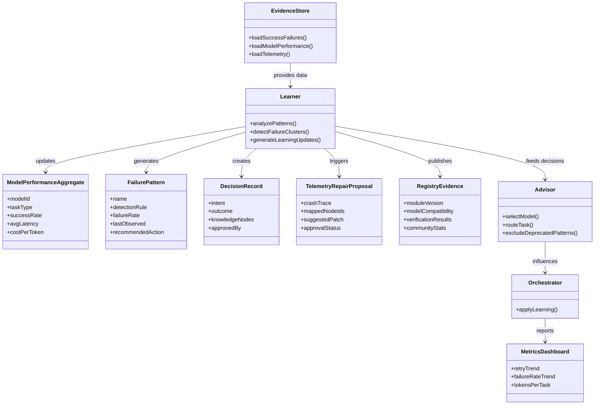

---
tags:
  - duumbi/inbox/enriched
  - duumbi/status/processed
  - duumbi/classification/feature
  - duumbi/value/critical
  - duumbi/importance/high
  - duumbi/complexity/high
duumbi_inbox_enrichment: processed
duumbi_inbox_enrichment_generated_at: 2026-06-13T07:19:40.919Z
---

# Active Learning Loop

<!-- duumbi-inbox-enrichment:v1 status=processed generated_at=2026-06-13T07:19:40.919Z -->

## Source
- Surface: Manual Obsidian edit
- Vault path: Duumbi/00 Inbox (ToProcess)/2026-06-12 - Active Learning Loop.md
- Submitted by: unknown unless explicit in the raw input

## Raw input
> ---
> tags:
>   - duumbi/inbox/roadmap
>   - duumbi/status/to-process
>   - duumbi/classification/execution
>   - duumbi/value/critical
>   - duumbi/importance/high
>   - duumbi/complexity/high
> created: 2026-06-12
> milestone: M2
> source: "[[DUUMBI Future Development Roadmap Map]]"
> ---
> 
> # Active Learning Loop
> 
> ## Context
> 
> Audit finding (2026-06-12): DUUMBI **records** a lot but **adapts** little. What works today: success/failure JSONL auto-appended after every task (workspace + user-local `~/.duumbi/learning/`), few-shot injection of scored past successes, recent failures shown as "avoid" patterns in mutation context. What is passive or missing: session stats are display-only; model-performance aggregates are never consulted; strategy/failure-pattern deprecation (>70% fail rate) exists but selection ignores it; DecisionRecord/PatternRecord are manual-only; query answers can't be saved as knowledge (MODE-011 open); telemetry crash/trace artifacts are inspection-only (Phase 13 loop not closed); and the registry carries **zero** quality/evidence metadata — one user's failures and successes never benefit another.
> 
> ## Goal
> 
> Recorded evidence changes future behavior — locally (routing, prompts, strategy selection, repair) and community-wide (registry evidence metadata) — and "did the system get better?" becomes a measured metric. This is also the closure stage of the native development loop ([[2026-06-12 - DUUMBI Loop Native Workflow Adaptation]]).
> 
> ## Subtasks
> 
> 1. Local adaptation (can start in M1): model-performance aggregates feed the advisor/routing ([[2026-06-12 - Model Capability Advisor and Task Routing]]); deprecated strategies/failure-patterns are actually excluded in assembler/orchestrator selection; a periodic aggregation job clusters raw failure records into named failure patterns automatically (today taxonomy is ad-hoc).
> 2. Auto knowledge capture as closure: a completed intent generates approval-gated DecisionRecord/PatternRecord candidates (what was decided, what pattern emerged, what failed and why) into the knowledge store; implement MODE-011 so query answers can be saved as knowledge nodes; knowledge nodes already flow into query context — closing the loop.
> 3. Telemetry → repair loop (Phase 13 completion): `telemetry inspect` output feeds an auto-proposed repair intent (crash → mapped graph context → draft intent awaiting approval), instead of stopping at inspection.
> 4. Community learning via registry: published module versions carry evidence metadata — eval results, verification status, provider/model compatibility ("intent-executed successfully with X") — extending [[2026-06-12 - Registry Graph Database Evolution]]; opt-in anonymized aggregate stats (which model families succeed at which task types) published alongside the model catalog so every user's advisor benefits; explicit trust/provenance model for imported knowledge.
> 5. Learning effectiveness metric: trend of retry counts, failure rates, and tokens-per-task over workspace lifetime — published in the [[2026-06-12 - Token Economics Benchmark]] reporting so "the system learns" is a claim with data.
> 
> ## Acceptance criteria
> 
> - A failure pattern observed N times measurably changes behavior (warning, prompt content, or routing) with no manual configuration.
> - Completing an intent produces knowledge candidates for approval; approved ones appear in subsequent query/mutation context.
> - A registry module page shows evidence metadata; the advisor uses community model-compatibility data when local history is empty.
> - Learning-effectiveness trends are part of release reporting.
> 
> ## Links
> 
> - [[DUUMBI Future Development Roadmap Map]]
> - [[2026-06-12 - Model Capability Advisor and Task Routing]]
> - [[2026-06-12 - Registry Graph Database Evolution]]
> - [[2026-06-12 - DUUMBI Loop Native Workflow Adaptation]]
> - [[2026-06-12 - Session Kernel and Event Ledger]]

## Interpreted intent

Close the DUUMBI learning loop: transform passively recorded evidence (model performance, success/failure patterns, telemetry, knowledge nodes) into active behavioral adaptation (routing, prompt assembly, strategy selection, repair suggestions) and community-shared evidence in the registry. Measurably reduce failure rates and retries over time.

## Developer summary

Implement the Active Learning Loop across DUUMBI's subsystems. Feed recorded model-performance, success/failure patterns, and telemetry data into the advisor, routing, prompt assembler, and strategy selector. Auto-cluster raw failure records into named patterns; automatically generate DecisionRecord/PatternRecord candidates from completed intents; close the telemetry→repair loop by mapping crash traces to graph context and proposing repairs; extend the registry with evidence quality metadata and opt-in anonymous community stats; and build a learning-effectiveness metrics dashboard to prove the system improves over time.

## UML overview

## Classification
- Type: feature
- Business value: critical
- Importance: high
- Complexity: high

## Clarifications
### Answered
- The need to close the local learning loop is explicit from the audit finding: DUUMBI records but doesn't adapt.
- Model-performance aggregates must feed the advisor and routing, and deprecated failure patterns must be excluded in assembler/orchestrator selection.
- Auto knowledge capture should generate DecisionRecord/PatternRecord candidates with approval gates.
- The telemetry→repair loop proposes a repair intent rather than stopping at inspection.
- Community learning means sharing anonymized model-performance stats and evidence metadata via the registry.
- Learning effectiveness is measured through retry counts, failure rates, and tokens-per-task trends.

### Open
- What exact criteria trigger a learned behavior change? How many observations of a failure pattern before the system reacts?
- How is the approval gate for auto-generated knowledge candidates designed in practice? Who reviews and approves?
- How do we prevent feedback loops where an aggressive adaptation based on bad data makes things worse and the resulting failures reinforce the pattern?
- Should learning be scoped per-workspace, per-user, or can we safely share anonymized patterns across users from day one?
- What is the acceptable shelf-life of a learned pattern? When does it expire?
- How do we validate that the learning loop actually improved quality and not just shifted cost elsewhere?
- Should we start with a simple rule-based adaptation before introducing ML/AI clustering for failure patterns?

## Relevant DUUMBI context
- Duumbi/00 Inbox (ToProcess)/2026-06-12 - Active Learning Loop.md — the source note with full context
- Duumbi/01 Atlas (Knowledge Base)/Works (Developed Materials)/DUUMBI - PRD.md — product thesis and quality goals
- Duumbi/01 Atlas (Knowledge Base)/Maps (Overviews)/DUUMBI Future Development Roadmap Map — overall roadmap and M2 milestone
- Duumbi/01 Atlas (Knowledge Base)/Works (Developed Materials)/DUUMBI - Agentic Development Runbook.md — delivery workflow and stage definitions
- Duumbi/00 Inbox (ToProcess)/2026-06-12 - Model Capability Advisor and Task Routing.md — linked dependency for local adaptation
- Duumbi/00 Inbox (ToProcess)/2026-06-12 - Registry Graph Database Evolution.md — linked dependency for community learning
- Duumbi/00 Inbox (ToProcess)/2026-06-12 - DUUMBI Loop Native Workflow Adaptation.md — closure stage of the loop
- Duumbi/00 Inbox (ToProcess)/2026-06-12 - Session Kernel and Event Ledger.md — session data source
- duumbi/src/agents/agent_knowledge/ — existing strategy/failure-pattern persistence (must be extended)
- duumbi/src/agents/model_performance.rs — existing model-performance telemetry (addition needed)
- duumbi/crates/duumbi-studio/ — dashboard for metrics
- duumbi/src/registry/ — registry client for community evidence

## Related GitHub context

No known GitHub issues, PRs, or project items specific to this note. Triage should verify no duplicates. Linked roadmap items may already have their own issues; coordinate accordingly.

## Initial routing recommendation

GitHub issue

## Requested follow-up
- Create a GitHub epic titled 'Active Learning Loop' under the M2 milestone.
- Break down into sub-issues per subtask: (1) local adaptation, (2) auto knowledge capture, (3) telemetry→repair loop, (4) community learning.
- Link to existing issues for Model Capability Advisor, Registry Graph Database Evolution, and DUUMBI Loop Native Workflow Adaptation.
- Define a learning-effectiveness measurement plan before implementation starts.
- Schedule a design discussion on approval gates and safety mechanisms.

## AI agent instructions
- Create a GitHub issue (epic) titled 'Active Learning Loop: from passive recording to active adaptation' with description summarizing the four subtasks and acceptance criteria from the note.
- Label it 'active-learning-loop', 'M2', 'learning', 'epic'.
- Add to the M2 DUUMBI project board with high priority.
- Create child issues for each subtask, linking them back to the epic.
- In each child issue, detail the specific data flows and components to modify, referencing the source code paths listed in relevant_duumbi_context.
- Ensure each child issue includes verification steps and measurable outcomes (e.g., 'after deployment, retry rate for intent execution drops by X%').
- Coordinate with the owners of linked roadmap items to avoid duplicate work.

## Scope candidate
### In
- Local adaptation: feed model-performance aggregates to the advisor and routing; ensure deprecated failure patterns are excluded from orchestrator/assembler selection; write a periodic aggregation job that clusters raw failure records into named failure patterns automatically.
- Auto knowledge capture: generate DecisionRecord/PatternRecord candidates for completed intents with an approval gate; implement MODE-011 so query answers can be saved as knowledge nodes and flow back into query context.
- Telemetry→repair loop: from a crash trace, map to graph node context, auto-propose a repair intent (draft) and place it behind an approval gate instead of stopping at inspection.
- Community learning: extend the registry to carry evidence metadata (eval results, verification status, model compatibility); offer opt-in anonymous aggregate stats on model performance per task type; design a trust/provenance model for imported knowledge.
- Learning effectiveness metric: dashboard/report showing retry counts, failure rates, tokens-per-task over time, published alongside token economics benchmarks.

### Out
- Full autonomous self-modification without human approval — all changes must pass a review gate.
- Real-time distributed learning across unrelated workspaces without explicit opt-in.
- Modifying the internal agent mutation model to bypass validation or safety checks in pursuit of learning.
- Implementing community learning before the registry graph database evolution milestone delivers a stable evidence schema.
- Building a general-purpose ML system; we are implementing rule-based adaptation and simple clustering first.

## Risks and trade-offs
- Over-engineering a complex learning pipeline before proving local adaptation with a single data source (model performance or failure patterns) works reliably.
- Bad or stale telemetry data leading to incorrect pattern detection and harmful adaptations.
- Feedback instability — an aggressive adaptation based on a small sample could increase failure rates, which then become a 'pattern' and lock in the bad behavior.
- Approval gate fatigue: too many auto-generated knowledge candidates could overwhelm reviewers and cause them to ignore the gate.
- Privacy and security: sharing community stats must not leak proprietary code, project structure, or user-specific behaviors. Anonymization must be watertight.
- Latency impact: real-time query to model-performance aggregates or pattern clusters could slow down task routing; must be cached efficiently.

## Obsidian tags

#duumbi/inbox/enriched #duumbi/status/processed #duumbi/classification/feature #duumbi/value/critical #duumbi/importance/high #duumbi/complexity/high

## Enrichment result
- Date: 2026-06-13T07:19:40.919Z
- Status: ready for triage
- Canonical duplicate: none verified
- Facts:
- DUUMBI already appends success/failure JSONL after every task, per workspace and per user.
- Model-access probes and model-performance data are already recorded.
- Strategy/failure-pattern deprecation (>70% fail rate) exists in the codebase but the assembler/orchestrator does not use it during selection.
- DecisionRecord and PatternRecord are manual-only; no auto-generation.
- MODE-011 (query answers saved as knowledge) is open and not implemented.
- Telemetry crash/trace artifacts are inspection-only; Phase 13 loop not closed.
- Registry carries zero quality/evidence metadata — no model compatibility or verification status.
- The note is a child of the DUUMBI Future Development Roadmap Map, tied to milestone M2.
- Assumptions:
- The existing success/failure JSONL and model-performance telemetry have sufficient structure to feed machine-readable adaptation without a data format migration.
- A simple clustering algorithm (e.g., k-means on error fingerprints) can produce useful named failure patterns with acceptable false positive/negative rates.
- The approval gate for auto-generated knowledge candidates will be a Slack-based or Studio-based lightweight review, not a heavy manual process.
- Users will voluntarily opt into sharing anonymized stats once the privacy guarantees are clear.
- The linked roadmap items (Model Capability Advisor, Registry Graph Database Evolution) will progress in parallel, providing the necessary substrates.
- We can measure learning effectiveness without a long baseline because we already have historical telemetry.
- Recommendations:
- Prioritize local adaptation first — it yields the quickest user-visible improvement and validates the learning concept with minimal risk.
- Implement auto knowledge capture before the telemetry→repair loop because it leverages the existing intent lifecycle and has clearer acceptance criteria.
- Start with a single, well-understood failure pattern (e.g., 'LLM returned invalid JSON patch') and build the entire loop (observe → detect → act → measure) for that one case before generalizing.
- Define the learning effectiveness dashboard early, using the existing performance.jsonl and token economics data, to have a clear metric for success.
- Delay community learning until the registry graph database evolution is stable and a secure, privacy-preserving evidence format has been agreed upon.
- Involve the DUUMBI product and security leads early for approval gate design and anonymization policy.
