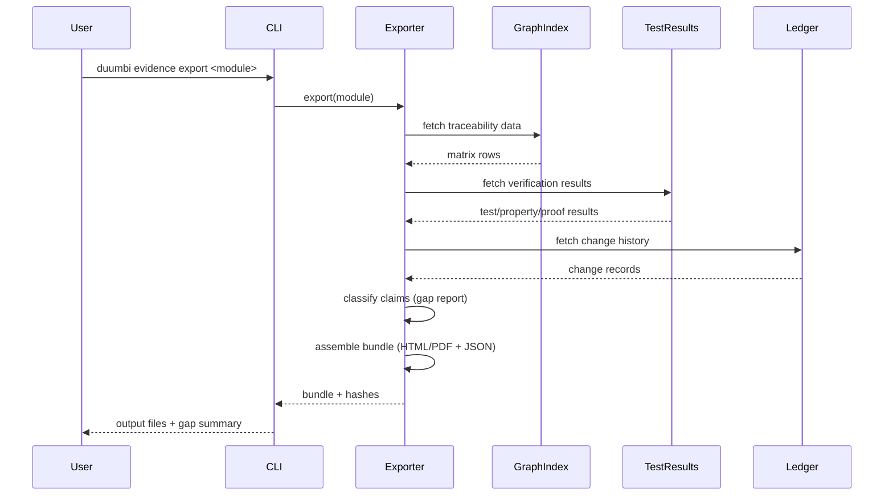

---
tags:
  - duumbi/inbox/enriched
  - duumbi/status/processed
  - duumbi/classification/execution
  - duumbi/value/high
  - duumbi/importance/medium
  - duumbi/complexity/medium
duumbi_inbox_enrichment: processed
duumbi_inbox_enrichment_generated_at: 2026-06-14T07:36:33.646Z
---

# Certification Evidence Export

<!-- duumbi-inbox-enrichment:v1 status=processed generated_at=2026-06-14T07:36:33.646Z -->

## Source
- Surface: Manual Obsidian edit
- Vault path: Duumbi/00 Inbox (ToProcess)/2026-06-12 - Certification Evidence Export.md
- Submitted by: unknown unless explicit in the raw input

## Raw input
> ---
> tags:
>   - duumbi/inbox/roadmap
>   - duumbi/status/to-process
>   - duumbi/classification/execution
>   - duumbi/value/high
>   - duumbi/importance/medium
>   - duumbi/complexity/medium
> created: 2026-06-12
> milestone: M4
> source: "[[DUUMBI Future Development Roadmap Map]]"
> ---
> 
> # Certification Evidence Export
> 
> ## Context
> 
> *Proposed addition (Claude, 2026-06-12).* In safety- and assurance-critical engineering (aerospace DO-178C, industrial IEC 61508, automotive ISO 26262, medical IEC 62304), the dominant cost is not writing code — it is producing and maintaining the **traceability and verification documentation**: requirement ↔ design ↔ code ↔ test ↔ result matrices, kept consistent by hand. DUUMBI stores exactly these links natively (intent → spec/BDD → graph nodes → tests → property/proof results → session ledger), so the audit dossier becomes an **export**, not a project. This is a use case where I would genuinely choose DUUMBI over any text-language toolchain: the evidence is a by-product of how the system works, never stale, never hand-assembled.
> 
> ## Goal
> 
> One command produces an audit-ready evidence bundle for a module or program: traceability matrix, verification results (tests, property runs, formal proofs with prover versions), change history from the ledger, and an explicit gap report listing every unproven or untested claim.
> 
> ## Subtasks
> 
> 1. Traceability matrix export: requirement/intent ↔ graph node ↔ BDD scenario ↔ test/property/proof result, generated from existing links; identify and close any missing link types in the data model.
> 2. Evidence bundle format: human-readable (HTML/PDF) + machine-readable (JSON) with content hashes, tool versions (compiler, prover), and snapshot ids — reproducible and tamper-evident.
> 3. Gap report: every exported claim is classified proven / property-tested / tested / asserted-only; unverified surface is listed explicitly (honest by default — this is the differentiator, not a marketing gloss).
> 4. Standards mapping research: with a domain expert, map bundle sections onto the artifact requirements of one chosen standard (start with the most achievable, e.g. IEC 61508 software support or a DO-178C subset); document what DUUMBI can and cannot claim.
> 5. Pilot: run the export on a verified stdlib module + the flagship example; iterate format with someone who has lived through a real certification audit.
> 6. GTM: "compliance dossier as a build artifact" page + the [[2026-06-12 - Verified Business Rules Vertical]] story share this foundation.
> 
> ## Acceptance criteria
> 
> - `duumbi evidence export <module>` (name TBD) produces a complete bundle covering 100% of exported functions, with the gap report.
> - Bundle regenerated after a code change shows precisely the impacted rows (delta view).
> - A domain expert review confirms the bundle maps credibly onto at least one real standard's artifact list.
> 
> ## Links
> 
> - [[DUUMBI Future Development Roadmap Map]]
> - [[2026-06-12 - Formal Verification VCGen MVP]]
> - [[2026-06-12 - Contract Property Test Generation]]
> - [[2026-06-12 - Session Kernel and Event Ledger]]

## Interpreted intent

Add a CLI command (`duumbi evidence export <module>`) that produces an audit‑ready certification evidence bundle. The bundle should include a traceability matrix (requirement ↔ graph node ↔ BDD scenario ↔ test/property/proof result), verification results, change history from the session ledger, and an explicit gap report listing unverified claims. The goal is to make certification documentation a by‑product of DUUMBI's existing graph linking, reducing cost in safety‑critical domains.

## Developer summary

Implement a CLI subcommand for certification evidence export. The command (`duumbi evidence export <module>`) gathers traceability data from the semantic graph, intent/BDD specs, test results, property/proof runs, and session ledger. It emits a bundle (HTML/PDF + JSON) containing a traceability matrix, verification results, change history, and a gap report classifying every exported claim as proved, property‑tested, tested, or unverified. The bundle includes content hashes, tool versions, and snapshot IDs for tamper‑evidence. A rerun shows a delta view of impacted rows. This feature directly addresses the certification documentation burden in DO‑178C, IEC 61508, and similar standards. Dependencies: VCGen (M4) and contract property tests (M1) must be stable. A domain expert review for standards mapping is planned after a pilot on a verified stdlib module.

## UML overview

## Classification
- Type: execution
- Business value: high
- Importance: medium
- Complexity: medium

## Clarifications
### Answered
- Goal is to export audit‑ready evidence: traceability matrix, verification results, change history, gap report.
- Acceptance criteria: complete bundle covering 100% of exported functions, gap report lists unverified claims, rerun shows delta view.
- Standards mapping research is planned for one chosen standard (e.g., IEC 61508 or DO‑178C subset).
- Dependencies: uses existing graph links, test/property/proof results, session ledger; requires VCGen and contract property tests to be stable.
- Export is a CLI command, not a Studio UI.

### Open
- Which specific standard should be the first mapping target? (IEC 61508 vs DO‑178C vs other)
- What exact fields must the traceability matrix include to satisfy a real auditor?
- Should the export be runnable as a CI gate (e.g., fail build if gap exceeds threshold)?
- How to handle modules that lack explicit contracts or tests: mark them as untested, omit them, or fail?
- Is the bundle intended for formal regulatory submission or internal audit support?
- Should the delta view require a previous bundle snapshot on disk, or can it recompute from graph/ledger history?

## Relevant DUUMBI context
- Vault: `Duumbi - PRD` — product thesis includes assurance‑critical engineering as a target market.
- Vault: `2026-06-12 - Formal Verification VCGen MVP` — supplies proof results for the evidence export.
- Vault: `2026-06-12 - Contract Property Test Generation` — supplies property‑based test evidence.
- Vault: `2026-06-12 - Session Kernel and Event Ledger` — provides change history for the export.
- Source: `src/graph/` and `src/compiler/` — graph and compilation artifacts are the source for traceability data.
- Source: `src/agents/` — agent‑generated mutations are recorded in the ledger and can be audited.
- The Runbook shows export aligns with M4 milestones and the overall agentic development loop.

## Related GitHub context

No GitHub issue currently exists; triage should verify later and create one with the refined scope.

## Initial routing recommendation

GitHub issue

## Requested follow-up
- Create a GitHub issue in `hgahub/duumbi` with the enriched scope and milestones.
- Schedule a discussion with a domain expert to choose the first standard for mapping.
- Begin spike on the evidence export core (without formal standards mapping) once VCGen and property tests are stable.

## AI agent instructions
- Create a GitHub issue titled 'Certification Evidence Export' with labels: `execution`, `feature`, `high`, `M4`.
- Include the developer summary as the issue body.
- List dependencies: VCGen MVP (#...), contract property tests (#...), session ledger.
- Define acceptance criteria: complete bundle, gap report, delta view.
- Add a comment with open clarification questions for human response.
- Set milestone to M4.
- Link the vault Inbox note in the issue for traceability.

## Scope candidate
### In
- CLI command `duumbi evidence export <module>`
- Traceability matrix: requirement/intent → graph node → BDD scenario → test/property/proof result
- Verification results from tests, property runs, formal proofs
- Change history from the session ledger
- Gap report classifying every claim as proven/property-tested/tested/unverified
- Human‑readable (HTML/PDF) and machine‑readable (JSON) formats
- Content hashes, tool versions (compiler, prover), snapshot IDs
- Delta view when rerun after code changes

### Out
- Automatic mapping to certification standards (separate research task)
- GUI integration in Studio (CLI‑only for now)
- CI integration as a mandatory gate (future enhancement)
- Export of runtime telemetry traces beyond the session ledger
- Implementation of VCGen or property test enhancements (only consumes their outputs)

## Risks and trade-offs
- VCGen MVP (M4) and contract property tests (M1) may not be stable in time, delaying the export feature.
- The chosen standard mapping may reveal gaps in DUUMBI's current data model or evidence generation, causing scope creep.
- The traceability matrix may require linking intents/BDD scenarios to graph nodes that are not yet fully formalized.
- Performance: exporting large modules with many nodes/edges could be slow; needs benchmarking.
- If the session ledger is not yet populated with sufficient history, change history will be minimal.

## Obsidian tags

#duumbi/inbox/enriched #duumbi/status/processed #duumbi/classification/execution #duumbi/value/high #duumbi/importance/medium #duumbi/complexity/medium

## Enrichment result
- Date: 2026-06-14T07:36:33.646Z
- Status: ready for triage
- Canonical duplicate: none verified
- Facts:
- The note was created 2026‑06‑12, tagged with milestone M4 and source [[DUUMBI Future Development Roadmap Map]].
- Subtasks include: traceability matrix export, evidence bundle format, gap report, standards mapping, pilot, GTM.
- Acceptance criteria: 100% coverage of exported functions, gap report explicit, delta view on rerun.
- The note is linked to `Formal Verification VCGen MVP`, `Contract Property Test Generation`, and `Session Kernel and Event Ledger`.
- The export leverages existing graph links and recorded evidence, so no new runtime data collection is needed.
- Standards mapping is planned as a follow‑up research activity, not part of the initial implementation.
- Assumptions:
- VCGen and property test generation will be implemented and stable before this work begins.
- The graph already contains all necessary linking between intents, specs, nodes, tests, and proofs.
- A domain expert will be available to review the bundle against a chosen standard.
- The session ledger will be functioning and recording sufficient change history.
- The CLI command will be the primary interface; no Studio integration is required in v1.
- Recommendations:
- Route this note to a GitHub issue with the title 'Certification Evidence Export' and M4 milestone.
- Prioritize the core export (without standards mapping) as soon as dependencies are met, because it provides immediate value for internal DUUMBI certification‑style documentation.
- Defer the standards mapping research until a pilot bundle can be reviewed by a domain expert.
- Coordinate with the VCGen and property test teams to ensure evidence formats are consumable by the exporter.
- Add a `duumbi evidence` module to the CLI early to establish the command namespace.
