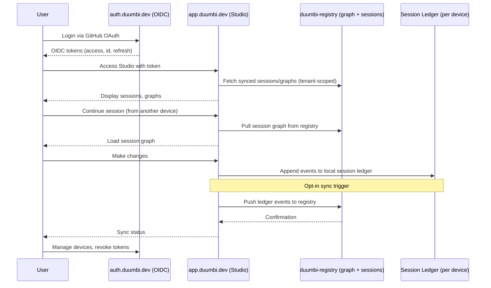

---
tags:
  - duumbi/inbox/enriched
  - duumbi/status/processed
  - duumbi/classification/feature
  - duumbi/value/high
  - duumbi/importance/high
  - duumbi/complexity/high
duumbi_inbox_enrichment: processed
duumbi_inbox_enrichment_generated_at: 2026-06-14T18:30:03.673Z
---

# Cloud App and DUUMBI Account SSO

<!-- duumbi-inbox-enrichment:v1 status=processed generated_at=2026-06-14T18:30:03.673Z -->

## Source
- Surface: Manual Obsidian edit
- Vault path: Duumbi/00 Inbox (ToProcess)/2026-06-12 - Cloud App and DUUMBI Account SSO.md
- Submitted by: unknown unless explicit in the raw input

## Raw input
> ---
> tags:
>   - duumbi/inbox/roadmap
>   - duumbi/status/to-process
>   - duumbi/classification/execution
>   - duumbi/value/high
>   - duumbi/importance/medium
>   - duumbi/complexity/high
> created: 2026-06-12
> milestone: M6
> source: "[[DUUMBI Future Development Roadmap Map]]"
> ---
> 
> # Cloud App and DUUMBI Account (SSO)
> 
> ## Context
> 
> Surface #4: hosted Studio with a DUUMBI account, enabling true "continue your session on any device". The Loop plan already designed the account model worth reusing: central issuer `auth.duumbi.dev`, User/Identity/Organization/Team/Session/ApiToken concepts, GitHub/GitLab/Google/email login, `.duumbi.dev` session cookie, RBAC roles — and mandates that the existing registry auth must not remain a user island (token migration path required). Prerequisites: session kernel (M2), registry graph/session sync backend (M2), desktop parity (M3).
> 
> ## Goal
> 
> app.duumbi.dev (hosted Studio) + auth.duumbi.dev (central SSO): log in, see your synced sessions and graph repositories, continue a session started in the TUI/Desktop — opt-in sync, local-first remains default.
> 
> ## Subtasks
> 
> 1. Central auth service: stand up auth.duumbi.dev per the Loop plan's SSO section (OIDC issuer; GitHub OAuth first, Google + email magic link next); decide repo home (start inside duumbi-loop workspace or separate `duumbi-auth`).
> 2. Registry migration: duumbi-registry becomes an OIDC client of the central issuer; preserve existing registry API tokens in migration mode.
> 3. Hosted Studio: multi-tenant deployment of the Studio frontend backed by the graph-aware duumbi-registry (workspaces, sessions, snapshots per user/org); strict tenant scoping on every query (Loop plan rule: no data-layer method without org scope).
> 4. Session sync GA: implement the opt-in push/pull spec from [[2026-06-12 - Session Kernel and Event Ledger]]; device list + revocation; end-to-end encryption decision for ledgers.
> 5. Execution model decision: cloud builds/runs (sandboxed workers) vs. query-and-review-only cloud with execution staying local — recommend query/review-first, execution later.
> 6. Infra: new Pulumi stack (Container Apps, PostgreSQL, Key Vault, budgets) following existing duumbi-infra patterns; cost guardrails (current budget cap is $20/month — needs a deliberate raise decision).
> 7. Privacy/security docs: what syncs, what never leaves the machine, retention, deletion.
> 
> ## Acceptance criteria
> 
> - One DUUMBI account logs into registry, repository, and app.duumbi.dev.
> - Demo: start session in TUI on machine A → continue in cloud Studio → continue in Desktop on machine B.
> - Tenant isolation tests pass; security/data-retention docs published.
> 
> ## Links
> 
> - [[DUUMBI Future Development Roadmap Map]]
> - [[2026-06-12 - Session Kernel and Event Ledger]]
> - [[2026-06-12 - Registry Graph Database Evolution]]
> - [[2026-06-12 - Desktop App Packaging]]

## Interpreted intent

Implement DUUMBI Account SSO (auth.duumbi.dev) and hosted Studio (app.duumbi.dev) to enable cross-device session continuation. The feature must reuse the Loop plan's account model (User/Identity/Organization/Team/Session/ApiToken, OIDC issuer, GitHub OAuth, etc.), migrate the registry into an OIDC client, and provide opt-in session sync with end-to-end encryption decisions. Prerequisites are the Session Kernel and Event Ledger (M2), Registry Graph Database Evolution (M2), and Desktop App Packaging (M3).

## Developer summary

Build a central auth service (auth.duumbi.dev) as an OIDC issuer per the Loop plan's SSO section. Start with GitHub OAuth, then add Google and email magic link. Migrate duumbi-registry into an OIDC client while preserving existing API tokens. Deploy a multi-tenant hosted Studio (app.duumbi.dev) that reads/writes the graph-aware registry with strict tenant scoping. Implement GA session sync (opt-in push/pull) from the session kernel/ledger design, including device management and revocation. Decide execution model: cloud builds/execution vs. query/review-only cloud with local execution; recommend query/review-first. Set up infra via a new Pulumi stack (Container Apps, PostgreSQL, Key Vault) with explicit cost guardrails (current $20/month cap needs deliberate raise). Publish privacy/security docs on what syncs and what stays local.

## UML overview

## Classification
- Type: feature
- Business value: high
- Importance: high
- Complexity: high

## Clarifications
### Answered
- Account model follows the Loop plan: central issuer auth.duumbi.dev, User/Identity/Organization/Team/Session/ApiToken concepts, GitHub/GitLab/Google/email login, .duumbi.dev session cookie, RBAC roles.
- Existing registry auth must not remain a user island; token migration path is required.
- Prerequisites: session kernel (M2), registry graph/session sync backend (M2), desktop parity (M3).
- Hosted Studio must be multi-tenant with strict tenant scoping on every query (no data-layer method without org scope).

### Open
- What specific OIDC flows will be used for the hosted Studio and registry migration?
- How will existing registry API tokens be migrated to OIDC-based authentication without breaking current users?
- What is the target infrastructure budget, and who approves the raise beyond the current $20/month cap?
- What end-to-end encryption scheme will be used for session ledger sync, and who holds the keys?
- How will tenant isolation be tested and enforced at the database layer?
- What are the exact data retention and deletion policies for synced sessions?

## Relevant DUUMBI context
- Vault: [[DUUMBI Future Development Roadmap Map]] - places this as Surface #4 and sets milestone M6.
- Vault: [[2026-06-12 - Session Kernel and Event Ledger]] - prerequisite for session sync.
- Vault: [[2026-06-12 - Registry Graph Database Evolution]] - prerequisite for graph-aware session storage.
- Vault: [[2026-06-12 - Desktop App Packaging]] - prerequisite for desktop parity.
- Source: crates/duumbi-studio - existing Leptos SSR web app to be used as the basis for the hosted Studio.
- Source: src/registry/ - existing registry client that will need OIDC migration.

## Related GitHub context

No known related GitHub issues, PRs, or discussions. Triage should verify later if any exist.

## Initial routing recommendation

GitHub issue

## Requested follow-up
- Triage stage: evaluate size and feasibility, clarify open questions, and decide if this should become a GitHub Epic or a single large issue.
- Validate that the prerequisites (M2, M3) are on track or reschedule if needed.
- Assess infrastructure cost implications and secure budget approval.
- Define security and privacy requirements with stakeholders before implementation.

## AI agent instructions
- Break this feature into subtasks aligned with the M6 milestone, referencing the Loop plan account model.
- Ensure all components (auth service, registry migration, Studio deployment, session sync) adhere to OIDC standards.
- Enforce strict tenant scoping in every registry query; verify with tests.
- Design the auth service to be a central OIDC issuer with token introspection and revocation endpoints.
- Plan for a phased rollout: auth service and registry migration first, then hosted Studio, then session sync.
- Document all security and privacy aspects (what syncs, what stays local, encryption, data handling).
- Use existing Pulumi patterns from duumbi-infra; add cost monitoring and alerts.
- Before implementation, ensure human approval on the execution model (cloud query/review vs. cloud execution).

## Scope candidate
### In
- auth.duumbi.dev OIDC issuer (GitHub OAuth initially, later Google/email)
- Registry migration to OIDC client with legacy token compatibility
- Multi-tenant hosted Studio (app.duumbi.dev) reusing Studio frontend
- Session sync (opt-in push/pull) using session kernel/ledger
- Device management and revocation
- Infrastructure via Pulumi (Container Apps, PostgreSQL, Key Vault) with explicit budget
- Privacy/security documentation

### Out
- Full cloud execution (build/run) – defer, recommend query/review only initially
- Non-OIDC auth mechanisms not in Loop plan
- Changes to existing CLI/TUI/Desktop beyond adopting the account system

## Risks and trade-offs
- Infrastructure cost may exceed the current $20/month cap; a deliberate raise decision is needed.
- Multi-tenant isolation bugs could leak data between organizations.
- Session sync encryption design may be complex; end-to-end encryption decisions may delay sync GA.
- Registry token migration may break existing `duumbi publish` or CLI workflows if not carefully managed.
- Dependency on M2 deliverables (session kernel, registry graph/session sync) could delay M6 if those slip.

## Obsidian tags

#duumbi/inbox/enriched #duumbi/status/processed #duumbi/classification/feature #duumbi/value/high #duumbi/importance/high #duumbi/complexity/high

## Enrichment result
- Date: 2026-06-14T18:30:03.673Z
- Status: ready for triage
- Canonical duplicate: none verified
- Facts:
- The Loop plan has a fully designed account model with OIDC, organizations, RBAC.
- DUUMBI already has a Leptos-based Studio (crates/duumbi-studio) and a registry client (src/registry/).
- The roadmap places this at Surface #4 with prerequisites in M2 and M3.
- The current infrastructure budget is $20/month; this feature will require a higher limit.
- Existing registry auth is independent and must be migrated to the central issuer.
- Assumptions:
- The Session Kernel and Event Ledger (M2) and Registry Graph Database Evolution (M2) will be completed before M6 starts.
- Desktop App Packaging (M3) will be sufficient for the cross-device demo.
- Pulumi infrastructure can be extended to support new Azure resources.
- OIDC is the accepted standard for all authentication, and no proprietary alternatives will be introduced.
- Users are willing to opt-in to session sync and understand what data leaves their machine.
- Recommendations:
- Start with auth.duumbi.dev and registry migration to centralize identity.
- Defer cloud execution; deliver hosted Studio as a query/review surface first.
- Use the existing Studio frontend with multi-tenant routing instead of building a new UI.
- Encrypt session ledger sync with user-controlled keys to meet privacy expectations.
- Raise the infrastructure budget explicitly and monitor costs from day one.
- Prioritize tenant isolation testing and include it in CI.
