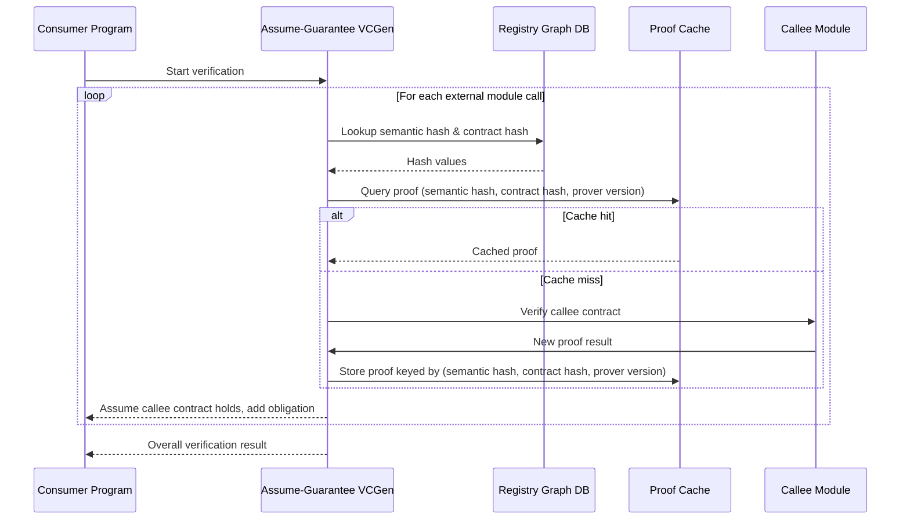

---
tags:
  - duumbi/inbox/enriched
  - duumbi/status/processed
  - duumbi/classification/research
  - duumbi/value/high
  - duumbi/importance/medium
  - duumbi/complexity/high
duumbi_inbox_enrichment: processed
duumbi_inbox_enrichment_generated_at: 2026-06-15T19:21:02.179Z
---

# Compositional Verification Proof Boundaries

<!-- duumbi-inbox-enrichment:v1 status=processed generated_at=2026-06-15T19:21:02.179Z -->

## Source
- Surface: Manual Obsidian edit
- Vault path: Duumbi/00 Inbox (ToProcess)/2026-06-12 - Compositional Verification Proof Boundaries.md
- Submitted by: unknown unless explicit in the raw input

## Raw input
> ---
> tags:
>   - duumbi/inbox/roadmap
>   - duumbi/status/to-process
>   - duumbi/classification/research
>   - duumbi/value/high
>   - duumbi/importance/medium
>   - duumbi/complexity/high
> created: 2026-06-12
> milestone: M4
> source: "[[DUUMBI Future Development Roadmap Map]]"
> ---
> 
> # Compositional Verification: Proof Boundaries
> 
> ## Context
> 
> [[DUUMBI - Service and Research Direction]] hypothesis: registry module boundaries and semantic hashes can serve as **proof cache boundaries** — verify a module once against its contract, then reuse the proof wherever the semantic hash matches, instead of re-verifying whole programs. Depends on [[2026-06-12 - Formal Verification VCGen MVP]] (contracts must exist) and on the semantic-hash index in [[2026-06-12 - Registry Graph Database Evolution]].
> 
> ## Goal
> 
> Calls across module boundaries verify against the callee's published contract (assume-guarantee), and proofs are cached/keyed by semantic hash so verification scales with changed code, not program size.
> 
> ## Subtasks
> 
> 1. Module contract format: exported function signatures + pre/postconditions + effect summary, packaged with the module (registry metadata + graph fields).
> 2. Assume-guarantee VCGen: at a `Call` node, use the callee contract instead of inlining the callee body; emit an obligation that the callee satisfies its own contract (proved once, separately).
> 3. Proof cache: store proof results keyed by (semantic hash, contract hash, prover version) in the graph-aware `duumbi-registry`; invalidate on either hash change.
> 4. Trust model: who may publish "verified" claims; re-verification policy on download; signed proof artifacts (long-term).
> 5. Demonstrate on stdlib: verify `stdlib-math` functions once; verify a consumer program using only the cached contracts; measure verification time vs. monolithic VCGen.
> 6. Define honest failure modes: contract too weak (consumer obligation unprovable) → actionable error pointing at the missing guarantee.
> 
> ## Acceptance criteria
> 
> - A program using verified stdlib modules verifies without re-proving stdlib bodies.
> - Proof cache hit/miss is observable; changing a module body with the same contract invalidates only that module's proof.
> - Research note documenting whether the proof-boundary hypothesis holds, with measurements.
> 
> ## Links
> 
> - [[DUUMBI Future Development Roadmap Map]]
> - [[2026-06-12 - Formal Verification VCGen MVP]]
> - [[2026-06-12 - Registry Graph Database Evolution]]

## Interpreted intent

Enable compositional, assume-guarantee verification in DUUMBI: verify program modules independently against contracts, cache proofs keyed by semantic hash, so verification time scales with changed code rather than total program size.

## Developer summary

Add assume-guarantee verification to DUUMBI's formal verification pipeline. When the compiler encounters a cross-module call, instead of inlining the callee, it retrieves the callee's published contract (pre/postconditions, effect summary). The verifier then emits an obligation that the callee satisfies its own contract. Verification results are cached in the DUUMBI registry, keyed by (semantic hash of callee, contract hash, prover version). On a cache miss, the callee is verified once and the proof stored; on a hit, the cached proof is reused. This makes verification time proportional to changed code rather than total program size, enabling practical formal verification for large, modular DUUMBI programs. The feature depends on the formal verification VCGen MVP (contracts) and the registry graph database with semantic hash indexing (both also planned for M4).

## UML overview

## Classification
- Type: research
- Business value: high
- Importance: medium
- Complexity: high

## Clarifications
### Answered
- Goal: compositional verification using assume-guarantee and proof caching keyed by semantic hash.
- Depends on Formal Verification VCGen MVP (contracts) and Registry Graph Database Evolution (semantic hash index).
- Acceptance criteria include cache hit/miss observability and demonstration on stdlib.

### Open
- What exactly should the module contract format look like? (JSON-LD extension, serialized pre/postconditions, effect summary).
- How to handle circular module dependencies in assume-guarantee reasoning?
- Should proofs be automatically trusted when published, or always re-checked locally? (trust model details).
- What invalidation policy for the proof cache: e.g., if only the callee's implementation changes but the contract stays the same?
- Should the proof cache be local to a workspace or shared via the registry?
- How to handle partial contracts or contracts too weak to prove consumer obligations?
- Is a formal soundness proof required for the assume-guarantee VCGen transformation?

## Relevant DUUMBI context
- Vault note: DUUMBI Future Development Roadmap Map – original roadmap source.
- Vault note: Formal Verification VCGen MVP – dependency for contracts.
- Vault note: Registry Graph Database Evolution – dependency for semantic hash index.
- Source code: src/hash.rs – semantic hashing (SHA-256) used as cache key.
- Source code: src/deps.rs – module dependency resolution, needed for contract lookup.
- Source code: src/graph/ – graph representation that will store contracts and verification metadata.
- Source code: src/compiler/ – potential integration point for assume-guarantee VCGen.
- Vault note: DUUMBI - PRD – mentions formal verification as a long-term product goal.

## Related GitHub context

No known GitHub issues or pull requests directly for this yet. Depends on the Formal Verification VCGen MVP and Registry Graph Database Evolution roadmap items (which are also Inbox notes at time of enrichment). Triage should verify GitHub state later.

## Initial routing recommendation

GitHub issue

## Requested follow-up
- Create a GitHub issue from this note after Stage 4 triage.

## AI agent instructions
- When creating a GitHub issue, title it clearly as 'Compositional Verification: Proof Boundaries'.
- Include the full developer summary, Mermaid diagram, and open clarifications as issue body.
- Label as research, enhancement, area/formal-verification, and milestone M4.
- Reference the dependency notes: Formal Verification VCGen MVP and Registry Graph Database Evolution.
- Add an acceptance criteria checklist based on the note's acceptance criteria.
- Do not start implementation; this is a design/research task until dependencies land.

## Scope candidate
### In
- Define module contract format (exported function signatures, pre/postconditions, effect summary).
- Implement assume-guarantee VCGen that uses callee contracts instead of inlining.
- Build proof cache keyed by (semantic hash, contract hash, prover version) in the registry graph DB.
- Trust model design: who may publish 'verified' claims, re-verification policy, signed proof artifacts (long-term).
- Demonstration: verify stdlib-math functions once, then verify a consumer program using only cached contracts.
- Honest failure modes: contract too weak → actionable error pointing at the missing guarantee.

### Out
- Full SMT solver integration (covered by the VCGen MVP).
- Proof-certificate export for external auditors (a separate future feature).
- General distributed proof networks or proof-carrying code.
- Automatic synthesis of missing contracts.

## Risks and trade-offs
- Semantic hash changes may cause frequent cache invalidations if not carefully designed (e.g., @id independence).
- Assume-guarantee reasoning is not sound for all properties; the contract language must be chosen carefully.
- Complexity of contract language may hinder adoption and verification performance.
- Proof cache management overhead (serialization, storage, querying) may offset verification speedup for small programs.
- Trust model: signed proof artifacts require key management and public‑key infrastructure.

## Obsidian tags

#duumbi/inbox/enriched #duumbi/status/processed #duumbi/classification/research #duumbi/value/high #duumbi/importance/medium #duumbi/complexity/high

## Enrichment result
- Date: 2026-06-15T19:21:02.179Z
- Status: ready for triage
- Canonical duplicate: none verified
- Facts:
- The note is a roadmap item from the DUUMBI Future Development Roadmap Map.
- It is classified as research with high value, medium importance, high complexity.
- It explicitly depends on the Formal Verification VCGen MVP and Registry Graph Database Evolution for M4.
- DUUMBI already has semantic hashing (src/hash.rs) and module dependency resolution (src/deps.rs) which are prerequisites.
- The vault PRD lists formal verification as a long-term direction.
- Assumptions:
- A working formal verification VCGen MVP and registry graph database with semantic hash index will exist by the time this feature is implemented.
- The DUUMBI stdlib will have contracts defined (e.g., for stdlib-math).
- Developers will be willing to annotate their modules with pre/postconditions.
- Proof caching will yield measurable verification‑time savings for multi-module programs.
- Recommendations:
- Start with a research spike on the assume-guarantee approach and what contract language is necessary.
- Design the contract JSON‑LD extension early, even before the VCGen MVP is complete, to validate against known requirements.
- Prototype proof caching using a local graph database (in‑memory) before integrating with the registry.
- Implement the demonstration on stdlib as a way to measure cache hit/miss ratios and verification‑time savings.
- Treat trust model (signed proofs) as a stretch goal; first prove the correctness of the assume-guarantee transformation with local proofs.
