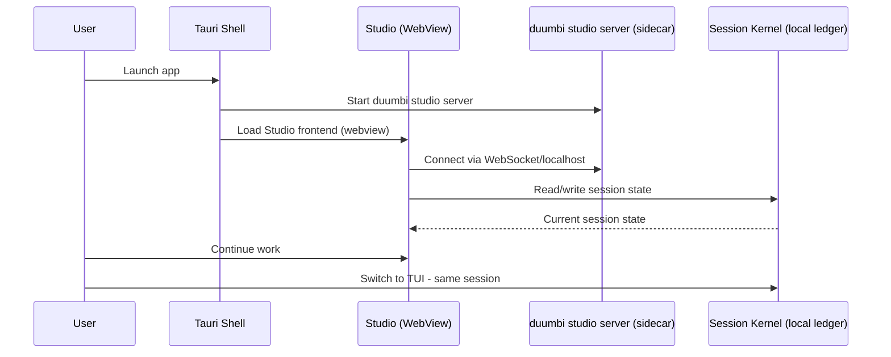

---
tags:
  - duumbi/inbox/enriched
  - duumbi/status/processed
  - duumbi/classification/execution
  - duumbi/value/high
  - duumbi/importance/high
  - duumbi/complexity/high
duumbi_inbox_enrichment: processed
duumbi_inbox_enrichment_generated_at: 2026-06-16T07:58:17.934Z
---

# Desktop App Packaging

<!-- duumbi-inbox-enrichment:v1 status=processed generated_at=2026-06-16T07:58:17.934Z -->

## Source
- Surface: Manual Obsidian edit
- Vault path: Duumbi/00 Inbox (ToProcess)/2026-06-12 - Desktop App Packaging.md
- Submitted by: unknown unless explicit in the raw input

## Raw input
> ---
> tags:
>   - duumbi/inbox/roadmap
>   - duumbi/status/to-process
>   - duumbi/classification/execution
>   - duumbi/value/medium
>   - duumbi/importance/medium
>   - duumbi/complexity/medium
> created: 2026-06-12
> milestone: M3
> source: "[[DUUMBI Future Development Roadmap Map]]"
> ---
> 
> # Desktop App Packaging
> 
> ## Context
> 
> Studio already exists as a Leptos 0.8 SSR app (3-panel layout, WebSocket `/ws/chat`, graph view). The archived roadmap's guidance stands: build a Studio web/desktop path that reuses one frontend instead of splitting product surfaces. Desktop is surface #3 after CLI and TUI.
> 
> ## Goal
> 
> DUUMBI Desktop = the existing Studio frontend packaged as an installable desktop app (recommendation: Tauri shell embedding the Studio server/webview), sharing the session kernel with CLI/TUI.
> 
> ## Subtasks
> 
> 1. Architecture spike: Tauri + sidecar `duumbi studio` server vs. Tauri + Leptos CSR build vs. plain webview wrapper. Pick based on Leptos SSR constraints; document trade-offs.
> 2. Local integration: workspace picker, native file dialogs, OS keychain for provider API keys, deep links (open intent/session).
> 3. Session kernel adoption: desktop reads/writes the same ledger as TUI/CLI ([[2026-06-12 - Session Kernel and Event Ledger]] is a prerequisite) — switching between TUI and Desktop mid-session on one machine is the M3 demo.
> 4. Packaging & signing: macOS notarized .dmg, Windows installer, Linux AppImage/deb; auto-update channel aligned with the release pipeline from [[2026-06-12 - Release v0.4.0-preview TUI-first]].
> 5. Keep one frontend codebase: no desktop-only UI forks; desktop-specific behavior behind a platform service trait.
> 
> ## Acceptance criteria
> 
> - Installable signed builds for macOS/Windows/Linux from CI.
> - Start a session in the TUI, continue it in the Desktop app on the same machine (local ledger, no cloud needed).
> - No divergence between Studio-in-browser and Studio-in-desktop features.
> 
> ## Links
> 
> - [[DUUMBI Future Development Roadmap Map]]
> - [[2026-06-12 - Session Kernel and Event Ledger]]
> - [[2026-06-12 - Cloud App and DUUMBI Account SSO]]

## Interpreted intent

Package the existing DUUMBI Studio frontend into a standalone desktop application using Tauri, reusing the same frontend codebase and sharing the session kernel with CLI/TUI to enable seamless switching between surfaces.

## Developer summary

Create a desktop distribution of the DUUMBI Studio web app by embedding a webview in a Tauri shell that launches the existing Leptos SSR server as a sidecar. The desktop app must share the local session kernel (event ledger) with the TUI and CLI, allowing a user to start a session in one surface and continue it in another without interruption. Subtasks include an architecture spike to validate Tauri vs alternatives, native OS integration (file dialogs, keychain for API keys, deep links), session kernel adoption, cross-platform packaging/signing for macOS, Windows, and Linux, and enforcing a single frontend codebase with no desktop-specific UI fork. The spike should evaluate whether the Leptos SSR model works well inside a Tauri webview, and if not, how to adapt while preserving one codebase.

## UML overview

## Classification
- Type: execution
- Business value: high
- Importance: high
- Complexity: high

## Clarifications
### Answered
- Studio is a Leptos SSR app with a 3-panel layout and WebSocket `/ws/chat`
- The desktop app must reuse the same Studio frontend codebase; no separate UI fork
- The session kernel (local ledger) is a prerequisite (planned for M2)
- The roadmap sets this as milestone M3

### Open
- Should Tauri be confirmed as the framework, or should alternatives (Electron, neutralino.js) be considered in the spike?
- What IPC mechanism will connect the Tauri shell, the Studio server sidecar, and the session kernel?
- How will the SSR model interact with a desktop webview? If SSR is problematic, is a CSR fallback acceptable without forking the frontend?
- What auto-update channel should the desktop app use, and how will it align with the release pipeline?
- Which OS keychain API to use for provider API key storage (macOS Keychain, Windows DPAPI, Linux libsecret)?
- Should deep link handling (e.g., `duumbi://intent/...`) be implemented in the first version?

## Relevant DUUMBI context
- DUUMBI Future Development Roadmap Map (roadmap placement)
- 2026-06-12 - Session Kernel and Event Ledger (dependency; note states it is a prerequisite)
- DUUMBI - PRD (product surface description, no desktop yet)
- DUUMBI Technical Architecture Map (overall architecture)
- DUUMBI - Agentic Development Runbook (delivery workflow for this task)
- crates/duumbi-studio/ (the existing Studio Leptos app)
- Cargo.toml (workspace structure includes `duumbi-studio`)
- AGENTS.md (build and test commands, Rust conventions)

## Related GitHub context

No directly related GitHub issues or PRs known at this time; triage should verify if any Tauri exploration, session kernel, or packaging issues already exist.

## Initial routing recommendation

GitHub issue

## Requested follow-up
- Create a GitHub issue for this Desktop App Packaging milestone task
- Ensure the issue explicitly depends on the session kernel GitHub issue (to be created or tracked)
- Break the architecture spike into a separate research/task issue if needed

## AI agent instructions
- When creating a GitHub issue for this task, use the title 'Desktop App Packaging (M3)' and a body that reproduces the sub-task list from the Inbox note.
- Mark the issue as a feature, milestone M3, and label with `desktop`, `studio`, `tauri`.
- Link the session kernel issue as a blocker.
- In the issue description, include the acceptance criteria: installable signed builds for macOS/Windows/Linux, session continuation between TUI and Desktop on the same machine, and no divergence in Studio features between web and desktop.
- Add a note that the first step is an architecture spike to be resolved before coding; the spike should answer Tauri vs alternatives, and how to maintain one frontend codebase.
- Reference `crates/duumbi-studio/` as the existing codebase and the `AGENTS.md` for build conventions.

## Scope candidate
### In
- Architecture spike to select Tauri or alternative
- Local OS integration: file dialogs, deep links, keychain for API keys
- Session kernel adoption (read/write same ledger as TUI/CLI)
- Cross-platform packaging and signing (macOS .dmg, Windows installer, Linux AppImage/deb)
- Auto-update channel alignment with release pipeline
- Maintaining one frontend codebase with platform‑specific behavior behind a trait

### Out
- Cloud app / DUUMBI account SSO (this is M6)
- Mobile app surfaces
- Creating a separate desktop-only UI fork
- Changing Studio web behaviour beyond what is necessary for desktop packaging

## Risks and trade-offs
- Leptos SSR model may conflict with a desktop webview; a solution must avoid splitting the frontend
- Tauri and cross-platform packaging introduce significant complexity and build pipeline changes
- Tight coupling with the session kernel may delay desktop delivery if the kernel slips
- Auto-update infrastructure requires maintenance and signing across platforms

## Obsidian tags

#duumbi/inbox/enriched #duumbi/status/processed #duumbi/classification/execution #duumbi/value/high #duumbi/importance/high #duumbi/complexity/high

## Enrichment result
- Date: 2026-06-16T07:58:17.934Z
- Status: ready for triage
- Canonical duplicate: none verified
- Facts:
- The DUUMBI Studio frontend is built with Leptos (SSR) and runs a WebSocket chat endpoint
- The roadmap lists Desktop App Packaging as milestone M3, with the session kernel as a prerequisite
- The note recommends a Tauri shell embedding the Studio server/webview
- The desktop app must share the session kernel (local ledger) with CLI and TUI
- No desktop implementation work has started
- Assumptions:
- Tauri will be the final choice after the spike, as recommended
- The session kernel will be implemented by the time desktop packaging starts
- The Studio SSR server can run as a sidecar or embedded process within the Tauri app
- One frontend codebase can be maintained through a platform service trait
- Recommendations:
- Execute the architecture spike first; document trade-offs and implications for SSR
- Use the Tauri sidecar pattern to manage the `duumbi studio` server
- Keep the frontend build system agnostic of the desktop shell, with platform specifics hidden behind a trait
- Create a dedicated CI pipeline for desktop builds, integrated with the existing release workflow
