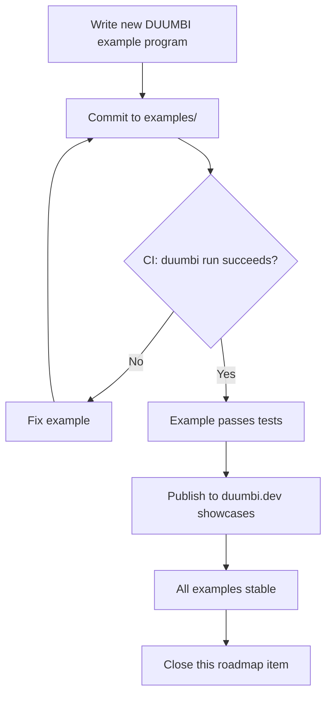

---
tags:
  - duumbi/inbox/enriched
  - duumbi/status/processed
  - duumbi/classification/execution
  - duumbi/value/high
  - duumbi/importance/high
  - duumbi/complexity/medium
duumbi_inbox_enrichment: processed
duumbi_inbox_enrichment_generated_at: 2026-06-18T07:41:24.882Z
---

# Flagship Examples and Showcase Programs

<!-- duumbi-inbox-enrichment:v1 status=processed generated_at=2026-06-18T07:41:24.882Z -->

## Source
- Surface: Manual Obsidian edit
- Vault path: Duumbi/00 Inbox (ToProcess)/2026-06-12 - Flagship Examples and Showcase Programs.md
- Submitted by: unknown unless explicit in the raw input

## Raw input
> ---
> tags:
>   - duumbi/inbox/roadmap
>   - duumbi/status/to-process
>   - duumbi/classification/execution
>   - duumbi/value/high
>   - duumbi/importance/high
>   - duumbi/complexity/medium
> created: 2026-06-12
> milestone: M0
> source: "[[DUUMBI Future Development Roadmap Map]]"
> related_issues:
>   - hgahub/duumbi#688
>   - hgahub/duumbi#382
> ---
> 
> # Flagship Examples and Showcase Programs
> 
> ## Context
> 
> `examples/` in the main repo is empty; showcases are toy-scale (calculator, fibonacci, min_of_two). Issue #688 asks for a flagship reference program (HTTP + SQLite + JSON), and #382 covers Tier 1 stdlib ecosystem E2E smoke tests. The Op surface now covers strings, arrays, structs, ownership, Result/Option, JSON, TCP, HTTP, SQLite, file I/O, and a static server — enough for a real program.
> 
> ## Goal
> 
> `examples/` contains 3–5 real programs, each buildable offline from the released binary, proving the language is more than single tiny functions.
> 
> ## Subtasks
> 
> 1. Flagship: small HTTP service backed by SQLite returning JSON (uses stdlib-http/db/json/server) — the #688 program.
> 2. CLI utility example: file processing with string ops + Result error handling.
> 3. Network example: TCP echo or HTTP client aggregation.
> 4. Each example: JSON-LD graph + `describe` output + expected run transcript + one-paragraph README, structured for copy-paste from docs.
> 5. CI job that builds and runs every example on every PR (examples never rot).
> 6. Wire #382 ecosystem E2E smoke tests so registry-distributed Tier 1 modules are exercised by at least one example (clean-workspace install evidence).
> 7. Surface the examples on duumbi.dev showcases section and in docs quickstart follow-ups.
> 
> ## Acceptance criteria
> 
> - `duumbi run` succeeds for every example on a clean machine with the released binary.
> - The flagship HTTP + SQLite + JSON example is referenced from the main repo README and in-repo examples guide.
> - CI fails if any example breaks.
> 
> ## Stage 12 Disposition
> 
> - 2026-06-15: Subtask 1 / GitHub issue #688 is complete. Implementation PR hgahub/duumbi#715 was merged at `64649fa9e3a3e14e021e2261b00eea872ecee448`, adding `examples/flagship-http-sqlite-json/`, root README/docs links, and focused CI coverage for the loopback HTTP + SQLite + JSON path.
> - The source GitHub issue was closed after Stage 12 closure evidence.
> - This note remains in `00 Inbox (ToProcess)` because the broader roadmap item is not fully complete: additional showcase examples, duumbi.dev/public-docs surfacing, and every-example CI coverage remain future work.
> 
> ## Links
> 
> - [[DUUMBI Future Development Roadmap Map]]
> - [[2026-06-12 - Release v0.4.0-preview TUI-first]]

## Interpreted intent

Expand the currently empty `examples/` directory with 3–5 real-world DUUMBI programs (HTTP service with SQLite and JSON, CLI file processing utility, TCP echo/HTTP client) to demonstrate the language's capabilities beyond toy functions. Ensure every example builds and runs correctly via CI on every PR, and surface them on duumbi.dev. The flagship HTTP+SQLite+JSON example (#688) is already implemented and merged, but the broader roadmap item remains incomplete.

## Developer summary

Extend the `examples/` directory with multiple non-trivial DUUMBI programs that showcase stdlib features (HTTP, SQLite, JSON, file I/O, TCP, string ops, Result error handling). Each example must be self-contained, include a README, and be tested via CI (`duumbi run`). The flagship example from GitHub issue #688 (https://github.com/hgahub/duumbi#688) is already implemented and merged (PR #715), and the source issue is closed. Remaining work: implement additional examples (CLI utility, network example), add CI coverage that builds/runs all examples on every PR, and surface all examples on duumbi.dev. Also coordinate with #382 ecosystem E2E smoke tests. This note should be archived once the remaining subtasks are tracked in separate GitHub issues.

## UML overview

## Classification
- Type: execution
- Business value: high
- Importance: high
- Complexity: medium

## Clarifications
### Answered
- The flagship HTTP+SQLite+JSON example (subtask 1) is complete and merged as PR #715.
- The note remains in Inbox because additional examples and CI coverage are not yet implemented.
- The related GitHub issues: #688 (closed, implemented), #382 (open, ecosystem E2E smoke tests).

### Open
- Should the remaining examples be implemented immediately or deferred to a later milestone?
- How many examples are sufficient? The note says 3–5, but the 5th may be optional.
- Should the note be closed after the remaining subtasks are created as GitHub issues, or kept open until all examples are live?
- What is the priority of duumbi.dev surfacing relative to CI coverage?

## Relevant DUUMBI context
- [[DUUMBI Future Development Roadmap Map]] – identifies this as an M0 milestone item.
- `docs/architecture.md` – provides overview of DUUMBI's build pipeline and compilation targets.
- `AGENTS.md` – describes the agent interaction style and repository layout.
- Source code layout: `src/` contains compiler, graph, agent, MCP, and CLI modules that are exercised by examples.
- Related issues: #688 (flagship example) and #382 (ecosystem smoke tests).

## Related GitHub context

GitHub issue #688 (Flagship Reference Program: HTTP + SQLite + JSON) is implemented and closed. PR #715 merged the example into `examples/flagship-http-sqlite-json/`. GitHub issue #382 (E2E smoke tests for every Tier 1 stdlib package) is still open and partially depends on example coverage. No other open issues directly reference this note.

## Initial routing recommendation

GitHub issue

## Requested follow-up
- Create separate GitHub issues for the remaining examples (CLI utility, TCP echo/HTTP client).
- Create a GitHub issue for CI job that builds and runs every example on each PR.
- Create a GitHub issue to surface all examples on duumbi.dev.
- Link the new issues to the existing roadmap note and consider archiving the note once they are created.

## AI agent instructions
- When creating GitHub issues, reference the existing PR #715 and note that the flagship example is complete.
- Mention that the source Inbox note should be archived when all subtasks are tracked in GitHub.
- Check the current state of #382 and coordinate example coverage with its requirements.
- Use the standard DUUMBI issue template if available, otherwise include a clear description and acceptance criteria.

## Scope candidate
### In
- Adding 2-4 new DUUMBI example programs (CLI utility, network echo/client, etc.).
- Adding CI workflow step that runs `duumbi run` on each example.
- Updating duumbi.dev documentation and showcases to list the examples.
- Each example must be buildable offline from the released DUUMBI binary.

### Out
- No new language features or standard library additions.
- No changes to the compiler or graph pipeline.
- No deep optimizations; examples should be readable and illustrative.
- No automatic deployment pipelines; duumbi.dev updates will be manual or follow a separate process.

## Risks and trade-offs
- The current DUUMBI toolchain may still have bugs that prevent some examples from building/running correctly.
- The HTTP + SQLite example already works, but the other examples may expose new compiler or runtime issues.
- CI time may become longer as more examples are added, requiring optimization of the build process.
- Duumbi.dev surfacing may require additional documentation effort that is not yet planned.

## Obsidian tags

#duumbi/inbox/enriched #duumbi/status/processed #duumbi/classification/execution #duumbi/value/high #duumbi/importance/high #duumbi/complexity/medium

## Enrichment result
- Date: 2026-06-18T07:41:24.882Z
- Status: ready for triage
- Canonical duplicate: none verified
- Facts:
- The `examples/` directory in the main repo was empty before #715.
- The only pre-existing examples were the toy‑scale calculator, fibonacci, and min_of_two programs.
- Issue #688 requested a flagship reference program, and PR #715 delivered `examples/flagship-http-sqlite-json/`.
- Issue #382 covers Tier 1 stdlib E2E smoke tests and is not yet fully implemented.
- The roadmap item (this note) is not fully complete: additional examples, CI, and duumbi.dev surfacing remain future work.
- Assumptions:
- The existing compiler and runtime are stable enough to support the proposed example programs.
- The HTTP + SQLite example can serve as a template for the others.
- The CI environment has the necessary dependencies (e.g., curl, sqlite3) available.
- The developer who implements the remaining examples is familiar with DUUMBI's Op set and stdlib.
- Recommendations:
- Split the remaining subtasks into separate, trackable GitHub issues.
- Prioritize CI coverage first so that new examples are automatically validated.
- Surface the examples on duumbi.dev only after all examples pass CI and are documented.
- Close this Inbox note and archive it once the follow-up issues have been created and linked.
