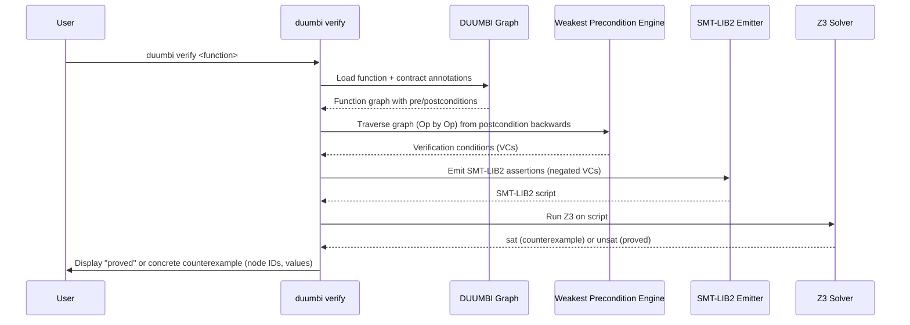

---
tags:
  - duumbi/inbox/enriched
  - duumbi/status/processed
  - duumbi/classification/research
  - duumbi/value/critical
  - duumbi/importance/high
  - duumbi/complexity/high
duumbi_inbox_enrichment: processed
duumbi_inbox_enrichment_generated_at: 2026-06-19T07:52:50.623Z
---

# Formal Verification: VCGen MVP

<!-- duumbi-inbox-enrichment:v1 status=processed generated_at=2026-06-19T07:52:50.623Z -->

## Source
- Surface: Manual Obsidian edit
- Vault path: Duumbi/00 Inbox (ToProcess)/2026-06-12 - Formal Verification VCGen MVP.md
- Submitted by: unknown unless explicit in the raw input

## Raw input
> ---
> tags:
>   - duumbi/inbox/roadmap
>   - duumbi/status/to-process
>   - duumbi/classification/research
>   - duumbi/value/critical
>   - duumbi/importance/high
>   - duumbi/complexity/high
> created: 2026-06-12
> milestone: M4
> source: "[[DUUMBI Future Development Roadmap Map]]"
> ---
> 
> # Formal Verification: VCGen MVP
> 
> ## Context
> 
> [[DUUMBI - Phase 15i - Formal Verification]] (archived) already states the thesis: Dijkstra's correctness vision failed to spread because the gap between source code and formal spec is too wide; DUUMBI's JSON-LD graph closes it — the program is already structured, typed, near-SSA, ownership-annotated, with explicit control flow. Verification pipeline collapses from 8 steps to 3: graph → VCGen (direct traversal) → SMT → Z3/CVC5. The schema already carries optional spec fields (`duumbi:verificationStatus`). Status today: Research.
> 
> ## Goal
> 
> `duumbi verify` exists: given a function with pre/postconditions in the graph, it generates verification conditions via weakest-precondition traversal, feeds Z3, and returns **proved** or a **concrete counterexample**. (Phase 15i kill criterion.)
> 
> ## Subtasks
> 
> 1. Contract vocabulary: finalize JSON-LD fields for precondition, postcondition, invariant, and effect annotations on Function/Block/Op nodes; extend the core schema + `jsonld-schema` validation.
> 2. WP rules per Op: implement the Phase 15i rule table (Const, Add/Sub/Mul/Div with overflow/div-by-zero obligations, Compare, Branch, Call with callee contracts, ArrayGet bounds, ReturnOk/ReturnErr) — start with the integer/bool/array subset, defer strings/IO effects.
> 3. SMT backend: SMT-LIB v2 emission, Z3 integration (process or bindings), counterexample parsing back to graph node ids + concrete values.
> 4. Branch-only loops: handle DUUMBI's loop-via-branch pattern with user-supplied invariants; document the limitation honestly. The planned structured Loop op ([[2026-06-12 - Op Set Expansion Tiers]]) provides the natural invariant attachment point — coordinate the two designs.
> 5. Targets: prove 3+ stdlib functions (abs, max, clamp; one array invariant) and one deliberately broken variant returning a counterexample.
> 6. Surface integration: `verificationStatus` shown in `describe`, TUI query answers ("can this be formally verified?"), and as evidence in intent/Loop artifacts.
> 7. Write-up: this is the headline differentiator — research note + blog post with the 8-step vs. 3-step pipeline comparison.
> 
> ## Acceptance criteria
> 
> - `duumbi verify <function>` proves the 3 stdlib targets and produces a counterexample for the broken variant.
> - Verification results stored as evidence and queryable.
> - Unsupported constructs fail with explicit "not yet verifiable because X", never silently pass.
> 
> ## Links
> 
> - [[DUUMBI Future Development Roadmap Map]]
> - [[2026-06-12 - Compositional Verification Proof Boundaries]]
> - [[2026-06-12 - Determinism Program for AI Development]]

## Interpreted intent

Implement the `duumbi verify` command that, given a function with pre/postconditions in the semantic graph, generates verification conditions via a weakest-precondition traversal of the graph, feeds them to Z3, and returns either 'proved' or a concrete counterexample. This is the Phase 15i kill criterion: collapse the verification pipeline from 8 steps to 3 (graph → VCGen → SMT → Z3/CVC5).

## Developer summary

The note proposes an MVP for formal verification inside DUUMBI. The pipeline is: (1) extend the JSON-LD schema with contract fields (precondition, postcondition, invariant, effect) on Function/Block/Op nodes; (2) implement weakest-precondition rules per Op (integers, bools, arrays with bounds, returns, calls with callee contracts) — exclude strings and IO initially; (3) emit SMT-LIB v2 and integrate Z3 (process or bindings), parse counterexamples back to graph node IDs; (4) support loop invariants on DUUMBI’s branch-based loops, coordinating with the evolving Loop op expansion design; (5) prove 3 stdlib functions and one deliberately broken variant; (6) surface verification results in `describe`, TUI, and intent artifacts; (7) write up the 8-step vs 3-step pipeline comparison. The kill criterion is that `duumbi verify <function>` must prove the 3 targets and expose the broken case. Unsupported constructs must fail with explicit 'not yet verifiable because…' messages.

## UML overview

## Classification
- Type: research
- Business value: critical
- Importance: high
- Complexity: high

## Clarifications
### Answered
- The note defines the goal, kill criterion, and 7 subtasks explicitly.
- The classification is currently 'research' because Phase 15i is a research item; this MVP is the research deliverable.
- The note links to related research items: Compositional Verification Proof Boundaries and Determinism Program for AI Development.
- The milestone is M4, so this is a planned research effort within the roadmap.

### Open
- What is the exact JSON-LD contract vocabulary? Should contracts be attached to Functions, Blocks, or both?
- How will user-supplied loop invariants be attached given the current branch-only loop pattern? Needs coordination with the Loop op expansion (2026-06-12 - Op Set Expansion Tiers).
- Should the MVP handle only integer/bool/array subset as stated, or should it also attempt minimal string/IO examples?
- What is the testing strategy for the VCGen itself (unit tests for WP rules, integration tests for Z3 interaction)?
- How should verification proofs be cached for reuse (e.g., per function, per semantic hash)? This may overlap with Compositional Verification Proof Boundaries.
- Are there any PRs or issues already open for this in GitHub? None visible in the provided context, but triage should check.

## Relevant DUUMBI context
- Vault path: Duumbi/00 Inbox (ToProcess)/2026-06-12 - Formal Verification VCGen MVP.md – the raw input itself.
- Vault path: Duumbi/01 Atlas (Knowledge Base)/Maps (Overviews)/DUUMBI Future Development Roadmap Map – provides milestone and phase context.
- Vault path: Duumbi/05 Archive/… – Phase 15i spec (archived, but states the thesis and pipeline).
- Source code: src/types.rs – Op enum with all operations that need WP rules (Const, Add, Branch, Call, ArrayGet, etc.).
- Source code: src/graph/mod.rs – GraphNode, GraphEdge definitions; contracts would extend these.
- Source code: src/compiler/mod.rs – CodegenBackend trait; verification pipeline would be a separate concern but may interact with codegen for counterexample presentation.
- Vault path: Duumbi/01 Atlas (Knowledge Base)/Works (Developed Materials)/DUUMBI - PRD – verification as part of the 'Runtime Failure Feedback' and 'Repair Validation Evidence' stories.

## Related GitHub context

No known GitHub issues or PRs specifically for this task. Triage should verify later.

## Initial routing recommendation

GitHub issue

## Requested follow-up
- Create a GitHub issue from this enriched note, linking to the vault source.
- Label the issue as research/verification with milestone M4.
- Clarify the contract vocabulary design before beginning VCGen implementation.
- Coordinate with the Loop op expansion (Op Set Expansion Tiers) note to define loop invariant attachment.
- Decide on the integration test strategy for Z3 (mock solver in dev, real solver in CI?).
- Plan the write-up (blog post, research note) as part of the MVP deliverable.

## AI agent instructions
- When creating the GitHub issue, include the subtitle 'Formal Verification: VCGen MVP'.
- Use the developer_summary as the issue body abstract.
- Break down the 7 subtasks as checklist items in the issue.
- Mark the issue as blocked by the contract vocabulary design (needs a spec PR or decision record).
- Note the kill criterion explicitly: prove 3 stdlib functions and produce a counterexample for the broken variant.
- Add a note that this issue supersedes or implements the Phase 15i research note.
- Suggest that the `duumbi verify` command could be a new top-level CLI command under `src/cli/`.
- Remind that unsupported constructs must fail with explicit error, never silently pass.

## Scope candidate
### In
- JSON-LD contract vocabulary for Function/Block/Op nodes (precondition, postcondition, invariant, effect).
- WP rules for integer/bool/array subset (Const, Add/Sub/Mul/Div with overflow/div-by-zero obligations, Compare, Branch, Call with callee contracts, ArrayGet bounds, ReturnOk/ReturnErr).
- SMT-LIB v2 emission and Z3 integration (process or bindings), including counterexample parsing.
- Branch-only loop support with user-supplied invariants.
- Proving 3 stdlib functions (abs, max, clamp; one array invariant) and one deliberately broken variant.
- Surface integration: `verificationStatus` shown in `describe`, TUI, and as evidence in intent/Loop artifacts.
- Write-up comparing 8-step vs 3-step pipeline.

### Out
- String and I/O effect verification deferred to future work.
- Full compositional verification (proof cache per semantic hash) – separate research item.
- Support for structured Loop op (not yet defined).
- Integration with runtime failure feedback (Phase 13) beyond static verification results.
- Automated invariant inference – out of scope for MVP.

## Risks and trade-offs
- The WP traversal may be incomplete for graph patterns not covered by the subset (e.g., recursive calls, multi-module programs).
- Z3 integration complexity: process invocation may be slow, bindings may introduce native dependency issues.
- Loop invariants for branch-only loops may be awkward to attach and may become stale when Loop op is introduced.
- The kill criterion might be too ambitious if the graph representation doesn't easily support structured contracts.
- Unsupported constructs failing with explicit messages requires enumerating all `TODO` branches in VCGen, which could be easily forgotten.

## Obsidian tags

#duumbi/inbox/enriched #duumbi/status/processed #duumbi/classification/research #duumbi/value/critical #duumbi/importance/high #duumbi/complexity/high

## Enrichment result
- Date: 2026-06-19T07:52:50.623Z
- Status: ready for triage
- Canonical duplicate: none verified
- Facts:
- The note is from the roadmap (milestone M4) and references Phase 15i (archived).
- The current verification pipeline collapse thesis: 8 steps → 3 steps.
- Subtasks 1–7 are explicitly listed.
- The note links to Compositional Verification Proof Boundaries and Determinism Program for AI Development.
- DUUMBI's graph structure is typed, near-SSA, ownership-annotated, with explicit control flow — this simplifies VCGen.
- The schema already has optional `duumbi:verificationStatus` field.
- Assumptions:
- The existing graph representation (petgraph StableGraph) can be traversed for WP computation without major refactoring.
- Z3 can be invoked as an external process or via Rust bindings without significant licensing or distribution issues.
- The contract vocabulary can be added as JSON-LD extensions without breaking existing parsers/validators.
- The branch-only loop pattern is semantically equivalent to the future Loop op for the purposes of invariant attachment.
- The stdlib functions (abs, max, clamp) are already implemented in graph form and can serve as test targets.
- Recommendations:
- Start with a research spike: prototype WP rules for a single function (e.g., abs) and run Z3 to confirm feasibility.
- Collaborate with the Loop op expansion design to define a future-proof invariant attachment point; document the interim solution explicitly.
- Design the contract vocabulary in a separate spec note or RFC before committing to schema changes.
- Consider writing the VCGen as a new module `src/verification/` that reads the graph and produces SMT-LIB, keeping it decoupled from the compiler.
- Plan to publish the write-up as a blog post early to gauge community interest and attract collaborators.
