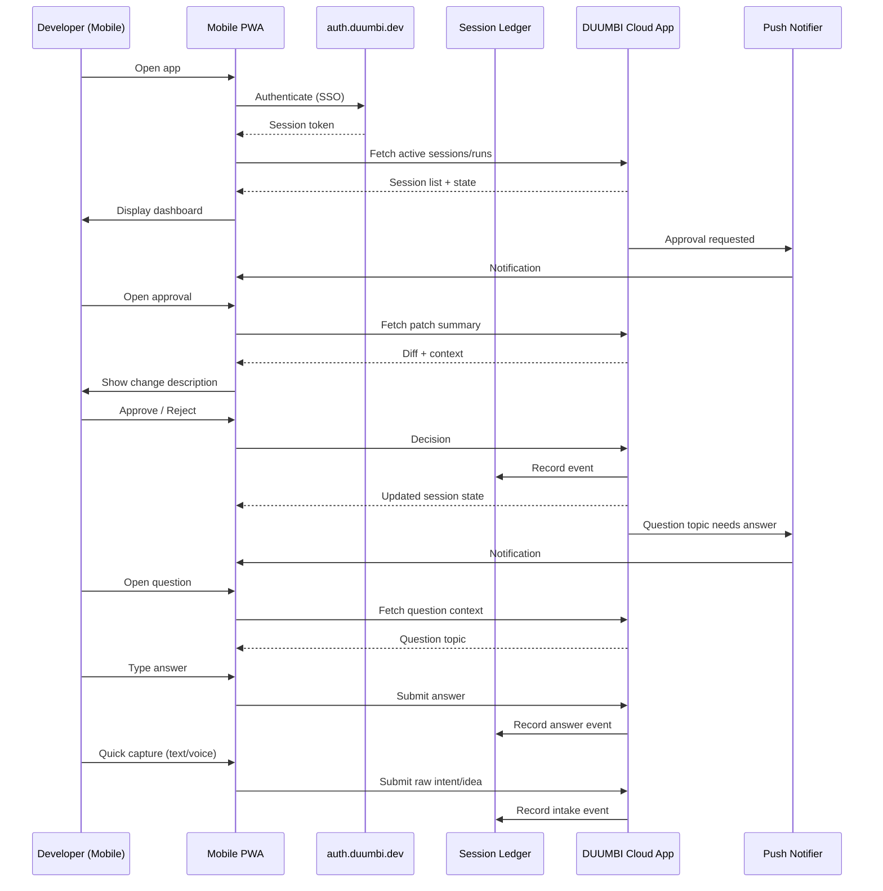

---
tags:
  - duumbi/inbox/enriched
  - duumbi/status/processed
  - duumbi/classification/execution
  - duumbi/value/medium
  - duumbi/importance/low
  - duumbi/complexity/medium
duumbi_inbox_enrichment: processed
duumbi_inbox_enrichment_generated_at: 2026-06-20T18:30:46.090Z
---

# Mobile App and Supervision Surface

<!-- duumbi-inbox-enrichment:v1 status=processed generated_at=2026-06-20T18:30:46.090Z -->

## Source
- Surface: Manual Obsidian edit
- Vault path: Duumbi/00 Inbox (ToProcess)/2026-06-12 - Mobile App and Supervision Surface.md
- Submitted by: unknown unless explicit in the raw input

## Raw input
> ---
> tags:
>   - duumbi/inbox/roadmap
>   - duumbi/status/to-process
>   - duumbi/classification/execution
>   - duumbi/value/medium
>   - duumbi/importance/low
>   - duumbi/complexity/medium
> created: 2026-06-12
> milestone: post-1.0
> source: "[[DUUMBI Future Development Roadmap Map]]"
> ---
> 
> # Mobile App and Supervision Surface
> 
> ## Context
> 
> Surface #5, post-1.0. The vault already records the working pattern: mobile-supervised delivery (Codex App, Slack as mobile capture surface). For DUUMBI the realistic first mobile value is **supervision, not authoring**: watch runs, answer clarifying questions, approve/reject patches and stage gates — continuing a session in the "decide" role while away from a keyboard. Requires Cloud App + session sync (M6) as backend.
> 
> ## Goal
> 
> A mobile app (or installable PWA first) where a signed-in user sees active sessions/runs, receives push notifications on approval gates and questions, and can approve, reject, or answer — those decisions land in the same session ledger every other surface reads.
> 
> ## Subtasks
> 
> 1. Form-factor decision: PWA on top of app.duumbi.dev first (cheapest, reuses Studio) vs. native (Tauri Mobile / Flutter / Swift+Kotlin). Recommend PWA + push first; reassess native after usage data.
> 2. Supervision UX: session list, run timeline, question topics inbox, patch summary view (graph diff rendered as readable change description), approve/reject with audit trail.
> 3. Push notifications: needs-input, run completed/failed, approval requested; quiet hours.
> 4. Mobile capture: quick intent/idea capture into the inbox flow (text/voice), feeding intake — replaces the Slack-capture workaround.
> 5. Security: biometric unlock for approval actions; scoped mobile tokens; remote sign-out.
> 6. Explicit non-goals first version: no graph editing, no local builds on mobile.
> 
> ## Acceptance criteria
> 
> - An approval requested in a TUI/cloud session can be granted from the phone within seconds, recorded in the ledger.
> - Question topics can be answered from mobile and consumed by the next loop step.
> - Capture-to-intake works end-to-end from mobile.
> 
> ## Links
> 
> - [[DUUMBI Future Development Roadmap Map]]
> - [[2026-06-12 - Cloud App and DUUMBI Account SSO]]
> - [[2026-06-12 - Session Kernel and Event Ledger]]

## Interpreted intent

Create a mobile Progressive Web App (PWA) for supervision of DUUMBI sessions. Users should view active runs, receive push notifications for approval gates and questions, and be able to approve, reject, or answer — actions recorded in the session ledger. Also includes quick idea/intent capture into the inbox flow.

## Developer summary

Develop a PWA stacked on app.duumbi.dev (reusing Studio) to serve as a mobile supervision companion. Requires Cloud App + session sync (M6) as backend. Users sign in, see a session list and run timeline, receive push notifications for needing input, approval requests, and run results. They can approve/reject patches (audit trail), answer clarifying questions (feeding next loop step), and capture ideas/intents via text or voice. Includes biometric unlock for approval actions, scoped mobile tokens, and remote sign-out. Non-goals: no graph editing, no local builds, no native rewrite before data supports it.

## UML overview

## Classification
- Type: execution
- Business value: medium
- Importance: low
- Complexity: medium

## Clarifications
### Answered
- Form-factor decision: PWA first, native reassess after usage data.
- Explicit non-goals: no graph editing, no local builds.
- Dependencies: Cloud App (M6) and Session Kernel + Event Ledger (M2) must be in place.
- Security requirements: biometric unlock for approvals, scoped mobile tokens, remote sign-out.
- Acceptance criteria: approvals, question answers, and capture-to-intake must work end-to-end with session ledger.

### Open
- Which push notification service and protocol? (WebPush via service worker, FCM, third-party?)
- Offline / spotty-connectivity behavior: re-queue decisions, stale-data handling?
- Authentication flow details: how does PWA obtain and refresh the session token from auth.duumbi.dev?
- How will multiple devices be handled? (e.g., phone + tablet + desktop concurrently)
- Mobile-optimized UX details: timeline layout, diff rendering on small screen, notification grouping.
- Testing strategy: how to verify push delivery, latency, and ledger consistency end-to-end.
- Rollout plan: Alpha to specific users, then general after Cloud App GA?
- Should quick capture support voice transcription on-device or via a cloud API?

## Relevant DUUMBI context
- Duumbi/00 Inbox (ToProcess)/2026-06-12 - Cloud App and DUUMBI Account SSO.md — prerequisite M6 account and hosted Studio.
- Duumbi/00 Inbox (ToProcess)/2026-06-12 - Session Kernel and Event Ledger.md — prerequisite M2 event ledger needed for mobile decisions to sync.
- Duumbi/01 Atlas (Knowledge Base)/Works (Developed Materials)/DUUMBI - PRD.md — product vision and agentic supervision surface concept.
- Duumbi/01 Atlas (Knowledge Base)/Works (Developed Materials)/DUUMBI - Glossary.md — definitions of supervision, Slack capture, session ledger.
- Duumbi/01 Atlas (Knowledge Base)/Maps (Overviews)/DUUMBI Agentic Development Map.md — mobile capture role in intake flow.
- Duumbi/01 Atlas (Knowledge Base)/Works (Developed Materials)/DUUMBI - Agentic Development Runbook.md — Stage 5 human acceptance flow may later integrate mobile approvals.
- Source code: crates/duumbi-studio — existing Studio frontend may serve as basis for PWA.
- Source code: AGENTS.md — agent contract mentions Slack as mobile capture surface; this replaces that workaround.

## Related GitHub context

No related GitHub issues, PRs, or discussions found for this specific mobile supervision surface. Triage should verify after initial routing.

## Initial routing recommendation

GitHub issue

## Requested follow-up
- Create a GitHub issue to track this feature (post-1.0 milestone).
- Link the issue to the parent roadmap note and dependent Cloud App/Session Kernel issues.
- Include a checklist for PWA architecture decisions and supervision features.

## AI agent instructions
- Create a GitHub issue labeled 'feature', 'mobile', 'post-1.0' with a dependency on M6 (Cloud App/SSO) and M2 (Session Kernel).
- Break down implementation into: (1) PWA scaffold on app.duumbi.dev, (2) session list + run timeline UI, (3) push notification integration with WebPush, (4) approve/reject with audit, (5) question answering workflow, (6) quick capture (text/voice), (7) biometric unlock and token security.
- Reference vault notes for context: [[2026-06-12 - Cloud App and DUUMBI Account SSO]], [[2026-06-12 - Session Kernel and Event Ledger]].
- Include in the issue body explicit non-goals (no graph editing, no local builds).

## Scope candidate
### In
- PWA mobile supervision surface on app.duumbi.dev
- Push notifications for approval gates, questions, and run status
- Approve/reject patches with audit trail recorded in session ledger
- Answer clarifying questions from mobile, feeding back into agent loop
- Quick capture of ideas/intents (text/voice) into the intake flow
- Biometric unlock for approval actions
- Scoped mobile API tokens with remote sign-out

### Out
- Native mobile app (Tauri Mobile, Flutter, Swift/Kotlin) — reassess after PWA data
- Graph editing or program authoring on mobile
- Local builds or compilation on mobile
- Full offline capability (v1 may require network for approvals)

## Risks and trade-offs
- PWA push notification support is inconsistent across browsers and iOS Safari limitations.
- Session synchronization latency between cloud ledger and mobile display could cause stale approval data.
- Biometric unlock may not be available on all devices (e.g., older phones, desktops).
- Scoped token management must be airtight to prevent session hijacking.
- Quick capture may need voice transcription service, adding third-party dependency.
- Mobile UX complexity — diff rendering on small screens is challenging.

## Obsidian tags

#duumbi/inbox/enriched #duumbi/status/processed #duumbi/classification/execution #duumbi/value/medium #duumbi/importance/low #duumbi/complexity/medium

## Enrichment result
- Date: 2026-06-20T18:30:46.090Z
- Status: ready for triage
- Canonical duplicate: none verified
- Facts:
- The note is tagged as execution, post-1.0 (M1 already defined current milestone).
- The vault records that initial mobile value is supervision, not authoring.
- Dependencies: Cloud App (M6) and Session Kernel (M2) must exist first.
- The roadmap recommends PWA as initial approach.
- Acceptance criteria: approval from phone in seconds, question answering, capture-to-intake.
- Assumptions:
- PWA stack on app.duumbi.dev is viable and can reuse existing Studio SPA components.
- Push notifications can be implemented via WebPush API; a backend relay is needed.
- DUUMBI account SSO will be available for mobile token issuance.
- Biometric Web Authentication (WebAuthn) can be used for approval actions within a PWA.
- Voice capture may use browser SpeechRecognition API without external services.
- Recommendations:
- Delay implementation until Cloud App and SSO (M6) and Session Kernel (M2) are complete.
- Start with a prototype PWA that loads session state from a mock cloud endpoint to validate push and approval UX before backend integration.
- Use GitHub Discussions for early form-factor debate before creating an issue.
- Consider using the existing Studio GitHub issues to track this as a 'Studio Mobile' label.
