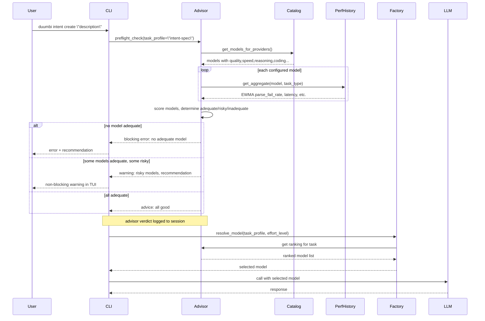

---
tags:
  - duumbi/inbox/enriched
  - duumbi/status/processed
  - duumbi/classification/execution
  - duumbi/value/critical
  - duumbi/importance/high
  - duumbi/complexity/medium
duumbi_inbox_enrichment: processed
duumbi_inbox_enrichment_generated_at: 2026-06-21T07:39:03.245Z
---

# Model Capability Advisor and Task Routing

<!-- duumbi-inbox-enrichment:v1 status=processed generated_at=2026-06-21T07:39:03.245Z -->

## Source
- Surface: Manual Obsidian edit
- Vault path: Duumbi/00 Inbox (ToProcess)/2026-06-12 - Model Capability Advisor and Task Routing.md
- Submitted by: unknown unless explicit in the raw input

## Raw input
> ---
> tags:
>   - duumbi/inbox/roadmap
>   - duumbi/status/to-process
>   - duumbi/classification/execution
>   - duumbi/value/critical
>   - duumbi/importance/high
>   - duumbi/complexity/medium
> created: 2026-06-12
> milestone: M1
> source: "[[DUUMBI Future Development Roadmap Map]]"
> related_issues:
>   - hgahub/duumbi#675
> ---
> 
> # Model Capability Advisor and Task Routing
> 
> ## Context
> 
> The user's pain: if the models available under their configured providers are likely inadequate for a task (especially intent create), DUUMBI should say so **before** the work fails. The building blocks already exist but are disconnected (verified 2026-06-12):
> 
> - The model catalog (`src/agents/model_catalog.rs`, DUUMBI-675) carries `quality`, `speed`, `cost_efficiency`, `reasoning`, `coding`, `lifecycle` per model — but is **documentation-only at runtime**; nothing reads it for decisions.
> - Model performance tracking (`src/agents/model_performance.rs`) appends per-call events (outcome incl. ParseFailure/ValidationFailure, latency, cost) and keeps EWMA aggregates per model — but is **passive telemetry**, never consulted.
> - Provider selection happens once at init (`src/agents/factory.rs`); the fallback chain only handles transient errors. There is **no per-task routing**: intent clarify, spec generation, mutation, repair, and query all hit the same model.
> - Failure records know which provider/model failed at what task type — also unused for selection.
> 
> ## Goal
> 
> Every LLM-calling step declares a capability profile; DUUMBI evaluates the user's configured models against the catalog plus local performance history, warns with a recommendation before work starts, and routes each step to the best adequate configured model.
> 
> ## Subtasks
> 
> 1. Task capability profiles as data: intent-clarify (fast, cheap), intent-spec (reasoning + structured output), mutation (coding + tool use), repair (coding), query (cheap, long context), verification-assist. Each declares required vs preferred capabilities.
> 2. Preflight advisor: at intent create/execute start (and as `duumbi provider doctor`), score each configured model against the step's profile using catalog metadata + local aggregates (e.g. ">40% parse-failure EWMA on intent-spec → risky"). Output: adequate / risky / inadequate with a concrete recommendation ("model X under your providers fits better; or enable provider Y"). Warn non-blocking; block only on hard incompatibility (e.g. tool-use required but unsupported).
> 3. Per-task routing: extend `ModelSelectionContext` so the factory resolves a model per task profile, not once per session; effort level ([[2026-06-12 - Effort Levels and Cost Control]]) shifts the tier up/down; fallback chain stays for transient errors.
> 4. Close the loop on passive data: advisor consumes model-performance aggregates and failure records; enforce strategy/failure-pattern deprecation (`agent_knowledge.rs` marks >70%-fail patterns deprecated but selection ignores it today).
> 5. Catalog as runtime input: the DUUMBI-675 user-approved local catalog becomes the advisor's source; catalog gains task-type evidence fields fed by create/execute evals ([[2026-06-12 - Intent Create Hardening]] subtask 6).
> 6. Surfaces: TUI warning panel on intent create/execute; CLI `provider doctor` table (per task type × configured model adequacy); advisor verdicts logged to the session for auditability.
> 
> ## Acceptance criteria
> 
> - Configuring a known-weak model and running intent create yields a pre-call warning naming the risk and a recommendation — before tokens are spent.
> - With two adequate models configured, spec generation and mutation demonstrably route to different models per their profiles.
> - Advisor predictions validated against eval outcomes (a model marked "inadequate" indeed fails the eval; "adequate" passes) on the phase15-e2e corpus.
> 
> ## Links
> 
> - [[DUUMBI Future Development Roadmap Map]]
> - [[2026-06-12 - Intent Create Hardening]]
> - [[2026-06-12 - Effort Levels and Cost Control]]
> - [[2026-06-12 - Active Learning Loop]]

## Interpreted intent

Implement a preflight advisor and per-task model routing so DUUMBI warns users before issuing calls to inadequate models and routes each LLM step to the best configured model based on capability profiles, catalog metadata, and local performance history.

## Developer summary

Connect the existing passive data sources (model catalog, model performance telemetry) to a new Model Advisor and per-task router. Define capability profiles for each DUUMBI task (clarify, spec, mutation, repair, query, verification). Introduce a preflight check before intent create/execute that scores the user's configured models against the required capabilities, warns if inadequate, and recommends alternatives. Implement per-task model resolution in the factory (ModelSelectionContext) so different tasks get different models, respecting effort levels. Add TUI warning panel and CLI `provider doctor` command. Validate advisor predictions against eval outcomes.

## UML overview

## Classification
- Type: execution
- Business value: critical
- Importance: high
- Complexity: medium

## Clarifications
### Answered
- The model catalog (DUUMBI-675) holds quality, speed, cost_efficiency, reasoning, coding, lifecycle fields per model but is not consumed at runtime.
- Model performance tracking records per-call EWMA aggregates per model but is passive and never consulted for decisions.
- Provider selection is once per session with a fallback chain; there is no per-task routing.
- Failure records note which provider/model failed on which task type but are unused for selection.
- Subtasks define capability profiles (clarify, spec, mutation, repair, query, verification), preflight advisor scoring, per-task routing, closing passive data loops, and surfaces (TUI, CLI `provider doctor`, session logs).
- Acceptance criteria: pre-call warning before token spend, demonstrable model routing for spec vs. mutation, advisor prediction validated against eval outcomes.

### Open
- Should the preflight advisor only warn, or block execution on hard incompatibility (e.g., no model supports tool use)?
- What exact thresholds map to adequate, risky, and inadequate?
- How should effort levels shift the model tier up/down numerically?
- Which performance aggregates (EWMA windows) and which metrics (parse_fail_rate, latency_p99) should be used?
- Should the advisor consume historical failure records per task type, and how to weight recent vs. old records?
- What form should the TUI warning take: modal, inline banner, or status line?
- When no configured model is adequate, should DUUMBI fail with a suggestion to enable another provider?
- Should `provider doctor` output a table, JSON, or both?
- What fields should the advisor log to the session ledger for auditability?
- How frequently should advisor predictions be validated against the phase15-e2e eval corpus, and what is the success metric for the validation?

## Relevant DUUMBI context
- Duumbi/00 Inbox (ToProcess)/2026-06-12 - Model Capability Advisor and Task Routing.md (the raw intake note)
- DUUMBI - PRD (product vision and user workflows)
- DUUMBI Technical Architecture Map (system boundaries and component interactions)
- src/agents/model_catalog.rs (catalog data source, DUUMBI-675, defines model fields but documentation-only)
- src/agents/model_performance.rs (telemetry data source, EWMA aggregates per model, passive)
- src/agents/factory.rs (current provider selection, fallback chain, session-level only)
- src/agents/agent_knowledge.rs (failure pattern deprecation marking, currently ignored by selection)
- Active Learning Loop note (2026-06-12) for closing the loop on evidence
- Intent Create Hardening note (2026-06-12) for eval-driven catalog evidence fields
- Effort Levels and Cost Control note (2026-06-12) for effort-aware routing

## Related GitHub context

DUUMBI-675 created model catalog; triage should verify if additional issues/discussions exist for model selection or advisor.

## Initial routing recommendation

GitHub issue

## Requested follow-up
- Convert this into a detailed implementation issue with subtasks (capability profiles, advisor scoring, routing, TUI/CLI surfaces).
- Ensure the design ties into the active learning loop and evaluation feedback.
- Clarify open questions before starting implementation.

## AI agent instructions
- Create a single GitHub issue with the title 'Model Capability Advisor and Task Routing'.
- Elaborate subtasks: define task profiles, implement advisor scoring, extend factory routing, build TUI warning and provider doctor CLI, validate with eval corpus.
- Link to existing issues DUUMBI-675 (catalog) and intent/eval hardening notes.
- Mark as M1 milestone, high priority.
- Include the Mermaid sequence diagram in the issue description.

## Scope candidate
### In
- Define capability profiles per DUUMBI task (clarify, spec, mutation, repair, query, verification).
- Preflight advisor: score configured models against profiles + local performance aggregates.
- Non-blocking warning (or blocking on hard incompatibility) before intent create/execute.
- Per-task model resolution in factory, driven by effort level.
- CLI `provider doctor` command showing per-task × model adequacy.
- TUI warning surface.
- Session ledger logging of advisor verdicts.
- Integration with model catalog and passive performance data.
- Validation against eval outcomes.

### Out
- Automatically downloading new models or providers.
- Dynamic catalog updates from external benchmarks (covered by Provider Model Catalog Refresh).
- Cloud-based telemetry sharing.
- Multi-session or cross-user learning (future active learning loop scope).

## Risks and trade-offs
- Per-task routing may increase configuration complexity and user confusion if not transparent.
- EWMA aggregates may be stale if model behavior changes rapidly; need decay/refresh strategy.
- Hard blocking on inadequate models could frustrate users who want to try anyway.
- Effort-level interplay with routing could produce unexpected cost spikes if logic is too simplistic.

## Obsidian tags

#duumbi/inbox/enriched #duumbi/status/processed #duumbi/classification/execution #duumbi/value/critical #duumbi/importance/high #duumbi/complexity/medium

## Enrichment result
- Date: 2026-06-21T07:39:03.245Z
- Status: ready for triage
- Canonical duplicate: none verified
- Facts:
- Model catalog exists but is documentation-only; not consumed at runtime.
- Model performance telemetry is collected per call (EWMA) but never queried for decisions.
- Provider selection is static per session; no per-task differentiation.
- Failure records exist but are unused for model selection.
- The note explicitly states the building blocks are disconnected and need integration.
- Assumptions:
- The model catalog structure (fields, format) will remain as described and can be loaded at runtime.
- Task profiles will be static or configurable data, not hardcoded logic.
- Existing provider factory can be extended with a per-task resolution layer without breaking the fallback chain.
- TUI warning can be added to the existing interface without major redesign.
- Recommendations:
- Route this as a high-priority GitHub issue in M1, directly connected to DUUMBI-675 and the active learning loop roadmap.
- Start with a lightweight scoring model and validate against eval outcomes before adding complexity.
- Implement blocking only for critical incompatibility (e.g., required function calling not supported); otherwise, warn.
- Make `provider doctor` a read-only diagnostic command first, then gradually add recommendation features.
