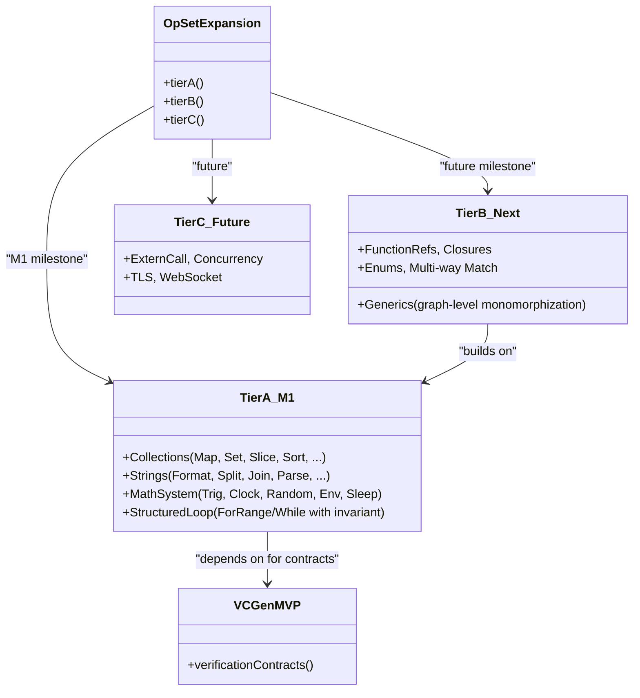

---
tags:
  - duumbi/inbox/enriched
  - duumbi/status/processed
  - duumbi/classification/execution
  - duumbi/value/critical
  - duumbi/importance/high
  - duumbi/complexity/high
duumbi_inbox_enrichment: processed
duumbi_inbox_enrichment_generated_at: 2026-06-21T18:32:36.923Z
---

# Op Set Expansion Tiers

<!-- duumbi-inbox-enrichment:v1 status=processed generated_at=2026-06-21T18:32:36.923Z -->

## Source
- Surface: Manual Obsidian edit
- Vault path: Duumbi/00 Inbox (ToProcess)/2026-06-12 - Op Set Expansion Tiers.md
- Submitted by: unknown unless explicit in the raw input

## Raw input
> ---
> tags:
>   - duumbi/inbox/roadmap
>   - duumbi/status/to-process
>   - duumbi/classification/execution
>   - duumbi/value/critical
>   - duumbi/importance/high
>   - duumbi/complexity/high
> created: 2026-06-12
> milestone: M1
> source: "[[DUUMBI Future Development Roadmap Map]]"
> ---
> 
> # Op Set Expansion Tiers
> 
> ## Context
> 
> Capability-gap audit (verified 2026-06-12): the ~119-op set covers arithmetic, strings, arrays, structs, ownership, Result/Option, JSON, TCP, HTTP, SQLite, and file I/O — enough for the flagship example, far from "most tasks". Confirmed gaps: **no map/set/dictionary**, no string format/split/join, no string→number parsing, no f64 formatting, **no time/date, no random, no env/args/sleep**, no trig/log/exp, no sorting, **no function values** (no callbacks/comparators — the HTTP server can only serve static routes), no closures, **no generics** (stdlib duplicates per type), no multi-way match/enums, and **loops exist only as backward-branch CFGs** — hard for LLMs to emit correctly and offering no invariant attachment point for verification.
> 
> **Design principle:** the op set is also the verification vocabulary. Every new op ships as a complete contract — type rules, ownership rules, WP/VCGen rule, effect annotation, `describe`/projection rendering, and property-test generator — or it doesn't ship. Growing the set carelessly destroys M4.
> 
> ## Goal
> 
> A tiered expansion so the intent pipeline can implement progressively more real tasks, with AI emission ease and verifiability as first-class selection criteria.
> 
> ## Subtasks
> 
> ### Tier A — completeness foundations (this milestone)
> 1. Collections: `Map` op family (string-keyed first: New/Insert/Get/TryGet/Remove/Len/Keys), `Set`; array additions (Pop/Remove/IndexOf/Slice/Sort/Contains) with properly typed elements (i64/f64/string handles).
> 2. Strings: `StringFormat` (template-based), `Split`/`Join`, `StringToI64`/`StringToF64` → Result, `F64ToString` with precision, byte/char access.
> 3. Math & system: trig/log/exp/abs/floor/ceil (libm is already linked), `Clock` (monotonic + wall), date formatting, `Random` with **mandatory explicit seed** (determinism/replay — no ambient entropy), `Env`/`Args`, `Sleep`.
> 4. **Structured Loop op** (`ForRange`/`While` with body block and an explicit invariant slot): desugars to the existing branch CFG for codegen, but exists for three reasons — LLMs emit it far more reliably than backward branches, `describe` output becomes readable, and VCGen gets its loop-invariant attachment point ([[2026-06-12 - Formal Verification VCGen MVP]]).
> 
> ### Tier B — abstraction (next)
> 5. Function references + `CallIndirect` with declared signatures → comparators, callbacks, dynamic HTTP route handlers (unblocks a real server story).
> 6. Explicit closures: capture-struct + function-ref pair, ownership-checked.
> 7. First-class enums/tagged unions + multi-way `Match` with exhaustiveness checking (today Match is hardcoded binary Ok/Err, Some/None).
> 8. Generics decision: **graph-level monomorphization** — typed instances generated at the intent/registry layer (fits semantic-hash reuse and keeps codegen monomorphic); document as the chosen strategy vs. per-type stdlib duplication.
> 
> ### Tier C — systems
> 9. ExternCall, concurrency, TLS/WebSocket/streaming → scoped in [[2026-06-12 - Runtime Capability Modules and Library Adoption]].
> 
> ### Process
> 10. Eval-driven prioritization: mine intent-eval failures ("this intent needed op X") to order the backlog; every new family lands with a showcase, a stdlib wrapper module, and a registry publish.
> 
> ## Acceptance criteria
> 
> - The M1 multi-module eval corpus is expressible without workarounds for: dictionary use, string formatting/parsing, timestamps, seeded randomness, and loop-based iteration.
> - Every shipped op family has its VCGen rule, effect annotation, and property-test generator on day one.
> - LLM graph-emission failure rate measured before/after the structured Loop op shows a significant drop on iteration-heavy tasks.
> 
> ## Links
> 
> - [[DUUMBI Future Development Roadmap Map]]
> - [[2026-06-12 - Codegen Trap Discipline and Backend Hardening]]
> - [[2026-06-12 - Runtime Capability Modules and Library Adoption]]
> - [[2026-06-12 - Formal Verification VCGen MVP]]
> - [[2026-06-12 - Intent at Scale Multi-Module and BDD]]

## Interpreted intent

Expand the DUUMBI op set in tiers to cover collections, strings, math/system, structured loops, and later abstraction/systems, each with full verification contracts.

## Developer summary

Implement a phased expansion of DUUMBI's ~119-op set, starting with foundational collections (Map, Set), string handling, math/date/random/env, and a structured loop op for LLM emission ease. Each new op family must include full verification contracts: type rules, ownership rules, WP/VCGen rule, effect annotation, describe output, and property-test generator. Tier A targets M1 milestone to enable multi-module eval corpus without workarounds. Subsequent tiers add function references/closures, generics, enums, and systems ops. The structured loop op desugars to existing branch CFG but provides an explicit invariant slot for VCGen.

## UML overview

## Classification
- Type: execution
- Business value: critical
- Importance: high
- Complexity: high

## Clarifications
### Answered
- The note details three tiers: A (collections, strings, math/system, structured loop), B (function refs, closures, generics, enums), C (systems).
- Design principle: each op ships as a complete verification contract (type rules, ownership rules, WP/VCGen rule, effect annotation, describe, property-test generator).
- Acceptance criteria include enabling M1 multi-module eval corpus without workarounds for dictionary, string formatting, timestamps, seeded randomness, and loops.
- Structured loop op desugars to existing branch CFG for codegen but provides an explicit invariant slot for VCGen.
- Libm is already linked for trig/log/exp.
- Graph-level monomorphization is proposed for generics.

### Open
- What is the prioritization order within Tier A? (e.g., should Collections or Structured Loop ship first?)
- Exact API design for each new op family: method signatures, type constraints, error handling (e.g., Map::Get returns Option/Result?).
- Is VCGen MVP a hard prerequisite before any new op can ship, or can ops ship with placeholder contracts?
- What is the exact syntax for the structured loop op (ForRange vs While) and how is the invariant slot attached?
- How will graph-level monomorphization work with registry publishing and semantic hashing?
- Which trig/log/exp functions are in scope? At what precision?
- Scope of date formatting: timezones, locale, formatting strings?
- Seed format for Random: user-provided string or opaque bytes?
- Does sorting require a comparator function, which would need function references (Tier B) first?
- How will the intent-eval failure mining drive prioritization in practice? Is there an automated pipeline?

## Relevant DUUMBI context
- Inbox note: Duumbi/00 Inbox (ToProcess)/2026-06-12 - Op Set Expansion Tiers.md
- Roadmap map: DUUMBI Future Development Roadmap Map
- VCGen MVP note: Duumbi/00 Inbox (ToProcess)/2026-06-12 - Formal Verification VCGen MVP.md — depends on this for verification contracts
- Codegen trap discipline note: Duumbi/00 Inbox (ToProcess)/2026-06-12 - Codegen Trap Discipline and Backend Hardening.md — relevant for new ops potentially introducing traps
- Source code: src/types.rs defines the Op enum; new ops will extend this
- Source code: src/graph/ (builder, validator, ownership) — where new op nodes will be constructed and validated
- Source code: src/compiler/ (lowering) — where new ops get Cranelift IR lowering
- Source code: src/contracts/ — where verification contracts will be stored
- Runbook: DUUMBI - Agentic Development Runbook — for process of creating issues and specs
- PRD: DUUMBI - PRD — overarching product goals

## Related GitHub context

No known GitHub issues directly linked to this note. Triage should check for existing issues about op set expansion, VCGen, or related compiler work. The note references no GitHub numbers.

## Initial routing recommendation

GitHub issue

## Requested follow-up
- Create a GitHub issue with tiered checkboxes for Tier A sub-tasks, linking to VCGen MVP issue as a dependency.
- Assign to M1 milestone.
- Include acceptance criteria from the note.
- Flag open clarifications for human triage.

## AI agent instructions
- Use Tier A as the first deliverable; break each sub-task (Collections, Strings, Math/System, Structured Loop) into separate implementation tasks that can be tracked in the issue.
- For each new op family, specification must define: type rules, ownership rules, WP/VCGen rule, effect annotation, describe output, and property-test generator.
- Link to the VCGen MVP issue as a hard dependency for verification contracts.
- Note that Libm is already linked; confirm before implementing trig/log/exp.
- For the structured loop op, specify the desugaring to existing branch CFG and how the invariant slot is exposed.
- Include the acceptance criteria from the note.
- Define scope clearly: M1 only covers Tier A; Tiers B and C are future milestones.
- Suggest that the issue also reference the intent-eval failure mining plan for prioritization.

## Scope candidate
### In
- Tier A: Collections (Map, Set, array additions like Pop/Remove/IndexOf/Slice/Sort/Contains).
- Strings: Format (template-based), Split, Join, StringToI64, StringToF64, F64ToString with precision, byte/char access.
- Math/System: trig/log/exp/abs/floor/ceil (using linked libm), Clock (monotonic + wall), date formatting (scope TBD), Random with mandatory explicit seed (deterministic), Env/Args, Sleep.
- Structured Loop op (ForRange/While) with an explicit invariant slot, desugaring to existing branch CFG for codegen.
- Each new op family must ship with full verification contracts (type rules, ownership rules, WP/VCGen rule, effect annotation, describe output, property-test generator).
- M1 acceptance criteria: multi-module eval corpus expressible without workarounds for dictionary, string formatting, timestamps, seeded randomness, and loop iteration.

### Out
- Tier B: Function references, closures, generics (graph-level monomorphization), first-class enums/tagged unions, multi-way match.
- Tier C: ExternCall, concurrency, TLS/WebSocket.
- Registry publishing and showcase programs for new ops.
- Any changes to existing non-structured loop CFG codegen beyond adding the structured loop desugaring.
- Per-type stdlib duplication (generics decision is captured but implementation is for Tier B).

## Risks and trade-offs
- Scope creep: Tier A could expand to try to cover all practical every-day ops, delaying M1.
- Structured loop implementation may break existing backwards-branch CFG assumptions or confuse graph validation.
- New ops may introduce subtle ownership or type safety regressions if not carefully tested with property generators.
- VCGen MVP might not be ready in time, forcing placeholder contracts that later need backfill.
- LLM emission failure rate may not drop as much as expected with structured loop alone; other factors (e.g., intent clarity) may dominate.
- Sorting may require a comparator function, which is not available until Tier B; alternative design (e.g., hardcoded ordering for primitives) may be needed.

## Obsidian tags

#duumbi/inbox/enriched #duumbi/status/processed #duumbi/classification/execution #duumbi/value/critical #duumbi/importance/high #duumbi/complexity/high

## Enrichment result
- Date: 2026-06-21T18:32:36.923Z
- Status: ready for triage
- Canonical duplicate: none verified
- Facts:
- Current op set has ~119 ops but lacks map/set/dictionary, string format/split/join, string parsing, f64 formatting, time/date, random, env/args/sleep, trig/log/exp, sorting, function values, closures, generics, multi-way match, and loops only exist as backward-branch CFGs hard for LLMs.
- The note links to VCGen MVP as a dependency.
- The note states that each new op family must ship with verification contracts or not ship at all.
- The note was created 2026-06-12 and is tagged as milestone M1.
- The structured loop op is intended to reduce LLM emission failure rates and provide an invariant attachment point for VCGen.
- Assumptions:
- The VCGen MVP will be available before or during Tier A work so that contracts can be implemented.
- Libm is already linked and can be used for trig/log/exp functions.
- The structured loop op can be desugared cleanly into the existing branch CFG without major compiler refactoring.
- Intent-eval failure mining can guide internal prioritization, but may not be automated yet.
- Graph-level monomorphization for generics is technically feasible and will be designed in Tier B.
- The existing Op enum in src/types.rs can be extended without breaking existing graph compatibility.
- Recommendations:
- Route to GitHub issue with a clear title and checklist of Tier A sub-tasks.
- Ensure explicit dependency on the VCGen MVP issue before starting any op that requires contracts.
- Prioritize ops that unblock multi-module eval corpus (dictionary, string formatting, loops) first.
- Consider creating separate sub-issues for each op family to enable parallel work.
- Implement the structured loop op early to start measuring LLM emission failure rate improvements.
- Define a minimal viable subset of Tier A if timelines slip: e.g., ship Map, StringFormat, Clock, and StructuredLoop first, then add others.
