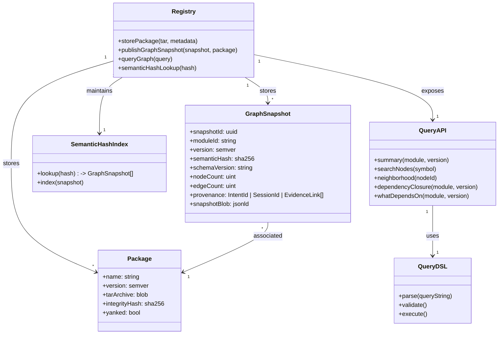

---
tags:
  - duumbi/inbox/enriched
  - duumbi/status/processed
  - duumbi/classification/execution
  - duumbi/value/high
  - duumbi/importance/high
  - duumbi/complexity/high
duumbi_inbox_enrichment: processed
duumbi_inbox_enrichment_generated_at: 2026-06-22T08:01:21.395Z
---

# Registry Graph Database Evolution

<!-- duumbi-inbox-enrichment:v1 status=processed generated_at=2026-06-22T08:01:21.395Z -->

## Source
- Surface: Manual Obsidian edit
- Vault path: Duumbi/00 Inbox (ToProcess)/2026-06-12 - Registry Graph Database Evolution.md
- Submitted by: unknown unless explicit in the raw input

## Raw input
> ---
> tags:
>   - duumbi/inbox/roadmap
>   - duumbi/status/to-process
>   - duumbi/classification/execution
>   - duumbi/value/high
>   - duumbi/importance/high
>   - duumbi/complexity/high
> created: 2026-06-12
> milestone: M2
> source: "[[DUUMBI Future Development Roadmap Map]]"
> ---
> 
> # Registry Graph Database Evolution
> 
> ## Context
> 
> Today `hgahub/duumbi-registry` (deployed at registry.duumbi.dev) stores opaque `.tar.gz` module packages with a SQLite index — it distributes modules but does not understand them. The roadmap needs a durable store that understands the graphs themselves: snapshots, semantic hashes, queries, similarity features — the substrate for reuse (M5), Loop knowledge (M3), and session sync (M6). **No new service is planned**: this capability is built as the evolution of the existing duumbi-registry, keeping one deployment, one auth, one repo.
> 
> ## Goal
> 
> duumbi-registry grows from a package store into a graph-aware registry: it stores versioned, immutable semantic graph snapshots with semantic hashes alongside the existing package archives, and serves a controlled graph query API — DUUMBI-native programs first (no git, no tree-sitter: the JSON-LD graph IS the source).
> 
> ## Subtasks
> 
> 1. Data model extension: graph snapshot record (snapshot id, module id, version, semantic hash, schema version, node/edge counts, provenance: intent id / session id / evidence links) added to the registry's SQLite schema via its existing migration mechanism; snapshots stored next to the `.tar.gz` archives.
> 2. Publish path: `duumbi publish` uploads the JSON-LD graph snapshot together with the package archive; backfill snapshots for already-published stdlib modules.
> 3. Query API: summary, node/symbol search, neighborhood, dependency closure — controlled query DSL, no raw query injection; this also backs the `query` surface remotely. Storage stays SQLite + JSON-LD blobs + extracted index tables, behind an adapter trait so the backend can change later without API breakage.
> 4. Semantic-hash index: content-addressed function/module hashes for dedup and reuse lookup (foundation for [[2026-06-12 - Semantic Graph Similarity and Reuse]] and proof caching in [[2026-06-12 - Compositional Verification Proof Boundaries]]).
> 5. Session ledger storage: implement the opt-in sync backend specified in [[2026-06-12 - Session Kernel and Event Ledger]] as a registry capability (per-user encrypted ledger blobs; local-first remains the default).
> 6. Infra: extend the existing `registry` stack in `duumbi-infra` (storage quota, probes, alerts) — no new Pulumi stack; watch the 1 GiB file-share quota and the $20/month budget cap, raise deliberately if needed.
> 7. CLI integration: `duumbi search --semantic` (by hash), "what depends on X" remote queries, snapshot push/pull.
> 8. Community evidence metadata: published versions carry eval results, verification status, and provider/model compatibility evidence; opt-in anonymized aggregate stats (which model families succeed at which task types) — the community half of [[2026-06-12 - Active Learning Loop]]. Today `VersionInfo` carries only integrity hash + yanked flag.
> 
> ## Acceptance criteria
> 
> - registry.duumbi.dev stores graph snapshots for the stdlib modules and flagship examples alongside their packages.
> - `duumbi` CLI can push a graph snapshot and query "what depends on X" remotely.
> - Semantic-hash lookup answers "has an equivalent function already been published?".
> - Existing package install/publish flows keep working unchanged (backward compatible).
> 
> ## Links
> 
> - [[DUUMBI Future Development Roadmap Map]]
> - [[2026-06-12 - Session Kernel and Event Ledger]]
> - [[2026-06-12 - Semantic Graph Similarity and Reuse]]
> - [[2026-06-12 - DUUMBI Loop Native Workflow Adaptation]]
> - [[2026-06-12 - Token Economics Benchmark]] (registry reuse is the largest token-cost lever)

## Interpreted intent

Evolve duumbi-registry from a passive package store into a graph-aware registry that stores versioned, immutable semantic graph snapshots with semantic hashes alongside packages, and serves a controlled graph query API. This enables reuse, Loop knowledge, session sync, and community evidence on the existing deployment without adding a new service.

## Developer summary

Extend the current duumbi-registry (SQLite-backed .tar.gz store) to store JSON-LD graph snapshots with semantic hashes, backfill existing stdlib modules, and expose a summary, search, neighborhood, dependency-closure, and semantic-hash lookup API. The registry’s data model grows with snapshot records (id, module, version, semantic hash, schema version, node/edge counts, provenance). The CLI gains `duumbi publish` for graph upload, `duumbi search --semantic` for hash-based lookup, and remote dependency queries. Infra work extends the existing Pulumi stack while respecting the 1 GiB file-share quota and $20/month budget cap. The implementation uses a SQLite + JSON-LD blob + extracted index tables approach behind an adapter trait so the backend can change later. Acceptance criteria: stdlib modules and flagship examples are snapshotted and queryable; CLI push/query works; semantic-hash lookup returns reuse candidates; existing install/publish flows remain backward compatible.

## UML overview

## Classification
- Type: execution
- Business value: high
- Importance: high
- Complexity: high

## Clarifications
### Answered
- The evolution is built inside the existing duumbi-registry service — no new service is created.
- Storage stays SQLite + JSON-LD blobs + extracted index tables initially.
- The query API is a controlled DSL, no raw query injection.
- Backward compatibility with existing package install/publish flows is required.
- Infra work reuses the existing Pulumi stack; no new stack is created.
- The 1 GiB file-share quota and $20/month budget cap are constraints.

### Open
- Should snapshot storage use the same Azure File Share as the .tar.gz archives, and if so, how will the 1 GiB quota be managed?
- What is the concrete snapshot JSON-LD schema (fields, compression, versioning)?
- How will backfill for already-published stdlib modules be orchestrated — a one-time migration or a command?
- What rate limiting or authentication rules apply to the new query API?
- Will the query DSL support joins or nested queries, or will it be limited to simple lookups initially?
- How will the semantic-hash index be populated during the publish path, and how is deduplication handled when the same graph hash already exists?
- What is the target throughput (snapshot uploads, queries per second) for the initial milestone?

## Relevant DUUMBI context
- Vault: [[DUUMBI - PRD]] for the product thesis on queries and service surface.
- Vault: [[DUUMBI - Glossary]] for definitions of semantic graph, JSON-LD, semantic hash.
- Source: src/registry/ module (registry client, packaging) — the existing client must be extended.
- Source: src/hash.rs — semantic hashing already implemented, must be integrated into registry index.
- Source: docs/architecture.md — the registry component is described; this evolution fits the component map.
- Vault: [[DUUMBI Future Development Roadmap Map]] — source of the M2 milestone.
- Vault: [[2026-06-12 - Session Kernel and Event Ledger]] — session sync depends on registry storage capability.

## Related GitHub context

No known GitHub issues or PRs exist for this work yet; triage should verify later.

## Initial routing recommendation

GitHub issue

## Requested follow-up
- Create a GitHub issue in hgahub/duumbi with the enriched context for Stage 4 triage.
- Label with 'milestone:m2', 'area:registry', 'type:execution', 'priority:high'.

## AI agent instructions
- Create a GitHub issue titled 'Registry Graph Database Evolution'.
- In the issue body, restate the goal, acceptance criteria, and subtasks from the Inbox note.
- Break subtasks into actionable implementation steps with estimated complexity (e.g., data model migration, CLI changes, query DSL).
- Note that this depends on the existing registry deployment and must not break backward compatibility.
- Link to relevant vault notes: [[2026-06-12 - Semantic Graph Similarity and Reuse]], [[2026-06-12 - Session Kernel and Event Ledger]], [[2026-06-12 - Active Learning Loop]].
- Specify that the initial backend must be behind an adapter trait to allow future switching (e.g., to a graph database).
- Do not assign or estimate dates — leave for human planning after triage acceptance.

## Scope candidate
### In
- Data model extension for graph snapshots (SQLite schema migration).
- Publish path: `duumbi publish` uploads graph snapshot alongside package archive; backfill existing stdlib modules.
- Query API: summary, node/symbol search, neighborhood, dependency closure, semantic hash lookup — controlled DSL.
- Semantic-hash index: content-addressed function/module hashes for reuse lookup.
- Session ledger storage (opt-in per-user encrypted blobs) as a registry capability.
- Infrastructure: extend existing registry stack in duumbi-infra (storage quota, probes, alerts).
- CLI integration: `duumbi search --semantic`, remote dependency queries, snapshot push/pull.
- Community evidence metadata: published versions carry eval results, verification status, provider/model compatibility.

### Out
- New service or separate deployment — must stay within duumbi-registry.
- General-purpose graph database; initial backend is SQLite + blobs.
- Full graph query language (e.g., GraphQL, SPARQL) — controlled DSL only.
- Changes to the compiler or runtime.
- Replacing the existing package store.

## Risks and trade-offs
- Storage quota: The Azure File Share has a 1 GiB limit; storing many snapshots may exceed it, requiring cost analysis or relocation.
- Backward compatibility: Breaking existing `duumbi install` or `duumbi publish` (package-only) flows would block adoption.
- Query complexity: Without careful DSL design, queries could become expensive or expose injection surfaces.
- Sync lag: If snapshot indexing is not immediate, the semantic-hash lookup could return stale results.
- Session ledger encryption: Key management for per-user encrypted blobs must be designed securely.
- Cost: The $20/month budget cap includes the existing service; the new features must not push costs beyond this.

## Obsidian tags

#duumbi/inbox/enriched #duumbi/status/processed #duumbi/classification/execution #duumbi/value/high #duumbi/importance/high #duumbi/complexity/high

## Enrichment result
- Date: 2026-06-22T08:01:21.395Z
- Status: ready for triage
- Canonical duplicate: none verified
- Facts:
- duumbi-registry currently stores .tar.gz packages indexed by SQLite and serves them.
- No graph awareness exists today; the registry does not understand module structure.
- Semantic hashing is already implemented in src/hash.rs but not used by the registry.
- The registry is deployed at registry.duumbi.dev and serves as a single deployment with existing auth.
- The roadmap milestone is M2, with dependencies on session kernel, reuse, and Loop knowledge features.
- The PRD positions query as a first-class service surface, which this registry work enables.
- Assumptions:
- The existing registry auth (API tokens) will be reused for graph snapshot publishing.
- The query API will be accessed primarily by DUUMBI CLI and Studio, not by third-party tools initially.
- The SQLite database schema can be migrated without downtime.
- The 1 GiB file-share quota is sufficient for the number of stdlib snapshots and initial community packages.
- Backfill will be a one-time operation run by the maintainer for existing stdlib modules.
- The session ledger storage feature will use the registry only for per-user encrypted blobs, not as a primary data store.
- Recommendations:
- Start with the data model migration and publish path for graph snapshots, as these are prerequisites for query and hash index.
- Implement the adapter trait early to allow future replacement of SQLite with a more scalable backend.
- Add detailed cost and storage monitoring before merging to catch quota overruns during development.
- Coordinate with the Session Kernel and Semantic Graph Similarity tasks to align interfaces.
- Deploy the query API with conservative rate limiting and logging.
- Ensure the backfill mechanism is idempotent and can be re-run safely.
