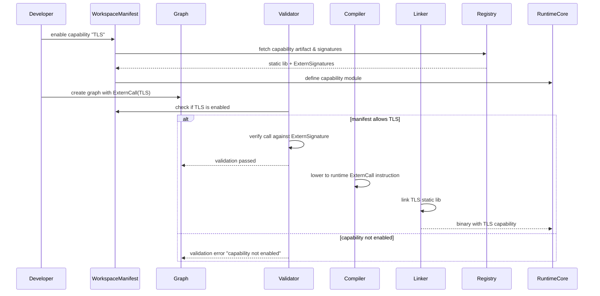

---
tags:
  - duumbi/inbox/enriched
  - duumbi/status/processed
  - duumbi/classification/architecture
  - duumbi/value/high
  - duumbi/importance/high
  - duumbi/complexity/high
duumbi_inbox_enrichment: processed
duumbi_inbox_enrichment_generated_at: 2026-06-23T07:15:15.026Z
---

# Runtime Capability Modules and Library Adoption

<!-- duumbi-inbox-enrichment:v1 status=processed generated_at=2026-06-23T07:15:15.026Z -->

## Source
- Surface: Manual Obsidian edit
- Vault path: Duumbi/00 Inbox (ToProcess)/2026-06-12 - Runtime Capability Modules and Library Adoption.md
- Submitted by: unknown unless explicit in the raw input

## Raw input
> ---
> tags:
>   - duumbi/inbox/roadmap
>   - duumbi/status/to-process
>   - duumbi/classification/execution
>   - duumbi/value/high
>   - duumbi/importance/high
>   - duumbi/complexity/high
> created: 2026-06-12
> milestone: M2
> source: "[[DUUMBI Future Development Roadmap Map]]"
> ---
> 
> # Runtime Capability Modules and Library Adoption
> 
> ## Context
> 
> The runtime today is one embedded ~4,000-line C file linking libcurl, SQLite3, libm, and platform sockets; user graphs have **no FFI** — capabilities exist only as hand-written op families. That closure is a feature (full validation, no arbitrary native calls) but hand-writing every capability doesn't scale. The pattern is already proven twice: SQLite and HTTP were wrapped behind op families + Tier 1 stdlib modules on the registry. This note industrializes that pattern so mature external libraries become registry-distributed "batteries".
> 
> ## Goal
> 
> A capability-module architecture: vetted external libraries wrapped behind typed, effect-annotated boundaries, packaged as versioned runtime capabilities + registry stdlib modules with contracts and evidence — validation closure preserved, batteries included.
> 
> ## Subtasks
> 
> 1. Runtime modularization: split the monolithic runtime into core + per-capability objects (`.o`/`.a`); the workspace manifest (capabilities section + registry deps) drives the link line. A workspace that doesn't use TLS doesn't link TLS.
> 2. `ExternCall` design: each capability ships a **declared extern signature manifest** (typed params/returns, effect annotation, error contract); the validator checks every call against it. No arbitrary user FFI — capabilities are reviewed, checksummed registry artifacts, and a workspace must explicitly enable each one (permission model, consistent with existing file/net sandboxing).
> 3. Adoption shortlist (C ABI directly, or Rust crates via `staticlib` + `extern "C"` — links into the existing pipeline unchanged):
>    - **rustls** via rustls-ffi — TLS / HTTPS raw sockets (closes the explicitly deferred TLS module),
>    - **regex**: `rure` (the rust regex crate's official C API) or PCRE2,
>    - **libsodium** — hashing, HMAC, signatures, secure random (audited, small),
>    - **zstd / zlib** — compression,
>    - **time/date**: libc + strftime in core runtime (or Rust `time` via FFI if needed),
>    - base64/hex/uuid: trivial, implement in core runtime,
>    - optional later: **yyjson** to replace the custom JSON parser if performance demands.
> 4. **Java verdict: do not embed a JVM.** JNI/JVM linkage contradicts the single-binary, deterministic, lightweight runtime; every shortlisted need has a C/Rust equivalent. JVM ecosystems integrate across a process/network boundary (the existing HTTP/TCP ops), not via linkage.
> 5. Registry distribution: a capability module = runtime artifact (per-target prebuilt static lib + checksums + license metadata) + stdlib graph wrapper with contracts + evidence (tests, provenance); the registry serves both halves (extends [[2026-06-12 - Registry Graph Database Evolution]]).
> 6. Verification trust model: extern functions are **trusted-boundary axioms** — their contracts are asserted, not proven. [[2026-06-12 - Compositional Verification Proof Boundaries]] and the gap report in [[2026-06-12 - Certification Evidence Export]] must label them explicitly as trusted.
> 7. Supply-chain hygiene: vendored library versions, license inventory (MPL-2.0 compatibility), reproducible builds with checksums.
> 
> ## Acceptance criteria
> 
> - At least two capability modules (TLS, regex) installable from the registry into a clean workspace and callable from user graphs, with validator-enforced signatures.
> - A graph calling a capability the workspace hasn't enabled fails at **validation**, not at runtime.
> - Registry pages show evidence, checksum, and license metadata for capability modules.
> - Core binary size unchanged for workspaces that enable no capabilities.
> 
> ## Links
> 
> - [[DUUMBI Future Development Roadmap Map]]
> - [[2026-06-12 - Op Set Expansion Tiers]]
> - [[2026-06-12 - Registry Graph Database Evolution]]
> - [[2026-06-12 - Compositional Verification Proof Boundaries]]

## Interpreted intent

The user wants to industrialize the pattern of wrapping external C/Rust libraries behind typed, effect-annotated boundaries, packaged as versioned runtime capabilities and registry-distributed stdlib modules. This preserves DUUMBI's validation closure while scaling beyond hand-written ops, enabling TLS, regex, hashing, compression, and more.

## Developer summary

Split the monolithic ~4k-line C runtime into core + per-capability object files (.o/.a). Introduce an ExternCall op with a declared extern signature manifest (typed params, return type, effect annotation, error contract). The validator checks every ExternCall against the capabilities enabled in the workspace manifest. Adopt shortlisted C/Rust libraries via their C ABIs (rustls-ffi for TLS, rure/PCRE2 for regex, libsodium for crypto, zstd for compression). Extend the registry to serve capability modules as prebuilt static libs + graph wrappers with evidence and checksums. Enforce that a disabled capability causes validation failure, not a runtime crash. Ensure core binary size unchanged for workspaces with no capabilities enabled. Treat extern functions as trusted-boundary axioms; their contracts are asserted, not proven.

## UML overview

## Classification
- Type: architecture
- Business value: high
- Importance: high
- Complexity: high

## Clarifications
### Answered
- Runtime will be modularized into per-capability objects.
- ExternCall will have declared extern signatures with typed params, returns, effect annotations, and error contracts.
- No JVM will be embedded; all adopted libraries are C/Rust with C ABIs.
- Existing ops for SQLite and HTTP serve as proven patterns for this approach.
- Vetted external libraries will be wrapped behind typed, effect-annotated boundaries.
- Capability modules will be packaged as registry artifacts with checksums, license metadata, and evidence.
- Extern functions are treated as trusted axioms with asserted contracts, not formally proven.
- License compatibility (MPL-2.0) must be maintained for vendored libraries.

### Open
- What is the exact syntax for enabling capabilities in the workspace manifest?
- How will capability module versioning and ABI stability be managed?
- How will platform-specific binaries for different OS/arch be distributed and selected?
- Should existing hand-written ops (SQLite, HTTP) be migrated to this new module system, or remain as core runtime ops?
- What is the trust model for community-contributed capability modules?
- How will the linker invocation handle multiple .a files across different platforms?
- What is the fallback behavior if a capability's static library fails to link or is missing?
- How will capabilities interact with the existing file/net sandboxing (permission model)?
- Should the validator allow capabilities to be enabled globally or per-module?

## Relevant DUUMBI context
- Duumbi/00 Inbox (ToProcess)/2026-06-12 - Runtime Capability Modules and Library Adoption.md - the source note itself
- Duumbi/00 Inbox (ToProcess)/2026-06-12 - Op Set Expansion Tiers.md - defines tiers for op set expansion, relevant to new ops
- Duumbi/00 Inbox (ToProcess)/2026-06-12 - Registry Graph Database Evolution.md - registry must serve capability artifacts
- Duumbi/00 Inbox (ToProcess)/2026-06-12 - Compositional Verification Proof Boundaries.md - extern functions as trusted axioms
- Duumbi/01 Atlas (Knowledge Base)/Maps (Overviews)/DUUMBI Technical Architecture Map.md - existing architecture context
- src/types.rs - Op enum, DuumbiType definitions where ExternCall would be added
- src/graph/mod.rs - graph construction and validation where capability checks go
- src/compiler/mod.rs - codegen where ExternCall lowering happens
- runtime/duumbi_runtime.c - the current monolithic C runtime to be modularized
- src/registry/mod.rs - registry client to serve capability modules
- Cargo.toml / AGENTS.md - project build and agent conventions

## Related GitHub context

No specific GitHub issue numbers are present in the note or vault. Triage should verify later whether issues exist for TLS, regex, runtime modularization, or capability support.

## Initial routing recommendation

GitHub issue

## Requested follow-up
- Create a parent GitHub issue for the Runtime Capability Modules feature.
- Break down into sub-issues: runtime modularization, ExternCall design, TLS adoption, regex adoption, registry distribution, supply-chain hygiene.
- Coordinate with registry evolution and verification proof boundaries work.
- Define a capability manifest scheme before implementation.
- Set milestone to M2 per the note.

## AI agent instructions
- When creating the GitHub issue, include the Mermaid diagram from this enrichment.
- Include the subtask list and acceptance criteria from the note.
- Label the issue with M2 milestone and appropriate tags (feature, architecture).
- Reference the related vault notes: Op Set Expansion Tiers, Registry Graph Database Evolution, Compositional Verification Proof Boundaries.
- Ensure the issue body highlights the validation-closure preservation as a key design constraint.
- Break the work into multiple implementable issues if necessary, with clear dependencies.

## Scope candidate
### In
- Modularize monolithic C runtime into per-capability object files
- Design and implement ExternCall op with declared extern signature manifest
- Adopt rustls-ffi for TLS capability
- Adopt rure or PCRE2 for regex capability
- Extend registry to serve capability artifacts with metadata and evidence
- Enforce capability enablement in workspace manifest at validation time
- Ensure zero binary size overhead for workspaces with no capabilities enabled

### Out
- Embedding a JVM or supporting Java ecosystems via linkage
- Allowing arbitrary user FFI without validated signatures
- Implementing all shortlisted libraries at once
- Modifying verification proofs to automatically verify extern functions
- Creating a cloud-based distribution mechanism for capabilities
- Building a general-purpose package manager beyond capability modules

## Risks and trade-offs
- ABI breakage between library versions may cause silent failures or incompatibility
- Security vulnerabilities in adopted libraries can propagate to DUUMBI programs
- Supply-chain attacks via compromised library artifacts or registry distribution
- Performance overhead of the ExternCall boundary if not designed efficiently
- Trusted axiom status means no formal guarantees about extern function behavior
- Platform-specific binary distribution increases CI and maintenance complexity
- License incompatibility if a future library is not MPL-2.0 compatible

## Obsidian tags

#duumbi/inbox/enriched #duumbi/status/processed #duumbi/classification/architecture #duumbi/value/high #duumbi/importance/high #duumbi/complexity/high

## Enrichment result
- Date: 2026-06-23T07:15:15.026Z
- Status: ready for triage
- Canonical duplicate: none verified
- Facts:
- Current runtime is a monolithic ~4,000-line C file linking libcurl, SQLite3, libm, and platform sockets
- No FFI exists; existing ops are hand-written
- SQLite and HTTP are already wrapped as op families
- rustls-ffi, rure, libsodium, and zstd are available and fit the C ABI model
- MPL-2.0 license compatibility is a known constraint for vendored libraries
- Existing time/date uses libc + strftime already
- Base64/hex/uuid are deemed trivial and will be implemented in the core runtime
- The workspace manifest already supports dependencies and a capabilities section
- Assumptions:
- The workspace manifest can be extended with a list of enabled capability names
- Graph validation can be extended to check ExternCall operations against enabled capabilities
- The linker invocation can be controlled to include only the static libraries for enabled capabilities
- The registry can be extended to serve per-target binary artifacts with checksums
- Vendored libraries can be compiled to static libs with reproducible builds
- The existing hand-written ops for SQLite and HTTP might be migrated to this module system later
- No major changes to Cranelift codegen are required to support ExternCall
- Recommendations:
- Start with TLS and regex as the first two capability modules for M2 delivery
- Define a concrete capability manifest schema before implementation
- Implement the validator check early to enforce enablement and fail fast
- Design the ExternCall op to be generic enough to support future capabilities without IR changes
- Include platform-specific CI to build and test capability artifacts
- Plan for deterministic, reproducible builds of static libraries
- Treat the registry distribution as an extension of the existing package system, not a separate service
