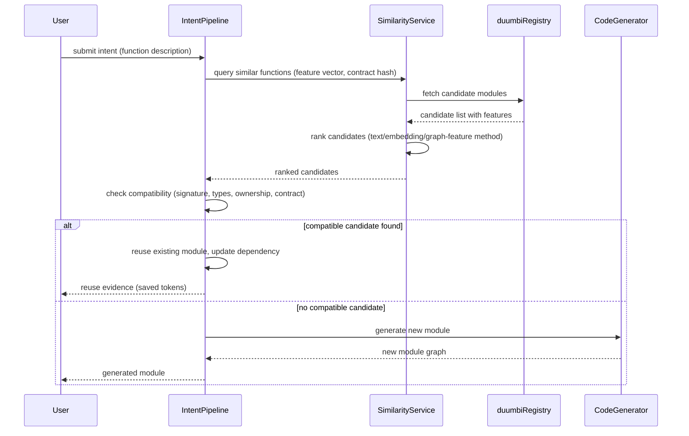

---
tags:
  - duumbi/inbox/enriched
  - duumbi/status/processed
  - duumbi/classification/research
  - duumbi/value/high
  - duumbi/importance/medium
  - duumbi/complexity/high
duumbi_inbox_enrichment: processed
duumbi_inbox_enrichment_generated_at: 2026-06-23T18:42:26.605Z
---

# Semantic Graph Similarity and Reuse

<!-- duumbi-inbox-enrichment:v1 status=processed generated_at=2026-06-23T18:42:26.605Z -->

## Source
- Surface: Manual Obsidian edit
- Vault path: Duumbi/00 Inbox (ToProcess)/2026-06-12 - Semantic Graph Similarity and Reuse.md
- Submitted by: unknown unless explicit in the raw input

## Raw input
> ---
> tags:
>   - duumbi/inbox/roadmap
>   - duumbi/status/to-process
>   - duumbi/classification/research
>   - duumbi/value/high
>   - duumbi/importance/medium
>   - duumbi/complexity/high
> created: 2026-06-12
> milestone: M5
> source: "[[DUUMBI Future Development Roadmap Map]]"
> ---
> 
> # Semantic Graph Similarity and Reuse
> 
> ## Context
> 
> Exact reuse via semantic hashes exists conceptually (registry + semantic hash reuse is Delivered per [[DUUMBI - Service and Research Direction]]), but **similar** (not identical) graph retrieval is a research hypothesis. The promised behavior: before the AI builds a function, DUUMBI checks whether an equivalent or near-equivalent module already exists and reuses it — turning the registry/repository into compounding leverage and reducing nondeterminism (reused code is deterministic by definition).
> 
> ## Goal
> 
> A benchmarked similarity-retrieval layer: given an intent or a graph fragment, return ranked candidate modules/functions with compatibility assessment, integrated into the intent pipeline as a "reuse-first" step.
> 
> ## Subtasks
> 
> 1. Build the module-reuse benchmark named in the research direction: corpus of intents with known-correct reuse targets; compare text search, embeddings, semantic hashes, and graph-feature methods (degree profiles, op-type histograms, graph kernels/matching).
> 2. Candidate representation: per-function feature vector stored in `duumbi-registry` at publish time (op counts, signature shape, effect summary, contract hashes).
> 3. Retrieval API: `POST /similarity/query` on duumbi-registry; CLI `duumbi search --semantic`.
> 4. Compatibility check: signature/type/ownership compatibility + (later) contract implication from [[2026-06-12 - Compositional Verification Proof Boundaries]] — "is the candidate's contract strong enough for this call site?".
> 5. Intent pipeline integration: reuse-first gate before generation; measure reuse hit rate and token savings on the M1 eval corpus (methodology shared with [[2026-06-12 - Token Economics Benchmark]] — reuse is the single largest token lever, since a hit saves ~100% of that function's generation and repair tokens).
> 6. Honest metric reporting: precision/recall of each method on the benchmark; pick the simplest method that wins.
> 
> ## Acceptance criteria
> 
> - Benchmark published with method comparison numbers.
> - Intent execution demonstrably reuses an existing module instead of regenerating it, with evidence in the run artifact.
> - Reuse hit rate tracked as a release metric.
> 
> ## Links
> 
> - [[DUUMBI Future Development Roadmap Map]]
> - [[2026-06-12 - Registry Graph Database Evolution]]
> - [[2026-06-12 - Intent at Scale Multi-Module and BDD]]
> - [[2026-06-12 - Token Economics Benchmark]]

## Interpreted intent

Establish a similarity-based reuse layer in DUUMBI: before the AI builds a new function, check whether an equivalent or near-equivalent module already exists in the registry. If a compatible candidate is found, reuse it instead of regenerating, reducing nondeterminism and saving generation tokens. This is a research hypothesis first, requiring a benchmark comparing text search, embeddings, semantic hashes, and graph-feature methods to determine the most effective approach. The chosen method will be integrated as a 'reuse-first' step in the intent-to-code pipeline.

## Developer summary

Add a similarity-retrieval layer to DUUMBI's intent pipeline. Before the AI generates code for a function, query the registry for similar existing modules. The retrieval uses a feature vector (op counts, signature shape, effect summary, contract hashes) stored at publish time. Rank candidates, check compatibility (signature, types, ownership, contract strength), and if a compatible candidate is found, reuse it. This saves ~100% of function generation and repair tokens, the single largest token lever. Work includes building a benchmark corpus of intents with known reuse targets, comparing multiple similarity methods, integrating the winner into the pipeline, and tracking reuse hit rate as a metric. Depends on the registry semantic hash reuse (already delivered) and may later use compositional verification contract implications.

## UML overview

## Classification
- Type: research
- Business value: high
- Importance: medium
- Complexity: high

## Clarifications
### Answered
- The note is tagged as research, milestone M5, high value, medium importance, high complexity.
- It references the DUUMBI Future Development Roadmap and other linked notes.
- The subtask list is provided.
- Semantic hash reuse (exact match) is already delivered per DUUMBI - Service and Research Direction.

### Open
- Which similarity method(s) should be benchmarked as baseline? Text search, embeddings, semantic hashes, graph-feature methods?
- What threshold defines 'similar enough' for reuse? (e.g., cosine similarity > 0.8)
- How should partial matches (same signature, different body) be treated?
- Should the retrieval service cache similarity results, or query fresh each time?
- How should compatibility check evolve when contracts change in the registry?
- Should workspace-local modules also be considered for similarity reuse?
- What exact token savings measurement methodology should be used (reference to Token Economics Benchmark note)?
- Is there an existing evaluation corpus, or will one be built as part of this task?

## Relevant DUUMBI context
- File: Duumbi/00 Inbox (ToProcess)/2026-06-12 - Semantic Graph Similarity and Reuse.md — the source Inbox note.
- File: Duumbi/01 Atlas (Knowledge Base)/Maps (Overviews)/DUUMBI Future Development Roadmap Map.md — source roadmap providing milestone and priority.
- File: Duumbi/01 Atlas (Knowledge Base)/Works (Developed Materials)/DUUMBI - Service and Research Direction.md — mentions semantic hash reuse and similarity retrieval as research hypothesis.
- File: Duumbi/01 Atlas (Knowledge Base)/Works (Developed Materials)/DUUMBI - PRD.md — defines product vision for reuse and intent pipeline.
- Source: src/registry/ — registry client code will be extended for similarity queries.
- Source: src/intent/ — intent pipeline where the reuse gate will be inserted.
- Source: src/hash.rs — semantic hashing; similarity may extend or complement this.
- Source: src/types.rs — core types used in feature vectors (e.g., Op counts).
- File: Duumbi/00 Inbox (ToProcess)/2026-06-12 - Token Economics Benchmark.md — linked note defining token savings methodology.
- File: Duumbi/00 Inbox (ToProcess)/2026-06-12 - Registry Graph Database Evolution.md — linked note about registry improvements.
- File: Duumbi/00 Inbox (ToProcess)/2026-06-12 - Intent at Scale Multi-Module and BDD.md — linked note about multi-module intent handling.

## Related GitHub context

No specific GitHub issues or PRs known at this time. Triage should check for existing issues in hgahub/duumbi related to similarity, reuse, or registry query enhancements.

## Initial routing recommendation

GitHub issue

## Requested follow-up
- Create a GitHub issue for this research task.
- Clarify the benchmark methodology and acceptance thresholds before implementation begins.
- Coordinate with the token economics benchmark to define reuse metrics.

## AI agent instructions
- Create a GitHub issue titled 'Semantic Graph Similarity and Reuse' with labels: research, high-priority, M5.
- In the issue body, include the developer summary, subtasks from the note, acceptance criteria, and links to related notes.
- Suggest that the issue be placed in the M5 milestone and triaged for implementation planning.
- Mention that exact semantic hash reuse is already delivered; this work extends to near-equivalent reuse.
- Note the dependency on the registry and possibly on compositional verification for contract-compatibility checks.

## Scope candidate
### In
- Benchmarking multiple similarity retrieval methods for graph modules.
- Designing a feature vector representation for functions/modules stored in the registry.
- Implementing a retrieval API (POST /similarity/query) and CLI command (duumbi search --semantic).
- Building a compatibility checker for signature, type, ownership, and contract strength.
- Integrating the chosen method into the intent pipeline as a reuse-first step.
- Measuring reuse hit rate and token savings, and reporting honestly on benchmark precision/recall.

### Out
- Implementing all similarity methods before benchmarking; only the winner will be integrated.
- Automatic contract implication verification (optional if not yet ready from compositional verification note).
- Modifying the intent creation or specification process itself.
- Full registry architecture redesign; incremental extension of existing registry capabilities.
- User-facing UI changes in Studio; only API and CLI are in scope initially.

## Risks and trade-offs
- Similarity retrieval may not yield significant reuse benefits if the registry lacks diverse modules.
- Benchmark results may be inconclusive or favour overly simple methods if the corpus is insufficient.
- Token savings measurement may be confounded by other pipeline changes; need careful isolation.
- Compatibility checks may be overly conservative and reject valid candidates, lowering reuse rate.
- Performance overhead of similarity queries could slow down the intent pipeline if not optimized.

## Obsidian tags

#duumbi/inbox/enriched #duumbi/status/processed #duumbi/classification/research #duumbi/value/high #duumbi/importance/medium #duumbi/complexity/high

## Enrichment result
- Date: 2026-06-23T18:42:26.605Z
- Status: ready for triage
- Canonical duplicate: none verified
- Facts:
- The note is part of the DUUMBI Future Development Roadmap, milestone M5.
- Exact semantic hash reuse is already delivered per DUUMBI - Service and Research Direction.
- The note proposes a research task with a benchmark to decide the best similarity method.
- The task includes building a feature vector representation, retrieval API, and pipeline integration.
- The note links to Token Economics Benchmark for methodology on measuring token savings.
- Assumptions:
- The registry can store and index feature vectors per module without breaking changes.
- The benchmark corpus will be constructed from existing DUUMBI intents and modules.
- Token savings measurement will follow the methodology defined in the Token Economics Benchmark note.
- The compatibility checker will initially check signature and types, and later extend to contracts.
- Studio or CLI will provide a way for developers to inspect similarity matches.
- Recommendations:
- Start with a lightweight benchmark comparing text search, embeddings, and graph-feature methods using a small curated corpus.
- Use the benchmark results to select the simplest effective method for MVP integration.
- Coordinate with the Token Economics Benchmark task to ensure consistent measurement.
- Plan the integration such that the similarity gate can be disabled or bypassed if needed.
- Consider caching similarity results to avoid repeated costly queries.
