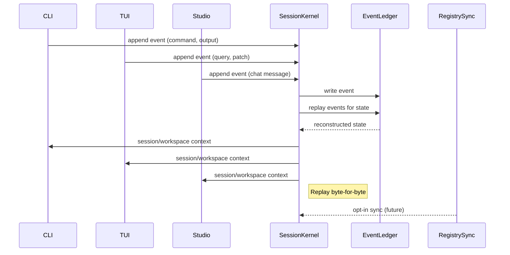

---
tags:
  - duumbi/inbox/enriched
  - duumbi/status/processed
  - duumbi/classification/execution
  - duumbi/value/high
  - duumbi/importance/high
  - duumbi/complexity/high
duumbi_inbox_enrichment: processed
duumbi_inbox_enrichment_generated_at: 2026-06-24T07:12:19.289Z
---

# Session Kernel and Event Ledger

<!-- duumbi-inbox-enrichment:v1 status=processed generated_at=2026-06-24T07:12:19.289Z -->

## Source
- Surface: Manual Obsidian edit
- Vault path: Duumbi/00 Inbox (ToProcess)/2026-06-12 - Session Kernel and Event Ledger.md
- Submitted by: unknown unless explicit in the raw input

## Raw input
> ---
> tags:
>   - duumbi/inbox/roadmap
>   - duumbi/status/to-process
>   - duumbi/classification/execution
>   - duumbi/value/high
>   - duumbi/importance/high
>   - duumbi/complexity/high
> created: 2026-06-12
> milestone: M2
> source: "[[DUUMBI Future Development Roadmap Map]]"
> ---
> 
> # Session Kernel and Event Ledger
> 
> ## Context
> 
> Today sessions live in `.duumbi/session/current.json` + history archives, scoped to the local TUI/REPL. The product vision: **if the user permits it, a started session can be continued on any surface** (CLI, TUI, Desktop, Cloud, Mobile). The archived roadmap already names the solution: a shared session kernel and an append-only event ledger. This must exist before building Desktop/Cloud/Mobile, otherwise each surface forks its own session model.
> 
> ## Goal
> 
> One session model: an append-only event ledger (turns, queries, mutations, approvals, builds, evidence) that every surface reads/writes through the same kernel API, replayable to reconstruct state, syncable when the user opts in.
> 
> ## Subtasks
> 
> 1. Specify the event schema: event types (query, intent, patch proposed/approved/rejected, build, run, telemetry, provider call), envelope (session id, surface, actor, timestamps, hashes), and JSON-LD alignment with the existing graph vocabulary.
> 2. Session kernel crate in `hgahub/duumbi`: load/append/replay/archive; migrate `SessionManager` and the REPL `/resume` flow onto it without breaking existing archives.
> 3. Replay semantics: reconstruct conversation + workspace context from the ledger; define what is replayed vs. referenced (large artifacts by hash).
> 4. Surface adoption: CLI one-shot commands append to the same ledger as the TUI; Studio (WebSocket `/ws/chat`) reads/writes the same session.
> 5. Sync design (spec only at this stage): opt-in push/pull of ledgers to the evolved `duumbi-registry` graph database; conflict rule (append-only ⇒ merge by event time + causal ids); privacy contract (local-first default, explicit consent to sync).
> 6. Security: redaction rules for secrets in events; per-session encryption considerations for synced ledgers.
> 
> ## Acceptance criteria
> 
> - TUI, CLI, and Studio share one session: start a query in the TUI, see and continue it in Studio on the same machine.
> - Ledger replay reproduces session state byte-for-byte from events.
> - Written sync spec approved before any cloud implementation (gates M3/M6 surfaces).
> 
> ## Links
> 
> - [[DUUMBI Future Development Roadmap Map]]
> - [[2026-06-12 - Registry Graph Database Evolution]]
> - [[2026-06-12 - Determinism Program for AI Development]] (shared evidence ledger)

## Interpreted intent

Implement a shared session kernel and append-only event ledger so that a developer session started in one surface (CLI, TUI, Desktop, Studio) can be continued in any other surface, with opt-in cloud sync for later mobile/cloud scenarios. This includes designing the event schema, building a kernel crate, integrating it across all current surfaces, and specifying a sync protocol that respects local-first privacy.

## Developer summary

Design and implement a shared session kernel and append-only event ledger so CLI, TUI, and Studio surfaces share one session. Start a query in TUI, continue in Studio. The kernel provides a library (likely a new crate) that loads/append/replay/archive events. Existing SessionManager and REPL /resume flow must be migrated without breaking current archives. The event schema must specify event types (query, intent, patch proposed/approved/rejected, build, run, telemetry, provider call) with a JSON-LD envelope. Replay reconstructs session and workspace context; large artifacts are referenced by hash, not stored inline. The work includes a sync design (spec only) for future cloud sync with the duumbi-registry. Security: redaction rules for secrets, per-session encryption considerations. Acceptance criteria: TUI, CLI, Studio share one session on same machine; ledger replay reproduces state byte-for-byte; sync spec approved before any cloud implementation (gates M3/M6).

## UML overview

## Classification
- Type: execution
- Business value: high
- Importance: high
- Complexity: high

## Clarifications
### Answered
- A shared session kernel is necessary before building Desktop/Cloud/Mobile surfaces, otherwise each will fork its own session model.
- The session will be an append-only event ledger that all surfaces read/write through the same kernel API.
- The ledger must be replayable to reconstruct session and workspace context.
- Sync to a future duumbi-registry is opt-in, with local-first default.
- The existing session state (`.duumbi/session/current.json` + history archives) must be migrated without breaking archives.

### Open
- What exact event types and envelope fields are needed for the JSON-LD schema?
- How will replay handle external side-effects or time-dependent operations?
- What mechanism ensures byte-for-byte state reproducibility after replay?
- How to handle large artifacts (storage, referencing, garbage collection)?
- How to handle concurrent session writes from multiple surfaces to the same local ledger?
- What is the precise conflict resolution algorithm for sync (merge by event time + causal IDs)?
- What redaction rules apply to secrets in events, and how are per-session encryption keys managed?
- What is the session lifecycle (start, pause, resume, archive) and how does it interact with the kernel API?
- Should the kernel support multiple simultaneous sessions or just one active session per workspace?
- How will the kernel be integrated into the Studio WebSocket channel without blocking the UI?

## Relevant DUUMBI context
- Vault note: [[DUUMBI Future Development Roadmap Map]] – names the session kernel and event ledger as prerequisite for Desktop/Cloud/Mobile surfaces.
- Vault note: [[2026-06-12 - Registry Graph Database Evolution]] – specifies the registry sync backend that will be used for opt-in cloud sync of ledgers.
- Vault note: [[2026-06-12 - Determinism Program for AI Development]] – shared evidence ledger concept aligns with the event ledger approach.
- Source code: `.duumbi/session/current.json` and history archives – the current session implementation that must be migrated.
- Source code: `src/cli/` and TUI/REPL session management code – entry points that must adopt the kernel.
- Source code: `crates/duumbi-studio/src/ws/` – WebSocket chat handler that must read/write the shared session.

## Related GitHub context

No known GitHub issues currently track this work. Triage should verify later whether a placeholder issue exists (e.g., from the roadmap) and if any related PRs are in flight.

## Initial routing recommendation

GitHub issue

## Requested follow-up
- Stage 4 triage should create a GitHub issue for the session kernel implementation.
- Split the work into smaller issues if needed (e.g., event schema spec, kernel crate, surface adoption, sync spec).
- Link the issue to milestone M2 and to the relevant roadmap/architecture notes.
- Before implementation, ensure the event schema and kernel API are reviewed and accepted.

## AI agent instructions
- Create a GitHub issue titled "Implement shared Session Kernel and Event Ledger".
- Add milestone M2 and labels: area:session, area:architecture, area:cross-surface, effort:high.
- In the issue body: outline the problem, goal, and subtasks from this note.
- Include a checklist for each subtask (event schema, kernel crate, SessionManager migration, surface adoption, sync spec).
- Link to relevant vault notes: DUUMBI Future Development Roadmap Map, Registry Graph Database Evolution, Determinism Program.
- Mention dependencies: Registry Graph Database Evolution for sync spec; Determinism Program for evidence alignment.
- Specify acceptance criteria as stated.
- Note that the sync specification gates M3/M6, so it should be completed early in the kernel work.
- Advise that this is foundational work: no Desktop/Cloud/Mobile before the kernel is stable.

## Scope candidate
### In
- Event schema specification (JSON-LD, event types, envelope).
- Session kernel library (load, append, replay, archive) in a new or extended crate.
- Migration of existing SessionManager and REPL /resume workflow.
- Adoption of the kernel in all three current surfaces: CLI, TUI, Studio.
- Replay semantics and artifact referencing.
- Sync design (spec only) with opt-in push/pull to duumbi-registry.
- Security: redaction rules for secrets, per-session encryption considerations.

### Out
- Actual implementation of cloud sync / registry sync backend.
- Implementation of Desktop, Cloud, or Mobile surfaces (these are gated by this kernel).
- Implementation of the duumbi-registry graph database evolution (covered in separate note).
- Real‑time collaboration across devices (post‑sync spec).
- Production‑grade encryption key management for synced ledgers (spec only).

## Risks and trade-offs
- Breaking existing session archives during migration; users may lose session history if not handled carefully.
- Complexity of replay correctness across heterogeneous events may be underestimated; byte‑for‑byte replay is hard.
- Concurrent writes from multiple surfaces to the same local ledger could cause corruption or race conditions without careful locking.
- The sync protocol may introduce privacy leaks if not designed with strong local‑first boundaries.
- Performance: the append‑only ledger may grow large; replay, compaction, and garbage collection must be considered.
- Integration with the Studio WebSocket may require significant refactoring to avoid blocking the event loop.

## Obsidian tags

#duumbi/inbox/enriched #duumbi/status/processed #duumbi/classification/execution #duumbi/value/high #duumbi/importance/high #duumbi/complexity/high

## Enrichment result
- Date: 2026-06-24T07:12:19.289Z
- Status: ready for triage
- Canonical duplicate: none verified
- Facts:
- The current session model is surface‑local: each surface maintains its own session state (e.g., `.duumbi/session/current.json`).
- The product vision requires a shared session kernel so that a session started in one surface can be continued in another.
- The session kernel is a prerequisite for Desktop, Cloud, and Mobile surfaces (M3, M5, M6), according to the roadmap.
- The existing codebase includes a TUI, CLI, and Studio (Leptos) with WebSocket support, all needing integration.
- The note explicitly calls for an append‑only event ledger, replayable to reconstruct state, with JSON‑LD alignment.
- Sync is opt‑in and must be local‑first by default.
- Assumptions:
- The current session data can be migrated to the new event ledger without losing critical metadata.
- A single local ledger file per workspace is acceptable; no immediate need for distributed local storage.
- The kernel will be a new crate within the duumbi workspace, not a separate repository.
- Replay will not need to re‑execute external side effects (e.g., network calls); only state reconstruction is required.
- The sync spec can be written without implementing the registry backend (separate work).
- The event schema can be defined in a way that is extensible for future event types.
- Recommendations:
- Triage to GitHub issue; proceed with Stage 4 triage and creation of a single parent issue with linked subtasks.
- Start with the event schema and kernel API design, as this will guide all other work and is reviewable separately.
- Prioritize migration of existing session manager first, to validate the kernel against real‑world session data.
- Ensure the sync spec is written and approved before any implementation that depends on it (cloud surfaces).
- Use the deterministic program evidence ledger as a model for the event format.
- Involve a human architect to review the kernel API and sync protocol before implementation begins.
