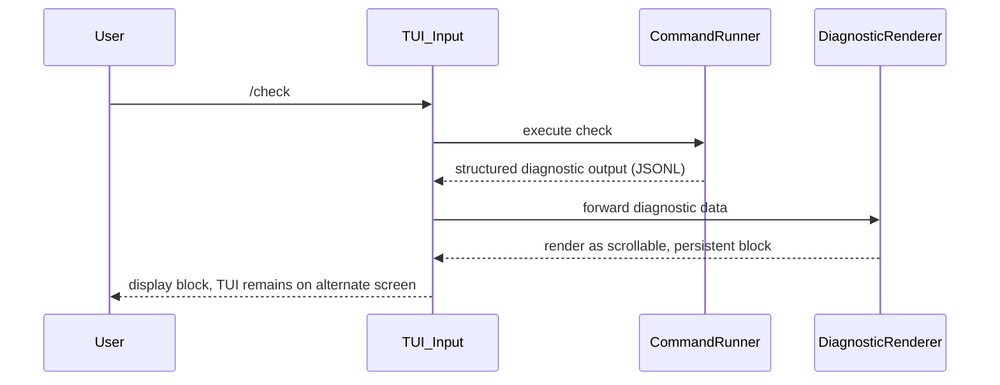

---
tags:
  - duumbi/inbox/enriched
  - duumbi/status/processed
  - duumbi/classification/execution
  - duumbi/value/high
  - duumbi/importance/high
  - duumbi/complexity/medium
duumbi_inbox_enrichment: processed
duumbi_inbox_enrichment_generated_at: 2026-06-26T07:18:43.842Z
---

# TUI Error Diagnostics Stay In-App

<!-- duumbi-inbox-enrichment:v1 status=processed generated_at=2026-06-26T07:18:43.842Z -->

## Source
- Surface: Manual Obsidian edit
- Vault path: Duumbi/00 Inbox (ToProcess)/2026-06-12 - TUI Error Diagnostics Stay In-App.md
- Submitted by: unknown unless explicit in the raw input

## Raw input
> ---
> tags:
>   - duumbi/inbox/roadmap
>   - duumbi/status/to-process
>   - duumbi/classification/execution
>   - duumbi/value/high
>   - duumbi/importance/high
>   - duumbi/complexity/medium
> created: 2026-06-12
> milestone: M0
> source: "Manual TUI UX review, 2026-06-12"
> parent: "[[2026-06-12 - TUI as Primary Surface Polish]]"
> ---
> 
> # TUI Error Diagnostics Stay In-App
> 
> ## Context
> 
> Manual review intentionally corrupted `.duumbi/graph/main.jsonld` and ran `/check` from the TUI. The product produced useful diagnostics, including JSONL, error code, source location, and suggestions. However, the TUI dropped out of the alternate-screen interface and printed raw CLI output with `[Press Enter to return to the REPL]`.
> 
> The UI recovered after pressing Enter, but the diagnostic was not preserved as a normal conversation block, making the error easy to miss and hard to review.
> 
> ## Goal
> 
> Build/check/run failures should render inside the TUI as structured, scrollable, persistent diagnostic blocks. The user should see what failed, where, why, suggested next actions, and whether the process is recoverable without leaving the TUI surface.
> 
> ## Observed Evidence
> 
> - Fresh workspace: `/tmp/duumbi-tui-ux.XkZdLF`.
> - Graph corruption inserted invalid JSON at line 2.
> - `/check` left the alternate-screen UI and printed:
>   - JSONL diagnostic with code `INTERNAL`.
>   - Human error: invalid JSON expected value at line 2 column 20.
>   - Suggestions: ask AI to fix, undo, describe.
>   - `[Press Enter to return to the REPL]`.
> - After return, the conversation showed `/check` but not the diagnostic output as a normal retained block.
> 
> ## Subtasks
> 
> 1. Capture stdout/stderr from `/check`, `/build`, and `/run` inside the REPL command path instead of temporarily leaving the TUI.
> 2. Render diagnostics as a structured block: status, command, elapsed time, error code, location, message, and suggested actions.
> 3. Preserve error blocks in session history and `/history`, not only in transient terminal output.
> 4. Keep machine-readable diagnostic details available for copy/export without showing raw JSONL as the default human view.
> 5. Add regression tests for parse error, validation error, compilation error, link error, and runtime failure display.
> 
> ## Acceptance Criteria
> 
> - A malformed graph produces an in-app error block and the TUI layout remains intact.
> - The user can scroll back to the diagnostic after recovery.
> - Suggested next actions are visible and actionable.
> - No command path requires `[Press Enter to return to the REPL]` for ordinary errors.
> 
> ## Links
> 
> - [[2026-06-12 - TUI as Primary Surface Polish]]
> - [[2026-06-12 - Codegen Trap Discipline and Backend Hardening]]
> - [[2026-06-12 - Agent Substrate MCP First-Class]]

## Interpreted intent

Ensure that build/check/run failures render inside the TUI as structured, scrollable, persistent diagnostic blocks instead of dumping raw CLI output that breaks the alternate-screen interface and discards diagnostic context.

## Developer summary

Intercept stdout/stderr from /check, /build, and /run within the TUI command path. Render a structured diagnostic block (status, command, elapsed time, error code, location, message, suggested actions) using ratatui components. Keep the TUI alternate-screen active; never fall back to raw terminal output. Persist error blocks in session history and /history. Provide machine-readable details for export (e.g., copy/paste of JSONL) without showing raw JSONL as the default view. Add regression tests for parse error, validation error, compilation error, link error, and runtime failure display.

## UML overview

## Classification
- Type: execution
- Business value: high
- Importance: high
- Complexity: medium

## Clarifications
### Answered
- A malformed main.jsonld was used to trigger the bug; the TUI dropped to raw CLI output with a [Press Enter to return to the REPL] prompt, then recovered but lost diagnostic content.
- The current behavior does not preserve the diagnostic in the conversation history.
- The goal is to show structured diagnostics (status, command, elapsed time, error code, location, message, suggestions) without leaving TUI.

### Open
- Should the diagnostic block replace the current REPL output area, or appear as a modal/overlay?
- How should large output (e.g., thousands of lines) be handled? Truncation with option to expand?
- Where should persistent error blocks be stored: in the same session history as the command, or in a separate error log?
- Should raw JSONL be accessible via a keybinding (e.g., ‘v’ for raw view) rather than always visible?
- Should the feature be limited to /check first and then extended to /build and /run, or rolled out together?

## Relevant DUUMBI context
- Duumbi/00 Inbox (ToProcess)/2026-06-12 - TUI as Primary Surface Polish.md (parent note, TUI surface quality priorities)
- Duumbi/01 Atlas (Knowledge Base)/Works (Developed Materials)/DUUMBI - PRD.md (product requirements, runtime failure feedback section)
- Duumbi/01 Atlas (Knowledge Base)/Works (Developed Materials)/DUUMBI - Glossary.md (definitions of Trace Map, Runtime Failure Feedback)
- src/cli/ (CLI entry point, likely where TUI is implemented; ratatui dependency in Cargo.toml)
- src/graph/mod.rs (graph verification errors that can trigger /check failures)
- src/compiler/mod.rs (compilation errors that can trigger /build failures)

## Related GitHub context

No known GitHub issue or PR for this exact bug/improvement; triage should verify against existing TUI-related issues.

## Initial routing recommendation

GitHub issue

## Requested follow-up
- Create a GitHub issue detailing the bug and expected behavior.
- Add the issue to the relevant GitHub Project milestone (likely M0 or M1).

## AI agent instructions
- Create a GitHub issue titled 'TUI: keep error diagnostics in-app with structured persistent blocks'.
- In the issue body, summarize the observed bug from the Inbox note: /check dropped TUI to raw CLI, diagnostic lost, recovery required Enter.
- List the acceptance criteria from the Inbox note: TUI stays active, error block shown, scrollable, suggested next actions visible, no [Press Enter to return to the REPL] for ordinary errors.
- Include technical directions: intercept subprocess output, render using ratatui widgets, persist in session history model.
- Add a label (enhancement, TUI, ux, good-first-issue).
- Suggest initial scope: implement for /check first, then generalize to /build and /run.
- Link to the vault note for full context.

## Scope candidate
### In
- Capture stdout/stderr of /check, /build, /run within TUI REPL path.
- Render structured diagnostic block (status, command, elapsed, error code, location, message, suggestions).
- Keep TUI in alternate-screen mode; never fall to raw terminal.
- Persist diagnostic blocks in session history and /history.
- Provide machine-readable export for diagnostics (e.g., copy raw JSONL).
- Add regression tests for parse, validation, compilation, link, and runtime failure display.

### Out
- Changing the diagnostic format or error codes themselves.
- Remote telemetry or cloud-based error aggregation.
- Modifying the non-TUI (bare CLI) output behavior.
- Implementing full error repair or undo from the diagnostic block.

## Risks and trade-offs
- Large output could overflow TUI rendering or cause layout breakage.
- Intercepting subprocess output might interfere with interactive commands (future).
- Scrolling performance for very long output might be poor with naive ratatui textarea.
- Maintaining two output paths (TUI vs bare CLI) could lead to drift.

## Obsidian tags

#duumbi/inbox/enriched #duumbi/status/processed #duumbi/classification/execution #duumbi/value/high #duumbi/importance/high #duumbi/complexity/medium

## Enrichment result
- Date: 2026-06-26T07:18:43.842Z
- Status: ready for triage
- Canonical duplicate: none verified
- Facts:
- Reproduced by corrupting .duumbi/graph/main.jsonld and running /check from TUI.
- TUI currently leaves alternate-screen and prints raw CLI diagnostic + [Press Enter to return to the REPL].
- After pressing Enter, the TUI recovers but diagnostic output is not retained as a conversation block.
- Output includes JSONL diagnostic with code INTERNAL, source location, and suggestions.
- The related parent note emphasizes TUI as primary product surface and lists polish items.
- Assumptions:
- The subprocess output can be captured via a pty or stdout redirection within the ratatui event loop.
- The current TUI implementation uses a REPL-like input handling; modifying the command dispatch is feasible.
- The session history system can store structured diagnostic blocks alongside user commands.
- Regression tests can be automated via mock command output or real graph fixture corruption.
- Recommendations:
- Start with /check diagnostic in-app rendering as the highest-impact improvement.
- Use a dedicated ratatui component (e.g., a scrollable paragraph widget) for diagnostic display.
- Store diagnostics as a variant in the session history model to preserve them.
- Expose raw JSONL via a keybinding (e.g., 'Ctrl+J') for power users.
- Coordinate with the TUI as Primary Surface Polish note to prioritize this fix.
