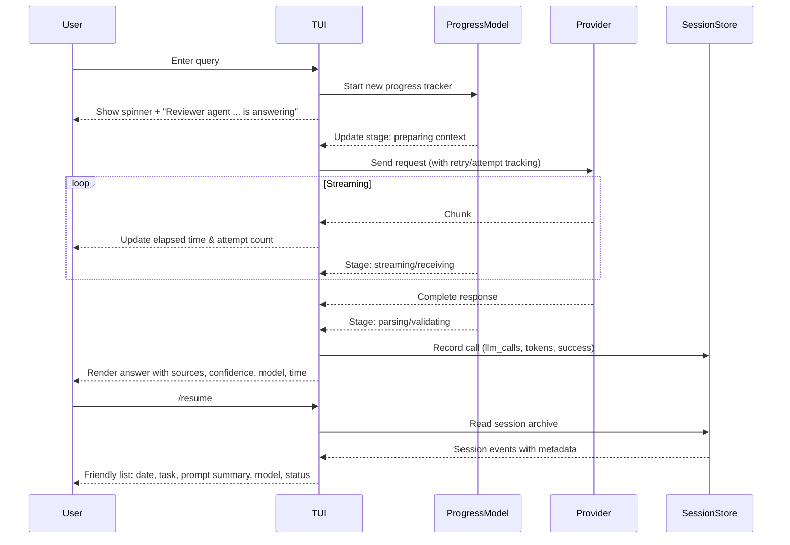

---
tags:
  - duumbi/inbox/enriched
  - duumbi/status/processed
  - duumbi/classification/execution
  - duumbi/value/high
  - duumbi/importance/high
  - duumbi/complexity/medium
duumbi_inbox_enrichment: processed
duumbi_inbox_enrichment_generated_at: 2026-06-27T07:05:36.365Z
---

# TUI Progress and Session Evidence UX

<!-- duumbi-inbox-enrichment:v1 status=processed generated_at=2026-06-27T07:05:36.365Z -->

## Source
- Surface: Manual Obsidian edit
- Vault path: Duumbi/00 Inbox (ToProcess)/2026-06-12 - TUI Progress and Session Evidence UX.md
- Submitted by: unknown unless explicit in the raw input

## Raw input
> ---
> tags:
>   - duumbi/inbox/roadmap
>   - duumbi/status/to-process
>   - duumbi/classification/execution
>   - duumbi/value/high
>   - duumbi/importance/high
>   - duumbi/complexity/medium
> created: 2026-06-12
> milestone: M0
> source: "Manual TUI UX review, 2026-06-12"
> parent: "[[2026-06-12 - TUI as Primary Surface Polish]]"
> ---
> 
> # TUI Progress and Session Evidence UX
> 
> ## Context
> 
> A live MiniMax Query-mode request succeeded in the TUI. The UI showed a spinner and "Reviewer agent (minimax/MiniMax-M2.7) is answering", then rendered the answer with sources, confidence, model, and elapsed time. This is useful, but long-running work still lacks stage-level progress, cost/request counters, retry visibility, and a clear sense of where the process is in the workflow.
> 
> The archived session file stored the query summary, but usage stats remained zero and `/resume` displayed a filename-like archive id (`20260612 175411 653 1`) instead of a readable local timestamp and summary.
> 
> ## Goal
> 
> The TUI should make provider-backed work observable while it runs and auditable after it finishes. Users should be able to tell what is happening, how long it has been running, whether it is waiting on a provider, how many attempts/calls have happened, and what can be resumed later.
> 
> ## Observed Evidence
> 
> - Query prompt: `what modules exist?`.
> - Provider: MiniMax through workspace config.
> - Running state: generic spinner plus `Reviewer agent ... is answering`.
> - Completion: answer rendered with `Sources: 10 | Confidence: Medium | Model: minimax/MiniMax-M2.7` and `completed in 6.07s`.
> - Session archive: one query turn persisted, but usage stats showed `llm_calls: 0`, token counts `0`, successes `0`, and empty provider breakdown.
> - `/resume` displayed `[1] 20260612 175411 653 1 (1 turn(s))` rather than a readable date/time and short summary.
> 
> ## Subtasks
> 
> 1. Add a progress model for Query, Agent, and Intent operations: preparing context, provider call, streaming/receiving, parsing, validating, writing, building, running.
> 2. Show elapsed time during work, not only after completion.
> 3. Show request/attempt/retry count and provider/model in the running state.
> 4. Record successful Query-mode provider calls in session usage stats and provider breakdown.
> 5. Improve `/resume` listing with local date/time, mode/task type, first prompt, short summary, provider/model, and success/failure status.
> 6. Preserve command errors and provider failures as resumable session events.
> 
> ## Acceptance Criteria
> 
> - A long-running provider call gives the user current phase, elapsed time, provider/model, and attempt count.
> - `/resume` is understandable without decoding archive filenames.
> - Session usage stats reflect successful and failed provider-backed calls.
> - Query, Agent, and Intent flows share consistent progress language.
> 
> ## Links
> 
> - [[2026-06-12 - TUI as Primary Surface Polish]]
> - [[2026-06-12 - Session Kernel and Event Ledger]]
> - [[2026-06-12 - Effort Levels and Cost Control]]
> - [[2026-06-12 - Token Economics Benchmark]]

## Interpreted intent

Make provider-backed work in the TUI observable during execution and auditable after completion by adding a real-time progress model, correct session usage statistics, human-readable /resume summaries, and preserving errors as resumable events.

## Developer summary

Enhance the DUUMBI TUI (ratatui-based) to show stage-level progress (e.g., preparing context, provider call, streaming, parsing, validating), elapsed time, attempt count, and provider/model for long-running Query, Agent, and Intent operations. Fix session usage stats to record successful and failed provider-backed calls (llm_calls, token counts, provider breakdown). Improve /resume to display local date/time, mode/task type, first prompt, short summary, provider/model, and status instead of raw archive IDs. Persist command errors and provider failures as resumable session events.

## UML overview

## Classification
- Type: execution
- Business value: high
- Importance: high
- Complexity: medium

## Clarifications
### Answered
- Current spinner only shows generic message and no intermediate stages.
- Completed query shows sources, confidence, model, and elapsed time but not during execution.
- Session archive currently shows llm_calls: 0 and no provider breakdown despite successful query.
- /resume listing shows filename-like archive id instead of readable timestamp and summary.

### Open
- Should the progress stages be configurable or hardcoded per operation type?
- What exact format should /resume use for date/time and summary (e.g. '2026-06-12 17:54:11 - query: what modules exist?')?
- How to handle concurrent queries or long-running work in the progress display?
- Should we display a live elapsed timer (e.g., counting up) or just update periodically?
- Do we need a new TUI component for progress, or extend the existing spinner?

## Relevant DUUMBI context
- Vault: [[2026-06-12 - TUI as Primary Surface Polish]] (parent note) – provides overarching TUI goals and constraints.
- Vault: [[2026-06-12 - Session Kernel and Event Ledger]] – defines session recording architecture and persistence.
- Vault: [[2026-06-12 - Effort Levels and Cost Control]] – relates to tracking cost and provider calls.
- Vault: [[2026-06-12 - Token Economics Benchmark]] – may inform token counting logic.
- Source: Cargo.toml includes ratatui, indicatif (progress bars) – TUI framework and progress primitives exist.
- Source: src/agents/ – provider calling logic where attempts and stats can be captured.
- Source: (inferred) src/cli/tui.rs or src/tui/ – current TUI rendering code to modify.

## Related GitHub context

No known related GitHub issues at this time; triage should verify later if any existing issues cover TUI progress or session recording.

## Initial routing recommendation

GitHub issue

## Requested follow-up
- Create a detailed implementation issue based on this enriched note.
- Ensure alignment with the Session Kernel and Event Ledger design before implementation.

## AI agent instructions
- When creating a GitHub issue, include acceptance criteria from the note.
- Break down subtasks into a task list referencing affected source files (TUI rendering, session storage, /resume command).
- Do not invent completed work – start with current state as described in observed evidence.
- Include technical notes on where to hook into existing provider call pipeline for progress updates.
- Mention that the progress model should reuse existing cost and attempt tracking mechanisms.
- Note that session usage stats recording must work for both success and failure cases.

## Scope candidate
### In
- Real-time progress display (stage, elapsed time, attempt count, provider/model) for Query, Agent, and Intent operations in TUI.
- Correct recording of provider-backed calls (success and failure) in session usage statistics and provider breakdown.
- Human-readable /resume listing with local date/time, task type, prompt summary, provider/model, and status.
- Preserving command errors and provider failures as resumable session events.

### Out
- Changing the underlying provider or streaming logic.
- Altering the session storage format beyond adding necessary fields for progress and stats.
- Modifying non-provider-backed operation UI.
- Adding progress to CLI or other surfaces (TUI only).

## Risks and trade-offs
- Frequent UI updates during streaming could cause performance issues or flicker in the TUI.
- Incomplete or incorrect session stats may lead to misleading cost or usage data.
- Changing /resume output format might break scripts that parse the old format (if any exist).
- Adding many progress stages could overwhelm the user with unnecessary detail.

## Obsidian tags

#duumbi/inbox/enriched #duumbi/status/processed #duumbi/classification/execution #duumbi/value/high #duumbi/importance/high #duumbi/complexity/medium

## Enrichment result
- Date: 2026-06-27T07:05:36.365Z
- Status: ready for triage
- Canonical duplicate: none verified
- Facts:
- The TUI already shows a spinner and generic agent message during provider calls.
- After completion, the TUI displays sources, confidence, model, and elapsed time.
- The session archive currently stores query turns but records zero llm_calls and empty provider breakdown.
- /resume shows a filename-like ID (e.g., '20260612 175411 653 1') instead of a human-friendly date and summary.
- Assumptions:
- The TUI is built with ratatui and can be extended with custom widgets.
- The session storage is a local file that can be safely augmented with new fields.
- Provider calls are already instrumented for attempt counting and timing, but not persisted to session stats.
- The /resume command reads from the same session archive and can be modified without breaking other commands.
- Recommendations:
- Prioritize this work as high business value; it significantly improves user experience.
- Implement progress stages as a finite state machine to simplify rendering logic.
- Reuse the existing `indicatif` crate for elapsed time and progress bars if available.
- Coordinate with the Session Kernel note to ensure the event ledger design supports progress events and usage stats.
- Test with long-running and failed provider calls to verify stats and /resume behavior.
