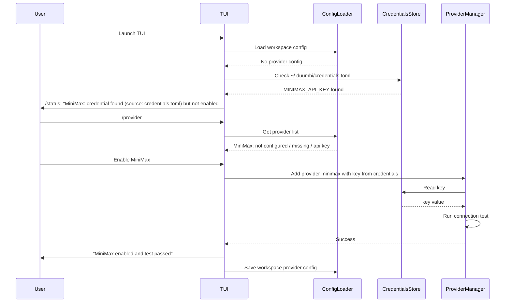

---
tags:
  - duumbi/inbox/enriched
  - duumbi/status/processed
  - duumbi/classification/feature
  - duumbi/value/high
  - duumbi/importance/high
  - duumbi/complexity/medium
duumbi_inbox_enrichment: processed
duumbi_inbox_enrichment_generated_at: 2026-06-27T18:25:35.670Z
---

# TUI Provider Setup and Credential Discovery UX

<!-- duumbi-inbox-enrichment:v1 status=processed generated_at=2026-06-27T18:25:35.670Z -->

## Source
- Surface: Manual Obsidian edit
- Vault path: Duumbi/00 Inbox (ToProcess)/2026-06-12 - TUI Provider Setup and Credential Discovery UX.md
- Submitted by: unknown unless explicit in the raw input

## Raw input
> ---
> tags:
>   - duumbi/inbox/roadmap
>   - duumbi/status/to-process
>   - duumbi/classification/execution
>   - duumbi/value/high
>   - duumbi/importance/high
>   - duumbi/complexity/medium
> created: 2026-06-12
> milestone: M0
> source: "Manual TUI UX review, 2026-06-12"
> parent: "[[2026-06-12 - TUI as Primary Surface Polish]]"
> ---
> 
> # TUI Provider Setup and Credential Discovery UX
> 
> ## Context
> 
> Manual review used the MiniMax credential in `/Users/heizergabor/.duumbi/credentials.toml`. The fresh workspace had no provider configuration, so `/status` and `/provider` reported providers as not configured even though a MiniMax key existed in the user credential file. After adding a workspace provider entry manually and launching with `MINIMAX_API_KEY` loaded, Query mode worked against MiniMax.
> 
> This creates a first-run setup gap: users can have a credential available but still see only "not configured" unless they understand config layering and env indirection.
> 
> ## Goal
> 
> The TUI provider flow should guide users from detected credential material to a tested, active provider without requiring manual TOML edits or hidden environment setup.
> 
> ## Observed Evidence
> 
> - `~/.duumbi/credentials.toml` contained `MINIMAX_API_KEY`.
> - Fresh workspace `/status`: `Providers: not configured (source: none)`.
> - `/provider` listed MiniMax as `not configured / missing / api key`.
> - `duumbi provider add minimax MINIMAX_API_KEY` attempted to save through user config and failed under sandboxed user-config access.
> - Manual workspace config with `provider = "minimax"` and `role = "primary"` plus env injection made Query mode succeed.
> 
> ## Subtasks
> 
> 1. Define the intended relationship between `credentials.toml`, user config, workspace config, and environment variables.
> 2. In `/provider`, distinguish "credential found but provider not enabled" from "credential missing".
> 3. Add a provider setup action that enables MiniMax from the existing credential file and runs a connection test.
> 4. Prevent casing footguns in hand-authored config by documenting valid values and, where possible, producing repair suggestions for `MiniMax` -> `minimax` and `Primary` -> `primary`.
> 5. Ensure `/status` reports the config source and credential state without exposing secrets.
> 
> ## Acceptance Criteria
> 
> - A user with `MINIMAX_API_KEY` in `~/.duumbi/credentials.toml` can enable and test MiniMax from the TUI.
> - Provider setup never prints or stores raw secrets in screen output, logs, or session history.
> - `/status` and `/provider` use consistent provider-state language.
> - Provider setup works in a fresh workspace without editing TOML by hand.
> 
> ## Links
> 
> - [[2026-06-12 - TUI as Primary Surface Polish]]
> - [[2026-06-12 - Model Capability Advisor and Task Routing]]
> - [[2026-06-12 - Docs Truth Reconciliation]]

## Interpreted intent

The user wants the TUI to detect available API credentials (e.g., from ~/.duumbi/credentials.toml) and guide the user through enabling and testing a provider without manual TOML edits or environment variable juggling. The goal is to reduce first-run friction and provide clear provider-state reporting in /status and /provider.

## Developer summary

Implement a TUI flow that discovers API keys from the user's credentials file (~/.duumbi/credentials.toml), distinguishes between 'credential found but provider not enabled' and 'credential missing', offers to enable the provider with a connection test, and updates /status and /provider to reflect config source and credential state. Also prevent casing mismatches (e.g., 'MiniMax' vs 'minimax') by normalizing provider names and producing repair suggestions. Ensure no raw secrets are ever printed or logged.

## UML overview

## Classification
- Type: feature
- Business value: high
- Importance: high
- Complexity: medium

## Clarifications
### Answered
- ~/.duumbi/credentials.toml contained MINIMAX_API_KEY.
- Fresh workspace /status reported 'Providers: not configured (source: none)'.
- /provider listed MiniMax as 'not configured / missing / api key'.
- Manual workspace config with provider = 'minimax' and env injection made Query mode succeed.
- duumbi provider add minimax MINIMAX_API_KEY attempted to save through user config and failed under sandboxed user-config access.

### Open
- How should the TUI handle multiple credentials in the file? Which one takes precedence?
- Should the TUI allow the user to select a different credential file location?
- Should the provider setup action automatically add the provider to workspace config or user config?
- What happens if the connection test fails? Should the TUI offer retry or fallback?
- Should the /provider command show all providers even if no credentials detected?
- How should provider name casing be normalized beyond MiniMax (e.g., anthropic, openai)? Is a canonical mapping needed?

## Relevant DUUMBI context
- Duumbi/00 Inbox (ToProcess)/2026-06-12 - TUI as Primary Surface Polish (parent note)
- src/config.rs (workspace and user config handling)
- src/agents/ (provider model and credential management, especially minimax module)
- AGENTS.md (agent interaction style and project conventions)
- DUUMBI - PRD (user-facing workflows and TUI as primary surface)

## Related GitHub context

No known open GitHub issues directly matching this. Triage should verify GitHub for existing provider setup or TUI UX issues.

## Initial routing recommendation

GitHub issue

## Requested follow-up
- Create a GitHub issue for implementing the TUI provider discovery and setup flow. Include acceptance criteria from the note.
- Consider breaking into sub-issues: (1) credential detection and status reporting, (2) provider enablement action with test, (3) case normalization.

## AI agent instructions
- Title: 'TUI: Provider discovery from credentials.toml and guided setup flow'.
- Body should describe the problem, proposed solution, steps, and acceptance criteria.
- Reference the vault note path: 'Duumbi/00 Inbox (ToProcess)/2026-06-12 - TUI Provider Setup and Credential Discovery UX.md'.
- Label with 'tui', 'provider', 'ux', 'enhancement'.
- Assign to relevant milestone (likely M0).

## Scope candidate
### In
- TUI provider status display improvement
- Credential detection in ~/.duumbi/credentials.toml
- Guided provider setup action with connection test
- Normalization of provider names and case-insensitive handling

### Out
- Non-TUI surfaces (CLI, Studio) provider setup changes
- Registry integration
- Multi-credential priority resolution
- Credential file editing UI

## Risks and trade-offs
- Exposing secrets accidentally in logs or UI (must sanitize output).
- Casing mismatches causing confusion (need a canonical mapping).
- Workspace config vs user config conflict resolution.
- Connection test might reveal API key to error messages.
- Sandboxed user-config access still needs to be addressed for the 'enable' action.

## Obsidian tags

#duumbi/inbox/enriched #duumbi/status/processed #duumbi/classification/feature #duumbi/value/high #duumbi/importance/high #duumbi/complexity/medium

## Enrichment result
- Date: 2026-06-27T18:25:35.670Z
- Status: ready for triage
- Canonical duplicate: none verified
- Facts:
- ~/.duumbi/credentials.toml contained MINIMAX_API_KEY.
- Fresh workspace /status reported 'Providers: not configured (source: none)'.
- /provider listed MiniMax as 'not configured / missing / api key'.
- duumbi provider add minimax MINIMAX_API_KEY failed under sandboxed user-config access.
- Manual workspace config with provider = 'minimax' and role = 'primary' plus env injection made Query mode succeed.
- Assumptions:
- Credentials file is at standard location (~/.duumbi/credentials.toml).
- TUI has read access to the credentials file.
- Provider adding logic can be invoked from TUI with the key from the file.
- Users expect the guided flow to be safe and not expose secrets.
- Recommendations:
- Start with a simple implementation: detect credentials in ~/.duumbi/credentials.toml, surface in /status and /provider, offer one-click enable with test.
- Add provider name normalization early to avoid support issues.
- Ensure secrets are never echoed in UI or logs.
- Use sandboxed provider add that saves to workspace config, not user config, to avoid access failures.
