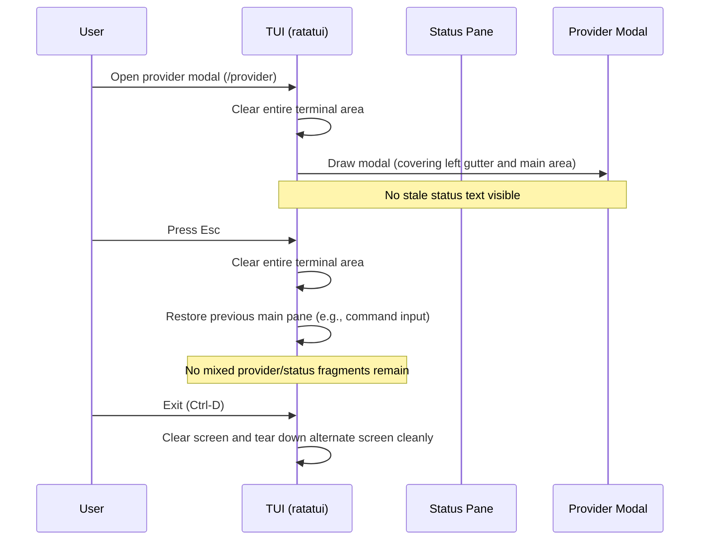

---
tags:
  - duumbi/inbox/enriched
  - duumbi/status/processed
  - duumbi/classification/bug
  - duumbi/value/high
  - duumbi/importance/high
  - duumbi/complexity/medium
duumbi_inbox_enrichment: processed
duumbi_inbox_enrichment_generated_at: 2026-06-28T07:21:59.938Z
---

# TUI Redraw Stability and Modal Cleanup

<!-- duumbi-inbox-enrichment:v1 status=processed generated_at=2026-06-28T07:21:59.938Z -->

## Source
- Surface: Manual Obsidian edit
- Vault path: Duumbi/00 Inbox (ToProcess)/2026-06-12 - TUI Redraw Stability and Modal Cleanup.md
- Submitted by: unknown unless explicit in the raw input

## Raw input
> ---
> tags:
>   - duumbi/inbox/roadmap
>   - duumbi/status/to-process
>   - duumbi/classification/execution
>   - duumbi/value/high
>   - duumbi/importance/high
>   - duumbi/complexity/medium
> created: 2026-06-12
> milestone: M0
> source: "Manual TUI UX review, 2026-06-12"
> parent: "[[2026-06-12 - TUI as Primary Surface Polish]]"
> ---
> 
> # TUI Redraw Stability and Modal Cleanup
> 
> ## Context
> 
> Manual review of `target/debug/duumbi` in a fresh workspace found redraw corruption in normal TUI use. The provider manager modal opened over existing status output without clearing the underlying left gutter, leaving stale fragments beside the panel. Closing the modal with `Esc` also left large portions of stale status and prompt text in the main pane before exit.
> 
> This fits the M0 TUI release-polish track: the UI must not visually fall apart during ordinary setup and recovery flows.
> 
> ## Goal
> 
> Modal open/close, panel transitions, command output, and normal exit always repaint the affected regions cleanly. The terminal should never show stale fragments from a previous panel, prompt, or conversation block.
> 
> ## Observed Evidence
> 
> - Fresh workspace: `/tmp/duumbi-tui-ux.XkZdLF`.
> - Command: `target/debug/duumbi`.
> - Opened `/provider`; stale fragments from the underlying status pane appeared in the left margin beside the modal.
> - Pressed `Esc`; the main pane still contained mixed provider/status/prompt fragments.
> - Exiting with `Ctrl-D` left a visibly corrupted final screen before terminal restoration.
> 
> ## Subtasks
> 
> 1. Audit ratatui layout clearing for modal overlays, especially provider manager and status/history panes.
> 2. Add render tests that verify modal rectangles clear their full background, including surrounding gutters and borders.
> 3. Add an integration smoke path for `/status` -> `/provider` -> `Esc` -> `Ctrl-D` and assert no stale provider/status text remains in the rendered buffer.
> 4. Ensure alternate-screen teardown restores the terminal cleanly after corrupted-render paths and normal exit.
> 5. Repeat the pass at 80x24 and a narrow terminal size such as 60x18.
> 
> ## Acceptance Criteria
> 
> - Provider panel open and close leaves no stale underlying text.
> - Status, provider, help, and resume panels can be opened and closed repeatedly without visual residue.
> - Automated tests cover modal background clearing and at least one narrow terminal size.
> 
> ## Links
> 
> - [[2026-06-12 - TUI as Primary Surface Polish]]
> - [[2026-06-12 - Release v0.4.0-preview TUI-first]]

## Interpreted intent

Fix ratatui-based TUI redraw corruption: opening/closing modals (e.g., provider manager) and normal exit must not leave stale text fragments from previous panels. The fix should ensure every modal open/close and panel transition fully clears the affected region, including gutters and borders, at standard (80x24) and narrow (e.g., 60x18) terminal sizes.

## Developer summary

The DUUMBI TUI (ratatui v0.30.2) exhibits visual corruption during modal lifecycle: opening the provider modal overlays status text without clearing the left gutter, and closing via Esc leaves stale fragments in the main pane. Exiting with Ctrl-D also shows a corrupted final screen. The goal is to enforce complete repaint of the terminal area on every modal open/close, panel transition, and exit. This involves auditing ratatui layout logic in the provider manager and command output rendering, ensuring full-area clearing before drawing overlays, and adding render tests (e.g., with ratatui's Buffer or terminal-size snapshot utilities) to verify no stale text remains. Also need to verify behavior at narrow terminal sizes (e.g., 60x18) to prevent clipping artifacts. The fix is part of M0 TUI polish for v0.4.0-preview.

## UML overview

## Classification
- Type: bug
- Business value: high
- Importance: high
- Complexity: medium

## Clarifications
### Answered
- Corruption observed at fresh workspace /tmp/duumbi-tui-ux.XkZdLF with target/debug/duumbi binary.
- Opening /provider leaves stale fragments from status pane in left gutter.
- Pressing Esc leaves mixed provider/status/prompt fragments in main pane.
- Ctrl-D leaves corrupted final screen before terminal restoration.
- Acceptance criteria: modal open/close must leave no stale underlying text; repeated open/close must not accumulate residue; automated tests must cover modal clearing and narrow terminal size.

### Open
- Which specific ratatui widgets/layouts are responsible for the uncleared gutter area? (e.g., area used for status panel vs. provider modal overlay).
- Are there known ratatui best practices for full-area clearing that are currently missing?
- Does the issue require a restructuring of the UI composition (e.g., using a central state machine) or can it be fixed with targeted clear operations?
- Does the ratatui version (v0.30.2) have any relevant rendering bugs that could affect clearing logic?
- Should the fix also address potential flicker from unnecessary full-screen repaints, or is simplicity preferred?

## Relevant DUUMBI context
- Cargo.toml: ratatui v0.30.2 dependency (TUI framework). The rendering corruption likely originates in how the DUUMBI TUI code handles view transitions and overlay clearing.
- Vault: DUUMBI - PRD (M0 TUI-first release polish). This bug directly affects the user-facing quality of the primary surface.
- Vault: DUUMBI - Agentic Development Runbook (Stage 4 triage guidelines). The note should be triaged into a high-priority GitHub issue for implementation.
- Vault parent note: 2026-06-12 - TUI as Primary Surface Polish (likely contains broader TUI quality goals).

## Related GitHub context

No known open GitHub issue. Triage should check for existing TUI-bug issues before creating a new one.

## Initial routing recommendation

GitHub issue

## Requested follow-up
- Create a GitHub issue capturing the observed corruption, reproduction steps, acceptance criteria, and subtasks.
- Prioritize the issue as high for M0 TUI polish.

## AI agent instructions
- When creating the GitHub issue, describe the exact observed rendering corruption in the /provider modal and on Esc/Ctrl-D.
- Include steps to reproduce: fresh workspace, run target/debug/duumbi, open /provider, observe gutter; press Esc, observe main pane; Ctrl-D, observe final screen.
- Note the affected terminal sizes: 80x24 and 60x18.
- List subtasks from the Inbox note: audit ratatui layout clearing, add render tests for modal overlays, add integration smoke test for /status -> /provider -> Esc -> Ctrl-D, ensure alternate-screen teardown, test at narrow sizes.
- Set acceptance criteria: modal open/close clean, panel transitions clean, automated tests pass.

## Scope candidate
### In
- Fix ratatui rendering for modal overlays (provider manager, status/history panes)
- Ensure full-area clear on modal open, close, and panel transition
- Add automated render tests (e.g., buffer comparison) that verify no stale fragments after modal open/close
- Add an integration smoke test path: /status → /provider → Esc → Ctrl-D
- Verify clean alternate-screen teardown after corrupted render paths
- Test at standard (80x24) and narrow (60x18) terminal sizes

### Out
- Rewriting the entire TUI framework or switching to another library
- Adding new TUI features unrelated to redraw
- Fixing other non-TUI CLI components
- Performance optimization beyond preventing unnecessary flicker (can be deferred)

## Risks and trade-offs
- Excessive clearing might cause visible flicker or slow down rendering on small terminals.
- Fixing clearing in one overlay could cause layout regressions in other panels (help, resume).
- If ratatui version has an underlying redraw bug, the fix might require an upgrade or workaround.
- The bug might be in a specific widget composition that is not obvious until layout code is restructured.

## Obsidian tags

#duumbi/inbox/enriched #duumbi/status/processed #duumbi/classification/bug #duumbi/value/high #duumbi/importance/high #duumbi/complexity/medium

## Enrichment result
- Date: 2026-06-28T07:21:59.938Z
- Status: ready for triage
- Canonical duplicate: none verified
- Facts:
- Observed corruption on fresh workspace with DEBUG binary (target/debug/duumbi).
- Provider panel open: stale fragments from underlying status pane appear in left margin.
- Esc close: main pane shows mixed provider/status/prompt fragments.
- Ctrl-D exit: final screen is corrupted before terminal restoration.
- This is a manual review finding, not a test failure.
- Terminal size tested: 80x24 and 60x18.
- Note is linked to parent roadmap note '2026-06-12 - TUI as Primary Surface Polish'.
- Assumptions:
- The rendering corruption is due to missing explicit clear/write operations when transitioning between views, not a terminal emulator bug.
- The ratatui widgets can be fixed by ensuring the area used by the overlay is completely filled with spaces or a Clear widget before drawing the new content.
- The integration smoke test can be implemented using ratatui's TestBackend or by comparing raw terminal buffer bytes.
- The alternate-screen handling code already exists but may need to force a full repaint before teardown.
- Recommendations:
- Audit the provider manager modal drawing code: ensure it paints over the entire target area, including the left gutter where the status bar usually sits.
- Add a Clear widget or a hard-coded space-filling step before painting any overlay.
- Implement render tests using ratatui::Terminal with a TestBackend to capture buffer state and assert no stale text after each action.
- Add the integration smoke test as a new test case in the TUI test module.
- After fix, manually verify narrow terminal sizes to ensure clearing works edge-to-edge.
