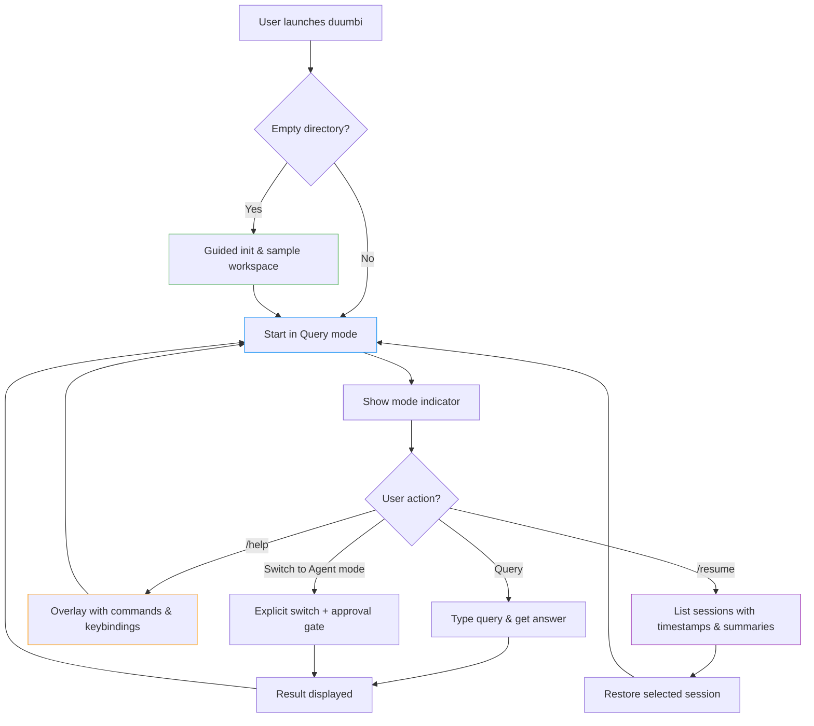

---
tags:
  - duumbi/inbox/enriched
  - duumbi/status/processed
  - duumbi/classification/execution
  - duumbi/value/high
  - duumbi/importance/high
  - duumbi/complexity/medium
duumbi_inbox_enrichment: processed
duumbi_inbox_enrichment_generated_at: 2026-06-25T18:45:12.762Z
---

# TUI as Primary Surface Polish

<!-- duumbi-inbox-enrichment:v1 status=processed generated_at=2026-06-25T18:45:12.762Z -->

## Source
- Surface: Manual Obsidian edit
- Vault path: Duumbi/00 Inbox (ToProcess)/2026-06-12 - TUI as Primary Surface Polish.md
- Submitted by: unknown unless explicit in the raw input

## Raw input
> ---
> tags:
>   - duumbi/inbox/roadmap
>   - duumbi/status/to-process
>   - duumbi/classification/execution
>   - duumbi/value/high
>   - duumbi/importance/high
>   - duumbi/complexity/medium
> created: 2026-06-12
> milestone: M0
> source: "[[DUUMBI Future Development Roadmap Map]]"
> ---
> 
> # TUI as Primary Surface Polish
> 
> ## Context
> 
> The TUI already exists (`src/cli/repl.rs`, ~2,460 lines, ratatui, Query/Agent modes, session persistence in `.duumbi/session/`, `/resume` command). Strategy says: lead with the read-only `query` surface. The TUI is the first surface to be released publicly (M0), ahead of Desktop/Cloud/Mobile.
> 
> ## Goal
> 
> The TUI is good enough to be the face of the v0.4.0-preview launch: query-first, discoverable, stable, and demonstrably session-persistent.
> 
> ## Subtasks
> 
> 1. First-run experience: launching `duumbi` in an empty directory should offer guided `init` and a sample workspace, not an error.
> 2. Query mode as default with visible mode indicator; Agent (write) mode behind explicit switch + approval gates (already the design — verify and document).
> 3. Command discoverability: `/help` overlay, slash-command palette, keybinding cheatsheet.
> 4. Session UX: `/resume` listing with timestamps and summaries; verify archive/restore round-trips; document the session contract (this is the seed of "continue session anywhere" — see [[2026-06-12 - Session Kernel and Event Ledger]]).
> 5. Robustness pass: terminal resize, narrow terminals, no-color terminals, Windows Terminal.
> 6. Demo asset: a recorded TUI walkthrough (asciinema/VHS) for duumbi.dev and the launch post.
> 
> ## Review-Derived Follow-Ups
> 
> - [[2026-06-12 - TUI Redraw Stability and Modal Cleanup]]
> - [[2026-06-12 - TUI Error Diagnostics Stay In-App]]
> - [[2026-06-12 - TUI Provider Setup and Credential Discovery UX]]
> - [[2026-06-12 - TUI Progress and Session Evidence UX]]
> - [[2026-06-12 - TUI Narrow Terminal and Slash Menu Polish]]
> 
> ## Acceptance criteria
> 
> - A first-time user completes: launch TUI → guided init → query "what exists?" → one approved AI mutation → build/run, without reading external docs.
> - Session survives kill/restart and `/resume` restores conversational context.
> - Works on macOS Terminal, Linux, and Windows Terminal.
> 
> ## Links
> 
> - [[DUUMBI Future Development Roadmap Map]]
> - [[2026-06-12 - Release v0.4.0-preview TUI-first]]
> - [[DUUMBI - Service and Research Direction]] (query-first positioning)

## Interpreted intent

Polish the existing ratatui-based TUI (src/cli/repl.rs) to be the face of the v0.4.0-preview launch. Ensure a query-first, discoverable, and stable experience with guided first-run setup, session persistence, command discoverability, terminal robustness, and a demo recording.

## Developer summary

Refine the TUI (src/cli/repl.rs, ~2,460 lines) for the public preview. Implement a guided init flow for empty directories, make query mode the default with a visible mode indicator, add /help overlay and slash-command palette, enhance /resume with timestamps and summaries, and harden against terminal resize, narrow terminals, no-color terminals, and Windows Terminal. Produce a recorded walkthrough for the launch post.

## UML overview

## Classification
- Type: execution
- Business value: high
- Importance: high
- Complexity: medium

## Clarifications
### Answered
- The TUI already exists in src/cli/repl.rs using ratatui.
- Query and Agent modes are implemented; the design requires an explicit switch and approval gate for Agent mode.
- Session persistence is in .duumbi/session/ and /resume already works.
- The launch release is v0.4.0-preview with milestone M0.
- Review-derived follow-up sub-notes already exist for redraw stability, error diagnostics, provider UX, progress/session UX, and narrow-terminal polish.

### Open
- Exact UX of guided init: should it be a series of prompts, a single-page wizard, or just a friendly message?
- What should the default query mode indicator look like and where should it be placed?
- Content and layout of the /help overlay and keybinding cheatsheet?
- Specific Windows Terminal bugs or limitations to address?
- How will the demo video be produced (tools, script, voiceover)?
- Should any of the polish items be prioritized over others for the M0 release given time constraints?

## Relevant DUUMBI context
- Duumbi/00 Inbox (ToProcess)/2026-06-12 - TUI as Primary Surface Polish.md (the raw note itself)
- Duumbi/00 Inbox (ToProcess)/2026-06-12 - Release v0.4.0-preview TUI-first.md (linked release note)
- Duumbi/01 Atlas (Knowledge Base)/Works (Developed Materials)/DUUMBI - PRD.md (product thesis and service surface definition)
- Duumbi/01 Atlas (Knowledge Base)/Works (Developed Materials)/DUUMBI - Agentic Development Runbook.md (workflow for implementation and review)
- src/cli/repl.rs (TUI implementation code)
- Duumbi/00 Inbox (ToProcess)/2026-06-12 - TUI Redraw Stability and Modal Cleanup.md (review follow-up)
- Duumbi/00 Inbox (ToProcess)/2026-06-12 - TUI Error Diagnostics Stay In-App.md (review follow-up)
- Duumbi/00 Inbox (ToProcess)/2026-06-12 - TUI Provider Setup and Credential Discovery UX.md (review follow-up)
- Duumbi/00 Inbox (ToProcess)/2026-06-12 - TUI Progress and Session Evidence UX.md (review follow-up)
- Duumbi/00 Inbox (ToProcess)/2026-06-12 - TUI Narrow Terminal and Slash Menu Polish.md (review follow-up)

## Related GitHub context

No direct GitHub issues are cited in the note. Triage should verify if any existing issues cover TUI polish or the v0.4.0-preview launch.

## Initial routing recommendation

GitHub issue

## Requested follow-up
- Create a tracking GitHub issue for this high-level polish task, optionally breaking it into sub-issues corresponding to the review-derived sub-notes.
- Produce the demo recording before the launch.
- Verify the query-mode defaulting and approval gates are documented in the user-facing help.

## AI agent instructions
- When creating a GitHub issue: use title 'TUI as Primary Surface Polish', label it as 'execution', 'TUI', 'milestone: M0'.
- Include the developer summary and acceptance criteria from the Inbox note.
- Link to the review-derived sub-notes as separate detailed issues if not yet created.
- Add a checklist with subtasks: guided init, query-mode default, command discoverability, session UX, robustness, demo video.
- Reference the existing TUI code (src/cli/repl.rs) as the primary affected file.
- Set the issue priority high and assign to the M0 project.

## Scope candidate
### In
- First-run guided init for empty directories.
- Query mode as default with visible indicator.
- Command /help overlay and slash-command palette.
- Session /resume with timestamps and summaries.
- Archive/restore round-trip verification.
- Terminal resize, narrow, no-color, and Windows Terminal handling.
- Recorded walkthrough demo.

### Out
- New TUI features not related to polish (e.g., adding new commands beyond what is needed for discoverability).
- Desktop or Cloud surface development.
- Backend changes to session kernel (already exists).
- Changes to Agent mode beyond the existing approval gate design.

## Risks and trade-offs
- The TUI codebase is large, and polish changes may introduce regressions in complex rendering or session state.
- Terminal compatibility issues may surface after launch on niche platforms not included in the test matrix.
- The guided init could be perceived as too simple or too intrusive.
- The demo video might set unrealistic expectations if it shows a polished but not yet released experience.
- The multiple follow-up sub-notes may lead to parallel work that conflicts or overlaps.

## Obsidian tags

#duumbi/inbox/enriched #duumbi/status/processed #duumbi/classification/execution #duumbi/value/high #duumbi/importance/high #duumbi/complexity/medium

## Enrichment result
- Date: 2026-06-25T18:45:12.762Z
- Status: ready for triage
- Canonical duplicate: none verified
- Facts:
- The TUI uses ratatui v0.30.2 and crossterm v0.29.0.
- The main source file is src/cli/repl.rs, approximately 2,460 lines.
- Session persistence uses .duumbi/session/ directory and /resume command.
- The launch version is v0.4.1-preview (according to Cargo.toml).
- There are five specific review-derived follow-up notes already in the Inbox.
- Assumptions:
- The guided init will be a simple interactive prompt or message, not a full reimplementation of `duumbi init`.
- All terminal robustness fixes will be limited to TUI rendering and not affect the core compiler or graph logic.
- The demo video will be produced using asciinema or VHS as suggested.
- The existing query/agent mode design is correct and only needs verification and documentation.
- Recommendations:
- Prioritize first-run experience and session persistence for the demo video.
- Use the review-derived notes as checklists for individual polish items.
- Assign a tracking GitHub issue and link each sub-note as a separate issue if the scope is large.
- Schedule terminal compatibility testing on all three OS families early in the M0 cycle.
