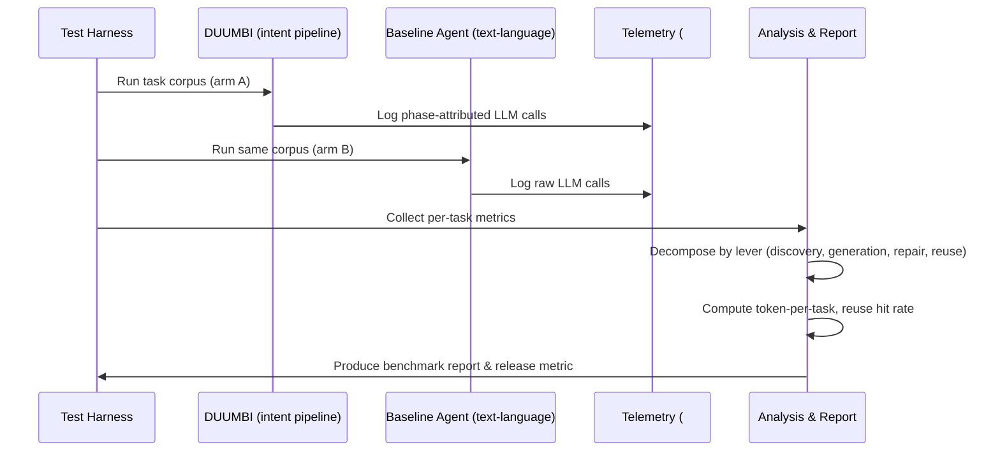

---
tags:
  - duumbi/inbox/enriched
  - duumbi/status/processed
  - duumbi/classification/execution
  - duumbi/value/critical
  - duumbi/importance/high
  - duumbi/complexity/medium
duumbi_inbox_enrichment: processed
duumbi_inbox_enrichment_generated_at: 2026-06-24T18:36:32.906Z
---

# Token Economics Benchmark

<!-- duumbi-inbox-enrichment:v1 status=processed generated_at=2026-06-24T18:36:32.906Z -->

## Source
- Surface: Manual Obsidian edit
- Vault path: Duumbi/00 Inbox (ToProcess)/2026-06-12 - Token Economics Benchmark.md
- Submitted by: unknown unless explicit in the raw input

## Raw input
> ---
> tags:
>   - duumbi/inbox/roadmap
>   - duumbi/status/to-process
>   - duumbi/classification/execution
>   - duumbi/value/critical
>   - duumbi/importance/high
>   - duumbi/complexity/medium
> created: 2026-06-12
> milestone: M1
> source: "[[DUUMBI Future Development Roadmap Map]]"
> related_issues:
>   - hgahub/duumbi#682
> ---
> 
> # Token Economics Benchmark
> 
> ## Context
> 
> *Proposed addition (Claude, 2026-06-12).* Token usage is cost, latency, and quota (the project already caps Anthropic eval spend). Text-language agentic tools (Claude Code, Cursor, Copilot agents) spend tokens in a characteristic pattern: context discovery dominates input (grep/read cycles, whole-file reads, re-reads after edits — often 50–80% of input tokens), generation output is the highest unit price (output ≈ 5× input on typical pricing), and every repair iteration replays the whole loop. DUUMBI's architecture attacks each of these — and the claim should be **measured, not asserted**. [[DUUMBI - Service and Research Direction]] already names the experiment ("task quality with full context vs. selected context vs. graph summaries"), session LLM usage stats exist (`src/session`), and issue #682 (MCP model usage telemetry analytics) is the natural instrumentation home.
> 
> ### Where the advantage is expected (per cost center)
> 
> | Cost center in text-based tools | DUUMBI mechanism | Expected effect |
> |---|---|---|
> | Context discovery (file dumps, search cycles) | Graph queries: dependency closure, neighborhood, "where does behavior live" — the graph IS the index | Scoped query answers replace multi-round file reads; expected 5–20× reduction in discovery tokens |
> | Generation output (full file/hunk rewrites at ~5× input price) | GraphPatch ops; rewrite-rule selection + parameters (#684) | Small mutation ≈ 10–20% of regenerating the unit; rule emission is tens of tokens |
> | Repair iterations (full-context retries after build/test failures) | Pre-build schema/type/ownership validation, node-precise machine-readable errors, deterministic compiler feedback | Fewer retries; retry prompts shrink to error + offending nodes instead of context re-dump |
> | Re-derived knowledge across sessions | Session ledger + knowledge graph + query mode | "What did we decide/build" is a query, not re-exploration |
> | Reimplementing existing functionality | Registry semantic-hash + similarity reuse-first gate | A reuse hit saves ~100% of that function's generation+repair tokens; hit rate compounds as the registry grows → **declining marginal token cost per task** |
> 
> ### The honest liability
> 
> Raw JSON-LD is 3–10× more verbose than equivalent source code (plus branch-only control flow inflates op counts). "No programming language" is a token **disadvantage** at the representation level unless LLM-facing I/O is engineered so the model never reads or writes raw JSON-LD — that work is [[2026-06-12 - Token-Efficient Graph Representation for LLM IO]]. Without it, novel-generation tasks could be break-even or worse; with it, the architectural levers come on top.
> 
> ## Goal
> 
> A published, reproducible benchmark quantifying tokens-per-task for DUUMBI vs. a text-language agent baseline on the same task corpus, with per-phase attribution — and token-per-task tracked as a standing release metric.
> 
> ## Subtasks
> 
> 1. Per-phase token attribution: tag every LLM call with phase (context/discovery, generation, repair, verification, reuse-lookup) in session usage stats and telemetry; align with #682 so the analytics are queryable via MCP too.
> 2. Benchmark protocol: same corpus (M1 multi-module intents + flagship example), arm A = DUUMBI intent pipeline, arm B = off-the-shelf agent implementing the same spec in Rust; identical model/provider; record input/output/cache tokens, retries, wall-clock, success rate.
> 3. Lever decomposition — measure each independently: (a) reuse hit vs. fresh generation delta; (b) graph-query context vs. file-read context for identical questions; (c) patch/rewrite-rule output size vs. full-function text; (d) repair iteration count and per-iteration token cost.
> 4. Run the context experiment from the research direction: full context vs. selected context packs vs. graph summaries — quality-vs-token tradeoff curve.
> 5. Reuse compounding curve: token cost per task as a function of registry size / reuse hit rate (simulated on the corpus), demonstrating declining marginal cost.
> 6. Token-per-task as a release metric next to determinism and reuse hit rate; publish "The token economics of graph-native development" (Phase 14 GTM) — including where DUUMBI loses and how the representation work fixes it.
> 
> ## Acceptance criteria
> 
> - Every LLM call in telemetry is phase-attributed; per-task token breakdown reproducible from session data alone.
> - Published benchmark with the four-lever decomposition against the text baseline on the shared corpus.
> - Token-per-task and reuse hit rate appear in release reporting from v0.5 onward.
> 
> ## Links
> 
> - [[DUUMBI Future Development Roadmap Map]]
> - [[2026-06-12 - Token-Efficient Graph Representation for LLM IO]]
> - [[2026-06-12 - Semantic Graph Similarity and Reuse]]
> - [[2026-06-12 - Intent at Scale Multi-Module and BDD]]
> - [[2026-06-12 - Agent Substrate MCP First-Class]]

## Interpreted intent

Benchmark and measure DUUMBI's token economics advantage over text-language agents, with per-phase attribution, using existing telemetry (#682) and establishing tokens-per-task as a release metric.

## Developer summary

Build a reproducible token economics benchmark comparing DUUMBI’s intent pipeline to a text-language agent on a shared task corpus, with per-phase token attribution (discovery, generation, repair, reuse) using existing session telemetry and issue #682 for MCP analytics. The benchmark will measure and publish the claimed token savings, track tokens-per-task as a release metric, and include reuse hit rate compounding curves.

## UML overview

## Classification
- Type: execution
- Business value: critical
- Importance: high
- Complexity: medium

## Clarifications
### Answered
- Session usage stats exist in src/session.
- Issue #682 (MCP model usage telemetry analytics) is the natural instrumentation home.
- The context experiment is already named in DUUMBI - Service and Research Direction.
- Expected token savings per cost center are listed (context discovery 5-20x, generation output reduction via patch ops, repair iteration reduction).
- Honest liability re JSON-LD verbosity acknowledged and linked to representation optimization note.

### Open
- Exact task corpus specification (which intents/programs)?
- Which off-the-shelf text-language agent will serve as baseline (Claude Code, Codex, etc.)?
- Model and provider selection for both arms (identical model/provider critical).
- Definition of success rate and task equivalence.
- Whether to include cache-hit token savings in total count.
- How to handle LLM non-determinism in token counts (multiple runs, averaging).

## Relevant DUUMBI context
- DUUMBI - Service and Research Direction (already names the experiment).
- 2026-06-12 - Token-Efficient Graph Representation for LLM IO (linked note, prerequisite for honest comparison).
- 2026-06-12 - Semantic Graph Similarity and Reuse (enables reuse hit rate measurement).
- 2026-06-12 - Intent at Scale Multi-Module and BDD (potential task corpus source).
- 2026-06-12 - Agent Substrate MCP First-Class (external agent usage via MCP relates to baseline arm).
- Source: src/session (existing session usage stats).
- Source: issue #682 (MCP telemetry analytics).
- DUUMBI Future Development Roadmap Map (origin).
- AGENTS.md (repository context).

## Related GitHub context

Issue #682 (MCP model usage telemetry analytics) is the natural instrumentation home and is open. Triage should verify state and any related PRs.

## Initial routing recommendation

GitHub issue

## Requested follow-up
- Create a detailed GitHub issue for the token economics benchmark, referencing this enriched note and issue #682.
- Assign to M1 milestone and link to the roadmap.

## AI agent instructions
- When creating the GitHub issue, include the full benchmark structure: per-phase attribution, protocol, decomposition, reuse curve, release metric.
- Reference issue #682 and coordinate telemetry instrumentation with that work.
- Detail acceptance criteria: phase-attributed LLM calls, published benchmark with lever decomposition, token-per-task in v0.5 release reporting.
- Flag risks: without representation optimization, raw JSON-LD verbosity may offset gains; baseline agent selection needs careful justification.
- Include open clarifications as discussion points in the issue.

## Scope candidate
### In
- Per-phase token attribution (session stats + MCP telemetry via #682).
- Benchmark protocol and harness.
- Arm A: DUUMBI intent pipeline, arm B: off-the-shelf text agent (same corpus).
- Lever decomposition: discovery, generation, repair, reuse.
- Reuse compounding simulation.
- Tokens-per-task release metric from v0.5 onward.

### Out
- Optimization of token-efficient graph representation (handled in separate Inbox note).
- Marketing publication content (the eventual publishable article is out of scope for implementation).
- Changes to the DUUMBI compilation pipeline.
- Automatic selection of baseline agent; human decision required.

## Risks and trade-offs
- Without token-efficient representation optimization, novel-generation tasks may show little or no advantage, undermining claimed savings.
- Baseline agent selection may bias results (e.g., a heavily optimized agent could skew comparison).
- Reuse hit rate compounding may be negligible on a small corpus, failing to demonstrate declining marginal cost.
- LLM non-determinism can cause high token usage variance; multiple runs needed to achieve statistical significance.
- Issue #682 delays could block instrumentation.

## Obsidian tags

#duumbi/inbox/enriched #duumbi/status/processed #duumbi/classification/execution #duumbi/value/critical #duumbi/importance/high #duumbi/complexity/medium

## Enrichment result
- Date: 2026-06-24T18:36:32.906Z
- Status: ready for triage
- Canonical duplicate: none verified
- Facts:
- DUUMBI already records session LLM usage stats locally.
- Issue #682 exists for MCP model usage telemetry analytics.
- Project already caps Anthropic eval spend, indicating cost awareness.
- Expected advantages are quantified: context discovery 5-20x reduction, generation output via patch ops, repair iteration reduction, reuse compounding.
- Honest liability: raw JSON-LD is 3-10x more verbose than equivalent source code, though representation note aims to mitigate.
- The benchmark experiment is part of the service and research direction document.
- Assumptions:
- Existing session usage stats can be extended to capture phase attribution.
- Issue #682 will be completed in time to provide MCP-based telemetry queries.
- The test harness can share the same task corpus for both arms.
- The representation optimization work will proceed in parallel to ensure a fair comparison.
- Recommendations:
- Prioritize as a high-impact, low-regret measurement task that validates key product claims.
- Coordinate tightly with issue #682 and the token-efficient representation Inbox note.
- Select a baseline agent widely used by developers (e.g., Claude Code or Codex) to maximize relevance.
- Run multiple trials to account for LLM non-determinism.
- Publish raw data alongside final benchmark for transparency.
