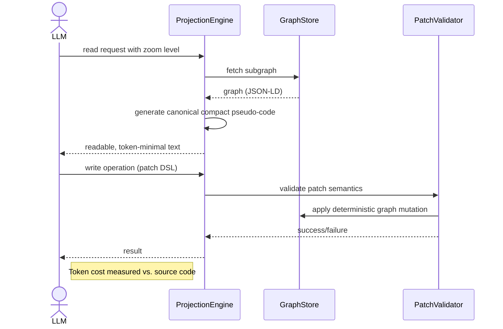

---
tags:
  - duumbi/inbox/enriched
  - duumbi/status/processed
  - duumbi/classification/execution
  - duumbi/value/critical
  - duumbi/importance/high
  - duumbi/complexity/high
duumbi_inbox_enrichment: processed
duumbi_inbox_enrichment_generated_at: 2026-06-25T07:12:31.612Z
---

# token-efficient-graph-representation-for-llm-io

<!-- duumbi-inbox-enrichment:v1 status=processed generated_at=2026-06-25T07:12:31.612Z -->

## Source
- Surface: Manual Obsidian edit
- Vault path: Duumbi/00 Inbox (ToProcess)/2026-06-12 - Token-Efficient Graph Representation for LLM IO.md
- Submitted by: unknown unless explicit in the raw input

## Raw input
> ---
> tags:
>   - duumbi/inbox/roadmap
>   - duumbi/status/to-process
>   - duumbi/classification/execution
>   - duumbi/value/critical
>   - duumbi/importance/high
>   - duumbi/complexity/high
> created: 2026-06-12
> milestone: M1
> source: "[[DUUMBI Future Development Roadmap Map]]"
> related_issues:
>   - hgahub/duumbi#684
> ---
> 
> # Token-Efficient Graph Representation for LLM I/O
> 
> ## Context
> 
> *Proposed addition (Claude, 2026-06-12).* JSON-LD is the right durable format — but it is the wrong LLM wire format: raw graphs cost 3–10× the tokens of equivalent source code (verbose ids, structural ceremony, branch-only control flow). If LLMs read and write raw JSON-LD, the architectural token advantages (reuse, scoped context, small patches — see [[2026-06-12 - Token Economics Benchmark]]) get eaten by representation overhead, and "no programming language" becomes a cost instead of a feature. The fix is a projection layer: **the LLM never sees or emits raw JSON-LD.** The pieces already half-exist: `describe` produces human pseudo-code, GraphPatch is a structured mutation format, and the semantic rewrite engine direction (#684) shrinks mutation output to rule-id + parameters.
> 
> ## Goal
> 
> Token-minimal LLM I/O over the graph: a canonical, deterministic, compact textual projection for reading, and structured patch/rule emission for writing — measured at token parity or better with an equivalent source-text workflow for novel generation, so the architectural levers come on top rather than paying off representation debt.
> 
> ## Subtasks
> 
> 1. Read path: canonical compact projection (describe-grade pseudo-code with stable short node-id anchors) becomes THE format LLMs receive for graph content; deterministic and diff-stable across turns so prompt caching keeps working (cache reads are ~10× cheaper than fresh input — stability is money).
> 2. Zoom levels: module summary → function signature + contract → block → op detail; context packs select the zoom per node, never the whole graph (integrates the Phase 10 context system and the research direction's graph-summaries experiment).
> 3. Write path: token-budgeted patch DSL (target: a small mutation ≤ ~10% of the tokens of regenerating the function as text); rewrite-rule selection + parameters as the preferred mutation output, aligning with #684.
> 4. Id scheme audit: long UUIDs in LLM-facing text burn tokens at every mention — short stable aliases in the projection, mapping layer back to canonical graph ids.
> 5. Round-trip safety: projection → LLM patch → graph application is semantics-preserving and validated by tests; ambiguity in the projection must fail loudly, never silently misapply.
> 6. Measure (feeds the benchmark): read+write token cost on the M1 corpus in projection form vs. raw JSON-LD vs. equivalent Rust source; publish the deltas.
> 7. Orchestrator prompt diet: the mutation system prompt is ~44 KB (~15k tokens) of static text sent on every call (`src/agents/orchestrator.rs`) — restructure into a small core + task-profile-scoped sections (selected by task type/complexity), and measure the per-call saving; cache-stable prefix ordering preserved.
> 
> ## Acceptance criteria
> 
> - No LLM-facing flow (intent, mutation, repair, query answers, MCP tools) serializes raw JSON-LD into prompts.
> - Projection + patch output reaches ≤1× the tokens of an equivalent source-text workflow for novel generation on the benchmark corpus.
> - Projections are deterministic (byte-stable for unchanged graphs) — verified, since prompt-cache hits depend on it.
> 
> ## Links
> 
> - [[DUUMBI Future Development Roadmap Map]]
> - [[2026-06-12 - Token Economics Benchmark]]
> - [[2026-06-12 - Determinism Program for AI Development]]
> - [[2026-06-12 - Agent Substrate MCP First-Class]]

## Interpreted intent

Implement a projection layer so that DUUMBI's LLM I/O never sees raw JSON-LD. The LLM receives a compact, deterministic pseudo-code projection with short stable IDs and zoom levels; writes use a token-budgeted patch DSL and rewrite rule parameters. Also restructure the orchestrator system prompt into modular, cache‑friendly sections. Measure token cost against an equivalent source-code workflow to prove the projection achieves parity or better.

## Developer summary

Create a canonical textual projection for the read path that turns graph content into token‑minimal pseudo‑code (like an enhanced `describe`) with stable short node‑ID aliases and configurable zoom levels. For the write path, design a token‑budgeted patch DSL that expresses small mutations in ~10% of regenerating the function as text, ideally emitting rewrite‑rule ID + parameters (aligns with #684). Alongside this, refactor the orchestrator prompt (~15k tokens) into a slim core + task‑profile‑specific sections that are cache‑prefix‑stable. Guarantee round‑trip safety: projection → LLM response → graph mutation must be semantics‑preserving and fail loudly on ambiguity. Measure saved tokens against a raw JSON‑LD baseline and against equivalent Rust source code to guide further optimization.

## UML overview

## Classification
- Type: execution
- Business value: critical
- Importance: high
- Complexity: high

## Clarifications
### Answered
- Proposal originates from Claude (2026-06-12) as a roadmap addition, NOT a reply to a user request.
- Related issue #684 (semantic rewrite engine direction) is tightly coupled – the write path is expected to emit rewrite-rule selections plus parameters.
- Orchestrator prompt size measured at ~15k tokens / 44 KB (src/agents/orchestrator.rs), confirming the need for a diet.
- JSON-LD is identified as the durable format; the projection is an LLM-only wire format, never stored.
- Prompt-cache stability (10× cheaper reads) depends on deterministic, byte-stable projections.

### Open
- What is the exact structure and syntax of the canonical compact projection? (pseudo-code vs. a textual graph notation)
- Which LLM APIs / providers must the projection support? (tokenization behavior varies)
- How should the projection integrate with the existing `describe` output (already human-readable) and the GraphPatch format?
- Is the token-budgeted patch DSL a new side language or an extension of existing GraphPatch?
- What is an acceptable token-parity threshold (≤1× source text) and how will it be measured?
- Should zoom levels be selected automatically per context pack, or exposed to the LLM?
- Does the orchestrator prompt restructuring include moving large static sections into MCP resources or just scoped sections?
- Who decides when an ID alias is stable enough to be used across turns?
- How will round-trip ambiguity be detected and prevented before it reaches the LLM?

## Relevant DUUMBI context
- Vault: [[DUUMBI Future Development Roadmap Map]] – source roadmap context.
- Vault: [[2026-06-12 - Token Economics Benchmark]] – companion note defining token measurement framework.
- Vault: [[2026-06-12 - Determinism Program for AI Development]] – reinforces deterministic projection requirement.
- Vault: [[2026-06-12 - Agent Substrate MCP First-Class]] – overlaps when external agents use MCP tools that must not emit raw JSON‑LD.
- Source: src/agents/orchestrator.rs – contains the ~15k‑token system prompt that needs restructuring.
- Source: src/graph/describe.rs – existing human‑readable pseudo‑code that can serve as a starting point for the projection.
- Source: src/patch/ – the existing GraphPatch format and application logic to extend.
- Source: AGENTS.md and docs/architecture.md – architecture boundaries and agent interaction rules that restrict how the projection can be injected.

## Related GitHub context

Issue hgahub/duumbi#684 (semantic rewrite engine direction) is directly relevant; the write path should align with its rule‑based emission. No other known GitHub issues or PRs are linked to this specific Inbox note. Triage should verify if any existing PR/pre‑issue touches LLM prompt token efficiency.

## Initial routing recommendation

GitHub issue

## Requested follow-up
- Triage should convert this note into a GitHub issue with a clear scope of the projection layer and promp-diet.
- The issue must explicitly link to #684 and mention the token-measurement benchmark.
- After issue creation, stage for human acceptance and later combined‑spec drafting.

## AI agent instructions
- When creating the GitHub issue, include these acceptance criteria: No LLM‑facing flow emits raw JSON‑LD; projection + patch reaches ≤1× tokens of equivalent source code on the benchmark corpus; projections are deterministic and byte‑stable for unchanged graphs; round‑trip safety is tested.
- The issue body should list subtasks: canonical read projection, zoom level integration, write‑path patch DSL, ID alias scheme, round‑trip validation, measurement harness, and orchestrator prompt restructuring.
- Note risks: byte‑stability is critical for prompt caching; ambiguity in the projection must trigger loud, immediate failure; the patch DSL must be strictly scoped to small mutations (otherwise token savings may vanish).
- Reference existing components that can be adapted: `src/graph/describe`, GraphPatch, and the orchestrator prompt in `src/agents/orchestrator.rs`.
- Do NOT include implementation details or code changes in the generated issue – only the spec and acceptance criteria.

## Scope candidate
### In
- Canonical compact projection for read path (pseudo‑code with short stable IDs)
- Zoom levels (module summary, function+contract, block, op detail) integrated with context packs
- Token‑budgeted patch DSL for write path (target ~10% of re‑generated text)
- Rewrite‑rule selection + parameters as preferred write output (align #684)
- ID scheme audit: short stable aliases in projection, mapping layer back to canonical graph IDs
- Round‑trip safety: semantics‑preserving and validated by tests; ambiguity fails loudly
- Measurement: read+write token cost on M1 corpus vs. raw JSON‑LD vs. equivalent Rust source
- Orchestrator prompt diet: restructure into small core + task‑profile‑scoped sections, cache‑stable, measure savings

### Out
- Changing the JSON‑LD schema or storage format
- Extending the graph store beyond its current capabilities
- Implementing the semantic rewrite engine itself (#684 is separate)
- Modifying LLM API integrations (only the prompt content changes)
- Creating new UI features for LLM interaction
- Any durability guarantees beyond the LLM I/O layer (projection is ephemeral)

## Risks and trade-offs
- Byte‑stable projections are hard to guarantee across graph refactorings; a single unexpected change invalidates the prompt cache
- An ambiguous projection that silently misinterprets the LLM’s intent could silently corrupt the graph
- Token‑budgeted patches may become larger than expected for certain transformations, undermining the business case
- The orchestrator prompt restructuring may inadvertently break prompt‑caching if section order is not carefully preserved
- Measuring token cost against equivalent source code may be misleading if the source‑code baseline is not a true‑to‑life agent workflow
- Zoom levels add complexity; if the LLM cannot reliably use them, token savings may not materialise

## Obsidian tags

#duumbi/inbox/enriched #duumbi/status/processed #duumbi/classification/execution #duumbi/value/critical #duumbi/importance/high #duumbi/complexity/high

## Enrichment result
- Date: 2026-06-25T07:12:31.612Z
- Status: ready for triage
- Canonical duplicate: none verified
- Facts:
- Raw JSON‑LD costs 3–10× the tokens of equivalent source code (claimed in the input, to be verified)
- Existing `describe` output produces human‑readable pseudo‑code, but it is not yet canonical or diff‑stable
- GraphPatch is a structured mutation format; future rewrite‑rule emission (#684) will further shrink write tokens
- Orchestrator system prompt is ~44 KB (~15k tokens) sent on every mutation call
- Prompt caching makes cache reads ~10× cheaper than fresh input; stability directly impacts cost
- The DUUMBI roadmap milestone is M1; the token economics benchmark note exists as a companion measurement strategy
- Assumptions:
- The projection can be made deterministic and byte‑stable for unchanged graphs without performance regressions
- A token‑budgeted patch DSL will consistently stay under 10% of regenerating an equivalent function as text
- Rewrite‑rule + parameter emission (#684) will be ready in time to serve as the primary write path
- The LLM will effectively use zoom levels to request only the needed subgraph
- Restructuring the orchestrator prompt will not degrade LLM instruction‑following quality
- Token‑parity with source‑text workflows is an achievable and meaningful target
- The existing `describe` module can be extended rather than rewritten from scratch
- Recommendations:
- Create a GitHub issue that combines the projection layer and prompt‑diet as one cohesive token‑efficiency epic
- Link the issue directly to #684 and the token‑economics benchmark note
- Prioritise the read‑path projection first, as it is the most common LLM interaction; write path can follow
- Start measurement immediately on the M1 corpus to establish a baseline, so any improvement is quantifiable
- Enforce that the projection fails with a clear error on any ambiguity (no silent fallback)
- Coordinate with the agent‑substrate MCP work (#678?) to ensure MCP tools also use the projection rather than raw JSON‑LD
