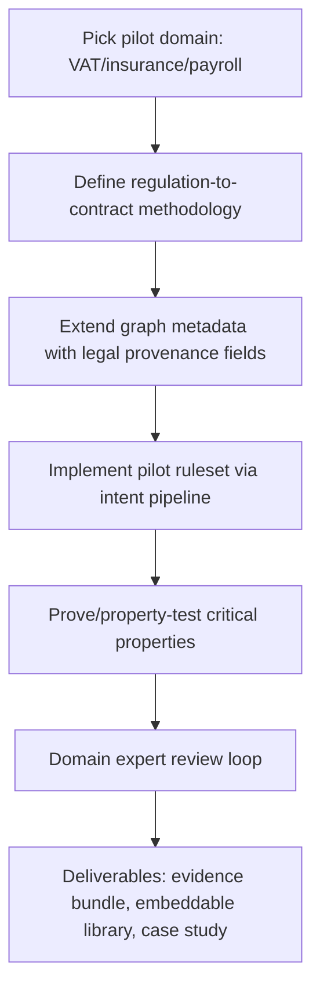

---
tags:
  - duumbi/inbox/enriched
  - duumbi/status/processed
  - duumbi/classification/feature
  - duumbi/value/high
  - duumbi/importance/medium
  - duumbi/complexity/high
duumbi_inbox_enrichment: processed
duumbi_inbox_enrichment_generated_at: 2026-06-28T18:25:32.662Z
---

# Verified Business Rules Vertical (Legal / Financial)

<!-- duumbi-inbox-enrichment:v1 status=processed generated_at=2026-06-28T18:25:32.662Z -->

## Source
- Surface: Manual Obsidian edit
- Vault path: Duumbi/00 Inbox (ToProcess)/2026-06-12 - Verified Business Rules Vertical.md
- Submitted by: unknown unless explicit in the raw input

## Raw input
> ---
> tags:
>   - duumbi/inbox/roadmap
>   - duumbi/status/to-process
>   - duumbi/classification/execution
>   - duumbi/value/high
>   - duumbi/importance/medium
>   - duumbi/complexity/high
> created: 2026-06-12
> milestone: M6
> source: "[[DUUMBI Future Development Roadmap Map]]"
> ---
> 
> # Verified Business Rules Vertical (Legal / Financial)
> 
> ## Context
> 
> *Proposed addition (Claude, 2026-06-12).* Legal, tax, insurance, and payroll logic is a natural-language specification (statute, policy, contract) that must be implemented provably correctly, audited for years, and survive both regulation changes and technology churn. Every DUUMBI strength maps onto this 1:1: intent provenance (each function linked to the exact regulation paragraph that mandates it), contracts (legal conditions become pre/postconditions), determinism + append-only ledger (audit), formal verification (the rule provably does what the law says), and **no human programming language** — the graph is self-describing data, immune to language fashion over a statute's decade-long life. This is the flagship vertical that makes "mathematically proven applications for special engineering and legal domains" concrete, and the v1.0 launch story candidate.
> 
> ## Goal
> 
> A pilot regulated ruleset implemented end-to-end in DUUMBI: every function carries a citation to its legal source, key properties are proven or property-tested, the evidence bundle is exportable, and a domain expert signs off — published as the reference case study.
> 
> ## Subtasks
> 
> 1. Pick the pilot domain: small, closed, high-value ruleset — candidates: an EU/Hungarian VAT rate determination subset, an insurance claim eligibility ruleset, or payroll contribution calculation. Criteria: bounded inputs, published official test cases, access to a domain expert.
> 2. Regulation-to-contract methodology: how a statute paragraph becomes an intent + pre/postconditions; document the workflow (this is the reusable product, not just the pilot).
> 3. Provenance fields: extend intent/graph metadata with legal-source citations (document id, section, version, effective date); regulation version changes flag affected graph regions — "what code does §12(3) govern?" becomes a query.
> 4. Implement the pilot via the intent pipeline; prove/property-test the critical properties (e.g. rate bounds, exhaustiveness of case analysis, monotonicity where the law implies it).
> 5. Expert review loop: domain expert validates the contracts against the law (the proofs guarantee code matches contracts; the expert guarantees contracts match the law — state this division of trust explicitly).
> 6. Deliverables: evidence bundle ([[2026-06-12 - Certification Evidence Export]]), embeddable library ([[2026-06-12 - Verified Module Export and Embedding]]) so an existing billing/HR system can call the verified rules, and a public case study for the v1.0 launch.
> 
> ## Acceptance criteria
> 
> - Pilot ruleset passes the official/published test cases; key properties proven or property-tested with evidence.
> - Every function answers "which legal source mandates you?" via query.
> - External domain expert validates contract-to-law fidelity in writing; case study published.
> 
> ## Links
> 
> - [[DUUMBI Future Development Roadmap Map]]
> - [[2026-06-12 - Verified Module Export and Embedding]]
> - [[2026-06-12 - Certification Evidence Export]]
> - [[2026-06-12 - Formal Verification VCGen MVP]]

## Interpreted intent

Make DUUMBI the flagship implementation platform for legally-bound rules (tax, insurance, payroll) by building a pilot that demonstrates provable correctness, regulatory provenance, audit evidence export, and domain expert validation — positioning DUUMBI for v1.0 launch with a high-value vertical.

## Developer summary

Implement an end-to-end pilot of a regulated ruleset on DUUMBI. Every function must cite its legal source, key properties must be formally verified or property-tested, the evidence bundle must be exportable for audit, and a domain expert must sign off on contract-to-law fidelity. The pilot will be published as the DUUMBI v1.0 launch case study. Sub-tasks include: (1) picking a small, bounded, high-value domain (e.g., VAT rate determination, insurance claim eligibility, payroll contribution), (2) defining a regulation-to-contract methodology, (3) extending graph metadata with legal provenance fields, (4) implementing the rules via the intent pipeline, (5) running expert review, and (6) producing deliverables: evidence bundle, embeddable library, and published case study.

## UML overview

## Classification
- Type: feature
- Business value: high
- Importance: medium
- Complexity: high

## Clarifications
### Answered
- The note defines six subtasks linking to evidence export, module export, and VCGen MVP.
- The acceptance criteria require official test cases, source provenance query, and domain expert validation.

### Open
- Which exact legal domain will be piloted? (VAT, insurance, payroll)
- Who is the committed domain expert?
- How will regulation version management be implemented in the graph?
- What is the timeline relative to other M6 milestones (VCGen MVP, evidence export)?
- Are there published official test cases for the chosen domain?

## Relevant DUUMBI context
- DUUMBI Future Development Roadmap Map – positions this as a vertical
- 2026-06-12 - Certification Evidence Export – evidence bundle format prerequisite
- 2026-06-12 - Verified Module Export and Embedding – embeddable library prerequisite
- 2026-06-12 - Formal Verification VCGen MVP – core verification engine prerequisite
- DUUMBI - PRD – product thesis around intent, evidence, and query

## Related GitHub context

No related GitHub state known; triage should verify later.

## Initial routing recommendation

GitHub issue

## Requested follow-up
- Convert to GitHub issue with product spec, scope, and acceptance criteria.
- Identify domain expert and potential pilot legal sources.
- Align with VCGen MVP, evidence export, and module export roadmap items.

## AI agent instructions
- Create a GitHub issue in hgahub/duumbi labeled 'feature' and 'M6'.
- Include the subtask list and acceptance criteria from the note.
- Link to the VCGen MVP, evidence export, and module export issues.
- Add a question to clarify the pilot domain choice.
- Set status to 'Needs Human Acceptance' for Stage 5 review.

## Scope candidate
### In
- One pilot legal/financial ruleset with bounded inputs and known test cases
- Provenance metadata: legal source citations per function/block
- Formal verification or property testing of critical rules
- Expert validation of contract-to-law correctness
- Exportable audit evidence bundle
- Embeddable verified library for existing systems
- Published case study

### Out
- Full regulation management system
- Support for all legal domains
- Replacing human legal interpretation
- Building a separate SaaS legal compliance product
- Consumer-facing tax preparation tool

## Risks and trade-offs
- Heavy dependency on VCGen MVP and formal verification research that may delay the pilot
- Difficulty finding and committing a domain expert with deep regulatory knowledge
- Regulation changes during development may invalidate the pilot
- Proving all intended properties may be harder than anticipated (explosion of verification conditions)
- Scope creep: the pilot could expand beyond a bounded demonstration

## Obsidian tags

#duumbi/inbox/enriched #duumbi/status/processed #duumbi/classification/feature #duumbi/value/high #duumbi/importance/medium #duumbi/complexity/high

## Enrichment result
- Date: 2026-06-28T18:25:32.662Z
- Status: ready for triage
- Canonical duplicate: none verified
- Facts:
- The note proposes a pilot with six subtasks and links to existing roadmap items.
- It positions this as the flagship vertical and a candidate for v1.0 launch story.
- DUUMBI's architecture provides intent provenance, contracts, determinism, formal verification, and no human programming language – all 1:1 strengths for regulated rules.
- The acceptance criteria require full provenance traceability, expert signoff, and published case study.
- Assumptions:
- A suitable small, closed, high-value ruleset exists with published official test cases.
- The regulation-to-contract methodology can be documented as a reusable product.
- An external domain expert will be available and willing to validate in writing.
- DUUMBI's current graph structure can accommodate legal-source citations without major redesign.
- The VCGen MVP will be sufficiently mature to support pilot-level verification needs.
- Recommendations:
- Route to GitHub issue and tag as M6 milestone.
- Prioritize scoping: choose the smallest possible ruleset first.
- Coordinate with the Formal Verification VCGen MVP and evidence export workstreams.
- Use the pilot to inform a reusable regulation-to-contract product playbook.
- Plan for a public case study even if the pilot is modest; the narrative matters as much as the code.
