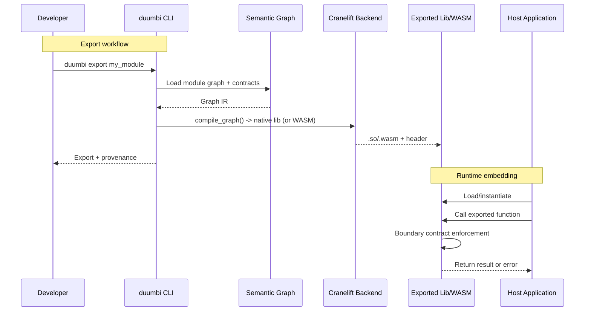

---
tags:
  - duumbi/inbox/enriched
  - duumbi/status/processed
  - duumbi/classification/execution
  - duumbi/value/critical
  - duumbi/importance/high
  - duumbi/complexity/high
duumbi_inbox_enrichment: processed
duumbi_inbox_enrichment_generated_at: 2026-06-29T07:43:21.988Z
---

# Verified Module Export and Embedding

<!-- duumbi-inbox-enrichment:v1 status=processed generated_at=2026-06-29T07:43:21.988Z -->

## Source
- Surface: Manual Obsidian edit
- Vault path: Duumbi/00 Inbox (ToProcess)/2026-06-12 - Verified Module Export and Embedding.md
- Submitted by: unknown unless explicit in the raw input

## Raw input
> ---
> tags:
>   - duumbi/inbox/roadmap
>   - duumbi/status/to-process
>   - duumbi/classification/execution
>   - duumbi/value/critical
>   - duumbi/importance/high
>   - duumbi/complexity/high
> created: 2026-06-12
> milestone: M5
> source: "[[DUUMBI Future Development Roadmap Map]]"
> ---
> 
> # Verified Module Export and Embedding
> 
> ## Context
> 
> *Proposed addition (Claude, 2026-06-12).* Nobody rewrites a working system in a new paradigm — adoption dies there. The realistic path: build the **critical 5%** in DUUMBI (the function where money, safety, or legal liability lives — interest calculation, dosage limits, control thresholds, contract clauses) and embed it in existing software as a library. Cranelift already emits native code; what's missing is a stable boundary. This turns DUUMBI from "a new way to build programs" into "a way to put a mathematically verified kernel inside the software you already have" — the single strongest adoption wedge for the verification story, and how I would introduce DUUMBI into any existing codebase I work on.
> 
> ## Goal
> 
> `duumbi export` packages a module as an embeddable artifact — C ABI static/dynamic library with generated headers, and a WASM build — with its contracts enforced or documented at the boundary, callable from Rust, C, JS/TS, Python hosts.
> 
> ## Subtasks
> 
> 1. C ABI export: stable `extern "C"` surface generated from exported function signatures (i64/f64/bool/string/array marshalling rules); static + dynamic library output; generated `.h` header with contract documentation in comments.
> 2. WASM target: compile the same graph to WASM (Cranelift supports it) for browser/edge/plugin embedding; JS/TS binding package.
> 3. Boundary contract enforcement: optional runtime precondition checks at the FFI boundary (host inputs are untrusted — proofs hold only inside the contract domain); document the trust model precisely.
> 4. Host bindings: idiomatic wrapper generation — Rust crate first, then npm package; Python wheel as stretch.
> 5. Artifact provenance: exported libraries carry the graph snapshot id, semantic hash, and verification status — checkable against the registry ([[2026-06-12 - Registry Graph Database Evolution]]).
> 6. Reference integrations: a verified pricing/limit function called from (a) a Rust service, (b) a TypeScript app via WASM — shipped as examples and docs.
> 7. Versioning/compat policy for exported ABI across DUUMBI releases.
> 
> ## Acceptance criteria
> 
> - A verified stdlib-style function is callable from a Rust host and a browser JS app, with published, checksummed artifacts.
> - Boundary violations (precondition breach from host) fail safely and observably, per the documented trust model.
> - Export artifacts are reproducible from the graph snapshot (bit-for-bit or attested).
> 
> ## Links
> 
> - [[DUUMBI Future Development Roadmap Map]]
> - [[2026-06-12 - Formal Verification VCGen MVP]]
> - [[2026-06-12 - Certification Evidence Export]]
> - [[2026-06-12 - Verified Business Rules Vertical]]

## Interpreted intent

Package verified DUUMBI modules as embeddable artifacts (C ABI native library + header, and WASM) with boundary contract enforcement and host-language bindings, enabling integration of safety-critical DUUMBI logic into existing software.

## Developer summary

Implement `duumbi export` to produce embeddable libraries from verified modules: C ABI static/dynamic lib with generated header, and WASM target. Enforce contracts at the FFI boundary (host inputs are untrusted). Generate idiomatic Rust, JS/TS, and optionally Python host bindings. Include artifact provenance (graph snapshot id, semantic hash, verification status). Provide reference integration: a verified pricing/limit function callable from Rust and browser JS. Define ABI versioning and compat policy.

## UML overview

## Classification
- Type: execution
- Business value: critical
- Importance: high
- Complexity: high

## Clarifications
### Answered
- The note clearly defines subtasks, acceptance criteria, and output artifacts (C ABI lib, WASM).
- Boundary enforcement is to be optional with a documented trust model.
- Provenance should include graph snapshot id, semantic hash, verification status.
- Reference integrations should target Rust and TypeScript/WASM.

### Open
- Which export target is the highest priority: C ABI native library or WASM?
- Should boundary enforcement be mandatory by default or opt-in?
- What host bindings should be auto-generated vs. hand-written?
- Which specific verified function should serve as the reference integration example?
- How will the ABI versioning and compatibility guarantees be defined across DUUMBI releases?
- Should the export command be integrated into `duumbi build` or be a separate command?

## Relevant DUUMBI context
- Duumbi/00 Inbox (ToProcess)/2026-06-12 - Verified Module Export and Embedding.md (the note itself)
- Duumbi/01 Atlas (Knowledge Base)/Maps (Overviews)/DUUMBI Future Development Roadmap Map.md (roadmap context)
- Duumbi/00 Inbox (ToProcess)/2026-06-12 - Formal Verification VCGen MVP.md (contract enforcement dependency)
- Duumbi/00 Inbox (ToProcess)/2026-06-12 - Certification Evidence Export.md (provenance/verification evidence)
- Duumbi/00 Inbox (ToProcess)/2026-06-12 - Verified Business Rules Vertical.md (reference integration candidate)
- src/compiler/mod.rs (CodegenBackend trait; Cranelift backend entry point)
- src/types.rs (type system for graph representation)
- runtime/duumbi_runtime.c (C ABI shims for memory and I/O)
- src/graph/mod.rs (semantic graph IR)
- AGENTS.md (build system and coding conventions)

## Related GitHub context

triage should verify later

## Initial routing recommendation

GitHub issue

## Requested follow-up
- Create a parent GitHub issue for 'Verified Module Export and Embedding' with subtasks
- Produce a technical spec for the export pipeline covering ABI stability and host bindings
- Determine priority and phasing between C ABI and WASM targets
- Define ABI versioning and compatibility policy

## AI agent instructions
- Convert the 7 subtasks into individual GitHub issues with acceptance criteria
- Reference affected source areas: src/compiler/ for codegen, src/graph/ for provenance, runtime/ for C ABI
- Include the Mermaid diagram in the GitHub issue description
- Specify that boundary enforcement should be a configurable option, not mandatory
- Note dependency on formal verification contracts (VCGen) for boundary checking
- Provenance metadata must embed graph snapshot ID and semantic hash

## Scope candidate
### In
- C ABI export: static/dynamic library with generated `.h` header
- WASM target compilation (Cranelift WASM backend)
- Boundary contract enforcement: optional precondition checks at FFI boundary
- Host bindings: Rust crate, npm package, Python wheel (stretch goal)
- Artifact provenance: snapshot ID, semantic hash, verification status
- Reference integration: verified function callable from Rust and TypeScript
- Versioning and compatibility policy for exported ABI

### Out
- Adding new compiler backends beyond Cranelift
- Supporting host languages beyond Rust, JS/TS, Python in initial delivery
- GUI or studio integration for export
- Fully automated AI-based host binding generation
- Performance optimization beyond boundary enforcement checks

## Risks and trade-offs
- Stable ABI may constrain future evolution of the internal graph representation or type system
- Boundary enforcement adds runtime overhead for every cross-boundary call
- WASM target may not fully support all DUUMBI types (e.g., ownership, struct passing)
- Cranelift WASM backend maturity and compatibility
- Host binding generation creates an ongoing maintenance burden
- ABI versioning mistakes could break existing integrations when DUUMBI itself is updated

## Obsidian tags

#duumbi/inbox/enriched #duumbi/status/processed #duumbi/classification/execution #duumbi/value/critical #duumbi/importance/high #duumbi/complexity/high

## Enrichment result
- Date: 2026-06-29T07:43:21.988Z
- Status: ready for triage
- Canonical duplicate: none verified
- Facts:
- Cranelift already supports both native object file emission and WASM compilation
- runtime/duumbi_runtime.c provides C ABI shims for core operations (print, alloc, string functions)
- The semantic graph can carry contracts (pre/postconditions) for verification
- The registry already stores graph snapshots and semantic hashes, suitable for provenance
- The note explicitly defines acceptance criteria for reproducibility and boundary safety
- Assumptions:
- Cranelift WASM backend can support the full DUUMBI instruction set needed for realistic modules
- Host binding generation can be automated or maintained with acceptable effort
- Boundary enforcement can be implemented as a configurable runtime check without major compiler changes
- The `duumbi` CLI can be extended with an `export` subcommand that invokes the compiler
- Target platform support includes Linux, macOS (native), and WebAssembly (via WASM)
- Users will accept a C ABI as the lowest common denominator for embedding
- Recommendations:
- Prioritize C ABI export as the first deliverable, followed by WASM
- Implement boundary enforcement as an opt-in flag (e.g., `--enforce-contracts`)
- Version the ABI with a scheme tied to DUUMBI's semantic version (e.g., major ABI changes only on major DUUMBI bumps)
- Use the Verified Business Rules Vertical (interest calculation, control thresholds) as the reference integration example
- Produce a technical spec that defines the ABI contract, marshalling rules, and host binding conventions before starting implementation
