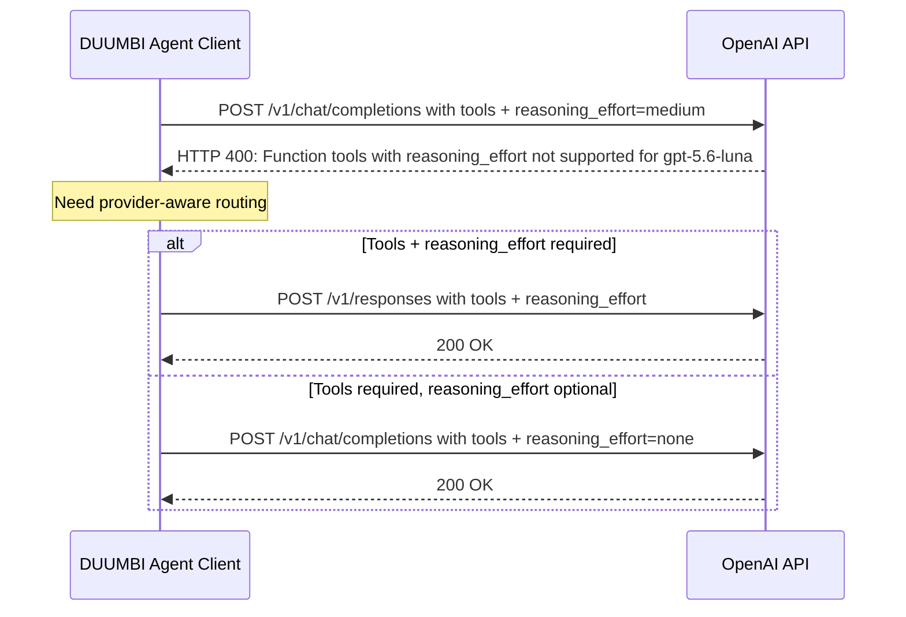

# Provider Models and Reasoning Effort Support

## Source
- Conversation: Duumbi Lead Grok Bot chat (2026-09-12); explicit duumbi-grok-intake capture
- Evidence run referenced by submitter as live validation tied to "#780" (provider HTTP 400)

## Raw input
Duumbi does not support newer models or effort usage. Concrete failure:

"The live #780 validation used OPENAI_API_KEY with gpt-5.6-luna. DUUMBI sent the current OpenAI Chat Completions request with function tools and reasoning enabled. The provider returned HTTP 400 before graph generation:

Function tools with reasoning_effort are not supported for gpt-5.6-luna in /v1/chat/completions.
To use function tools, use /v1/responses or set reasoning_effort to 'none'."

Support available effort levels for:
- OpenAI: GPT-5.6 Luna, GPT-5.6 Terra, GPT-5.6 Sol, GPT-6 Astra
- Anthropic: Claude Sonnet 5, Claude Opus 5, Claude Haiku 4.5, Claude Fable 5.1
- xAI: Grok 4.6, Grok Build 0.1

## Problem
DUUMBI's OpenAI Chat Completions client can send function tools together with non-none reasoning_effort. For models such as gpt-5.6-luna, the provider rejects that combination on /v1/chat/completions (HTTP 400) before graph generation. Newer catalog models and provider-native effort controls are therefore unusable or only usable if effort is forced off or the wrong API surface is used.

## Affected user
Owners and operators running live provider-backed intent/mutation/bench validation with current OpenAI (and planned Anthropic/xAI) models that expose reasoning effort.

## Desired outcome
DUUMBI can call the listed OpenAI, Anthropic, and xAI models with the effort levels those providers actually support, without HTTP 400 when tools and reasoning are both required—for example by using /v1/responses (or equivalent) when tools plus reasoning_effort are needed, or by mapping effort correctly per model and API.

## Out of scope
- User-facing session/intent --effort product UX already sketched in the older Effort Levels note (cost/team/verification levers), except where it must map onto provider reasoning_effort / model tier.
- Changing Stage 7/9 workflow gates or unrelated bench process-evidence work in GitHub #780 (HTTP/SQLite process evidence), unless that run is only the reproduction vehicle.
- Inventing unsupported effort values beyond what each provider documents.

## Interpreted intent
Make provider integrations (starting with OpenAI Chat Completions versus Responses) compatible with current reasoning-capable models and function/tool use, and extend model/effort support matrices for the named OpenAI, Anthropic, and xAI models so live validation and authoring can use them.

## Classification
feature / bug (provider API compatibility) / execution

## Related context
- Related (not duplicate): Duumbi/05 Archive/Processed Inbox/2026-06-12 - Effort Levels and Cost Control.md — user-facing effort/cost levers, not Chat Completions versus Responses plus tools.
- Related (not duplicate): Duumbi/00 Inbox (ToProcess)/2026-06-12 - Model Capability Advisor and Task Routing.md — catalog/routing advisor; does not fix the HTTP 400 tools+reasoning_effort path.
- GitHub #780 (test(bench): add bounded HTTP/SQLite/JSON process evidence) is a closed bench process-evidence issue; submitter cited a live validation using that label/context with gpt-5.6-luna — treat as reproduction evidence, not as an exact duplicate ticket.
- Not inspected: full src/agents OpenAI client implementation beyond the reported error text.

## Open questions
- Should OpenAI tool+reasoning calls move primarily to /v1/responses, or stay on Chat Completions with reasoning_effort=none when tools are present (degraded mode)?
- Exact supported effort enum per listed model (provider docs) for OpenAI / Anthropic / xAI?
- Ship OpenAI path first, then Anthropic and xAI in the same change set, or phased?

## Requested follow-up
Stage 3b prepare then Stage 4 triage for execution (provider client + model catalog / effort mapping). Do not implement from this capture alone.

## Notes
- Facts: Provider error explicitly forbids function tools with reasoning_effort on gpt-5.6-luna via /v1/chat/completions; suggests /v1/responses or reasoning_effort=none.
- Assumptions: Listed model names are the desired near-term catalog set; "effort" here means provider reasoning effort as well as usable model selection.
- Recommendations: Prefer Responses (or provider-correct surface) when tools and reasoning are both required; keep a documented matrix of model to allowed effort to API surface; link but do not merge with the older Effort Levels product note without triage.

<!-- duumbi-enrichment:start -->
## Stage 3b preparation
- Prepared title: Provider Models and Reasoning Effort Support
- Blocking clarification reason: none

## Interpreted intent

Make DUUMBI provider integrations compatible with current reasoning-capable models and function/tool use, starting with OpenAI Chat Completions versus Responses, and extend model/effort support matrices for the named OpenAI, Anthropic, and xAI models so live validation and authoring can use them without HTTP 400 errors.

## Developer summary

DUUMBI's OpenAI Chat Completions client can send function tools together with non-none reasoning_effort. For models such as gpt-5.6-luna, the provider rejects that combination on /v1/chat/completions with HTTP 400 before graph generation. The fix requires provider-aware API surface selection (e.g., use /v1/responses when tools and reasoning_effort are both required, or force reasoning_effort=none on Chat Completions when tools are present) and a documented model-to-effort-to-API-surface matrix for the listed OpenAI, Anthropic, and xAI models. This is a provider client and model catalog/effort mapping execution task, not a product UX change.

## UML overview

## Classification
- Type: feature
- Business value: high
- Importance: high
- Complexity: high

## Clarifications
### Answered
- The provider error explicitly forbids function tools with reasoning_effort on gpt-5.6-luna via /v1/chat/completions; it suggests /v1/responses or reasoning_effort=none.
- The desired outcome is to call the listed OpenAI, Anthropic, and xAI models with the effort levels those providers actually support, without HTTP 400 when tools and reasoning are both required.
- The older Effort Levels note is related but not a duplicate; it covers user-facing effort/cost levers, not Chat Completions versus Responses plus tools.
- GitHub #780 is a closed bench process-evidence issue; the live validation using gpt-5.6-luna is reproduction evidence, not an exact duplicate ticket.

### Open
- Should OpenAI tool+reasoning calls move primarily to /v1/responses, or stay on Chat Completions with reasoning_effort=none when tools are present (degraded mode)?
- Exact supported effort enum per listed model (provider docs) for OpenAI / Anthropic / xAI?
- Ship OpenAI path first, then Anthropic and xAI in the same change set, or phased?

## Relevant DUUMBI context
- src/agents/mod.rs — defines LlmProvider trait and provider modules (openai, anthropic, grok, etc.) where API surface selection and effort mapping would be implemented.
- src/agents/openai.rs — likely contains the OpenAI Chat Completions client that sends tools and reasoning_effort; needs inspection for exact request construction.
- src/agents/model_catalog.rs and model_catalog_publisher.rs — existing model catalog infrastructure where model-to-effort-to-API-surface matrix could be stored or published.
- Duumbi/05 Archive/Processed Inbox/2026-06-01 - Provider Model Catalog Refresh.md — related prior work on refreshing provider model catalogs; may inform how to keep the matrix current.
- Duumbi/05 Archive/Processed Inbox/2026-06-12 - Effort Levels and Cost Control.md — related user-facing effort/cost levers; not a duplicate but may share model tier concepts.

## Related GitHub context

GitHub #780 (test(bench): add bounded HTTP/SQLite/JSON process evidence) is a closed bench process-evidence issue. The submitter cited a live validation using that label/context with gpt-5.6-luna; treat as reproduction evidence, not as an exact duplicate ticket. Triage should verify current GitHub state for any existing provider API compatibility issues.

## Initial routing recommendation

GitHub issue

## Requested follow-up
- Stage 3b prepare then Stage 4 triage for execution (provider client + model catalog / effort mapping).
- Do not implement from this capture alone.

## AI agent instructions
- Create a GitHub issue with a clear title like 'Support reasoning effort and tools across OpenAI, Anthropic, and xAI models'.
- In the issue body, include the exact provider error message and the affected models list.
- Reference the relevant source files: src/agents/openai.rs, src/agents/mod.rs, src/agents/model_catalog.rs.
- Specify acceptance criteria: DUUMBI can call the listed models with tools and reasoning_effort without HTTP 400, using /v1/responses or reasoning_effort=none as appropriate.
- Ask for a technical plan that includes a model-to-effort-to-API-surface matrix and phased rollout (OpenAI first, then Anthropic/xAI).
- Link related notes: Effort Levels and Cost Control, Provider Model Catalog Refresh, and GitHub #780 as reproduction evidence.
- Do not start implementation; route to Needs Human Acceptance for Stage 5 decision.

## Scope candidate
### In
- OpenAI Chat Completions vs Responses API surface selection when tools and reasoning_effort are both required.
- Mapping supported effort levels per model for OpenAI (GPT-5.6 Luna, Terra, Sol, GPT-6 Astra), Anthropic (Claude Sonnet 5, Opus 5, Haiku 4.5, Fable 5.1), and xAI (Grok 4.6, Grok Build 0.1).
- Preventing HTTP 400 errors before graph generation.
- Documenting the model-to-effort-to-API-surface matrix.

### Out
- User-facing session/intent --effort product UX already sketched in the older Effort Levels note, except where it must map onto provider reasoning_effort / model tier.
- Changing Stage 7/9 workflow gates or unrelated bench process-evidence work in GitHub #780.
- Inventing unsupported effort values beyond what each provider documents.

## Risks and trade-offs
- Choosing the wrong API surface (Chat Completions vs Responses) could break existing tool-calling behavior for other models.
- Provider documentation for effort enums may be incomplete or change; the matrix must be maintainable.
- Phased rollout may leave Anthropic/xAI users with the same HTTP 400 issue temporarily.
- Forcing reasoning_effort=none on Chat Completions degrades reasoning quality for models that support it on Responses.

## Obsidian tags

#duumbi/inbox/enriched #duumbi/status/processed #duumbi/classification/feature #duumbi/value/high #duumbi/importance/high #duumbi/complexity/high

## Enrichment result
- Date: 2026-09-12T21:01:09.706Z
- Status: ready for triage
- Canonical duplicate: none verified
- Facts:
- Provider error explicitly forbids function tools with reasoning_effort on gpt-5.6-luna via /v1/chat/completions.
- The error suggests /v1/responses or reasoning_effort=none as alternatives.
- DUUMBI's OpenAI Chat Completions client can send function tools together with non-none reasoning_effort.
- The listed models are the desired near-term catalog set per the submitter.
- Assumptions:
- Listed model names are the desired near-term catalog set.
- 'Effort' here means provider reasoning effort as well as usable model selection.
- The OpenAI client implementation is in src/agents/openai.rs and can be modified to select API surface based on tools and effort.
- Recommendations:
- Prefer Responses (or provider-correct surface) when tools and reasoning are both required.
- Keep a documented matrix of model to allowed effort to API surface.
- Link but do not merge with the older Effort Levels product note without triage.
- Ship OpenAI path first, then Anthropic and xAI in the same change set or phased, depending on triage decision.

<!-- duumbi-enrichment:end -->
