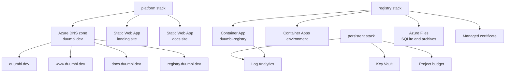

---
tags:
  - project/duumbi
  - concept/infrastructure
  - concept/architecture
status: active
source: repository-inspection
created: 2026-05-07
updated: 2026-05-07
---

# DUUMBI Azure Infrastructure Model

## Summary

DUUMBI infrastructure is managed in `duumbi-infra` with Pulumi TypeScript stacks for persistent shared resources, platform DNS/static sites, and registry runtime hosting.

## Why it matters

Infrastructure choices define operational risk: secrets, DNS, TLS, logging, cost limits, persistence, and container hosting must be managed as code and kept separate from product documentation.

## DUUMBI usage

- Keep infrastructure state and deployment mechanics in Pulumi, not Obsidian.
- Store durable architecture context and operational rationale in Obsidian.
- Never write secrets, tokens, or raw `.env` values into the vault.
- Treat DNS, certs, persistence, and budgets as architecture-level concerns because they affect reliability and maintainability.

## Sources

- [duumbi-infra](https://github.com/hgahub/duumbi-infra)

## Related

- [[DUUMBI Repository Map]]
- [[Static Website and Docs Publishing]]
- [[DUUMBI Registry Architecture]]
- [[Visual Documentation in Obsidian]]
