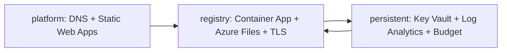

---
tags:
  - project/duumbi
  - concept/infrastructure
  - concept/visual-documentation
status: active
source: repository-inspection
created: 2026-05-16
updated: 2026-05-16
---

# DUUMBI Infrastructure Infographic

![[duumbi-infrastructure-infographic.png|DUUMBI infrastructure infographic]]

## Agent planning cue

Use this as a fast topology check before planning infrastructure, docs publishing, registry, DNS, logging, secrets, or cost-control work. Source of truth remains the `duumbi-infra` Pulumi stacks; do not infer secrets or live deployment state from the image.

## Related

- [[DUUMBI Azure Infrastructure Model]]
- [[DUUMBI Technical Architecture Map]]
- [[Visual Documentation in Obsidian]]
