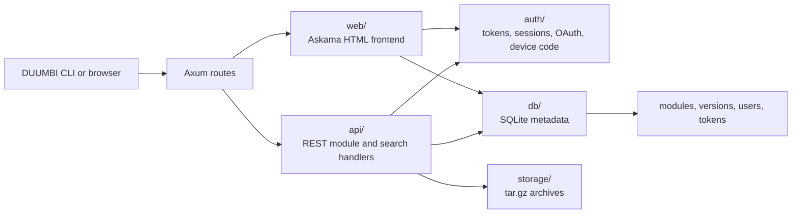

---
tags:
  - project/duumbi
  - concept/architecture
  - concept/registry
status: active
source: repository-inspection
created: 2026-05-07
updated: 2026-05-07
---

# DUUMBI Registry Architecture

## Summary

The DUUMBI registry is a Rust/Axum service that stores, serves, and indexes `.tar.gz` module packages through a REST API and a server-rendered HTML frontend.

## Why it matters

The registry is the distribution boundary for DUUMBI modules. Its API, authentication, persistence, and package storage rules affect CLI behavior, self-hosting, and the public registry at `registry.duumbi.dev`.

## DUUMBI usage

- Keep public module metadata and downloads unauthenticated unless product requirements change.
- Require bearer-token authentication for publish and yank operations.
- Keep archive bytes on the filesystem and module metadata in SQLite.
- Use integration tests against embedded Axum servers and in-memory SQLite for behavior evidence.

## Sources

- [duumbi-registry](https://github.com/hgahub/duumbi-registry)
- Local source: `/Users/heizergabor/space/hgahub/duumbi-registry/README.md`
- Local source: `/Users/heizergabor/space/hgahub/duumbi-registry/AGENTS.md`

## Related

- [[Registry Authentication Model]]
- [[Module Package Lifecycle]]
- [[DUUMBI Azure Infrastructure Model]]
- [[DUUMBI Repository Map]]
