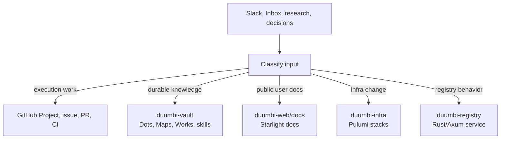

---
tags:
  - project/duumbi
  - concept/repository-architecture
status: active
source: repository-inspection
created: 2026-05-07
updated: 2026-05-07
---

# DUUMBI Repository Responsibility Model

## Summary

DUUMBI's repositories should have clear responsibilities: vault knowledge, infrastructure, registry service, public website, and public documentation should not duplicate each other's source of truth.

## Why it matters

Agentic work becomes fragile when status, architecture, docs, and implementation evidence are copied across repositories. Clear repository ownership makes changes easier to route, review, and keep current.

## DUUMBI usage

- Route current work state to GitHub, not Obsidian.
- Route durable rationale and architecture to `duumbi-vault`.
- Route user-facing instructions and reference material to `duumbi-web/docs`.
- Route deployable Azure infrastructure to `duumbi-infra`.
- Route package registry behavior to `duumbi-registry`.

## Sources

- [duumbi-vault](https://github.com/hgahub/duumbi-vault)
- [duumbi-infra](https://github.com/hgahub/duumbi-infra)
- [duumbi-registry](https://github.com/hgahub/duumbi-registry)
- [duumbi-web](https://github.com/hgahub/duumbi-web)
- Local source: `/Users/heizergabor/space/hgahub/duumbi-vault/.agents/skills/duumbi-obsidian-capture/SKILL.md`

## Related

- [[DUUMBI Repository Map]]
- [[GitHub Project as Execution Source of Truth]]
- [[Obsidian Vault as Agent Knowledge Substrate]]
- [[AGENTS.md as Agent Contract]]
