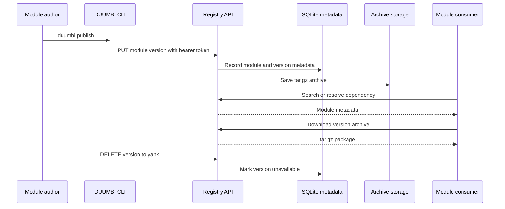

---
tags:
  - project/duumbi
  - concept/registry
  - concept/module-system
status: active
source: repository-inspection
created: 2026-05-07
updated: 2026-05-07
---

# Module Package Lifecycle

## Summary

A DUUMBI module package moves through publish, metadata indexing, search, download, dependency resolution, and optional yanking.

## Why it matters

The lifecycle defines what developers can rely on when sharing modules. It also determines where validation, auth, versioning, and storage behavior must be tested.

## DUUMBI usage

- Publishing and yanking require authentication.
- Searching and downloading are public by default.
- Version metadata and archive storage must stay consistent.
- User-facing lifecycle docs belong in `duumbi-web/docs`; design rationale belongs in Obsidian.

## Sources

- [duumbi-registry](https://github.com/hgahub/duumbi-registry)
- Local source: `/Users/heizergabor/space/hgahub/duumbi-registry/README.md`
- Local source: `/Users/heizergabor/space/hgahub/duumbi-web/docs/src/content/docs/registry/usage.md`

## Related

- [[DUUMBI Registry Architecture]]
- [[Registry Authentication Model]]
- [[Graph Repository Architecture]]
- [[Public Docs as Product Interface]]
