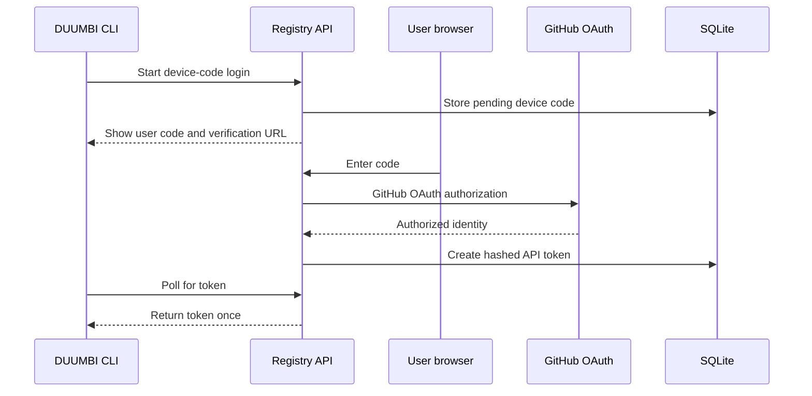

---
tags:
  - project/duumbi
  - concept/authentication
  - concept/registry
status: active
source: repository-inspection
created: 2026-05-07
updated: 2026-05-07
---

# Registry Authentication Model

## Summary

The DUUMBI registry supports local username/password registration for self-hosted registries and GitHub OAuth plus device-code CLI login for the public registry model.

## Why it matters

Authentication is the trust boundary for publishing and yanking modules. The registry must make token issuance traceable, protect raw tokens, and keep CLI login usable without weakening package publishing controls.

## DUUMBI usage

- `local_password` is the default self-hosted mode.
- `github_oauth` is the intended public registry mode.
- Raw API tokens are shown once and stored hashed.
- CLI credentials belong in the user's DUUMBI credentials store, not the vault.

## Sources

- [duumbi-registry](https://github.com/hgahub/duumbi-registry)
- Local source: `/Users/heizergabor/space/hgahub/duumbi-registry/README.md`
- Local source: `/Users/heizergabor/space/hgahub/duumbi-registry/AGENTS.md`

## Related

- [[DUUMBI Registry Architecture]]
- [[Module Package Lifecycle]]
- [[GitHub Project as Execution Source of Truth]]
