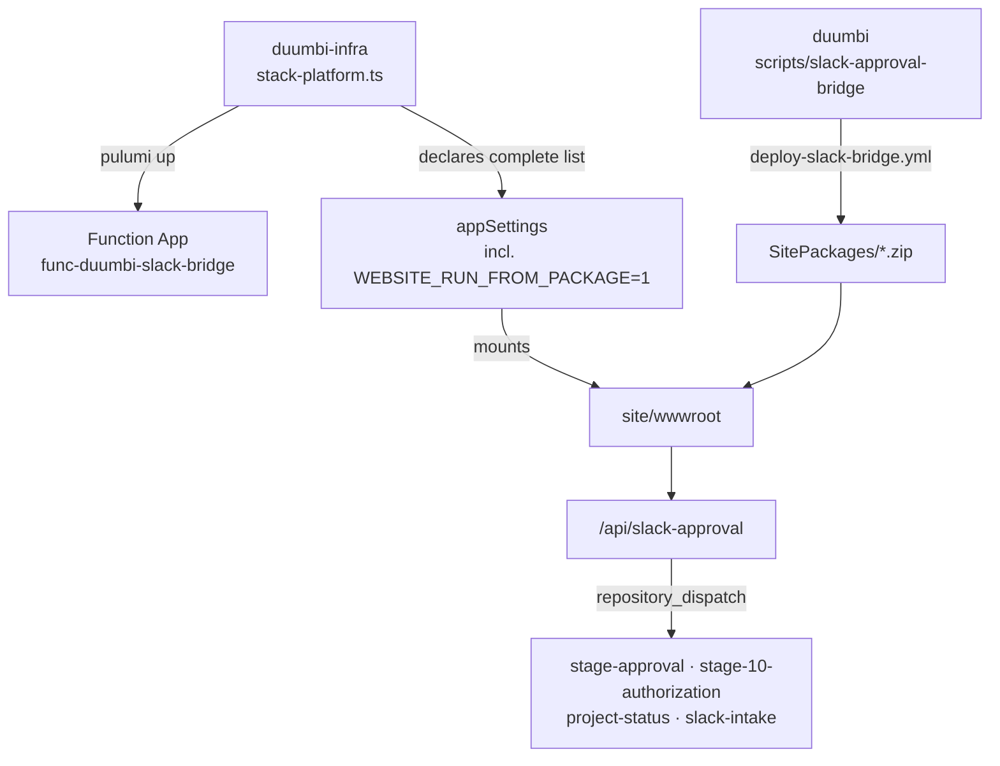

---
tags:
  - project/duumbi
  - concept/infrastructure
  - concept/repository-architecture
  - concept/operations
status: active
source: incident-2026-09-09
created: 2026-09-09
updated: 2026-09-09
---

# Slack Bridge Deployment Boundary

## Summary

The Azure Function `func-duumbi-slack-bridge` has two owners: `duumbi-infra` owns the *resource* (Pulumi), `duumbi` owns the *code* (published separately). The two are joined by one app setting, `WEBSITE_RUN_FROM_PACKAGE=1`, and whoever forgets that setting silently deletes the other side's work.

## Why it matters

Every Slack interactive button in the agentic workflow — Stage 5/7/9 approvals, Stage 10 authorization, Project Status, Slack intake — reaches GitHub only through this one function. When the boundary broke on 2026-09-07, the bridge answered HTTP 404 to every button for two days without a single alert, and the failure was invisible from both repositories: Pulumi reported success, GitHub showed the merged code, and only the live app knew nothing was running.

The mechanism: `stack-platform.ts` declares `siteConfig.appSettings` as a *complete list*, so any `pulumi up` on the Function App replaces the settings wholesale. The code, deployed as run-from-package, lives in `/home/data/SitePackages` and is mounted only while `WEBSITE_RUN_FROM_PACKAGE=1` exists. A routine token rotation (`pulumi up --target ...WebApp::func-duumbi-slack-bridge`) dropped the setting that `func publish` had added out of band; `wwwroot` fell back to a generated default `host.json` and the host loaded zero functions.

## DUUMBI usage

- Treat the Function App resource and the function code as two deliverables with two pipelines; never assume Pulumi deployed the code, because it never has.
- Declare every app setting the deployment method needs in Pulumi, including ones a CLI adds behind your back. An undeclared setting is a setting scheduled for deletion.
- Health is `401`, not `200`: an unsigned POST to `/api/slack-approval` must be rejected *by the function*. A `404` means no functions loaded — the package is unmounted.
- A deploy that no CI performs is a deploy that quietly stops happening. Between 2026-05-24 and 2026-09-09 ten bridge changes merged and none reached Azure; an ops issue was even closed as completed without any deploy taking place.
- Automated deploys must verify the running app, not the deploy tool's exit code. Both Pulumi and the zip deploy reported success while the bridge was dead.

## Sources

- [duumbi-infra#13](https://github.com/hgahub/duumbi-infra/pull/13) — declare `WEBSITE_RUN_FROM_PACKAGE`, Node 20 → 22, post-rotation check
- [duumbi#795](https://github.com/hgahub/duumbi/pull/795) — `deploy-slack-bridge.yml`: test → publish → 401 smoke
- [duumbi#793](https://github.com/hgahub/duumbi/issues/793) — incident evidence and recovery record
- `scripts/slack-approval-bridge/README.md`, `duumbi-infra/docs/slack-token-rotation.md`

## Related

- [[DUUMBI Azure Infrastructure Model]]
- [[DUUMBI Repository Responsibility Model]]
- [[Slack as Thin Surface; GitHub + Obsidian as Sources of Truth]]
- [[GitHub Project as Execution Source of Truth]]
- [[Runtime Failure Feedback Loop]]
