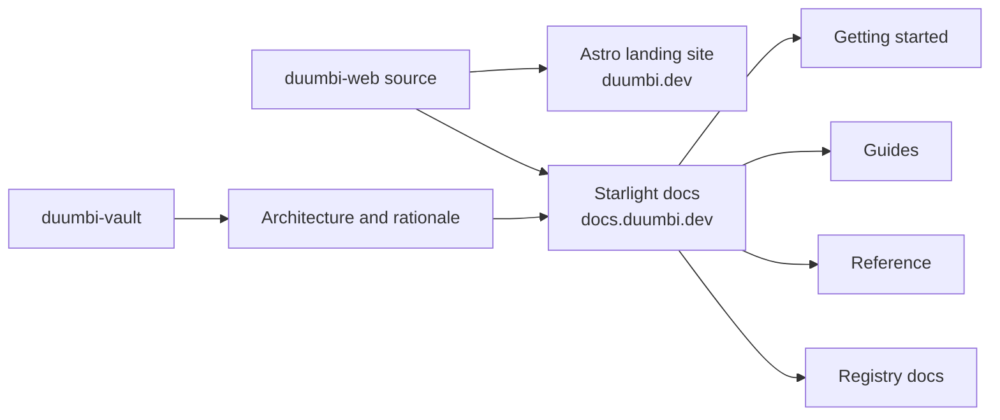

---
tags:
  - project/duumbi
  - concept/documentation
  - concept/web
status: active
source: repository-inspection
created: 2026-05-07
updated: 2026-05-07
---

# Static Website and Docs Publishing

## Summary

`duumbi-web` owns the public DUUMBI website and documentation surfaces, built with Astro, Tailwind CSS, and Starlight docs.

## Why it matters

The website and docs are product interfaces. They shape what users believe DUUMBI does, how they install it, how they use the registry, and which APIs or concepts are stable enough to learn.

## DUUMBI usage

- Put user-facing how-to, reference, and onboarding docs in `duumbi-web/docs`.
- Put durable rationale, architecture context, source mapping, and documentation policy in Obsidian.
- Keep marketing and public positioning in `duumbi-web`, not the vault.
- Update Obsidian only when a docs change reflects a durable product or architecture decision.

## Sources

- [duumbi-web](https://github.com/hgahub/duumbi-web)
- Local source: `/Users/heizergabor/space/hgahub/duumbi-web/README.md`
- Local source: `/Users/heizergabor/space/hgahub/duumbi-web/docs/src/content/docs/registry/index.md`
- Local source: `/Users/heizergabor/space/hgahub/duumbi-infra/stack-platform.ts`

## Related

- [[Public Docs as Product Interface]]
- [[DUUMBI Azure Infrastructure Model]]
- [[DUUMBI Repository Responsibility Model]]
- [[DUUMBI Repository Map]]
