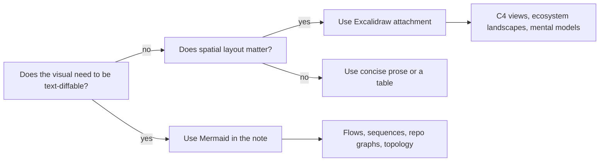

---
tags:
  - project/duumbi
  - concept/knowledge-base
  - concept/visual-documentation
status: active
source: user-decision
created: 2026-05-07
updated: 2026-05-07
---

# Visual Documentation in Obsidian

## Summary

DUUMBI Obsidian notes should use Mermaid and Excalidraw when a visual explanation helps readers understand relationships, flow, or sequence faster than prose.

## Why it matters

Agents and humans need fast orientation. Diagrams reduce ambiguity when they show what connects to what, what happens next, or which boundary owns a decision.

## DUUMBI usage

- Use Mermaid for repository graphs, registry request/data flow, module lifecycle, auth sequences, Azure topology, and workflow routing.
- Use Excalidraw for spatial, high-level, C4-style, ecosystem, and presentation-grade diagrams.
- Store Excalidraw files under `02 Resources (Assets and Tools)/Attachments (MediaFiles)/`.
- Embed Excalidraw drawings from notes with Obsidian embeds such as `![[DUUMBI - Architecture Diagram.excalidraw|Architecture Diagram]]`.
- Prefer one useful diagram over several decorative diagrams.

## Sources

- User decision in this thread on 2026-05-07`
- [Obsidian Mermaid docs](https://help.obsidian.md/advanced-syntax#Diagram)
- [Excalidraw Obsidian plugin](https://github.com/zsviczian/obsidian-excalidraw-plugin)

## Related

- [[Obsidian Vault as Agent Knowledge Substrate]]
- [[DUUMBI Repository Map]]
- [[DUUMBI Technical Architecture Map]]
- [[Inbox-to-Atlas Processing Workflow]]
