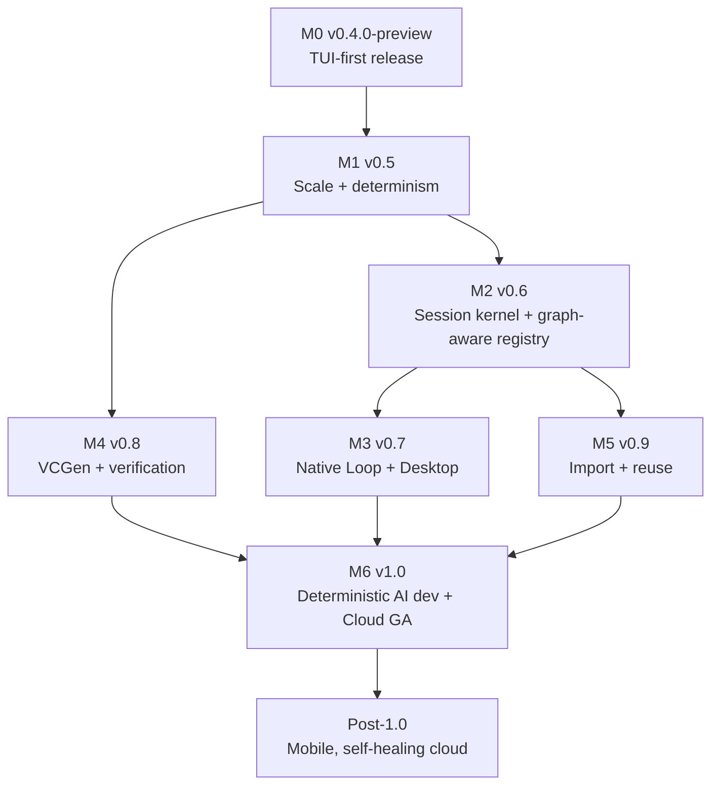

---
tags:
  - project/duumbi
  - map/roadmap
status: active
created: 2026-06-12
updated: 2026-06-16
related_maps:
  - "[[DUUMBI Core Concepts Map]]"
  - "[[DUUMBI Technical Architecture Map]]"
  - "[[DUUMBI Repository Map]]"
  - "[[DUUMBI Agentic Development Map]]"
---

# DUUMBI Future Development Roadmap Map

This map is the umbrella document for DUUMBI development from the first public release (v0.4.0-preview) toward v1.0 and beyond. It consolidates the current state of all DUUMBI repositories, the open GitHub issues, the research direction notes, and the DUUMBI Loop plan into one milestone sequence.

**North star:** DUUMBI is the development tool of the future that needs no human programming language. Programs are semantic graphs (JSON-LD), 100% AI-mediated, and DUUMBI's job is to make non-deterministic AI-based development **deterministic**: inspectable, reusable, testable, replayable, and eventually formally verifiable.

**Positioning (from [[DUUMBI - Service and Research Direction]]):** semantic execution substrate for coding agents — not another coding agent. Lead with the read-only `query` surface; mutation follows evidence.

---

## Current state snapshot (2026-06-12)

| Component | Repo | State |
|---|---|---|
| Core compiler + CLI + TUI | `hgahub/duumbi` | v0.3.3, works end-to-end (`init → build → run`), TUI REPL with session persistence and `/resume`, Studio (Leptos), MCP server, 5+ LLM providers. **No git tags, no releases, no prebuilt binaries, `examples/` empty.** |
| Module registry | `hgahub/duumbi-registry` | Deployed at registry.duumbi.dev (Azure Container Apps, GitHub OAuth, device-code CLI login). Stores `.tar.gz` module packages + SQLite index. Roadmap: evolves into the **graph-aware registry** — snapshots, semantic hashes, graph query API, session sync (M2). |
| Infrastructure | `hgahub/duumbi-infra` | Pulumi/Azure: DNS, 2 Static Web Apps (duumbi.dev, docs.duumbi.dev), registry Container App, Key Vault, Log Analytics, Slack approval bridge Function App. No CI for infra (manual `pulumi up`). |
| Public web + docs | `hgahub/duumbi-web` | Astro 6 + Starlight, deployed via GitHub Actions to Azure SWA. **Docs claim `cargo install duumbi`, which is not published** — truth gap to fix before launch. |
| Development loop service | `hgahub/duumbi-loop` | Repo exists but is code-empty; only the plan `wiki/duumbi-loop-codex-task.md`. Plan is GitHub/GitLab-centric and must be adapted to the DUUMBI-native, git-free workflow. |
| Knowledge base | `hgahub/duumbi-vault` | This vault. Roadmap/PRD/research direction maintained here. |

**Open issues in `hgahub/duumbi` driving the near term:** #687 (v0.4.0-preview release), #686 (docs reconciliation), #684 (semantic rewrite engine), #682 (MCP telemetry analytics). Completed execution evidence includes #688 (flagship HTTP + SQLite + JSON example, merged in hgahub/duumbi#715), #673 (BDD artifacts, merged in hgahub/duumbi#703), and #689 (scaled multi-function / multi-module intent-execute eval evidence, merged in hgahub/duumbi#723).

---

## Product surfaces and the session contract

Planned surfaces, in release order:

1. **CLI** — automation, CI, agents (exists; hardening only).
2. **TUI** — terminal-first interactive surface; **this is the first released product surface** (exists as `duumbi` REPL; needs release polish).
3. **Desktop App** — packaged Studio (reuse the Leptos frontend, e.g. via Tauri shell).
4. **Cloud App** — hosted Studio + DUUMBI account (SSO at auth.duumbi.dev).
5. **Mobile App** — supervision and approval surface first, authoring later.

**Session contract:** if the user permits it, a started session can be continued on any surface. This requires the **session kernel + append-only event ledger** (one session model across CLI/TUI/Studio/desktop/cloud/mobile) and a sync backend (provided by the evolved, graph-aware `duumbi-registry`). Local-only remains the default; sync is opt-in.

---

## Why this product wins (strengths to build toward)

How and why we — and notably AI agents themselves — would choose DUUMBI over a text-language toolchain. These strengths drive the proposed additions marked in the milestones below.

1. **Eliminates hallucination classes for agents.** An agent mutating a typed, ownership-checked, schema-validated graph with machine-readable errors cannot make whole categories of mistakes that raw text generation invites. DUUMBI should be the substrate any coding agent reaches for when output must be correct, not plausible. → [[2026-06-12 - Agent Substrate MCP First-Class]]
2. **Assurance is a ladder, and every rung is native.** Types → ownership → BDD → auto-generated property tests → SMT proofs, all attached to the same graph nodes, all exportable as evidence. Competitors bolt this on; here it is the data model. → [[2026-06-12 - Contract Property Test Generation]], [[2026-06-12 - Formal Verification VCGen MVP]]
3. **The audit dossier is a build artifact.** Intent → spec → node → test → proof links exist natively, so certification-grade traceability (safety engineering, regulated industries) becomes an export command instead of a documentation project. → [[2026-06-12 - Certification Evidence Export]]
4. **Adoption by embedding, not rewriting.** Build the critical 5% — the function where money, safety, or legal liability lives — in DUUMBI and embed it in existing software as a verified C ABI/WASM library. Nobody has to abandon their stack to benefit. → [[2026-06-12 - Verified Module Export and Embedding]]
5. **No human programming language = no language churn.** A self-describing graph survives decades of language fashion — exactly what statutes, insurance policies, and long-lived engineering systems need. Legal/financial verified business rules are the flagship vertical. → [[2026-06-12 - Verified Business Rules Vertical]]
6. **Determinism as a measurable promise.** Replayable sessions, evidence ledgers, and rewrite-rule mutations turn "AI wrote it" from a risk into an audited, reproducible process. → [[2026-06-12 - Determinism Program for AI Development]]
7. **Token economics by architecture, not by representation.** Versus text-language agentic tools: registry reuse makes already-solved functions ≈ free (no generation at all, compounding as the registry grows); graph queries replace file-dump context discovery (the dominant input-token cost); patch/rewrite-rule outputs are tiny where output tokens cost ~5× input; pre-build validation shortens repair loops. Honest caveat: raw JSON-LD is *more* verbose than source code — the advantage only banks if LLM-facing I/O uses compact projections, never raw graphs. → [[2026-06-12 - Token Economics Benchmark]], [[2026-06-12 - Token-Efficient Graph Representation for LLM IO]]

---

## Milestones

### M0 — v0.4.0-preview: first public release (TUI-first) — target 2026-07
Goal: a stranger can install DUUMBI in one command and reach a working `init → build → run` plus the TUI in under 10 minutes, with honest docs.

- Release engineering: tag `v0.4.0-preview`, GitHub Releases, prebuilt binaries (macOS arm64/x64, Linux x64, Windows x64), working install path (issue #687). → [[2026-06-12 - Release v0.4.0-preview TUI-first]]
- TUI polish as the headline surface (query-first UX, session resume, onboarding). → [[2026-06-12 - TUI as Primary Surface Polish]]
- Flagship example programs and populated `examples/`: first HTTP + SQLite + JSON example delivered by #688 / hgahub/duumbi#715; additional examples and broader population remain future work alongside #382 ecosystem evidence. → [[2026-06-12 - Flagship Examples and Showcase Programs]]
- Docs truth reconciliation: remove `cargo install duumbi` claim or publish to crates.io; reconcile legacy `sites/` + `docs/` with duumbi-web (issue #686). → [[2026-06-12 - Docs Truth Reconciliation]]

**Kill criterion:** clean-machine install evidence on all three platforms + docs quickstart matches reality + Phase 14 launch checklist green.

### M1 — v0.5: proven at scale, determinism program — target Q3 2026
Goal: move the AI story from "single tiny function" to multi-function/multi-module evidence, and make determinism measurable.

- Intent at scale: initial multi-function / multi-module intent-execute eval evidence delivered by issue #689 / hgahub/duumbi#723, building on delivered BDD specification artifacts in intent flow (issue #673, PR #703). Follow-up work remains to improve pass rates, process evidence, and determinism metrics. → [[2026-06-12 - Intent at Scale Multi-Module and BDD]]
- Determinism program: locked model/prompt/context replay, graph-diff stability metrics, evidence ledger — the core "make AI development deterministic" claim, measured. → [[2026-06-12 - Determinism Program for AI Development]]
- Agent substrate: MCP as a first-class interface — any coding agent drives the full loop via MCP, benchmarked and documented. → [[2026-06-12 - Agent Substrate MCP First-Class]]
- Contract-based property test generation: contracts on graph nodes yield auto-generated property tests now, de-risking the M4 verification track. → [[2026-06-12 - Contract Property Test Generation]]
- Token economics benchmark: per-phase token attribution + measured comparison vs. a text-language agent baseline on the same corpus; token-per-task becomes a release metric. → [[2026-06-12 - Token Economics Benchmark]]
- Token-efficient graph representation for LLM I/O: compact deterministic projections for reading, patch/rule DSL for writing — LLMs never see raw JSON-LD. → [[2026-06-12 - Token-Efficient Graph Representation for LLM IO]]
- Intent create hardening: schema-constrained output, retry-with-feedback, workspace context, streaming — fixes the weakest, most failure-prone step of the developer flow. → [[2026-06-12 - Intent Create Hardening]]
- Model capability advisor + per-task routing: warn before work starts when the user's configured models are likely inadequate; route each step (clarify/spec/mutation/query) to the best adequate model using the DUUMBI-675 catalog + local performance history. → [[2026-06-12 - Model Capability Advisor and Task Routing]]
- Effort levels and cost control: user-selectable low/medium/high/max effort mapping to model tier, retries, context budget, team size, verification depth — with cost preview and per-run cost report. → [[2026-06-12 - Effort Levels and Cost Control]]
- Codegen trap discipline + backend hardening: defined, node-attributed failure semantics (div-by-zero, silent OOB reads, overflow policy, ArrayTryGet), Cranelift verifier in CI, differential interpreter testing, struct layout registry. → [[2026-06-12 - Codegen Trap Discipline and Backend Hardening]]
- Op set expansion tiers: collections (map/set), string format/parse, time/seeded-random/env, structured Loop op with invariant slot; then function refs/closures/enums/monomorphized generics — every new op ships with its VCGen rule and effect annotation. → [[2026-06-12 - Op Set Expansion Tiers]]
- Semantic rewrite engine direction (issue #684) feeds this milestone as the formal graph-transformation substrate.

### M2 — v0.6: session everywhere + graph-aware registry — target Q4 2026
Goal: one session model across surfaces, backed by a durable graph store.

- Session kernel + append-only event ledger across CLI/TUI/Studio. → [[2026-06-12 - Session Kernel and Event Ledger]]
- Registry graph database evolution: `duumbi-registry` grows from package store into a graph-aware registry — snapshots, semantic hashes, graph query API, session sync backend (no new service). → [[2026-06-12 - Registry Graph Database Evolution]]
- Active learning loop: recorded evidence (failures, successes, model performance, telemetry) actually changes future behavior — locally and community-wide via registry evidence metadata; this is the closure stage of the development loop. → [[2026-06-12 - Active Learning Loop]]
- Runtime capability modules: vetted external libraries (rustls TLS, regex, libsodium, zstd) wrapped behind typed, effect-annotated, permissioned boundaries and distributed via the registry — batteries included, validation closure preserved, no JVM embedding. → [[2026-06-12 - Runtime Capability Modules and Library Adoption]]

### M3 — v0.7: DUUMBI-native Loop + Desktop App — target Q1 2027
Goal: the intake → spec → review → closure development loop runs on DUUMBI intents and graphs (no git required), and Studio ships as a desktop app.

- DUUMBI Loop adaptation: replace GitHub/GitLab issue triggers with DUUMBI-native intent/graph events; keep git providers as optional adapters. → [[2026-06-12 - DUUMBI Loop Native Workflow Adaptation]]
- Desktop app packaging of Studio. → [[2026-06-12 - Desktop App Packaging]]

### M4 — v0.8: formal verification track — target Q1–Q2 2027
Goal: `duumbi verify` exists and proves real properties (research → product), per [[DUUMBI - Phase 15i - Formal Verification]].

- Graph-based VCGen MVP: weakest-precondition rules per Op, SMT-LIB output, Z3/CVC5 backend; prove 3+ stdlib functions or return counterexamples. → [[2026-06-12 - Formal Verification VCGen MVP]]
- Compositional verification: module boundaries + semantic hashes as proof-cache boundaries. → [[2026-06-12 - Compositional Verification Proof Boundaries]]
- Certification evidence export: traceability matrix + verification results + gap report as a one-command, audit-ready bundle. → [[2026-06-12 - Certification Evidence Export]]

### M5 — v0.9: import and reuse — target Q2–Q3 2027
Goal: DUUMBI is useful on existing software, not only DUUMBI-native modules.

- Code import: source repositories → DUUMBI semantic graph (research spike → incremental product). → [[2026-06-12 - Code Import to Semantic Graph]]
- Semantic graph similarity and reuse ranking (semantic hashes, embeddings, graph features benchmark). → [[2026-06-12 - Semantic Graph Similarity and Reuse]]
- Verified module export and embedding: DUUMBI modules as C ABI/WASM libraries — the "verified kernel inside existing software" adoption wedge. → [[2026-06-12 - Verified Module Export and Embedding]]

### M6 — v1.0: deterministic AI development, Cloud App GA — target H2 2027
Goal: the full loop — intent → spec → graph mutation → verification → evidence → closure — is deterministic, auditable, and available as a hosted service.

- Cloud App + DUUMBI account/SSO (auth.duumbi.dev), session sync opt-in. → [[2026-06-12 - Cloud App and DUUMBI Account SSO]]
- DUUMBI Loop Cloud Service: hosted intake/spec/review/closure for DUUMBI-native workspaces and optional GitHub/GitLab adapters; Stripe billing, `duumbi-auth`, Neon Postgres, Postgres-backed graph tables, regional LLM policy, source-retention controls, and automatic closure publish. → [[2026-06-12 - DUUMBI Loop Cloud Service Milestone Plan]]
- Verified business rules vertical (legal/financial): pilot regulated ruleset with paragraph-level legal provenance and proven properties — the v1.0 launch story candidate. → [[2026-06-12 - Verified Business Rules Vertical]]
- v1.0 release criteria: determinism metrics public, verification on stdlib, multi-module AI evidence, all four M0–M5 surfaces stable.

### Post-1.0 — Mobile and beyond
- Mobile app: supervision/approval surface first (run status, question topics, approvals), authoring later. → [[2026-06-12 - Mobile App and Supervision Surface]]
- Self-healing telemetry cloud ingestion (deferred Phase 13 cloud tracks), enterprise control plane, Slack/Discord operational bridges.

---

## Dependency graph (what blocks what)

Key dependencies:
- Session kernel (M2) is a prerequisite for desktop/cloud/mobile continuity — do not build surfaces before the session model.
- The registry graph database evolution (M2) underpins similarity/reuse (M5), Loop knowledge base (M3), and session sync (M6). No new service: `duumbi-registry` carries these capabilities.
- Verification (M4) depends on the determinism/effect modeling work in M1 (explicit contracts on graph nodes).
- The Loop plan in `duumbi-loop/wiki/duumbi-loop-codex-task.md` is reused, but its provider layer is re-scoped: DUUMBI-native intent events become `provider-duumbi`, GitHub/GitLab become optional adapters.

---

## Subtask index (Inbox, to process)

| # | Subtask note | Milestone |
|---|---|---|
| 1 | [[2026-06-12 - Release v0.4.0-preview TUI-first]] | M0 |
| 2 | [[2026-06-12 - TUI as Primary Surface Polish]] | M0 |
| 3 | [[2026-06-12 - Flagship Examples and Showcase Programs]] | M0 |
| 4 | [[2026-06-12 - Docs Truth Reconciliation]] | M0 |
| 5 | [[2026-06-12 - Intent at Scale Multi-Module and BDD]] | M1 |
| 6 | [[2026-06-12 - Determinism Program for AI Development]] | M1 |
| 7 | [[2026-06-12 - Agent Substrate MCP First-Class]] | M1 |
| 8 | [[2026-06-12 - Contract Property Test Generation]] | M1 |
| 9 | [[2026-06-12 - Token Economics Benchmark]] | M1 |
| 10 | [[2026-06-12 - Token-Efficient Graph Representation for LLM IO]] | M1 |
| 11 | [[2026-06-12 - Intent Create Hardening]] | M1 |
| 12 | [[2026-06-12 - Model Capability Advisor and Task Routing]] | M1 |
| 13 | [[2026-06-12 - Effort Levels and Cost Control]] | M1 |
| 14 | [[2026-06-12 - Codegen Trap Discipline and Backend Hardening]] | M1 |
| 15 | [[2026-06-12 - Op Set Expansion Tiers]] | M1 |
| 16 | [[2026-06-12 - Session Kernel and Event Ledger]] | M2 |
| 17 | [[2026-06-12 - Registry Graph Database Evolution]] | M2 |
| 18 | [[2026-06-12 - Active Learning Loop]] | M2 |
| 19 | [[2026-06-12 - Runtime Capability Modules and Library Adoption]] | M2 |
| 20 | [[2026-06-12 - DUUMBI Loop Native Workflow Adaptation]] | M3 |
| 21 | [[2026-06-12 - Desktop App Packaging]] | M3 |
| 22 | [[2026-06-12 - Formal Verification VCGen MVP]] | M4 |
| 23 | [[2026-06-12 - Compositional Verification Proof Boundaries]] | M4 |
| 24 | [[2026-06-12 - Certification Evidence Export]] | M4 |
| 25 | [[2026-06-12 - Code Import to Semantic Graph]] | M5 |
| 26 | [[2026-06-12 - Semantic Graph Similarity and Reuse]] | M5 |
| 27 | [[2026-06-12 - Verified Module Export and Embedding]] | M5 |
| 28 | [[2026-06-12 - Cloud App and DUUMBI Account SSO]] | M6 |
| 29 | [[2026-06-12 - Verified Business Rules Vertical]] | M6 |
| 30 | [[2026-06-12 - DUUMBI Loop Cloud Service Milestone Plan]] | M6 |
| 31 | [[2026-06-12 - Mobile App and Supervision Surface]] | Post-1.0 |

---

## Sources

- Repo state: `hgahub/duumbi` (issues #382, #682, #684, #686, #687; completed issues #673 via PR #703, #688 via PR #715, and #689 via PR #723; milestones Phase 14/15/16; `specs/`, `docs/architecture.md`, `src/session/mod.rs`, `src/cli/repl.rs`)
- `hgahub/duumbi-registry` README + CD workflow; `hgahub/duumbi-infra` Pulumi stacks; `hgahub/duumbi-web` Astro/Starlight sites
- `duumbi-loop/wiki/duumbi-loop-codex-task.md` (full Loop plan)
- Vault: [[DUUMBI - PRD]], [[DUUMBI - Service and Research Direction]], [[DUUMBI - Phase 15i - Formal Verification]], archived DUUMBI Roadmap Map and Product Roadmap 2026-05
