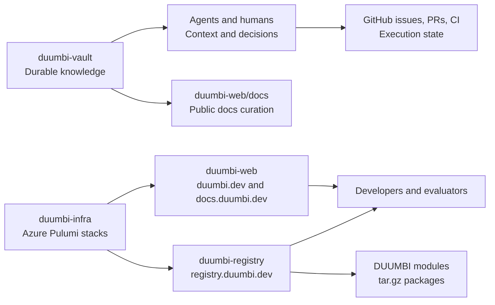

---
tags:
  - project/duumbi
  - map/repositories
status: active
created: 2026-05-07
updated: 2026-05-07
---

# DUUMBI Repository Map

This map explains how the active DUUMBI repositories divide durable knowledge, infrastructure, registry behavior, public web surfaces, and user documentation. It is not an execution status page.

## Repository Responsibilities

- `hgahub/duumbi-vault` stores durable product, architecture, workflow, glossary, source, and agent-skill knowledge.
- `hgahub/duumbi-infra` defines Azure infrastructure with Pulumi, including DNS, Static Web Apps, Container Apps, Key Vault, Log Analytics, budgets, and registry hosting.
- `hgahub/duumbi-registry` implements the Rust/Axum module registry for publishing, serving, searching, authenticating, and storing DUUMBI module packages.
- `hgahub/duumbi-web` owns `duumbi.dev`, `docs.duumbi.dev`, public messaging, blog content, and developer-facing documentation.

## Visual Overview

## Durable Boundaries

- GitHub Project, issues, PRs, CI, and review threads hold current execution state.
- Obsidian records stable architecture, product intent, operating model, rationale, and source-backed decisions.
- Public docs in `duumbi-web/docs` explain supported user behavior; Obsidian records why the docs say what they say.
- Repo-local `AGENTS.md` files govern code changes inside each source repository.

## Related

- [[DUUMBI Repository Responsibility Model]]
- [[DUUMBI Azure Infrastructure Model]]
- [[DUUMBI Registry Architecture]]
- [[Static Website and Docs Publishing]]
- [[Public Docs as Product Interface]]
- [[Visual Documentation in Obsidian]]
- [[DUUMBI Technical Architecture Map]]
- [[DUUMBI Agentic Development Map]]

## Sources

- [duumbi-vault](https://github.com/hgahub/duumbi-vault)
- [duumbi-infra](https://github.com/hgahub/duumbi-infra)
- [duumbi-registry](https://github.com/hgahub/duumbi-registry)
- [duumbi-web](https://github.com/hgahub/duumbi-web)
