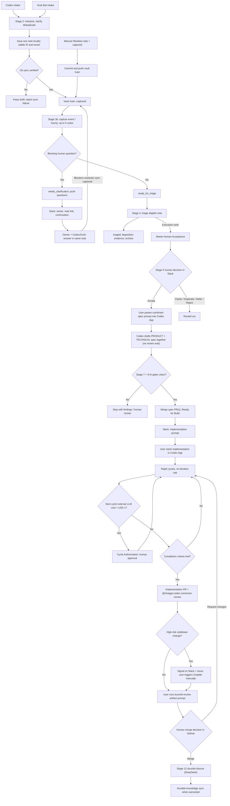

---
tags:
  - project/duumbi
  - doc/agent-workflow
  - doc/runbook
status: active
created: 2026-05-13
updated: 2026-09-12
related_maps:
  - "[[DUUMBI Agentic Development Map]]"
---

# DUUMBI - Agentic Development Runbook

## Summary

This runbook is the canonical operating guide for the redesigned DUUMBI intake-to-delivery workflow. It keeps the 12-stage DUUMBI model, but adds deterministic orchestration around intake, Inbox enrichment, triage queue refill, combined spec drafting with AI gates, Delivery Autopilot, cost-gated Ralph cycles, human GitHub implementation merge, and post-merge closure.

GitHub remains the execution source of truth. Obsidian stores raw intake and durable knowledge. Slack is the fast human surface for clarification, notification, and approval. GitHub Actions coordinate scheduled checks and dispatches. Stage 3b calls DeepSeek for bounded note preparation and Stage 4 calls Z.ai/Zhipu for bounded routing; other gates follow their documented policies. AI execution should run in Codex App by default — its subscription covers Codex usage, so heavy spec and implementation work belongs there — with Codex Cloud, Codex CLI, or a reviewed local agent environment as alternatives.

The earlier `DUUMBI - Development Intake to Delivery Workflow` document has been deleted; its useful content was folded into this runbook and the checked-in DUUMBI skills.

## Visual Guide

![[DUUMBI - Developer Ticket Flow Overview.svg]]

### End-To-End Flow



## Current Architecture In One Sentence

Codex, Grok Bot, and manual Obsidian Inbox notes feed a single GitHub-backed execution workflow; product and technical specs are drafted together and pass bounded AI gates on clean Codex self-review, the final implementation PR is reviewed by Codex (`@chatgpt-codex-connector`) with Greptile as a manual end-of-flow deep-review escalation, and implementation merge is performed by a human reviewer directly in GitHub after Stage 11 evidence.

## Developer Journey

The human path through one issue, end to end:

1. **Human Acceptance happens in Slack.** The developer decides `Accept` on the Slack approval card; the workflow records the Stage 5 decision and replies with the generated combined-spec prompt text.
2. **The developer pastes the prompt into Codex App.** Codex drafts the product spec and the technical spec together, without waiting for review between them, runs Codex self-review and the Stage 7/9 AI gates, merges the spec-only PR(s), and moves the issue to `Ready for Build`.
3. **Codex messages on Slack with the implementation prompt** (`ready-for-build-handoff.yml`).
4. **The developer starts implementation in Codex App.** Codex runs Ralph cycles to completion — stopping only at the USD 1 external-LLM cost gate, a blocker, or a scope change — then opens the implementation PR and requests review from `@chatgpt-codex-connector`.
5. **If the change is high-risk codebase work**, Codex signals on Slack and in the issue that a Greptile deep review is recommended; the developer triggers Greptile manually on the final PR.
6. **After the reviews arrive, the developer runs the `duumbi-review-artifact` prompt** received on Slack and in the issue after the PR was opened.
7. **If the PR is acceptable, the developer merges it in GitHub.** The merge triggers `stage12-closure-dispatch.yml`, and the closure skill runs using DeepSeek as its LLM.

## Source Of Truth

| Surface | Owns | Does not own |
|---|---|---|
| Slack | Clarification loops, review notifications, approval buttons, mobile-friendly control | Durable memory, raw secret storage, long-term execution state |
| Codex App | Human-controlled local execution, mobile-supervised delivery autopilot, specs, implementation, review handling, vault maintenance | Silent unattended project-state mutation without evidence |
| Codex Cloud | Scheduled, cloud, Slack-triggered, parallel, or long-running agent runs through approved dispatch contracts | Human product decisions or final implementation merge approval |
| GitHub Issues | Execution work unit, acceptance, clarification, stage decisions, linked evidence | Broad untriaged brainstorming forever |
| GitHub Project | Status, Todo queue, priority, sequencing, review gates | Durable architecture rationale by itself |
| GitHub PRs and CI | Spec review, implementation review, checks, merge evidence | Product decisions not linked back to issues |
| GitHub Actions | Deterministic dispatch, queue inspection, notification, marker comments, metadata-only metrics | Direct model calls, raw prompt storage, raw Slack payload storage |
| Obsidian Inbox | Raw ideas and unprocessed notes | Permanent backlog or live status mirror |
| Obsidian Atlas | Durable product, architecture, workflow, glossary, and source-backed knowledge | Current delivery tracking |
| Agent skills | Repeatable stage behavior and boundaries | Product decisions that belong in GitHub or Obsidian |
| Source repo `AGENTS.md` | Repository-local agent constraints | General roadmap or durable vault knowledge |

## Operating Principles

- One workflow, multiple front doors. Codex, Grok Bot, and manual Obsidian notes converge into the same GitHub-backed execution path.
- GitHub is the durable execution record. Slack and Codex chats are control surfaces unless their outcomes are written back to GitHub or Obsidian.
- Read-only context gathering comes before mutation. Agents inspect active Inbox, Processed Inbox, Atlas notes, GitHub Issues, GitHub Discussions, existing PRs, and relevant source before creating new work.
- Agents may prepare, deduplicate, summarize, recommend, draft, review, and implement inside approved boundaries. They must not invent human acceptance, broaden scope, or bypass gates.
- Product and technical specs are drafted together in one pass. The flow does not wait for external review between them; it proceeds to `Ready for Build` and sends the implementation prompt as soon as the gates allow.
- Stage 7 and Stage 9 may use bounded AI gate approval only when Codex self-review is clean, checks are green or inapplicable, and the spec-only PR remains inside accepted issue scope. Spec PRs have no required external automated reviewer.
- Codex review via `@chatgpt-codex-connector` is the required automated review on the final implementation PR. On any other PR, a quick low-cost review (MiniMax, DeepSeek Pro, Grok Build, Cursor BugBot) may be suggested; it is advisory only.
- Greptile is manual-only, quota-limited, and reserved for the final implementation PR when deep detailed review of codebase changes is justified. Do not run it automatically, include it in required reviewer variables, or re-run it after every push.
- Implementation merge is not an AI gate. After Stage 11 evidence, the human reviewer uses the GitHub PR UI to merge, request changes, ask clarification, or abandon the PR.
- Every scheduled or Slack-triggered workflow must fail closed when required GitHub Project, Slack, or evidence context is unavailable.
- Workflow metrics are metadata-only. Do not store raw Slack bodies, prompt text, issue bodies, model completions, provider payloads, credentials, or capability URLs.

## Pre-Flight Setup

| Check | Required state | Where to verify |
|---|---|---|
| GitHub auth | Repo, issue, PR, actions, and Project V2 operations work for the chosen tool | GitHub app, `gh auth status`, or Actions token scope |
| GitHub Project Status field | DUUMBI statuses exist and Project V2 can be read by `GH_PROJECT_PAT` | GitHub Project `Duumbi project` |
| Repository variables | `DUUMBI_PROJECT_NUMBER` is set; `DUUMBI_PROJECT_OWNER` is set when different from repo owner | `hgahub/duumbi` repo variables |
| Slack config | `SLACK_BOT_TOKEN`, `SLACK_REVIEW_CHANNEL_ID`, and optional `DUUMBI_AGENT_DISPATCH_CHANNEL_ID` are configured | repo secrets and Slack app config |
| Slack bridge | `func-duumbi-slack-bridge` points to `/api/slack-approval` and verifies Slack signatures | Azure Function App and Slack Request URL |
| Workflow labels | Required labels such as `needs-cycle-approval` and `needs-review` exist before agents use label routing | `hgahub/duumbi` labels |
| AI review configuration | `DUUMBI_REQUIRED_SPEC_REVIEWERS` is empty (no required automated reviewer on spec PRs); `@chatgpt-codex-connector` is available for final implementation PR review; Greptile has automatic review disabled and `.greptile/config.json` sets `skipReview: "AUTOMATIC"` | GitHub repo variables, Greptile dashboard, source repo `.greptile/` |
| Active workflow context | PRD, Glossary, Agentic Development Map, and this runbook are available | `duumbi-vault` |
| Source repo instructions | Repository `AGENTS.md` is available before source changes | target source repo, usually `duumbi` |
| Spec artifacts | Product and technical specs are linked before implementation | GitHub issue and spec PRs |

## Stage Status Model

| Status | Meaning | Allowed next states |
|---|---|---|
| `Inbox Capture` | Raw idea exists but has not been triaged | `Needs Human Acceptance`, `Needs Clarification`, `Closed`, `Deferred` |
| `Needs Clarification` | Agent or human needs more information | `Needs Human Acceptance`, `Spec Needed`, `Technical Spec Needed`, `In Progress`, `Blocked`, `Closed`, `Deferred` |
| `Todo` | Accepted backlog candidate waiting for queue selection | `Needs Human Acceptance`, `Spec Needed`, `Closed`, `Deferred`, `Duplicate` |
| `Needs Human Acceptance` | Triage is complete enough for a human decision | `Spec Needed`, `Needs Clarification`, `Closed`, `Deferred`, `Duplicate` |
| `Spec Needed` | Accepted work needs a product spec artifact | `Spec Review`, `Needs Clarification` |
| `Spec Review` | Product spec exists and needs human or bounded AI-gate review | `Technical Spec Needed`, `Spec Needed`, `Needs Clarification` |
| `Technical Spec Needed` | Approved product spec needs an agent-facing technical spec | `Technical Spec Review`, `Needs Clarification` |
| `Technical Spec Review` | Technical spec exists and needs human or bounded AI-gate review | `Ready for Build`, `Technical Spec Needed`, `Needs Clarification` |
| `Ready for Build` | Product and technical specs are approved | `In Progress`, `Cycle Authorization`, `Blocked` |
| `Cycle Authorization` | Human/resource authorization is needed before the next Ralph cycle | `In Progress`, `Blocked`, `Deferred` |
| `In Progress` | Approved or resource-permitted Ralph cycle work is running | `In Progress`, `Cycle Authorization`, `In Review`, `Blocked` |
| `In Review` | Implementation PR or equivalent artifact is under review | `In Progress`, `Needs Clarification`, `Done`, `Blocked` |
| `Blocked` | Work cannot proceed without external decision or dependency | previous active state, `Deferred`, `Closed` |
| `Done` | Merged or otherwise completed with evidence | none |
| `Deferred` | Valuable but intentionally postponed | `Needs Human Acceptance`, `Closed` |
| `Duplicate` | Superseded by another issue | none |
| `Closed` | Rejected or no longer relevant | none |

## End-To-End Stage Table

| Stage       | Skill or workflow                                                          | Trigger                                                                                                     | Source                                                          | Output                                                                                      |
| ----------- | -------------------------------------------------------------------------- | ----------------------------------------------------------------------------------------------------------- | --------------------------------------------------------------- | ------------------------------------------------------------------------------------------- |
| 1 | Retired (2026-09-11) | None | No Slack idea intake | Use Stage 2 Codex intake or Stage 3 manual Inbox |
| 2 | `duumbi-codex-intake` or Grok `duumbi-grok-intake` | Explicit capture or clarification request | User idea / existing waiting note | One English note, stable ID and owner, verified `captured` sync or explicit local-only failure |
| 3 | Manual Obsidian Inbox entry | Human writes and synchronizes Markdown | Inbox note with `intake_status: captured` | Raw note on vault `main` |
| 3b | `duumbi-inbox-enrichment` / `inbox-enrichment-dispatch.yml` | Vault capture event, hourly minute 17 UTC, or manual | Only `captured` Inbox notes | `ready_for_triage` or `needs_clarification`; post-push Slack handoff |
| 4 | `duumbi-triage` / `triage-queue-refill.yml` | Every 4 hours below acceptance queue target, or manual | Only `ready_for_triage` Inbox notes; GitHub as context | Execution issue → `Needs Human Acceptance`; successful disposition → `triaged` + archive |
| 5           | `duumbi-human-acceptance` or `stage-approval.yml`                          | Human decision in GitHub or Slack                                                                           | Triaged issue                                                   | Structured Stage 5 decision and `Spec Needed` when accepted                                 |
| 6           | `duumbi-spec-draft`                                                        | Accepted issue reaches `Spec Needed`                                                                        | GitHub issue and vault/source context                           | Product spec PR or issue-comment spec                                                       |
| 7           | `duumbi-spec-review` or `spec-ai-gate.yml`                                 | Human review or clean AI gate                                                                               | Product spec artifact                                           | Stage 7 decision; `Technical Spec Needed` when approved                                     |
| 8           | `duumbi-tech-spec-draft`                                                   | Product spec approved                                                                                       | Product spec and source context                                 | Technical spec PR                                                                           |
| 9           | `duumbi-tech-spec-review` or `spec-ai-gate.yml`                            | Human review or clean AI gate                                                                               | Technical spec artifact                                         | Stage 9 decision; `Ready for Build` when approved                                           |
| 10          | `duumbi-delivery-autopilot`, `duumbi-implementation`, `duumbi-ralph-cycle` | Codex App selected `Spec Needed` issue, or manual Stage 10 run                                              | Approved specs and source repo                                  | Implementation PR, Ralph evidence, resource request, blocker, or review handoff             |
| 10 gate     | `ralph-cycle-approval-request.yml` and `stage-10-authorization.yml`        | Resource gate exceeds threshold or risky change; label/manual/repository dispatch plus twice-daily backstop | Ralph Cycle request comment                                     | One-cycle authorization, narrower scope, clarification, block, or defer                     |
| 11          | `duumbi-review-artifact` and `implementation-review-request.yml`           | Implementation evidence ready; label/PR event/manual/repository dispatch plus twice-daily backstop          | Implementation PR, specs, CI, Ralph evidence                    | Stage 11 review artifact and merge-readiness recommendation                                 |
| 11 decision | Human reviewer in GitHub                                                   | Explicit human merge or disposition decision                                                                | Stage 11 artifact and PR                                        | Merge, request changes, clarification, abandon, or close PR directly in GitHub              |
| 12          | `stage12-closure-dispatch.yml` and `duumbi-closure`                        | Merged PR, manual dispatch, or equivalent completion evidence                                               | Merged PR, issue, specs, review artifact                        | Closure evidence, Project `Done`, issue closure, Inbox disposition, knowledge-sync decision |
| 12 optional | durable knowledge sync                                                     | Stage 12 says reusable learning exists                                                                      | Vault or source repo docs                                       | Updated Dot, Map, Work, skill, PRD, Glossary, or `AGENTS.md`                                |

## Intake And Enrichment

### Stage 1 - Retired

Slack idea intake was retired by product decision on 2026-09-11. Do not submit development ideas through Slack. Use Stage 2 Codex/Grok intake or Stage 3 manual Obsidian Inbox entry. Stage numbering is preserved. Slack remains available for clarification, notifications, and approvals.

### Stage 2 - Codex Or Grok Intake

Codex and Grok Bot use the same [intake contract](https://github.com/hgahub/duumbi/blob/74a407251aa871e6dd53fc2bffe0770d1d84dac0/docs/automation/intake-contract.md). Explicit capture authorizes interpreting, bounded clarification, duplicate inspection, one English Inbox note, and its verified Git synchronization. An exact repeat links the existing item; a related topic with new requirements remains a new candidate. A local save alone is not visible to Actions.

Metadata: stable UUID `intake_id`, `source: codex|grok|obsidian`, `intake_owner`, `intake_status`, and `intake_updated_at`. Use the sync helper to publish only the selected note. Same-note conflicts stop for reconciliation; unrelated local changes are not published.

### Stage 3 - Manual Obsidian Inbox Entry

Write a meaningful note in `Duumbi/00 Inbox (ToProcess)/` with the following frontmatter, then commit/push it to vault `main`. Stage 3b supplies missing optional ID/source/owner fields. Existing Obsidian Git synchronization may perform this push, but verify the remote note; a local file or unrelated cloud-drive sync is not enough.

```yaml
---
intake_status: captured
---
```

### Stage 3b - Scheduled Inbox Enrichment

A vault main push touching captured Inbox input wakes the central workflow through a metadata-only repository_dispatch event. An hourly sweep at minute 17 UTC reconciles missed events and backlog; manual dispatch remains available. It processes at most five captured notes serially, preserving original content and replacing only each generated preparation block. A targeted manual run handles one note. A failed item stops the batch; earlier pushed results remain complete. Own enrichment and archive pushes do not send another wake-up because their changed notes are no longer captured. Missing, invalid, waiting, ready, and triaged statuses are not candidates. Context inspection is bounded; unavailable GitHub facts must remain unverified.

Usable input becomes `ready_for_triage`. An essential missing human decision becomes `needs_clarification` with a reason and 1–3 questions. Questions stay in the note; after pushing, Slack sends the owner, note link, and continuation instructions. The default owner is `hgahub`, overridable per note or by repository variable. An optional Slack member ID enables a mention.

The owner continues the same note through Codex or Grok, preserving its ID, filename, source, and earlier answers. Append dated answers outside the generated block. Resolved blockers return to `captured` and synchronize; partial answers keep `needs_clarification`. Waiting notes cause no repeated model calls or duplicate notifications. Failed Slack notification remains visible in the workflow summary; the note remains the durable handoff.

## Triage Queue Refill

Stage 4 accepts only `ready_for_triage` Inbox notes. GitHub Issues and Ideas Discussions are retired as independent entry points; GitHub remains execution and duplicate context. `triage-queue-refill.yml` runs every 4 hours and routes at most one execution candidate when fewer than three issues wait in `Needs Human Acceptance`. With no ready source, it skips the model. Missing Project credentials or status data fails closed.

After successful routing, the selected note becomes `triaged` and moves to `Duumbi/05 Archive/Processed Inbox/` with issue evidence. The manual `duumbi-triage` skill handles knowledge, duplicate, defer, rejection, and no-action dispositions. It must not invent an issue to clear the Inbox. Both scheduled writers share a concurrency group; a conflicting human push stops safely. If issue writes succeeded but the archive push failed, reconcile the existing issue before rerunning.

### Rollout And Grok Setup

The 2026-09-12 lifecycle revision is active after source PR #806 merged. Event-driven wake-up additionally requires the companion source receiver and the vault secret DUUMBI_INTAKE_DISPATCH_TOKEN; see the source repository docs/automation/intake-events-setup.md before merging this listener. Existing Inbox notes are explicitly migrated before that merge; legacy processed markers are preserved for compatibility. Saving the Grok skill and authorizing its cloud Git access are user steps. Follow the [Grok setup](https://github.com/hgahub/duumbi/blob/74a407251aa871e6dd53fc2bffe0770d1d84dac0/docs/automation/grok-intake-setup.md) and [portable recipe](https://github.com/hgahub/duumbi/blob/74a407251aa871e6dd53fc2bffe0770d1d84dac0/docs/automation/grok-intake-skill.md). No new recurring Grok routine is required.

## Delivery Autopilot

`duumbi-delivery-autopilot` is a Codex App skill for a selected `Spec Needed` issue. It coordinates the high-cost delivery path while keeping the developer in mobile-controllable Codex App context.

Autopilot sequence:

1. Draft PRODUCT spec, then immediately draft TECHNICAL spec — together, in one pass, without waiting for external review between them. Open the spec-only PR(s).
2. Run Codex self-review on both spec artifacts.
3. Run Codex product-spec review for the Stage 7 gate and implementability review for the Stage 9 gate.
4. If clean, write the Stage 7 and Stage 9 AI Gate Decisions, merge the spec-only PR(s), move the issue to `Ready for Build`, and send the Stage 10 implementation prompt.
5. Enter Stage 10 Ralph-cycle implementation without bypassing resource gates.

AI gates may proceed only when all of these are true:

- Codex self-review has no blocking finding.
- CI/checks are passing, neutral, skipped, or explicitly not applicable.
- The PR is spec-only.
- There are no open scope, product, architecture, security, migration, cost, or verification questions.
- The PR stays inside the accepted issue scope.
- Greptile is never used on spec-only PRs; it is reserved for the final implementation PR.

## AI Code Review Policy

DUUMBI uses layered review concentrated on the final implementation PR instead of asking every connected AI reviewer to run on every PR. Copilot review was removed after the subscription was cancelled.

| Review service | Default use | Best fit |
|---|---|---|
| Codex self-review | Required before stage readiness, AI-gate approval, and Stage 11 merge-readiness recommendation | Spec alignment, BDD/evidence mapping, diff review with local context and checks |
| Codex review (`@chatgpt-codex-connector`) | Required automated reviewer on the final implementation PR | Full implementation review against specs before the human merge decision |
| Quick low-cost reviewers (MiniMax, DeepSeek Pro, Grok Build, Cursor BugBot) | Optional advisory suggestion on any non-final PR | Fast, cheap second opinion on spec, docs, config, or in-progress implementation PRs |
| Greptile | Manual-only scarce deep review, **final implementation PR only** | High-risk codebase changes where deep detailed review is justified: complex Rust, compiler/runtime, graph invariants, provider/auth, async/concurrency, security, cross-module refactors |

Greptile runs at most once per qualifying final implementation PR, after Codex review and relevant checks, and only after the agent signals the recommendation on Slack and in the issue and the developer triggers it manually. Re-run it only when the developer explicitly authorizes a follow-up for blocking feedback. If Greptile is not used, Stage 10 or Stage 11 evidence should say `Greptile: not needed` or `Greptile: recommended for human decision` instead of silently triggering it.

## Ralph Cycle Resource Gate

A Ralph Cycle is a bounded implementation-and-evidence unit. Cycles continue autonomously inside the approved technical spec — there is no iteration cap and no call-count cap, so the run must not stop just because two or three cycles have already completed. Human authorization is required before continuing only when any of these are true:

- the next cycle will use an external LLM and its expected cost exceeds USD 1
- scope expands beyond the approved issue or technical spec
- risky dependency, migration, security-sensitive behavior, irreversible operation, or broad refactor is introduced
- a blocker or product/architecture decision is encountered
- checks fail in a way the agent cannot resolve within approved scope

External LLM usage means DUUMBI live provider calls and external model/agent CLI calls. Codex internal reasoning is covered by the Codex App subscription and never triggers the gate.

Stage 10 approval authorizes only the named next cycle. It is not permission to merge, close, skip checks, broaden scope, or continue past the approved boundary.

## Stage 11 Review And Human PR Decision

`duumbi-review-artifact` remains the Stage 11 evidence-producing skill. The developer runs it after the implementation PR's reviews have arrived, using the prompt received on Slack and in the issue. It reviews one implementation PR against the approved product spec, technical spec, CI/checks, changed files, Codex self-review, the `@chatgpt-codex-connector` review, optional quick low-cost review comments, Greptile status when applicable, and Ralph-cycle evidence. It recommends a human merge decision but does not merge.

The human reviewer then opens the PR in GitHub and performs the decision directly:

| Decision | Required behavior |
|---|---|
| `Approve Merge` | Requires explicit human authorization, open non-draft PR, Stage 11 artifact, linked product and technical specs, green checks, Codex self-review, clean or handled Codex (`@chatgpt-codex-connector`) review, Greptile status recorded when the PR is high risk, and no blocking finding. The human reviewer merges in GitHub. |
| `Request Changes` | The reviewer requests changes on the PR or issue; work returns to Stage 10 `In Progress`. |
| `Needs Clarification` | The reviewer asks targeted questions on the PR or issue; no merge occurs, and status becomes `Needs Clarification` or `Blocked` when appropriate. |
| `Reject / Abandon` | Requires explicit human rationale. The reviewer closes the implementation PR or routes the issue to `Technical Spec Needed`, `Deferred`, or `Closed` as appropriate. |

`stage12-closure-dispatch.yml` runs automatically when the PR is merged and sends the Stage 12 `duumbi-closure` handoff. Stage 12 closure may run only after verified merge or equivalent completion evidence, and uses DeepSeek for any model-backed closure work.

## Workflow Privacy And Metrics

Workflow metrics must remain metadata-only. Allowed fields include identifiers, counts, timestamps, durations, conclusions, check status summaries, artifact availability, project status names, and provider-usage availability flags.

Do not store:

- raw Slack payloads or Slack message bodies
- Slack `response_url` or other capability URLs
- raw user prompts
- issue bodies, comment bodies, or broad conversation dumps
- model completions or provider payloads
- credentials or secrets
- broad command logs that include private content

GitHub workflow summaries should omit generated prompts when those prompts could contain user-provided Slack text. Slack source identifiers are acceptable when they are needed for an agent to fetch context through Slack.

## Stage Prompts

Prefer generated next-stage prompts from workflow comments, workflow summaries, or Slack summaries when available. Use the manual templates below only when generated prompts are unavailable or need correction.

### Stage 1 - Retired

Slack idea intake was retired by product decision on 2026-09-11. Do not submit development ideas through Slack. Use Stage 2 Codex/Grok intake or Stage 3 manual Obsidian Inbox entry. Stage numbering is preserved. Slack remains available for clarification, notifications, and approvals.

### Stage 2 - Codex Or Grok Intake

```text
Run DUUMBI Stage 2 Codex intake with duumbi-codex-intake.

Input: <idea, bug, question, or source material>
Goal: Capture one English Inbox note, inspect relevant context and duplicates, preserve source/owner, set captured, and verify single-note synchronization to vault main.

Do not create specs, GitHub issues, PRs, source changes, or implementation work.
```

### Stage 3b - Inbox Enrichment

```text
Run DUUMBI scheduled Inbox enrichment with duumbi-inbox-enrichment.

Target: notes with intake_status: captured under Duumbi/00 Inbox (ToProcess)/
Goal: Preserve original input and metadata, prepare one note, and set ready_for_triage or needs_clarification with questions and an owner handoff.

Do not create GitHub issues, specs, PRs, source changes, or implementation work.
```

### Stage 4 - Triage Queue Refill

```text
Run DUUMBI Stage 4 triage with duumbi-triage.

Target: ready_for_triage Inbox notes only. Use GitHub and active DUUMBI documentation as context.
Goal: Refill Needs Human Acceptance to 3 issues, with at most one execution item per scheduled run. Manually dispose knowledge/duplicate/defer/no-action notes. Mark successful dispositions triaged and archive them.

For each selected item, inspect duplicates and route execution work to Needs Human Acceptance. Do not mark work accepted, create specs, create PRs, modify source code, or start implementation.
```

### Stage 5 - Human Acceptance

```text
Run DUUMBI Stage 5 Human Acceptance with duumbi-human-acceptance.

Target issue: <GitHub issue URL>
Human decision: Accept
Reviewer source: <Codex | Codex Cloud | Slack | GitHub | other>
Rationale: <short human rationale>

Goal: Record the structured Stage 5 decision and route accepted work to Spec Needed.

Do not create product specs, technical specs, PRs, source-code changes, or implementation branches.
```

For non-acceptance decisions, replace `Accept` with `Needs Clarification`, `Duplicate`, `Defer`, or `Reject` and include the rationale.

### Delivery Autopilot From Spec Needed

```text
Run DUUMBI delivery autopilot with duumbi-delivery-autopilot.

Target issue: <Spec Needed GitHub issue URL>
Goal: Draft the product spec and the technical spec together without waiting for external review between them, run the Stage 7 and Stage 9 AI gates, merge clean spec-only PRs, move the issue to Ready for Build, send the Stage 10 implementation prompt, then enter Stage 10 Ralph-cycle implementation without bypassing resource gates.

Stop for human approval only when a Ralph resource gate triggers (expected external LLM cost above USD 1), scope expands, risky dependency/migration/security work appears, checks expose a blocker, or a product/architecture decision is needed.
```

### Combined Spec Draft From Spec Needed (Stage 6 + Stage 8)

This is the default spec prompt the developer pastes into Codex App after Stage 5 acceptance on Slack.

```text
Run DUUMBI combined spec drafting with duumbi-spec-draft and duumbi-tech-spec-draft.

Target issue: <GitHub issue URL>
Expected artifacts: specs/DUUMBI-<issue-number>/PRODUCT.md and specs/DUUMBI-<issue-number>/TECHNICAL.md in <target source repo>

Goal: Verify Stage 5 acceptance, inspect active DUUMBI context and relevant source context, draft the product spec in English with BDD Scenarios, then immediately draft the agent-facing technical spec with BDD-to-test mapping, live E2E plan, and Ralph Cycle resource policy. Do not wait for external review between the two specs. Run Codex self-review on both, record the Stage 7 and Stage 9 gate decisions when clean, merge the spec-only PR(s), move the issue to Ready for Build, and send the Stage 10 implementation prompt.

Spec-only PR rule: do not use GitHub auto-close keywords such as "Closes", "Fixes", or "Resolves" for the execution issue. Use "Related to #<issue>" or "Spec for #<issue>" instead.

Do not create implementation code or Ralph cycles.
Do not invoke Greptile; it is reserved for the final implementation PR.
```

### Stage 6 - Product Spec Draft (standalone)

```text
Run DUUMBI Stage 6 Product Spec Draft with duumbi-spec-draft.

Target issue: <GitHub issue URL>
Expected artifact: specs/DUUMBI-<issue-number>/PRODUCT.md in <target source repo>, unless the skill determines that an issue-comment spec is sufficient.

Goal: Verify Stage 5 acceptance, inspect active DUUMBI context and relevant source context, draft the product spec in English with BDD Scenarios, open a draft spec PR if file-based, run Codex self-review, address blocking findings, link it from the issue, and move the issue to Spec Review only after the artifact is review-clean. A quick low-cost review (MiniMax, DeepSeek Pro, Grok Build, Cursor BugBot) may be suggested on the PR; do not wait for it.

Spec-only PR rule: do not use GitHub auto-close keywords such as "Closes", "Fixes", or "Resolves" for the execution issue. Use "Related to #<issue>" or "Spec for #<issue>" instead.

Do not create implementation code or Ralph cycles.
Do not invoke Greptile; it is reserved for the final implementation PR.
```

### Stage 7 - Product Spec Review Or AI Gate

```text
Run DUUMBI Stage 7 Product Spec Review with duumbi-spec-review.

Target issue: <GitHub issue URL>
Product spec artifact: <PRODUCT.md PR URL or issue comment link>
Decision mode: <human-review | ai-gate>
Reviewer source: <Codex | Slack | GitHub | other>
Rationale: <review rationale and blocking findings, if any>

Goal: Review the product spec including BDD clarity, scope, product behavior, and testability. If approved, record Stage 7 decision and route to Technical Spec Needed.

Do not create a technical spec or implementation changes.
```

### Stage 8 - Technical Spec Draft (standalone)

```text
Run DUUMBI Stage 8 Technical Spec Draft with duumbi-tech-spec-draft.

Target issue: <GitHub issue URL>
Product spec artifact: <PRODUCT.md PR URL or path>
Expected artifact: specs/DUUMBI-<issue-number>/TECHNICAL.md in <target source repo>

Goal: Verify product spec approval, inspect repo AGENTS.md and affected source areas, draft an agent-facing technical spec with BDD-to-test mapping, live E2E plan, and Ralph Cycle resource policy, open a draft PR, run Codex self-review, address blocking findings, link it from the issue, and move the issue to Technical Spec Review only after the artifact is review-clean. A quick low-cost review may be suggested on the PR; do not wait for it.

Do not modify implementation code, tests, generated artifacts, runtime assets, or product specs.
Do not invoke Greptile; it is reserved for the final implementation PR.
```

### Stage 9 - Technical Spec Review Or AI Gate

```text
Run DUUMBI Stage 9 Technical Specification Review with duumbi-tech-spec-review.

Target issue: <GitHub issue URL>
Technical spec artifact: <TECHNICAL.md PR URL or path>
Product spec artifact: <PRODUCT.md PR URL or path>
Decision mode: <human-review | ai-gate>
Reviewer source: <Codex | Slack | GitHub | other>
Rationale: <review rationale and blocking findings, if any>

Goal: Review implementability, BDD-to-test mapping, live E2E feasibility, risk, and Ralph Cycle resource policy. If approved, record Stage 9 decision and route to Ready for Build.

Do not request a Ralph cycle or start implementation.
```

### Stage 10 - Implementation And Ralph Cycles

```text
Run DUUMBI Stage 10 Ralph Cycle with duumbi-ralph-cycle.

Target issue: <GitHub issue URL>
Mode: execute resource-permitted Ralph cycles

Goal: Implement only the approved technical spec scope, gather evidence, and stop only at completion, blocker, expected external LLM cost above USD 1, scope change, or risky dependency/migration/security change. There is no iteration cap; do not stop after a fixed number of cycles. When complete, open the implementation PR and request review from @chatgpt-codex-connector.
```

When a resource gate triggers, prefer the deterministic Stage 10 authorization workflow. Fallback approval comment:

```markdown
## Ralph Cycle <N> Resource Approval

Approved.

Scope approved:
- Execute the proposed Ralph Cycle <N> only.
- Stay within <issue number and title> scope.
- Do not expand into related issues or documentation consolidation unless explicitly listed in the approved cycle.
- After the planned checks and evidence report, continue with further cycles while they stay below the USD 1 external-LLM gate and inside scope.

Reviewer source: GitHub
```

### Stage 11 - Review Artifact

```text
Run DUUMBI Stage 11 Review Artifact with duumbi-review-artifact.

Target PR: <implementation PR URL>
Linked issue: <GitHub issue URL>
Product spec: <PRODUCT.md artifact>
Technical spec: <TECHNICAL.md artifact>

Goal: Review the PR against the approved product spec, technical spec, CI/checks, changed files, Codex self-review, the @chatgpt-codex-connector review, optional quick low-cost review comments, Greptile status when applicable, and Ralph cycle evidence. Write a structured review artifact and recommend whether it is ready for a human merge decision.

Do not merge, close the issue, move the Project item to Done, perform closure, or edit implementation code.
Do not invoke Greptile; if the PR meets the high-risk criteria, signal the recommendation on Slack and in the issue for the developer to trigger manually.
```

### Stage 12 - Closure

```text
Run DUUMBI Stage 12 Closure with duumbi-closure.

LLM provider: use DeepSeek for any model-backed closure work.

Merged PR or completion evidence: <merged PR URL>
Linked issue: <GitHub issue URL>

Goal: Verify merge evidence, Stage 11 review artifact, approved product spec, approved technical spec, checks, and final human decision. Add closure evidence to the issue, set Project status to Done when available, close the issue when appropriate, update source surfaces when available, process related Inbox notes if any, and decide whether durable knowledge sync is needed.

Do not merge PRs, start implementation, rewrite specs, or copy PR summaries into Obsidian unless there is durable reusable learning.
```

## Human Decision Points

| Decision point | Human must decide | Valid decisions |
|---|---|---|
| Stage 5 | Whether triaged work deserves specification effort | `Accept`, `Needs Clarification`, `Duplicate`, `Defer`, `Reject` |
| Stage 7 | Whether PRODUCT spec is approved when AI gate is unavailable or blocked | `Approve`, `Request Changes`, `Needs Clarification`, `Reject / No Longer Needed` |
| Stage 9 | Whether TECHNICAL spec is approved when AI gate is unavailable or blocked | `Approve`, `Request Changes`, `Needs Clarification`, `Reject / No Longer Needed` |
| Stage 10 | Whether a resource-gated Ralph cycle may proceed | approve the exact cycle, request narrower scope, clarify, defer, or block |
| Stage 11 | Whether the implementation PR can merge | approve merge, request changes, needs clarification, reject/abandon |
| Stage 12 | Whether durable knowledge sync is needed | sync performed, sync not needed, or sync blocked |

Agents may recommend decisions, but they must not invent human acceptance or implementation merge approval.

## Repository And Location Defaults

| Work type | Default repo | Default location | Reason |
|---|---|---|---|
| Codex / Grok intake | `duumbi-vault` | Vault-capable agent environment | Creates Inbox notes and needs active vault context |
| Manual Inbox enrichment | `duumbi-vault` | Vault-capable agent environment | Normalizes raw Inbox notes only |
| Triage, acceptance, clarification, review gates, closure | `duumbi-vault` plus GitHub | Work locally or cloud with GitHub access | Needs active vault context and GitHub state |
| Product spec draft | target source repo, usually `duumbi` | New worktree | Creates `specs/DUUMBI-<issue>/PRODUCT.md` and a spec-only PR |
| Technical spec draft | target source repo, usually `duumbi` | New worktree | Creates `specs/DUUMBI-<issue>/TECHNICAL.md` and a spec-only PR |
| Delivery Autopilot | target source repo, usually `duumbi` | Codex App worktree | Developer can supervise high-cost flow from mobile |
| Ralph cycle implementation | target source repo, usually `duumbi` | New worktree | Makes bounded implementation edits and runs checks |
| Review artifact | target source repo, usually `duumbi` | New worktree or GitHub workflow | Needs PR diff, checks, specs, and cycle evidence |
| Implementation merge or disposition | target source repo, usually `duumbi` | GitHub PR UI | Human reviewer performs merge, request changes, clarification, or abandon directly |
| Durable knowledge sync | `duumbi-vault` for Obsidian, target source repo for `AGENTS.md` | New worktree when editing source files | Keeps durable knowledge and repo-local agent rules versioned |

## Common Mistakes

- Do not treat `Todo` as `Needs Human Acceptance`; they are different workflow states.
- Do not create GitHub issues from Inbox enrichment. Enrichment prepares notes for triage only.
- Do not use GitHub Actions for direct model calls. Actions should dispatch or record, not run the model.
- Do not forward Slack `response_url` or raw Slack text through GitHub `repository_dispatch`.
- Do not store raw prompts or Slack bodies in workflow summaries or artifacts.
- Do not use `Closes`, `Fixes`, or `Resolves` in Stage 6 or Stage 8 spec-only PRs.
- Do not move from `Spec Review` to implementation without the Stage 7 and Stage 9 gate decisions; combined drafting removes the review wait, not the gates.
- Do not wait for external automated reviewers on spec PRs; there is no required automated reviewer below the final implementation PR.
- Do not treat a clean Stage 7 or Stage 9 AI gate as permission to merge implementation code.
- Do not treat issue acceptance as permission to exceed the Ralph Cycle resource gate.
- Do not stop Ralph cycles after a fixed number of iterations; the only resource stop is expected external LLM cost above USD 1 (plus blockers and scope changes).
- Do not route Stage 10 resource decisions through Stage 5, Stage 7, or Stage 9 approval semantics.
- Do not treat Stage 11 Slack handoff notification as review completion.
- Do not merge implementation PRs without Stage 11 review evidence and explicit human reviewer action in GitHub.
- Do not use removed Stage 11 merge-decision automation; the developer handles PR disposition directly.
- Do not request Copilot review; the subscription was cancelled and the reviewer no longer responds.
- Do not include Greptile in `DUUMBI_REQUIRED_SPEC_REVIEWERS` or treat missing Greptile as a failed default gate.
- Do not invoke Greptile on spec, docs, or intermediate PRs, and do not re-run it automatically. It is manual-only, reserved for the final implementation PR.
- Do not sync every PR summary into Obsidian. Sync only reusable durable knowledge.

## Sources

- [[DUUMBI Agentic Development Map]]
- [[Codex Development Toolchain]]
- [[Agent Skills as Operational Playbooks]]
- [[AI Code Review Service Policy]]
- [[How to use]]
- https://github.com/hgahub/duumbi/blob/main/docs/automation/code-review-policy.md
- https://www.greptile.com/docs/code-review/greptile-config
- https://www.greptile.com/docs/code-review/controlling-nitpickiness
- https://github.com/hgahub/duumbi/pull/621
- https://github.com/hgahub/duumbi/issues/610
- https://github.com/hgahub/duumbi/pull/612
- https://github.com/hgahub/duumbi/pull/613
- https://github.com/hgahub/duumbi/pull/615
- https://github.com/hgahub/duumbi/issues/595
- https://github.com/hgahub/duumbi/pull/616
- https://github.com/hgahub/duumbi/pull/618
- https://github.com/hgahub/duumbi/pull/619
- https://medium.com/@wasowski.jarek/sdd-writing-specifications-for-ai-bdd-as-the-missing-link-spec-driven-development-ad1b540b7f75
- https://cucumber.io/docs/gherkin/reference/
