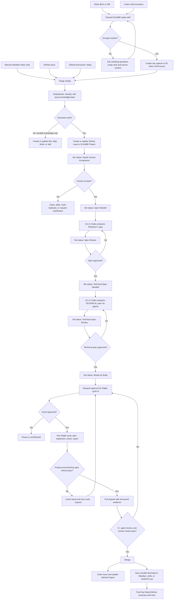

---
tags:
  - project/duumbi
  - doc/agent-workflow
  - doc/development-process
status: active
created: 2026-05-09
updated: 2026-05-09
related_maps:
  - "[[DUUMBI Agentic Development Map]]"
---

# DUUMBI - Development Intake to Delivery Workflow

## Summary

DUUMBI development should use one shared process with multiple entry points. A user can start from Slack, Codex, GitHub Issues, GitHub Discussions, or a raw Obsidian Inbox note, but the work should converge into the same artifact path:

1. capture the intent
2. clarify enough context
3. route raw material through `00 Inbox (ToProcess)/`
4. triage against the knowledge base and GitHub
5. create or update a GitHub issue in the DUUMBI Project
6. require human acceptance
7. produce a reviewed product/spec artifact
8. produce a reviewed technical specification for implementation agents
9. implement through permission-gated Ralph cycles in Codex or Oz
10. verify through CI, review, and structured evidence
11. sync durable lessons back into Obsidian, skills, or `AGENTS.md`

The core rule is source-of-truth separation:

- Slack is a capture, approval, and follow-up surface.
- Obsidian stores durable knowledge and raw material before triage.
- GitHub Issues, PRs, CI, and the DUUMBI Project store execution state.
- Agent skills store repeatable operating behavior.
- `AGENTS.md` stores source-repository-specific agent constraints.

## Operating Principles

- One workflow, multiple front doors. Slack Oz and Codex must use the same DUUMBI intake/triage/spec skills where possible.
- No implementation starts from vague intent. Ambiguity is a workflow state, not a reason to guess.
- Read-only context gathering comes before write-capable mutation. Agents should ask what exists, why it exists, where it lives, what proves it, and what risk a change carries before creating execution work.
- GitHub is the execution source of truth. Obsidian should not mirror current issue status, sprint state, assignees, or PR progress.
- Obsidian is the durable memory. Stable product, architecture, workflow, and research lessons should graduate into Dots, Maps, Works, or skills after verification.
- Human review gates product and architecture decisions. Agents can prepare, deduplicate, summarize, and recommend; humans accept scope and trade-offs.
- Each handoff must leave a traceable artifact with links back to source material.

## Tool Roles

| Tool or surface | Role | Writes to | Should not do |
|---|---|---|---|
| Slack | Fast capture, clarifying discussion, approvals, Oz run updates | Slack thread; linked Inbox/GitHub artifacts through agent | Act as durable memory or execution tracker |
| Warp Oz | Cloud agent orchestration, Slack-triggered work, scheduled sweeps, parallel or long-running tasks | GitHub issues/PRs, Obsidian via configured repo, Slack summaries | Make final product decisions without human acceptance |
| Codex | Local repo/vault work, source inspection, skill maintenance, spec drafting, implementation, PR review handling | Local files, GitHub through CLI/app, Obsidian vault | Treat local chat history as canonical project state |
| GitHub Issues | Execution work unit and discussion record for accepted or triaged work | Issue body/comments/labels/project fields | Store broad, untriaged brainstorming forever |
| GitHub Discussions Ideas | Open-ended idea intake and community/product discussion | Discussion thread; converted issue when actionable | Replace accepted implementation issues |
| GitHub Project | Execution sequencing, status, priority, ownership, review gates | Project fields | Store durable architecture rationale by itself |
| GitHub PRs and CI | Code change review, automated proof, merge gate | PR body, commits, checks, review threads | Carry undocumented product decisions after merge |
| Obsidian Inbox | Raw captured material waiting for classification | `Duumbi/00 Inbox (ToProcess)/` | Become permanent backlog |
| Obsidian Atlas | Durable product, architecture, workflow, glossary, and source-backed knowledge | Dots, Maps, Works | Mirror live delivery status |
| Agent skills | Repeatable agent playbooks shared by Oz and Codex | `.agents/skills/` | Hide project decisions that belong in GitHub or Obsidian |
| `AGENTS.md` | Repository-local agent contract | Source repo root | Store general product roadmap content |

## End-To-End Flow



## Stage 1 - Intake From Slack Oz

Trigger:

- A user tags `@Oz` in a Slack channel or thread, or DMs Oz.

Agent behavior:

1. Read the Slack message and available thread context.
2. Load the DUUMBI intake skill from the shared skill location.
3. Inspect the relevant active vault notes before answering.
4. Classify the input as quick idea, bug, feature proposal, architecture decision, research note, execution task, or agent-skill improvement.
5. Ask clarifying questions if the outcome, problem, target user, source evidence, urgency, or expected behavior is unclear.
6. When the user agrees, create a raw capture note under `Duumbi/00 Inbox (ToProcess)/`.
7. Reply in Slack with the captured interpretation, open questions, and the next processing step.

Minimum Inbox capture fields:

```markdown
# YYYY-MM-DD - Short Idea Title

## Source
- Surface: Slack
- Link: <Slack thread URL>
- Submitted by: <name or handle if appropriate>

## Raw input
<short source excerpt or summary>

## Interpreted intent
<agent interpretation>

## Classification
<idea | bug | feature | research | architecture | execution | knowledge | skill>

## Clarifications
- Answered:
- Open:

## Initial routing recommendation
<GitHub issue | GitHub Discussion | Dot/Map/Work | skill update | no action>
```

## Stage 2 - Intake From Codex

Trigger:

- The user invokes Codex directly and asks to capture or refine an idea.
- The user uses the same DUUMBI skill that Oz uses.

Agent behavior:

1. Read the user's request and the local vault context.
2. Use the same classification and clarification rules as Slack Oz.
3. If needed, inspect related GitHub state before deciding whether the input is new, duplicate, blocked, or already accepted.
4. Create the same Inbox capture artifact as the Oz path.
5. Return the same interpretation, open questions, and routing recommendation.

The important design constraint is that Slack Oz and Codex must not have separate mental models. Their entry surfaces differ; their capture schema and routing rules should be shared.

## Stage 3 - GitHub Issues And Discussions Intake

GitHub Issues can enter the flow in two ways:

- Already actionable issue: include it in the triage sweep and improve it if required.
- Unclear issue: label it `needs-clarification` and ask targeted questions before moving it forward.

GitHub Discussions under Ideas are treated as open-ended product input. They should be converted to a GitHub issue only when there is an actionable outcome, bounded scope, and enough confidence that the team wants to evaluate it as execution work.

## Stage 4 - Triage Sweep

Trigger:

- Scheduled Oz run.
- Manual Codex skill invocation.
- Human request to process Inbox or GitHub Ideas.

Inputs:

- `Duumbi/00 Inbox (ToProcess)/`
- open GitHub Issues in relevant intake states
- GitHub Discussions in the Ideas category
- optionally recent Slack captures that have not yet produced an Inbox note

Triage steps:

1. Read the source item and preserve the source link.
2. Search the vault for related Dots, Maps, Works, glossary terms, PRD sections, and prior decisions.
3. Search GitHub Issues, PRs, and Discussions for duplicates or related work.
4. Classify the item as execution work, durable knowledge, both, duplicate, rejected, or still unclear.
5. For execution work, create or update a GitHub issue in the DUUMBI Project.
6. For knowledge-only work, create or update the appropriate Dot, Map, Work, or skill.
7. For mixed work, create a GitHub issue and link the durable Obsidian note.
8. Set explicit open questions instead of burying uncertainty in prose.

Recommended GitHub issue body after triage:

```markdown
## Summary

## Source
- Origin:
- Links:

## User Outcome

## Problem

## Proposed Direction

## Knowledge Context
- Relevant Obsidian notes:
- Related issues or discussions:
- Existing code or docs:

## Scope Candidate
- In:
- Out:

## Risks And Trade-Offs

## Open Questions

## Triage Recommendation
- accept for spec
- ask clarification
- defer
- reject
- duplicate of #

## Acceptance Gate
- [ ] Human reviewed
- [ ] Accepted for spec
```

Project field updates:

- Status: `Needs Human Acceptance`
- Source: `Slack`, `Codex`, `Inbox`, `GitHub Issue`, or `GitHub Discussion`
- Type: `bug`, `feature`, `research`, `architecture`, `workflow`, `tech-debt`, or `knowledge`
- Labels: `needs-human-review`, plus source/type labels

## Stage 5 - Human Acceptance Gate

The triaged issue is not yet approved work. A human reviewer decides whether the team wants to spend specification effort on it.

Outcomes:

| Decision | Agent action | GitHub state |
|---|---|---|
| Accept | Move to spec preparation | `Spec Needed`, `accepted`, `needs-spec` |
| Needs clarification | Ask targeted questions in the source surface | `Needs Clarification` |
| Duplicate | Link canonical issue and close or mark duplicate | `Duplicate` |
| Defer | Preserve rationale and review date if known | `Deferred` |
| Reject | Close with short rationale | `Closed` |

Acceptance should verify:

- the problem is real enough to evaluate
- the desired outcome is understandable
- the work belongs in DUUMBI
- there is no already-accepted duplicate
- the expected value is plausible relative to cost and risk

## Stage 6 - Spec Preparation

Trigger:

- GitHub issue is accepted and marked `Spec Needed`.

Agent behavior:

1. Read the accepted issue, source links, related Discussions, PRD, glossary, relevant Dots/Maps/Works, and source code if the issue is implementation-facing.
2. Check whether an existing spec already covers the work.
3. Draft a `PRODUCT.md` style spec for non-trivial work.
4. For small issues, add the spec directly to the GitHub issue or as an issue comment.
5. For larger or architectural work, create a versioned spec in the source repository, for example `specs/DUUMBI-<issue-number>/PRODUCT.md`, and open a PR for the spec.
6. Move the issue to `Spec Review`.

Recommended DUUMBI product spec structure:

```markdown
# DUUMBI-<issue-number>: <Title>

## Summary

## Problem

## Outcome
What should be true when this is done?

## Scope
### In Scope

### Explicitly Out Of Scope

## Constraints And Assumptions
What must be preserved? What is assumed but not proven?

## Decisions
What decisions are already made, by whom, and where is the evidence?

## Behavior
Defaults, inputs, outputs, visible states, empty states, error states, cancellation,
offline/retry behavior, race conditions, accessibility/focus rules, and invariants.

## Tasks
How should the work be broken down? Which parts can run independently?

## Checks
What proves the work is correct? Include tests, CI, manual checks, review evidence,
and expected artifacts.

## Open Questions
Questions that block implementation or affect scope.

## Sources
Links to issues, discussions, Slack captures, Obsidian notes, code, docs, or external references.
```

The six-question format is a good minimum:

- Outcome: what should be true when done
- Scope: what is in and explicitly out
- Constraints: assumptions and constraints
- Decisions: decisions already made
- Tasks: work breakdown
- Checks: proof the work is correct

For DUUMBI, that minimum should be extended with `Problem`, `Behavior`, `Open Questions`, and `Sources`. Without those additions, agents can still miss edge cases, user-visible states, and traceability.

## Stage 7 - Spec Review Gate

The spec must be reviewed before implementation.

Review checklist:

- Outcome is testable.
- Scope has explicit non-goals.
- Constraints separate facts from assumptions.
- Decisions cite evidence or issue comments.
- Behavior covers success, empty, error, retry, cancellation, and relevant accessibility/focus states.
- Tasks are small enough for Codex or Oz runs.
- Checks map to acceptance criteria.
- Open questions are either resolved or explicitly accepted as risk.

If accepted:

- Status: `Technical Spec Needed`
- Labels: remove `needs-spec`, add `product-spec-approved` and `needs-tech-spec`

If rejected:

- Status: `Spec Needed` or `Needs Clarification`
- Agent updates the spec with review feedback.

## Stage 8 - Technical Specification Preparation

Trigger:

- The user-approved product specification is accepted and the issue is marked `Technical Spec Needed`.

Purpose:

- The product specification defines what should be true.
- The technical specification defines how AI implementation agents should safely make it true.

Agent behavior:

1. Read the approved product spec, issue, source links, relevant Obsidian notes, existing source code, tests, and repo `AGENTS.md`.
2. Identify the affected modules, contracts, data structures, commands, tests, generated artifacts, and documentation surfaces.
3. Translate product behavior into implementation boundaries, task order, validation checks, rollback expectations, and evidence requirements.
4. Define the Ralph cycle instructions that implementation agents must follow.
5. Define per-cycle resource controls: expected goal, max scope, expected commands, approximate cost/risk, and permission request format.
6. Move the issue to `Technical Spec Review`.

Assumption:

- `Ralph cycle` is not yet defined as a canonical active vault note. In this workflow, it means a permission-gated AI implementation loop: plan the next bounded step, ask for approval, implement only that approved step, run checks, report evidence, compare against the product and technical specs, then request approval for the next cycle if requirements are still unmet.

Recommended DUUMBI technical spec structure:

```markdown
# DUUMBI-<issue-number>: <Title> - Technical Specification

## Implementation Objective
Which approved product-spec outcomes this technical spec implements.

## Agent Audience
Which agents should use this spec: Codex, Oz, specialized reviewer, tester, or other.

## Source Context
- Product spec:
- GitHub issue:
- Relevant code:
- Relevant tests:
- Relevant Obsidian notes:
- Repo instructions:

## Affected Areas
Files, modules, graph nodes, schemas, commands, UI surfaces, docs, or CI paths expected to change.

## Technical Approach
The intended implementation strategy, important boundaries, dependencies, and rejected alternatives.

## Invariants
What must remain true throughout implementation.

## Ralph Cycle Protocol
Each cycle must:
1. summarize the current state and remaining unmet requirements
2. propose one bounded implementation goal
3. list intended file areas and commands
4. estimate resource use and risk
5. ask for explicit approval before starting
6. implement only the approved goal
7. run the agreed checks
8. report evidence, failures, and remaining gaps
9. stop if requirements are met or request approval for the next cycle

## Cycle Budget
- Default cycle size:
- Max files or modules per cycle:
- Expected command budget:
- When to stop and ask for human guidance:

## Task Breakdown
Ordered steps and independently executable slices.

## Verification Plan
Tests, builds, manual checks, screenshots, logs, and review artifacts required.

## Completion Criteria
The exact product-spec and technical-spec checks that must pass before PR review.

## Failure And Escalation
What the agent should do when tests fail, requirements conflict, cost grows, or scope changes.

## Open Questions
Questions that block implementation or require human trade-off decisions.
```

## Stage 9 - Technical Specification Review Gate

The technical spec must be reviewed before implementation agents start work.

Review checklist:

- The technical approach maps directly to the approved product spec.
- Affected areas are concrete enough for an AI agent to inspect and modify.
- Invariants and out-of-bounds areas are explicit.
- Ralph cycle protocol requires approval before every cycle.
- Cycle budget is small enough to manage resource usage.
- Verification plan maps to product-spec `Checks`.
- Failure and escalation rules stop the agent from spending unbounded resources.

If accepted:

- Status: `Ready for Build`
- Labels: remove `needs-tech-spec`, add `tech-spec-approved`

If rejected:

- Status: `Technical Spec Needed` or `Needs Clarification`
- Agent updates the technical spec with review feedback.

## Stage 10 - Ralph-Cycle Implementation

Tool choice:

- Use Codex for local repo changes, vault updates, focused implementation, review feedback, and work that benefits from direct local inspection.
- Use Oz for cloud execution, scheduled work, Slack-triggered tasks, parallel exploration, long-running tasks, or team-visible runs.

Implementation steps:

1. Read the approved issue, product spec, and technical spec.
2. Read the source repo `AGENTS.md`.
3. Create a feature branch.
4. Gather source context and identify affected modules.
5. Request permission for Ralph cycle 1 before making changes.
6. For each approved Ralph cycle, implement only the approved bounded goal.
7. Run the prescribed checks for that cycle.
8. Report evidence, failures, resource usage, and remaining unmet requirements.
9. If requirements are unmet, request explicit approval for the next cycle.
10. Stop the cycle loop when the product spec and technical spec completion criteria are met, or when the user declines another cycle.
11. Produce a structured review artifact.
12. Open a PR linked to the issue, product spec, and technical spec.
13. Move the issue to `In Review`.

Per-cycle permission request format:

```markdown
## Ralph Cycle <N> Approval Request

## Current State

## Remaining Requirements

## Proposed Cycle Goal

## Planned Changes

## Planned Checks

## Resource Estimate
- time:
- tool/model usage:
- command/test cost:
- risk:

## Stop Condition

Approve this cycle?
```

PR evidence should include:

- change summary
- linked issue, product spec, and technical spec
- affected files or modules
- test commands and results
- Ralph cycle summaries and approvals
- screenshots or logs when relevant
- risks and open questions
- explicit readiness state: `ready for human review` or `blocked`

## Stage 11 - Review, Verification, And Merge

Verification layers:

1. Automated checks: tests, lint, build, CI, benchmarks when relevant.
2. Agent review: Codex or Oz reviews the diff against the spec and reports findings by severity.
3. Human review: product fit, architecture fit, maintainability, risk, and operational impact.
4. Final PR merge only when checks and review expectations are satisfied.

No PR should merge only because the agent says it is done. The merge decision should be tied to evidence that maps back to the spec's `Checks` section.

## Stage 12 - Closure And Knowledge Sync

After merge:

1. Close or update the GitHub issue.
2. Move the Project item to `Done`.
3. Link the merged PR, checks, and final decision.
4. Update Slack or the original Discussion with the final link if the work started there.
5. Process any related Inbox note so it no longer looks untriaged.
6. Sync durable learning only when it changes future behavior:
   - Dot for atomic concept or decision
   - Map for navigation or synthesis
   - Work for mature product/architecture/spec synthesis
   - Skill for repeated workflow behavior
   - `AGENTS.md` for source-repository execution rules

Do not copy every PR summary into Obsidian. Only durable knowledge belongs there.

## Recommended Project Status Model

| Status | Meaning | Allowed next states |
|---|---|---|
| `Inbox Capture` | Raw idea exists but has not been triaged | `Needs Human Acceptance`, `Needs Clarification`, `Closed`, `Deferred` |
| `Needs Clarification` | Agent or human needs more information | `Needs Human Acceptance`, `Closed`, `Deferred` |
| `Needs Human Acceptance` | Triage is complete enough for a human decision | `Spec Needed`, `Needs Clarification`, `Closed`, `Deferred`, `Duplicate` |
| `Spec Needed` | Accepted work needs a product/spec artifact | `Spec Review`, `Needs Clarification` |
| `Spec Review` | Product spec exists and needs approval | `Technical Spec Needed`, `Spec Needed`, `Needs Clarification` |
| `Technical Spec Needed` | Approved product spec needs an agent-facing technical spec | `Technical Spec Review`, `Needs Clarification` |
| `Technical Spec Review` | Technical spec exists and needs approval | `Ready for Build`, `Technical Spec Needed`, `Needs Clarification` |
| `Ready for Build` | Product and technical specs are approved | `Cycle Authorization`, `Blocked` |
| `Cycle Authorization` | Agent needs explicit approval before the next Ralph cycle | `In Progress`, `Blocked`, `Deferred` |
| `In Progress` | Approved Ralph cycle is running | `Cycle Authorization`, `In Review`, `Blocked` |
| `In Review` | PR or equivalent artifact is under review | `In Progress`, `Done`, `Blocked` |
| `Blocked` | Work cannot proceed without external decision or dependency | previous active state, `Deferred`, `Closed` |
| `Done` | Merged or otherwise completed with evidence | none |
| `Deferred` | Valuable but intentionally postponed | `Needs Human Acceptance`, `Closed` |
| `Duplicate` | Superseded by another issue | none |
| `Closed` | Rejected or no longer relevant | none |

## Suggested Shared Skills

The workflow should be split into focused, reusable skills rather than one large vague agent prompt:

| Skill | Used by | Responsibility |
|---|---|---|
| `duumbi-idea-intake` | Oz, Codex | Capture Slack/Codex/raw input, clarify, write Inbox capture |
| `duumbi-triage` | Oz, Codex | Sweep Inbox, Issues, Discussions; dedupe; create/update GitHub issue |
| `duumbi-spec-draft` | Oz, Codex | Turn accepted issues into PRODUCT specs |
| `duumbi-spec-review` | Oz, Codex | Review specs against DUUMBI checklist before build |
| `duumbi-tech-spec-draft` | Oz, Codex | Turn approved product specs into agent-facing technical specs |
| `duumbi-tech-spec-review` | Oz, Codex | Review technical specs for implementability, bounded cycles, and verification |
| `duumbi-ralph-cycle` | Oz, Codex | Run one approved Ralph cycle and stop with evidence plus next-cycle recommendation |
| `duumbi-implementation` | Oz, Codex | Implement approved technical specs with repo `AGENTS.md`, Ralph cycles, and evidence rules |
| `duumbi-review-artifact` | Oz, Codex | Produce structured review artifacts for PRs |
| `duumbi-knowledge-sync` | Oz, Codex | Sync durable lessons to Dots, Maps, Works, skills, or `AGENTS.md` |

The existing `duumbi-obsidian-capture` skill already covers part of intake and knowledge routing. It can either be extended or kept as the knowledge-sync layer while more specialized execution skills are added.

## Source Set

- [[DUUMBI Agentic Development Map]]
- [[DUUMBI - PRD]]
- [[Slack as Thin Surface; GitHub + Obsidian as Sources of Truth]]
- [[Slack as Mobile Capture Surface]]
- [[GitHub Project as Execution Source of Truth]]
- [[Obsidian Vault as Agent Knowledge Substrate]]
- [[Inbox-to-Atlas Processing Workflow]]
- [[Spec-First Agentic Development]]
- [[Structured Agent Review Artifacts]]
- [[Agent Skills as Operational Playbooks]]
- [[Warp Oz and Codex Development Toolchain]]
- Warp Oz Slack integration docs: https://docs.warp.dev/agent-platform/integrations/slack
- Warp Oz platform docs: https://docs.warp.dev/agent-platform/cloud-agents/platform
- Warp Skills as Agents docs: https://docs.warp.dev/agent-platform/cloud-agents/skills-as-agents
- GitHub Projects docs: https://docs.github.com/en/issues/planning-and-tracking-with-projects
- Referenced Warp PRODUCT spec example: https://github.com/warpdotdev/warp/blob/master/specs/APP-4218/PRODUCT.md
