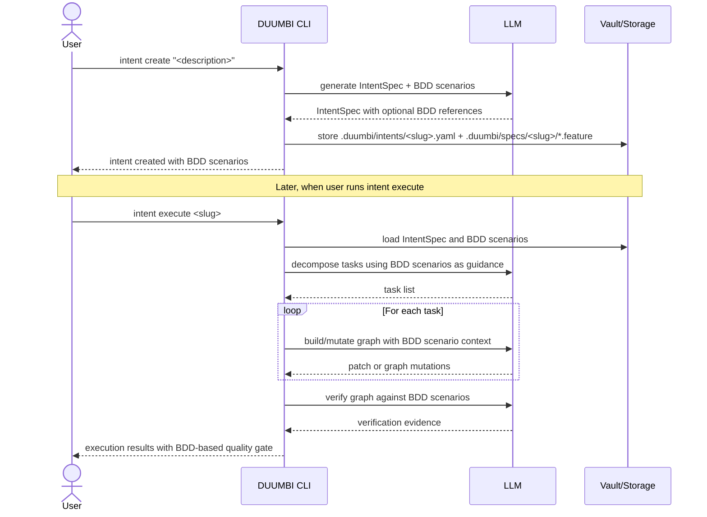

---
tags:
  - duumbi/inbox/enriched
  - duumbi/status/processed
  - duumbi/classification/feature
  - duumbi/value/high
  - duumbi/importance/high
  - duumbi/complexity/high
duumbi_inbox_enrichment: processed
duumbi_inbox_enrichment_generated_at: 2026-05-30T18:24:00.126Z
---

# BDD In Intent Workflow

<!-- duumbi-inbox-enrichment:v1 status=processed generated_at=2026-05-30T18:24:00.126Z -->

## Source
- Surface: Manual Obsidian edit
- Vault path: Duumbi/00 Inbox (ToProcess)/2026-05-18 - BDD In Intent Workflow.md
- Submitted by: unknown unless explicit in the raw input

## Raw input
> # 2026-05-18 - BDD In Intent Workflow
> 
> ## Source
> - Source: Codex
> - Surface: Codex
> - Conversation context: The user asked Codex to run DUUMBI Stage 2 intake with `duumbi-codex-intake`, research a Medium article about BDD as a specification language for AI, inspect DUUMBI vault and GitHub context read-only, and recommend routing without creating specs or implementation changes. The user later clarified that this idea is about development using the DUUMBI application, not about the internal workflow used to develop DUUMBI itself.
> - Submitted by: User
> 
> ## Raw input
> The user wrote: "When create intenet, duumbi add BDD (https://medium.com/@wasowski.jarek/sdd-writing-specifications-for-ai-bdd-as-the-missing-link-spec-driven-development-ad1b540b7f75). Examine, analyze and research the duumbi workflow (intent to running application) and improve qualty with technic."
> 
> Interpreted in natural English: when a user creates an intent, DUUMBI should add BDD-style behavior scenarios. Research the article's argument, examine the DUUMBI workflow from intent creation to a running application, and identify a technically rigorous quality improvement path.
> 
> Follow-up clarification from the user: the idea is about DUUMBI as an application used by developers. When users specify work through an intent, DUUMBI should also plan BDD specifications alongside that intent. Later, when users run `intent execute` to produce the desired semantic graph, the BDD specifications should help builder and tester agents. The BDD artifacts should likely be stored next to the intent specification by reference, so users can also review them with Gherkin-aware tools.
> 
> The idea is not about the process used to develop DUUMBI itself. DUUMBI's internal development workflow already uses BDD in product specs, technical specs, and skills. That internal workflow is separate from the product feature proposed here.
> 
> ## Interpreted intent
> Evaluate whether DUUMBI should introduce BDD/Gherkin-style specification artifacts as first-class companions to runtime user intents.
> 
> In the desired DUUMBI product behavior, a user creates an intent for an application they want DUUMBI to build or modify. DUUMBI then derives or helps design linked BDD specifications for that intent. During `intent execute`, the semantic-graph builder and tester agents use those BDD scenarios as execution and verification guidance, improving the quality of the generated semantic graph and the confidence that the graph implements the requested behavior.
> 
> The BDD artifacts should probably be stored beside the intent specification and referenced from it, rather than being embedded only as loose text. A likely shape is Gherkin `.feature` files or equivalent scenario files linked from the runtime `IntentSpec`, so users can inspect them in DUUMBI and in external Gherkin-aware tools.
> 
> This should not immediately create a product spec or implementation. Stage 4 triage should decide whether the idea becomes a GitHub issue, a GitHub Discussion, a source-backed Atlas note, or a staged product/architecture decision.
> 
> Non-goal: this is not about changing DUUMBI's own development workflow. DUUMBI's internal workflow already uses BDD in Stage 6 product specs, Stage 8 technical specs, and related skills. That is background context only. The product question here is whether DUUMBI users should get BDD artifacts when they develop applications with DUUMBI.
> 
> ## Classification
> feature proposal; architecture decision; research note or source link; execution task
> 
> ## Clarifications
> ### Answered
> - The user explicitly asked to capture the idea in the DUUMBI Inbox using Stage 2 Codex intake.
> - The user explicitly requested English capture, read-only vault and GitHub inspection, and routing recommendation.
> - The user explicitly said not to create specs or implementation changes.
> - The user clarified that the target is development using the DUUMBI application, not the process for developing DUUMBI itself.
> - The user clarified that BDD specifications should support semantic graph generation and the builder/tester agents during `intent execute`.
> - The user suggested storing BDD artifacts beside the intent spec by reference, so Gherkin-aware applications can review them.
> 
> ### Open
> - Should runtime `IntentSpec` reference external BDD/Gherkin files, embed BDD scenarios directly, or support both?
> - What file layout should DUUMBI use for intent-linked BDD artifacts, for example `.duumbi/intents/<slug>.yaml` plus `.duumbi/specs/<slug>/*.feature`?
> - Should BDD be required for every executable intent, or only for ambiguous, multi-surface, user-facing, or high-risk intents?
> - Should the deterministic preflight gate score BDD scenario quality, or should a separate intent-quality analyzer handle BDD coverage?
> - Should DUUMBI use strict Gherkin syntax (`Feature`, `Rule`, `Scenario`, `Given`, `When`, `Then`, `And`, `But`) or a lighter scenario format optimized for agent execution?
> - How should BDD scenarios map to DUUMBI's current verifier limitation of i64 function test cases, semantic graph validation, generated app behavior, manual checks, and live E2E evidence?
> - Should builder agents receive the BDD scenarios directly in mutation prompts, or should they receive a derived implementation contract generated from the scenarios?
> - Should tester agents generate or select tests from the BDD scenarios before graph mutation, after graph mutation, or both?
> 
> ## Relevant DUUMBI context
> - `Duumbi/How to use.md`: the Inbox stores raw ideas and article links; GitHub is the execution source of truth; specs should make agent behavior unambiguous before implementation.
> - `Duumbi/01 Atlas (Knowledge Base)/Works (Developed Materials)/DUUMBI - PRD.md`: DUUMBI is intent-first, queryable-first, graph-centered, evidence-oriented, and designed to reduce drift between intent, implementation, execution state, and durable knowledge.
> - `Duumbi/01 Atlas (Knowledge Base)/Works (Developed Materials)/DUUMBI - Glossary.md`: an intent should be clarified into defaults, inputs, outputs, edge cases, invariants, and verification steps before implementation.
> - `Duumbi/01 Atlas (Knowledge Base)/Maps (Overviews)/DUUMBI Agentic Development Map.md`: read-only context and risk inspection should happen before mutation; execution work routes through GitHub while durable knowledge routes to Obsidian.
> - `Duumbi/01 Atlas (Knowledge Base)/Works (Developed Materials)/DUUMBI - Agentic Development Runbook.md`: background context only. DUUMBI's internal development workflow already requires English Gherkin-style BDD scenarios in Stage 6 product specs and BDD-to-test mapping in Stage 8 technical specs; this intake is about adding analogous BDD support to the DUUMBI product workflow used by DUUMBI users.
> - `Duumbi/01 Atlas (Knowledge Base)/Works (Developed Materials)/DUUMBI - Development Intake to Delivery Workflow.md`: deprecated historical reference, but still records Stage 2 Codex intake behavior and the original skill contract.
> - `/Users/heizergabor/space/hgahub/duumbi/.agents/skills/duumbi-codex-intake/SKILL.md`: authoritative Stage 2 intake instructions used for this capture.
> - `/Users/heizergabor/space/hgahub/duumbi/AGENTS.md`: source repo contract says DUUMBI is an AI-first semantic graph compiler with intent-driven development, and that the vault is directly edited through filesystem tools.
> - `/Users/heizergabor/space/hgahub/duumbi/src/intent/spec.rs`: current `IntentSpec` stores natural-language intent, acceptance criteria, modules, i64 test cases, dependencies, optional context, and execution metadata; it has no BDD scenario field and no reference to external BDD/Gherkin artifacts.
> - `/Users/heizergabor/space/hgahub/duumbi/src/intent/create.rs`: `intent create` prompts for acceptance criteria and i64 test cases, not BDD scenarios.
> - `/Users/heizergabor/space/hgahub/duumbi/src/intent/preflight.rs`: current deterministic preflight validates acceptance criteria, test-case presence, acceptance/test alignment, entrypoint/module quality, type constraints, edge cases, reuse candidates, and decomposition hints; it does not validate BDD scenario structure.
> - `/Users/heizergabor/space/hgahub/duumbi/specs/DUUMBI-553/PRODUCT.md`: the completed preflight scope intentionally kept v1 deterministic, provider-free, and based on the existing `IntentSpec` shape rather than introducing YAML schema changes. A BDD companion-artifact model would be a new product feature adjacent to this work.
> - Medium source inspected: Jaroslaw Wasowski, "SDD Writing Specifications for AI: BDD as the Missing Link - Spec-Driven Development", published April 28, 2026. Publicly visible article text argues that AI coding needs specifications as execution contracts and presents BDD/Given-When-Then scenarios as a bridge between business specification and multiple test levels. The article is member-only, so only public title, subtitle, metadata, and visible excerpt were inspected.
> 
> ## Related GitHub context
> GitHub was inspected read-only through the GitHub connector.
> 
> - No open GitHub issue was found for `BDD`, `Gherkin`, or `intent create quality`.
> - No open or closed issue was found for `BDD`; no relevant PR was found for `BDD Gherkin preflight intent`.
> - Closest completed issue: https://github.com/hgahub/duumbi/issues/553, `feat(intent): add deterministic IntentSpec preflight quality gate`.
> - Related completed PRs:
>   - https://github.com/hgahub/duumbi/pull/554 added the DUUMBI-553 product spec.
>   - https://github.com/hgahub/duumbi/pull/557 added the DUUMBI-553 technical spec.
>   - https://github.com/hgahub/duumbi/pull/558 implemented the deterministic preflight quality gate.
> - Relevant older intent pipeline issues surfaced by GitHub search: #79 stabilized the `IntentSpec` YAML shape, #80 implemented LLM-assisted `intent create`, #82 implemented coordinator decomposition, #83 implemented `intent execute`, and #84 implemented verifier test execution.
> 
> ## Initial routing recommendation
> Route to Stage 4 triage as a likely GitHub Discussion or GitHub issue with an architecture decision component.
> 
> Recommended Stage 4 handling:
> - Treat this as a new idea adjacent to completed issue #553, not a duplicate of #553.
> - First decide the product boundary for DUUMBI users: should BDD be stored as intent-linked `.feature` files, embedded in runtime `IntentSpec`, generated as non-persisted review evidence, or derived only during execution?
> - If the accepted boundary changes runtime user behavior, create a GitHub issue. If the boundary is still uncertain, start as a GitHub Discussion or architecture Dot before execution.
> - Consider a follow-up Atlas Dot only after triage clarifies DUUMBI's stable position on BDD as a product feature for user-created intents.
> 
> ## Requested follow-up
> - Capture the idea in `Duumbi/00 Inbox (ToProcess)/`.
> - Clarify that this idea is about development using DUUMBI, not development of DUUMBI.
> - Later triage should inspect whether BDD belongs in `intent create`, `IntentSpec` references, external `.feature` files, preflight scoring, builder-agent context, tester-agent context, or some combination.
> - Do not create product specs, technical specs, GitHub issues, PRs, source changes, or implementation work during Stage 2.
> 
> ## Notes
> - Facts:
>   - This idea is about the DUUMBI product workflow used by DUUMBI users to develop applications.
>   - It is not about the internal workflow used to develop DUUMBI itself.
>   - The active DUUMBI runbook already requires BDD scenarios in product specs and BDD-to-test mapping in technical specs for DUUMBI's own agentic development workflow.
>   - Runtime `IntentSpec` currently has no BDD scenario field and no reference to external BDD/Gherkin artifacts.
>   - Runtime verifier test cases currently model callable i64 function checks, so they cannot directly express all user-facing BDD outcomes.
>   - The completed DUUMBI-553 preflight gate improves `IntentSpec` quality using deterministic checks over the existing spec shape.
>   - No open GitHub issue matching BDD/Gherkin intent creation was found during read-only inspection.
> - Assumptions:
>   - The user's typo "intenet" means "intent".
>   - The intended improvement is to raise the quality of the DUUMBI user workflow from intent to generated semantic graph to running application.
>   - The Medium article is being used as conceptual input, not as an authoritative implementation spec.
>   - A schema change to `IntentSpec`, or a new linked BDD artifact directory, would need stronger product acceptance than merely improving the create prompt.
> - Recommendations:
>   - Do not jump directly to adding a `bdd_scenarios` YAML field. First decide whether BDD should be canonical runtime data, linked external `.feature` files, generated review evidence, or a derived execution contract.
>   - Prefer referenced companion artifacts over loose embedded text if external Gherkin tooling compatibility is important.
>   - If accepted, prefer an incremental path: make `intent create` produce previewed scenario files or scenario-shaped acceptance criteria, then teach preflight to detect missing or unmapped scenario coverage, before committing to broad schema changes.
>   - Keep BDD-to-test mapping explicit: every scenario should map to verifier tests, semantic graph validation, integration tests, live E2E, manual evidence, or review evidence.
>   - Avoid introducing a Cucumber/Gherkin runner by default. DUUMBI can use Gherkin as a specification language without adding a new test runtime unless Stage 4/5 accepts that extra complexity.
>   - Preserve the distinction between product-level behavior scenarios and DUUMBI's current low-level i64 function verifier tests; they solve different verification problems.

## Interpreted intent

Evaluate whether DUUMBI should introduce BDD/Gherkin-style specification artifacts as first-class companions to runtime user intents.

## Developer summary

Introduce BDD/Gherkin scenario artifacts as optional companions to runtime IntentSpec. When a user creates an intent, DUUMBI should derive or assist in creating linked BDD feature files (Gherkin syntax) stored beside the intent spec. During intent execute, builder and tester agents should consult these scenarios for validation and evidence, improving the quality and confidence of generated semantic graphs. This is a product feature for DUUMBI users, not a change to DUUMBI's internal workflow (which already uses BDD).

## UML overview

## Classification
- Type: feature
- Business value: high
- Importance: high
- Complexity: high

## Clarifications
### Answered
- The user explicitly asked to capture the idea in the DUUMBI Inbox using Stage 2 Codex intake.
- The user explicitly requested English capture, read-only vault and GitHub inspection, and routing recommendation.
- The user explicitly said not to create specs or implementation changes.
- The user clarified that the target is development using the DUUMBI application, not the process for developing DUUMBI itself.
- The user clarified that BDD specifications should support semantic graph generation and the builder/tester agents during `intent execute`.

### Open
- Should runtime `IntentSpec` reference external BDD/Gherkin files, embed BDD scenarios directly, or support both?
- What file layout should DUUMBI use for intent-linked BDD artifacts, e.g. `.duumbi/intents/<slug>.yaml` plus `.duumbi/specs/<slug>/*.feature`?
- Should BDD be required for every executable intent, or only for ambiguous, multi-surface, user-facing, or high-risk intents?
- Should the deterministic preflight gate score BDD scenario quality, or should a separate intent-quality analyzer handle BDD coverage?
- Should DUUMBI use strict Gherkin syntax (`Feature`, `Rule`, `Scenario`, `Given`, `When`, `Then`, `And`, `But`) or a lighter scenario format optimized for agent execution?
- How should BDD scenarios map to DUUMBI's current verifier limitation of i64 function test cases, semantic graph validation, generated app behavior, manual checks, and live E2E evidence?
- Should builder agents receive the BDD scenarios directly in mutation prompts, or should they receive a derived implementation contract generated from the scenarios?
- Should tester agents generate or select tests from the BDD scenarios before graph mutation, after graph mutation, or both?

## Relevant DUUMBI context
- Duumbi/How to use.md: Defines vault structure, source of truth rules, and spec quality bar. Supports the idea that this feature should be an Inbox item routed to GitHub for execution.
- Duumbi/01 Atlas (Knowledge Base)/Works (Developed Materials)/DUUMBI - PRD.md: The PRD describes DUUMBI as intent-driven and agentic. This feature aligns with the goal of making intents unambiguous and verifiable.
- Duumbi/01 Atlas (Knowledge Base)/Works (Developed Materials)/DUUMBI - Glossary.md: Defines 'Intent' as something to be clarified with defaults, states, verification steps. BDD scenarios could serve as structured verification artifacts.
- Duumbi/01 Atlas (Knowledge Base)/Maps (Overviews)/DUUMBI Agentic Development Map.md: Describes the read-then-write workflow and routing execution work to GitHub. This feature idea should be routed accordingly.
- Duumbi/01 Atlas (Knowledge Base)/Works (Developed Materials)/DUUMBI - Agentic Development Runbook.md: The internal DUUMBI development workflow already uses BDD in product and technical specs. This context confirms the proposed feature is for the DUUMBI product workflow, not for the process of developing DUUMBI itself.

## Related GitHub context

No existing GitHub issues or PRs directly related to BDD for runtime intents were found. DUUMBI-553 implemented the preflight quality gate for IntentSpec v1, which did not include BDD scenarios. This idea is a new addition.

## Initial routing recommendation

GitHub issue

## Requested follow-up
- Route this Inbox note to Stage 4 triage for evaluation, deduplication, and potential GitHub issue creation.

## AI agent instructions
- Create a GitHub issue with title derived from the note's title.
- Include the developer_summary as the issue description.
- Link to the Inbox note path in duumbi-vault.
- Include the clarifications_open as discussion points under and open questions section.
- Set labels 'feature' or 'enhancement'.
- Assign to the DUUMBI project board under Idea or Triage.

## Scope candidate
### In
- Introduce BDD scenario artifacts linked to runtime IntentSpec.
- Store BDD artifacts beside intents by reference.
- Integrate BDD scenarios into intent execute for builder and tester agents.
- Allow users to review scenarios with Gherkin-aware tools.

### Out
- Changing DUUMBI's internal spec workflow.
- Immediate product spec or implementation.
- Embedding BDD only as loose text without file reference.

## Risks and trade-offs
- Increased complexity of intent create/execute flows.
- BDD scenario generation quality may vary, requiring user verification.
- File layout and format decisions may cause backward compatibility issues.
- Over-engineering if BDD becomes mandatory for all intents.
- Ambiguity in Gherkin syntax for low-level graph operations.

## Obsidian tags

#duumbi/inbox/enriched #duumbi/status/processed #duumbi/classification/feature #duumbi/value/high #duumbi/importance/high #duumbi/complexity/high

## Enrichment result
- Date: 2026-05-30T18:24:00.126Z
- Status: ready for triage
- Canonical duplicate: none verified
- Facts:
- User proposed BDD as a specification technique for DUUMBI's product workflow when creating and executing intents.
- User linked to a Medium article about BDD as a specification language for AI.
- User clarified that this is about DUUMBI usage by developers, not DUUMBI's own development.
- Current IntentSpec has no BDD field; preflight validates acceptance criteria but not BDD scenarios.
- DUUMBI's internal development workflow uses BDD in product and technical specs.
- Assumptions:
- That the feature would improve graph quality and user confidence.
- That DUUMBI agents can generate or reason about Gherkin scenarios.
- That storing BDD alongside intents is feasible within current file system constraints.
- That BDD scenarios will map to meaningful verification during graph compilation and testing.
- Recommendations:
- Route to GitHub issue for further discussion and specification.
- Keep BDD artifacts optional in early versions.
- Conduct a technical spike to evaluate Gherkin integration with graph mutation and verification.

## Triage result
- Date: 2026-06-07T13:55:52.597Z
- Classification: execution work
- Routing: Automated Stage 4 triage refill created or selected GitHub issue #673 and routed it to Needs Human Acceptance.
- GitHub artifacts:
  - https://github.com/hgahub/duumbi/issues/673
- Obsidian artifacts:
  - none
- Canonical duplicate:
  - none
- Open questions:
  - See GitHub issue.
- Assumptions:
  - Cleanup disposition is applied because the issue already exists and the source Inbox note was left behind by the missing automation step.
- Next stage: Needs Human Acceptance

## Closure disposition
- Date: 2026-06-14
- Status: completed
- GitHub issue: https://github.com/hgahub/duumbi/issues/673
- Merged implementation PR: https://github.com/hgahub/duumbi/pull/703
- Merge commit: `0855a44b0f20ce1c8603891ec57d9eb075c0f956`
- Product spec: `/Users/heizergabor/space/hgahub/duumbi/specs/DUUMBI-673/PRODUCT.md`
- Technical spec: `/Users/heizergabor/space/hgahub/duumbi/specs/DUUMBI-673/TECHNICAL.md`
- Stage 11 review artifact: https://github.com/hgahub/duumbi/pull/703#issuecomment-4701828872
- Outcome: DUUMBI now supports runtime intent BDD companion artifacts: new executable intents can save linked `.feature` files beside the intent YAML, `IntentSpec` references them through `bdd.feature_files`, review/preflight/execute/Studio surfaces recompute and show BDD readiness/coverage, explicit broken BDD artifacts block before mutation side effects, and legacy no-BDD intents remain warning-only.
- Durable knowledge note: source repo `docs/architecture.md` was updated by the merged PR; this processed Inbox note is retained as historical source context rather than current live status.

