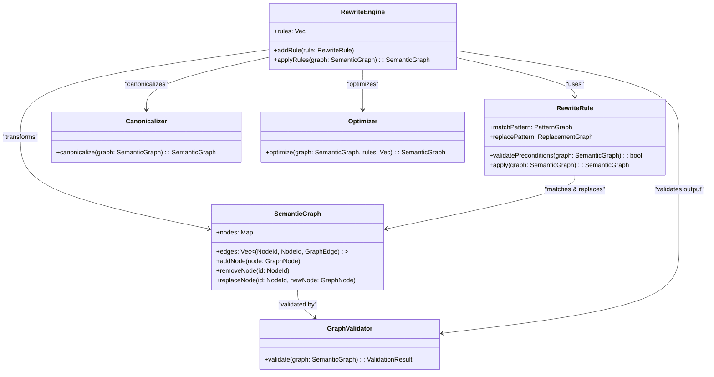

---
tags:
  - duumbi/inbox/enriched
  - duumbi/status/processed
  - duumbi/classification/architecture
  - duumbi/value/high
  - duumbi/importance/high
  - duumbi/complexity/high
duumbi_inbox_enrichment: processed
duumbi_inbox_enrichment_generated_at: 2026-05-31T07:19:21.171Z
---

# Semantic Rewrite Engine as Formal Graph Transformation Substrate

<!-- duumbi-inbox-enrichment:v1 status=processed generated_at=2026-05-31T07:19:21.171Z -->

## Source
- Surface: Manual Obsidian edit
- Vault path: Duumbi/00 Inbox (ToProcess)/2026-05-19 - Semantic Rewrite Engine Positioning.md
- Submitted by: unknown unless explicit in the raw input

## Raw input
> # 2026-05-19 - Semantic Rewrite Engine Positioning
> 
> ## Source
> - Surface: Slack
> - Link: Slack thread reference not provided (timestamp: 1779170097.181449, channel: D0B2X744E2U)
> - Submitted by: Slack user via `the Slack intake shortcut`
> 
> ## Raw input
> The user argues that DUUMBI's Semantic Rewrite Engine should be treated as a formal, graph-level semantic transformation substrate (closer to compiler optimization, theorem rewriting, and e-graph systems) rather than a text or AST refactor tool. The message describes problem framing, rewrite semantics, required components, rewrite categories, e-graph relevance, autonomous-agent stability value, long-term direction, IR shape, MVP phases, immutable-vs-mutable architecture trade-off, and semantic explosion risks.
> 
> ## Interpreted intent
> Capture and elevate a product-and-architecture framing: DUUMBI should position and design the Semantic Rewrite Engine as a verified semantic graph transformation core with explicit constraints, validation, canonicalization, and optimization strategy. The user also suggests this capability could become DUUMBI's differentiator and long-term substrate for intent-driven, autonomous, and potentially self-evolving software adaptation.
> 
> ## Classification
> architecture
> 
> ## Clarifications
> ### Answered
> - none
> 
> ### Open
> - Should this be routed first as a GitHub Discussion (research/positioning) or as one or more scoped implementation issues (for MVP Phase 1/2/3)?
> - What is the preferred first concrete deliverable: architecture RFC, glossary/PRD update, or technical spike issue with measurable acceptance criteria?
> 
> ## Relevant DUUMBI context
> - `Duumbi/How to use.md`
> - `Duumbi/01 Atlas (Knowledge Base)/Works (Developed Materials)/DUUMBI - PRD.md`
> - `Duumbi/01 Atlas (Knowledge Base)/Works (Developed Materials)/DUUMBI - Glossary.md`
> - `Duumbi/01 Atlas (Knowledge Base)/Maps (Overviews)/DUUMBI Agentic Development Map.md`
> - `Duumbi/01 Atlas (Knowledge Base)/Works (Developed Materials)/DUUMBI - Agentic Development Runbook.md`
> 
> ## Initial routing recommendation
> needs clarification before triage
> 
> ## Requested follow-up
> - Record this framing for Stage 4 triage and decide whether it should become a GitHub Discussion idea, a product/architecture documentation update, or scoped execution issues.
> 
> ## Notes
> - Facts:
>   - The Slack message provides a detailed architecture framing and proposed component model.
>   - The message explicitly contrasts semantic graph rewrites against text-based AI code mutation.
>   - The message includes staged MVP and risk notes (semantic explosion, bounded search/cost model requirements).
> - Assumptions:
>   - The user wants this preserved as actionable workflow input, not immediate implementation in Stage 1.
>   - The framing may affect product positioning, glossary language, and technical roadmap.
> - Recommendations:
>   - Triage this as an architecture-direction item.
>   - Convert to a concrete decision artifact before implementation routing (Discussion or RFC-like issue).

## Interpreted intent

Position and design DUUMBI's Semantic Rewrite Engine as a verified semantic graph transformation core, treating it as a compiler-like, graph-level substrate (analogous to compiler optimizations, theorem rewriting, and e-graph systems) rather than a text/AST refactor tool. The user envisions this as a potential long-term differentiator for autonomous, intent-driven software adaptation.

## Developer summary

The user proposes treating DUUMBI's Semantic Rewrite Engine as a formal, verified graph transformation system. This requires defining rewrite rules as first-class artifacts that operate on the semantic graph IR (petgraph), with components for pattern matching, replacement, validation, canonicalization, and optimization. The MVP should include staged implementation (Phase 1: basic rule DSL and graph-to-graph transformations; Phase 2: bounded e-graph equality saturation; Phase 3: autonomous intent-driven rewrite exploration). Key risks include semantic explosion, unbounded search, and misalignment with current compiler pipeline priorities. This should first be routed as an architecture direction item (GitHub Discussion or RFC issue) before any source-code work.

## UML overview

## Classification
- Type: architecture
- Business value: high
- Importance: high
- Complexity: high

## Clarifications
### Answered
- The user explicitly argues that the rewrite engine must operate at the semantic graph level, not as a text/AST refactor.

### Open
- Should this be routed first as a GitHub Discussion (research/positioning) or as one or more scoped implementation issues (for MVP Phase 1/2/3)?
- What is the preferred first concrete deliverable: architecture RFC, glossary/PRD update, or technical spike issue with measurable acceptance criteria?
- Which MVP phase should be scoped first, and what are the exact acceptance criteria for that phase?

## Relevant DUUMBI context
- Duumbi/How to use.md (clarifies how new architectural ideas are routed)
- Duumbi/01 Atlas (Knowledge Base)/Works (Developed Materials)/DUUMBI - PRD.md (current product thesis and architecture principles)
- Duumbi/01 Atlas (Knowledge Base)/Works (Developed Materials)/DUUMBI - Glossary.md (definitions for terms like 'Semantic Graph')
- Duumbi/01 Atlas (Knowledge Base)/Maps (Overviews)/DUUMBI Agentic Development Map.md (maps agentic development workflow and decision gates)
- Duumbi/01 Atlas (Knowledge Base)/Works (Developed Materials)/DUUMBI - Agentic Development Runbook.md (specifies intake-to-delivery process, including review gates)

## Related GitHub context

triage should verify later

## Initial routing recommendation

needs clarification before triage

## Requested follow-up
- Record this framing for Stage 4 triage and decide whether it should become a GitHub Discussion idea, a product/architecture documentation update, or scoped execution issues.

## AI agent instructions
- When converting this to a GitHub Issue or Discussion, frame it as an architectural direction item.
- Include the user's proposal for a formal rewrite engine with components, MVP phases, and risks.
- Do not assume immediate implementation; first clarify whether this becomes a GitHub Discussion or a product documentation update.
- Link to relevant DUUMBI context (PRD, Glossary, Agentic Development Map) and the source code architecture docs.
- If routing as a GitHub Discussion, tag it with 'idea' and 'architecture' labels and describe the intended direction without implementation details.
- If routing as an issue, scope it narrowly (e.g., 'Define Semantic Rewrite Engine architecture RFC') and block on human acceptance.

## Scope candidate
### In
- Defining the Semantic Rewrite Engine as a formal graph transformation system
- Drafting architecture RFC or product documentation update
- Exploring integration with DUUMBI's existing graph IR (`petgraph::StableGraph`)
- Proposing MVP phases and risk mitigation strategies

### Out
- Implementing the rewrite engine in source code
- Creating GitHub issues for implementation details
- Modifying the compiled output or existing compiler pipeline without acceptance
- Making PRD/glossary changes without human-approved decision

## Risks and trade-offs
- Scope creep if the rewrite engine expands beyond planned MVP phases
- Over-engineering before concrete use cases are validated
- Semantic explosion or unbounded search without a cost model
- Misalignment with current compiler pipeline priorities and delivery schedule
- Lack of clear acceptance criteria may stall the proposal in discussion

## Obsidian tags

#duumbi/inbox/enriched #duumbi/status/processed #duumbi/classification/architecture #duumbi/value/high #duumbi/importance/high #duumbi/complexity/high

## Enrichment result
- Date: 2026-05-31T07:19:21.171Z
- Status: ready for triage
- Canonical duplicate: none verified
- Facts:
- The Slack message provides a detailed architecture framing and proposed component model.
- The message explicitly contrasts semantic graph rewrites against text-based AI code mutation.
- The message includes staged MVP and risk notes (semantic explosion, bounded search/cost model requirements).
- Assumptions:
- The user wants this preserved as actionable workflow input, not immediate implementation in Stage 1.
- The framing may affect product positioning, glossary language, and technical roadmap.
- Recommendations:
- Triage this as an architecture-direction item.
- Convert to a concrete decision artifact before implementation routing (Discussion or RFC-like issue).

## Triage result
- Date: 2026-06-08T09:42:28.398Z
- Classification: execution work
- Routing: Created GitHub issue #684 and routed it to Needs Human Acceptance.
- GitHub artifacts:
  - https://github.com/hgahub/duumbi/issues/684
- Obsidian artifacts:
  - none
- Canonical duplicate:
  - none
- Open questions:
  - See GitHub issue.
- Assumptions:
  - Automated triage refill selected this source as actionable. Rationale: Existing eligible Todo issues (#93, #525) are noise. The Semantic Rewrite Engine note is a high-value architecture item ready for human acceptance to reach the minimum queue depth.
- Next stage: Needs Human Acceptance
