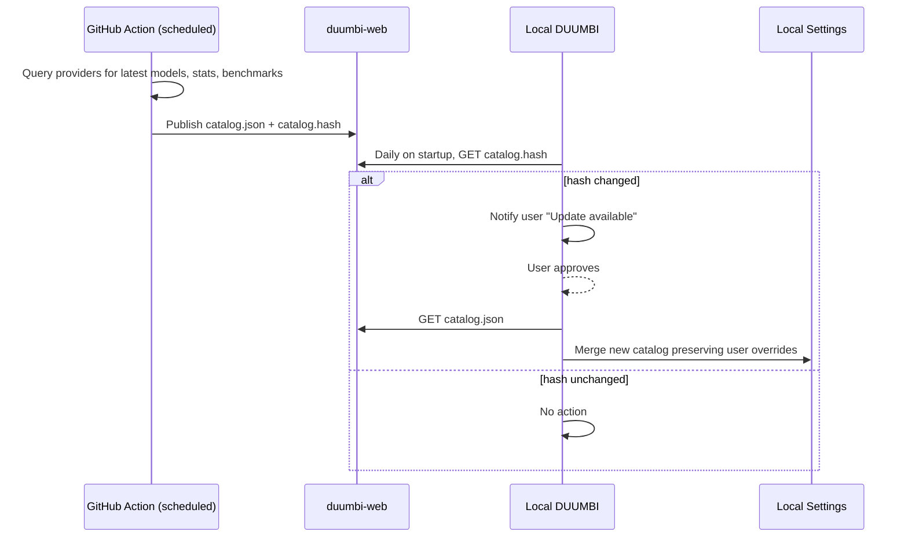

---
tags:
  - duumbi/inbox/enriched
  - duumbi/status/processed
  - duumbi/classification/feature
  - duumbi/value/high
  - duumbi/importance/high
  - duumbi/complexity/high
duumbi_inbox_enrichment: processed
duumbi_inbox_enrichment_generated_at: 2026-06-02T07:39:37.266Z
---

# Provider Model Catalog Refresh

<!-- duumbi-inbox-enrichment:v1 status=processed generated_at=2026-06-02T07:39:37.266Z -->

## Source
- Surface: Manual Obsidian edit
- Vault path: Duumbi/00 Inbox (ToProcess)/2026-06-01 - Provider Model Catalog Refresh.md
- Submitted by: unknown unless explicit in the raw input

## Raw input
> # 2026-06-01 - Provider Model Catalog Refresh
> 
> ## Source
> - Surface: Slack
> - Link: https://hgabor.slack.com/archives/C08SK7E6R7T/p1780345616825159
> - Submitted by: Slack user via Codex mention
> - Environment: Vault
> 
> ## Raw input
> The user asked to capture this as a DUUMBI Stage 1 intake and provided a Hungarian idea for translation to English:
> 
> > Jelenleg rögzítettük hogy mely providererk mely modeljeit használja a Duumbi. Rendszeres időközönként fusson egy Action amely kigyűjti az adott providerek legfrissebb modeljeit azok statisztikáit, metrikáit, benchmark-jait. Ezt elhelyezi a duumbi web oldala alatt egy fájlba és egy hash fájlt is létrehoz amely a fájl hash kódját tartalmazza. Amikor a duumbi-t elindítja a felhasználó akkor naponta 1x megnézi hogy változott-e a hash értéke a fájlnak, ha igen jelzi a felhasználónak hogy van frissítés és ha akarka letöltheti. Ha a felhasználó jóváhagyja akkor letölti és frissíti a használható modelleket, a lokálisan beállításokban tárolt model statisztikákat és elérhetőségeket.
> 
> English translation:
> 
> Currently we have recorded which providers and which models DUUMBI uses. At regular intervals, an Action should run that collects the latest models from those providers, along with their statistics, metrics, and benchmarks. It should place this data in a file under the DUUMBI website and also create a hash file containing the hash of that data file. When the user starts DUUMBI, once per day it should check whether the file hash has changed. If it has changed, DUUMBI should notify the user that an update is available and, if the user wants, allow them to download it. If the user approves, DUUMBI downloads the data and updates the usable models, locally stored model statistics, and endpoint or availability information in the settings.
> 
> ## Interpreted intent
> Capture a feature proposal for a provider-model catalog refresh mechanism. DUUMBI should not rely only on a statically recorded list of provider models. Instead, a scheduled GitHub Action or equivalent automation should periodically discover current models from configured providers, enrich them with model statistics, metrics, benchmark data, and availability or endpoint metadata, publish the catalog and its hash through the DUUMBI web/docs surface, and let local DUUMBI installations detect catalog changes once per day on startup.
> 
> The local app should treat the update as user-approved, not silent. On hash change, DUUMBI should notify the user that a provider-model catalog update is available. If approved, DUUMBI downloads the new catalog and updates its locally stored usable model list, model statistics, and provider endpoint or availability data.
> 
> ## Classification
> feature; architecture; execution
> 
> ## Clarifications
> ### Answered
> - The target environment is the DUUMBI Vault intake process.
> - The requested capture should be written in English even though the source idea is Hungarian.
> - The proposed update source is a scheduled Action that publishes a file and a hash file under the DUUMBI website.
> - DUUMBI should check for hash changes no more than once per day when the user starts the application.
> - Local catalog refresh should require user approval before download/update.
> 
> ### Open
> - Which providers are in scope for the first version: only currently supported DUUMBI providers, or any provider discovered by the Action?
> - What is the authoritative schema for the published model catalog file?
> - Which fields are required for each model: provider, model ID, display name, context window, modalities, pricing, rate limits, deprecation status, endpoint, benchmark scores, latency, quality metrics, release date, or other data?
> - Which benchmark sources are trusted enough to publish, and how should stale or provider-marketing-only metrics be labeled?
> - Should the catalog be signed or only hash-checked? A hash file detects change, but by itself does not establish authenticity unless delivered from a trusted, integrity-protected channel.
> - Should updates merge with user overrides in local settings, or replace the local catalog wholesale while preserving user-selected defaults?
> - What should DUUMBI do if startup is offline, the hash endpoint fails, the catalog fails validation, or the user postpones the update?
> - Should this be implemented first in CLI, Studio, or a shared configuration/runtime layer?
> 
> ## Relevant DUUMBI context
> - `Duumbi/How to use.md` explains that `00 Inbox (ToProcess)/` is for raw ideas, Slack captures, article links, and unresolved research input, while execution state belongs in GitHub issues and projects.
> - `Duumbi/01 Atlas (Knowledge Base)/Works (Developed Materials)/DUUMBI - PRD.md` says DUUMBI should remain tool-agnostic and evidence-oriented, which supports avoiding hard-coded dependence on one vendor's static model list.
> - `Duumbi/01 Atlas (Knowledge Base)/Dots (Atomic Ideas)/Static Website and Docs Publishing.md` records that `duumbi-web` owns the public DUUMBI website and documentation surfaces, making it a plausible distribution location for a public model catalog.
> - `Duumbi/05 Archive/Execution and Roadmap Docs/DUUMBI - Phase 15 - Studio Workflow Redesign.md` notes that provider connections are read from `config.toml`, DUUMBI selects concrete models internally, and settings expose provider configuration through the command palette.
> - `Duumbi/05 Archive/Execution and Roadmap Docs/DUUMBI - Phase 2 - AI Integration.md` records historical provider support for Anthropic and OpenAI in AI-based graph mutation.
> 
> ## Initial routing recommendation
> Create a GitHub Discussion or architecture issue first, then split into implementation issues after schema and trust decisions are accepted.
> 
> Recommended first artifact: a short architecture/product spec for a "Provider Model Catalog" with explicit decisions on catalog schema, provider adapters, update cadence, integrity/authenticity, local merge behavior, offline/error handling, and user consent UX.
> 
> After acceptance, likely implementation slices:
> 1. Catalog schema and validation rules.
> 2. Scheduled catalog generation Action in the appropriate repository.
> 3. Public publishing location in `duumbi-web` or equivalent website/docs hosting.
> 4. Hash/signature publication and verification.
> 5. Shared DUUMBI runtime update checker with once-per-day startup throttling.
> 6. CLI/Studio notification and approval UX.
> 7. Local settings/catalog merge behavior and rollback strategy.
> 
> ## Requested follow-up
> - Preserve this Stage 1 intake for later triage.
> - Do not implement the catalog updater yet from this capture alone.
> - During triage, decide whether this should become a GitHub Discussion, an architecture spec, or a scoped execution issue set.
> 
> ## Notes
> - Facts:
>   - The source idea explicitly asks for scheduled collection of provider model data, published catalog and hash files, daily local hash checks, user notification, user-approved download, and local model/settings updates.
>   - The idea concerns DUUMBI product behavior and supporting web/automation infrastructure.
> - Assumptions:
>   - "Action" means a GitHub Action or similar scheduled automation unless triage decides otherwise.
>   - "DUUMBI web page" means the public `duumbi-web` website/docs surface referenced in the vault.
>   - "Availability" includes endpoint or accessibility metadata for each provider model.
> - Recommendations:
>   - Treat this as a high-value feature with architectural/security implications, not a simple data refresh task.
>   - Specify authenticity and trust separately from hash-change detection.
>   - Keep user approval explicit, and preserve local user preferences when applying catalog updates.

## Interpreted intent

Capture a feature proposal for a provider-model catalog refresh mechanism. Instead of relying on a static model list, a scheduled GitHub Action should periodically discover current models from configured providers, enrich them with statistics, metrics, benchmarks, and availability metadata, publish the catalog and its hash through the DUUMBI web/docs surface, and let local DUUMBI installations detect catalog changes once per day on startup. The local app should notify the user on hash change and, upon approval, download and update the locally stored model list, statistics, and endpoint information while preserving user overrides.

## Developer summary

Implement a scheduled GitHub Action that fetches the latest provider model catalogs (model IDs, stats, benchmarks, endpoints), publishes a catalog.json and its hash on duumbi-web. The local DUUMBI binary checks the hash daily on startup; if changed, notifies the user and waits for approval. On approval, downloads the new catalog and merges it into local settings, preserving user-specific overrides. Requires schema design, authenticity/integrity considerations, and a user consent UX.

## UML overview

## Classification
- Type: feature
- Business value: high
- Importance: high
- Complexity: high

## Clarifications
### Answered
- The target environment is the DUUMBI Vault intake process.
- The requested capture should be written in English even though the source idea is Hungarian.
- The proposed update source is a scheduled Action that publishes a file and a hash file under the DUUMBI website.
- DUUMBI should check for hash changes no more than once per day when the user starts the application.
- Local catalog refresh should require user approval before download/update.

### Open
- Which providers are in scope for the first version? Only currently supported DUUMBI providers, or any provider discovered by the Action?
- What is the authoritative schema for the published model catalog file?
- Which fields are required for each model? (provider, model ID, display name, context window, modalities, pricing, rate limits, deprecation status, endpoint, benchmarks, latency, quality metrics, release date, etc.)
- Which benchmark sources are trusted enough to publish, and how should stale or provider-marketing-only metrics be labeled?
- Should the catalog be signed or only hash-checked? (Hash change detection alone does not guarantee authenticity.)
- Should updates merge with user overrides in local settings, or replace the local catalog wholesale while preserving user-selected defaults?
- What should DUUMBI do if startup is offline, the hash endpoint fails, the catalog fails validation, or the user postpones the update?
- Should this be implemented first in CLI, Studio, or a shared configuration/runtime layer?

## Relevant DUUMBI context
- Duumbi/How to use.md – explains that Inbox is for raw ideas, while execution state belongs in GitHub issues.
- Duumbi/01 Atlas/Works/DUUMBI - PRD.md – DUUMBI should remain tool-agnostic and evidence-oriented; avoids hard-coded static model lists.
- Duumbi/01 Atlas/Dots/Static Website and Docs Publishing.md – duumbi-web owns the public website; plausible distribution location for a public model catalog.
- Duumbi/05 Archive/Execution and Roadmap Docs/DUUMBI - Phase 15 - Studio Workflow Redesign.md – provider connections read from config.toml; DUUMBI selects concrete models internally.
- Duumbi/05 Archive/Execution and Roadmap Docs/DUUMBI - Phase 2 - AI Integration.md – historical provider support for Anthropic and OpenAI in AI-based graph mutation.

## Related GitHub context

triage should verify later

## Initial routing recommendation

Create a GitHub Discussion or architecture issue first, then split into implementation issues after schema and trust decisions are accepted.

## Requested follow-up
- Preserve this Stage 1 intake for later triage.
- Do not implement the catalog updater yet from this capture alone.
- During triage, decide whether this should become a GitHub Discussion, an architecture spec, or a scoped execution issue set.

## AI agent instructions
- When creating the GitHub issue or discussion, summarize the feature using the developer_summary and link this Inbox note.
- List the open clarifications as discussion points requiring resolution before implementation begins.
- Propose a phased implementation plan: schema design, Action publication, local checker, UX, merge logic.
- Ensure the issue includes the risks (authenticity, schema drift, merge conflicts) and explicit non-goals.
- Do not start implementation until human review confirms architectural decisions.

## Scope candidate
### In
- Scheduled catalog generation and publishing via GitHub Action.
- Daily hash check on local DUUMBI startup.
- User notification and explicit approval for updates.
- Download and merge of new catalog, preserving user overrides.
- Integrity verification via hash comparison (authenticity addressed separately).

### Out
- Silent auto-updates without user consent.
- Provider API key storage or direct provider communication from local DUUMBI.
- Real-time push notifications for catalog changes.
- Detailed model performance testing or benchmark execution.
- Backward-incompatible schema changes without migration strategy.

## Risks and trade-offs
- Hash delivered over unauthenticated HTTP could be tampered; catalog integrity may be compromised.
- Catalog schema changes could break older DUUMBI versions that do not understand new fields.
- Merge logic could unintentionally overwrite user customizations or default selections.
- Provider API rate limiting or failures could delay catalog updates.
- Third-party benchmark data may be outdated or lack provenance.

## Obsidian tags

#duumbi/inbox/enriched #duumbi/status/processed #duumbi/classification/feature #duumbi/value/high #duumbi/importance/high #duumbi/complexity/high

## Enrichment result
- Date: 2026-06-02T07:39:37.266Z
- Status: ready for triage
- Canonical duplicate: none verified
- Facts:
- Source idea explicitly requests scheduled collection of provider model data, published catalog and hash files, daily local hash checks, user notification, user-approved download, and local model/settings updates.
- The idea concerns DUUMBI product behavior and supporting web/automation infrastructure.
- The input is in Hungarian and has been translated to English for this intake.
- Assumptions:
- 'Action' means a GitHub Action or similar scheduled automation unless triage decides otherwise.
- 'DUUMBI web page' means the public duumbi-web website/docs surface.
- 'Availability' includes endpoint or accessibility metadata for each provider model.
- Local DUUMBI has network access to duumbi-web for daily hash checks.
- User approval is an explicit step, not a background operation.
- Recommendations:
- Treat this as a high-value feature with architectural/security implications, not a simple data refresh task.
- Specify authenticity and trust (e.g., signing) separately from hash-change detection before implementation.
- Keep user approval explicit; never auto-apply catalog updates.
- Preserve local user preferences and overrides when merging the catalog.
- Design the catalog schema to be extensible and versioned.

## Triage result
- Date: 2026-06-07T13:55:52.591Z
- Classification: execution work
- Routing: Automated Stage 4 triage refill created or selected GitHub issue #675 and routed it to Needs Human Acceptance.
- GitHub artifacts:
  - https://github.com/hgahub/duumbi/issues/675
- Obsidian artifacts:
  - none
- Canonical duplicate:
  - none
- Open questions:
  - See GitHub issue.
- Assumptions:
  - Cleanup disposition is applied because the issue already exists and the source Inbox note was left behind by the missing automation step.
- Next stage: Needs Human Acceptance
