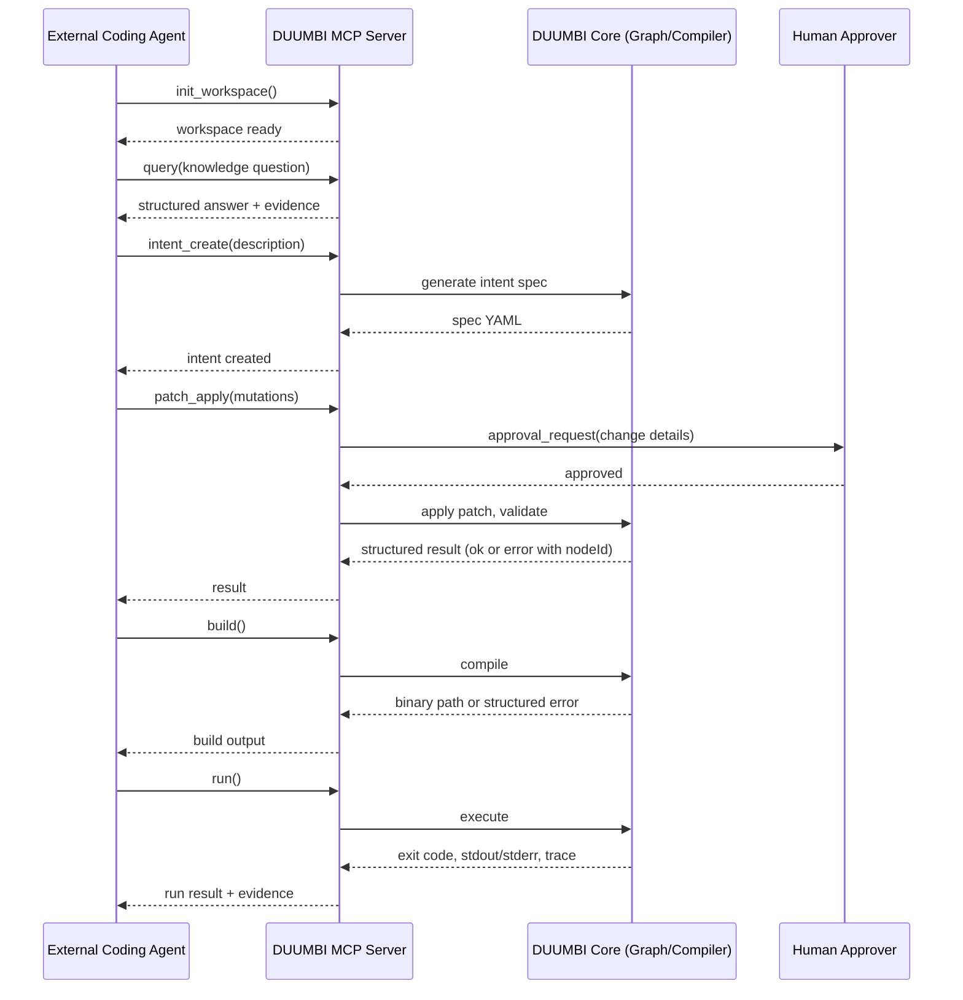

---
tags:
  - duumbi/inbox/enriched
  - duumbi/status/processed
  - duumbi/classification/execution
  - duumbi/value/critical
  - duumbi/importance/high
  - duumbi/complexity/medium
duumbi_inbox_enrichment: processed
duumbi_inbox_enrichment_generated_at: 2026-06-13T18:29:51.912Z
---

# Agent Substrate: MCP as First-Class Interface

<!-- duumbi-inbox-enrichment:v1 status=processed generated_at=2026-06-13T18:29:51.912Z -->

## Source
- Surface: Manual Obsidian edit
- Vault path: Duumbi/00 Inbox (ToProcess)/2026-06-12 - Agent Substrate MCP First-Class.md
- Submitted by: unknown unless explicit in the raw input

## Raw input
> ---
> tags:
>   - duumbi/inbox/roadmap
>   - duumbi/status/to-process
>   - duumbi/classification/execution
>   - duumbi/value/critical
>   - duumbi/importance/high
>   - duumbi/complexity/medium
> created: 2026-06-12
> milestone: M1
> source: "[[DUUMBI Future Development Roadmap Map]]"
> ---
> 
> # Agent Substrate: MCP as First-Class Interface
> 
> ## Context
> 
> *Proposed addition (Claude, 2026-06-12), from the "how would I use this system" exercise.* As an AI agent, generating raw source text is where my failure modes live: hallucinated APIs, type errors discovered late, silent behavioral drift, no memory of what I already built. DUUMBI removes whole hallucination classes by construction — the mutation target is a typed, ownership-checked, schema-validated graph with deterministic compiler feedback and machine-readable errors, plus reuse lookup so I don't rebuild what exists. This is exactly the [[DUUMBI - Service and Research Direction]] positioning ("semantic execution substrate for coding agents"), and the MCP server (rmcp, 10 tools) already exists. What's missing: external agents are not yet first-class, evaluated users.
> 
> ## Goal
> 
> Any off-the-shelf coding agent (Claude Code, Codex, etc.) can drive the full DUUMBI loop — init, query, intent, patch, build, run, evidence — through MCP alone, and this is a tested, documented, marketed product path, not a side feature.
> 
> ## Subtasks
> 
> 1. MCP tool surface audit: map the 10 existing tools against the full workflow; close gaps so no step requires a human at a terminal (init/workspace management, intent lifecycle, patch approval flow, build/run with captured output, evidence/query access — including the open MODE-010 conversational query tool from the modes spec).
> 2. Machine-readable error contract: every failure (parse, type, ownership, build, runtime) returns structured data an agent can act on — error code, offending node ids, suggested repair categories. No prose-only errors.
> 3. Approval gate design for agent callers: how a human approves agent-initiated mutations when the agent is the client (session ledger events + TUI/Studio approval surface; later mobile — [[2026-06-12 - Mobile App and Supervision Surface]]).
> 4. Agent onboarding docs: an AGENTS.md-grade "how to drive DUUMBI as a tool" guide, published on docs.duumbi.dev, plus a Claude Code skill/plugin package.
> 5. Benchmark: external agent builds the flagship example (HTTP + SQLite + JSON) end-to-end via MCP only; measure success rate, turns, tokens; compare against the same agent writing Rust directly — quantify the hallucination-class reduction and feed the token numbers into [[2026-06-12 - Token Economics Benchmark]].
> 6. Publish as case study (Phase 14 GTM): "an AI agent's view of DUUMBI" — why a substrate beats raw text generation.
> 
> ## Acceptance criteria
> 
> - An unmodified Claude Code session completes intent → build → run on the flagship example using only DUUMBI MCP tools.
> - Every error path returns structured, actionable data (verified by tests).
> - Agent guide live on docs.duumbi.dev; benchmark numbers published.
> 
> ## Links
> 
> - [[DUUMBI Future Development Roadmap Map]]
> - [[2026-06-12 - Intent at Scale Multi-Module and BDD]]
> - [[2026-06-12 - Determinism Program for AI Development]]

## Interpreted intent

Make the DUUMBI MCP server a first-class, documented, and tested interface for external coding agents (Claude Code, Codex, etc.) to drive the full DUUMBI development loop (init, query, intent, patch, build, run, evidence) without needing a human at the terminal.

## Developer summary

Upgrade the existing MCP server (10 tools, rmcp) to support the complete DUUMBI workflow for external agents. This includes auditing and filling tool gaps (init/workspace, intent lifecycle, patch approval, build/run with output capture, evidence/query, conversational query MODE-010), defining a machine-readable error contract (structured errors with node IDs, codes, suggested repairs), designing an approval gate for agent-initiated mutations (session ledger events + TUI/Studio approval surface), creating agent onboarding docs (AGENTS.md-grade guide + Claude Code skill/plugin), and benchmarking an external agent building the flagship example (HTTP+SQLite+JSON) end-to-end via MCP only, comparing against raw Rust to quantify hallucination reduction and token economics.

## UML overview

## Classification
- Type: execution
- Business value: critical
- Importance: high
- Complexity: medium

## Clarifications
### Answered
- The MCP server already exists with 10 tools, but external agents are not yet first-class users.
- The goal is to support any off-the-shelf coding agent through MCP alone.
- The workflow includes init, query, intent, patch, build, run, evidence.
- A machine-readable error contract is required (structured data, not prose).
- An approval gate is needed for agent-initiated mutations, with potential future mobile support.
- Agent onboarding docs and a Claude Code skill/plugin should be published on docs.duumbi.dev.
- A benchmark will compare external agent end-to-end success against raw Rust code.
- This work is milestone M1 and critical/high priority.

### Open
- What is the current state of the MCP tools? Which steps exactly are missing or incomplete?
- What shape should the machine-readable error contract take? Any existing error schema to extend?
- How should the approval gate integrate with the session ledger? What minimal UI is acceptable for the TUI and Studio?
- Which specific agent guide format will be adopted? Is AGENTS.md sufficient or is a dedicated developer portal needed?
- Is the benchmark scenario (HTTP+SQLite+JSON) already defined as a DUUMBI program? Are the reference Rust implementations ready?
- What is the target for the Claude Code skill/plugin? Should it be a simple skill or a more integrated plugin with custom MCP client configuration?

## Relevant DUUMBI context
- Duumbi/00 Inbox (ToProcess)/2026-06-12 - Agent Substrate MCP First-Class.md: the original enriched note describing the task and subtasks.
- Duumbi/01 Atlas (Knowledge Base)/Works (Developed Materials)/DUUMBI - PRD.md: product thesis including semantic graph as agent execution substrate.
- Duumbi/01 Atlas (Knowledge Base)/Works (Developed Materials)/DUUMBI - Agentic Development Runbook.md: defines the overall agent workflow and approvals.
- docs/architecture.md: documents the component map including MCP server role.
- src/mcp/mod.rs: the existing MCP server module source code.
- src/agents/mod.rs: agent framework relevant to understanding how agents could drive the system.

## Related GitHub context

Triage should verify if there are any existing GitHub issues or discussions about MCP first-class support, external agent integration, or agent-facing tool completeness.

## Initial routing recommendation

GitHub issue

## Requested follow-up
- Audit current MCP tools against the full DUUMBI workflow and create a gap report.
- Define the machine-readable error contract schema.
- Design the approval gate flow integrated with the session ledger and UI surfaces.
- Draft the AGENTS.md-grade agent guide and Claude Code skill package.
- Set up the benchmark scenario and instrumentation for token/hallucination measurement.

## AI agent instructions
- When creating the GitHub issue, title it as a feature: 'First-Class MCP Interface for External Coding Agents'.
- Use the milestone M1 label and assign appropriate priority/effort labels.
- Include the subtasks from the Inbox note as a checklist: tool surface audit, machine-readable errors, approval gate, onboarding docs, benchmark, and case study.
- Reference the relevant vault notes and source code paths for context.
- Add acceptance criteria from the note: Claude Code completes intent→build→run via MCP only, all errors are structured, guide is live, benchmark published.
- Link to related notes: DUUMBI Future Development Roadmap Map, Intent at Scale, Determinism Program.

## Scope candidate
### In
- Audit and complete the MCP tool surface for the full workflow (init, query, intent, patch, build, run, evidence).
- Implement machine-readable error contract for all failure paths.
- Design and build approval gate for agent-initiated mutations within session ledger.
- Create and publish agent onboarding documentation and a Claude Code skill/plugin.
- Set up and run a benchmark of the flagship example using an external agent via MCP only.
- Publish a case study outlining the agent's view of DUUMBI.

### Out
- General improvement of the MCP protocol or rmcp library.
- Extending MCP to support mobile or cloud approval beyond the initial TUI/Studio surface.
- Building a general agent framework beyond the MCP boundary; this is about MCP as the interface.
- Token economics benchmarking beyond the one scenario; that is a separate Inbox note.
- Full automation of agent-driven spec drafting or implementation; this is for driving existing DUUMBI capabilities.

## Risks and trade-offs
- The current MCP tools may be insufficient and require significant rework to support the full loop, potentially expanding scope.
- Designing a generic approval gate for arbitrary agents could be complex and may introduce security concerns if not properly scoped to the session ledger.
- The benchmark success may depend heavily on the quality of the agent's instruction and the MCP documentation; a poorly designed benchmark could give misleading results.
- External agents may have different authentication and session models, requiring careful design to keep DUUMBI state consistent.

## Obsidian tags

#duumbi/inbox/enriched #duumbi/status/processed #duumbi/classification/execution #duumbi/value/critical #duumbi/importance/high #duumbi/complexity/medium

## Enrichment result
- Date: 2026-06-13T18:29:51.912Z
- Status: ready for triage
- Canonical duplicate: none verified
- Facts:
- DUUMBI already has an MCP server with 10 tools implemented using the rmcp crate.
- External coding agents are not currently treated as first-class users of the DUUMBI system.
- The note explicitly lists six subtasks: MCP tool surface audit, machine-readable errors, approval gate, onboarding docs, benchmark, and case study.
- The milestone is M1, and the value is critical, importance high, complexity medium as tagged.
- The note references other roadmap items including the mobile app supervision surface and token economics benchmark.
- Assumptions:
- The existing MCP tools are not sufficient to cover the full workflow without additions.
- The approval gate can be implemented initially using session ledger events and the existing TUI/Studio UI, with mobile to come later.
- The benchmark scenario (HTTP+SQLite+JSON) is a well-defined DUUMBI program that can be built and run via MCP commands.
- An external agent (e.g., Claude Code) will be able to follow a concise AGENTS.md-like guide to orchestrate DUUMBI.
- The team accepts the risk that building the full MCP surface for external agents may expose gaps in the underlying CLI or library interfaces.
- Recommendations:
- Start with the MCP tool surface audit because it will define the required tool additions and error contract.
- Define the machine-readable error schema early, as it affects both tool responses and the agent's ability to self-correct.
- Collaborate with the session kernel work (if not already done) to ensure the approval gate integrates cleanly.
- Publish the agent guide incrementally, starting with a simple skill for Claude Code and expanding as the toolset matures.
- Treat the benchmark as a system integration test that can also serve as a demo for the case study.

## Triage result
- Date: 2026-06-16T01:09:34.667Z
- Classification: execution work
- Routing: Created GitHub issue #719 and routed it to Needs Human Acceptance.
- GitHub artifacts:
  - https://github.com/hgahub/duumbi/issues/719
- Obsidian artifacts:
  - none
- Canonical duplicate:
  - none
- Open questions:
  - See GitHub issue.
- Assumptions:
  - Automated triage refill selected this source as actionable. Rationale: Inbox note classified as critical execution feature for M1. No existing eligible Todo issue represents this work. Current human acceptance count is 1, policy allows 1 new issue. MCP first-class interface is prerequisite for agent usage in M1.
- Next stage: Needs Human Acceptance
