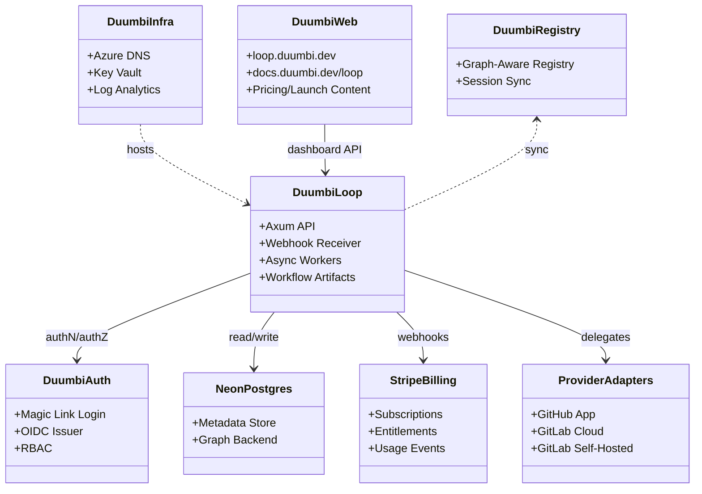

---
tags:
  - duumbi/inbox/enriched
  - duumbi/status/processed
  - duumbi/classification/execution
  - duumbi/value/high
  - duumbi/importance/high
  - duumbi/complexity/high
duumbi_inbox_enrichment: processed
duumbi_inbox_enrichment_generated_at: 2026-06-17T07:51:14.816Z
---

# M6 DUUMBI Loop Cloud Service Milestone Plan

<!-- duumbi-inbox-enrichment:v1 status=processed generated_at=2026-06-17T07:51:14.816Z -->

## Source
- Surface: Manual Obsidian edit
- Vault path: Duumbi/00 Inbox (ToProcess)/2026-06-12 - DUUMBI Loop Cloud Service Milestone Plan.md
- Submitted by: unknown unless explicit in the raw input

## Raw input
> ---
> tags:
>   - duumbi/inbox/roadmap
>   - duumbi/status/to-process
>   - duumbi/classification/execution
>   - duumbi/value/high
>   - duumbi/importance/high
>   - duumbi/complexity/high
> created: 2026-06-12
> milestone: M6
> target_window: H2 2027
> source: "[[duumbi-loop-codex-task]]"
> depends_on:
>   - M2
>   - M3
>   - M5
> ---
> 
> # DUUMBI Loop Cloud Service Milestone Plan
> 
> ## Context
> 
> The prepared `duumbi-loop` task is the full hosted DUUMBI Loop service plan: Axum API, webhook receiver, async workers, metadata store, code provider integrations, graph snapshots, LLM/model policy, dashboard, billing, Slack, and intake/spec/review/closure artifacts.
> 
> I reviewed the current inbox notes and [[DUUMBI Future Development Roadmap Map]]. The roadmap already separates:
> 
> - M2: session kernel and graph-aware registry.
> - M3: DUUMBI-native Loop adaptation and Desktop App.
> - M5: importing existing source repositories into a semantic knowledge graph.
> - M6: Cloud App, DUUMBI account/SSO, and v1.0 hosted-service readiness.
> 
> This ticket is not the narrow M3 native Loop adaptation. It is the hosted cloud service and external provider productization layer around Loop. It should reuse the original draft, but the draft must be rewritten around milestones rather than an MVP.
> 
> ## Roadmap insertion
> 
> Insert this as an M6 workstream in H2 2027, before v1.0 GA:
> 
> > DUUMBI Loop Cloud Service: hosted intake/spec/review/closure for DUUMBI-native workspaces and optional GitHub/GitLab adapters, backed by `duumbi-auth`, Stripe billing, Neon Postgres, Postgres-backed graph tables, regional LLM policy, source-retention controls, Slack/email notifications, and automatic closure publishing.
> 
> Discovery and document rewrite can start after M3, but implementation should wait until the M2/M3/M5 dependencies are real. Building it earlier would pull the product back toward a GitHub/GitLab-first model and would duplicate the graph/session responsibilities that the registry roadmap already assigns to M2.
> 
> ## Milestone framing
> 
> Do not frame this as an MVP. Use milestone slices:
> 
> 1. M6.0: Discovery and plan rewrite after M3. Update `wiki/duumbi-loop-codex-task.md` or supersede it with a v2 milestone document. Confirm `duumbi-infra`, `duumbi-registry`, `duumbi-web`, and `duumbi-auth` responsibilities.
> 2. M6.1: Account, tenant, and billing shell. Stand up `duumbi-auth`, org/team/RBAC, Stripe customer/subscription/entitlement records, email magic-link login, and dashboard settings.
> 3. M6.2: Data and graph foundation. Use Neon Postgres for metadata and first graph backend. Add retention settings, deletion jobs, audit logs, model policy, regional LLM data policy, and cost controls.
> 4. M6.3: External provider adapters. GitHub App first; GitLab Cloud next; GitLab Self-Hosted with manual webhook setup first. Keep DUUMBI-native provider as primary.
> 5. M6.4: Cloud workflow execution. Hosted intake/spec/review/closure artifacts, Slack/email notifications, dashboard run detail, branch/PR failure handling, review comment mode, and automatic closure publish.
> 6. M6.5: Hardening and launch. Security docs, data-retention docs, regional policy docs, pricing page, observability, operational budgets, and v1.0 readiness evidence.
> 
> ## Decisions
> 
> ### Repository topology
> 
> - `hgahub/duumbi-loop`: hosted Loop service, provider adapters, workflow artifacts, dashboard backend, workers.
> - `hgahub/duumbi-auth`: central DUUMBI auth service from the start. Do not start auth inside `duumbi-loop` and move it later.
> - `hgahub/duumbi-infra`: DNS, Container Apps/SWA patterns, secret references, observability, budget guardrails. Do not add Azure Database for PostgreSQL as the default Loop database.
> - `hgahub/duumbi-web`: `loop.duumbi.dev`, `docs.duumbi.dev/loop`, pricing/docs/launch content.
> - `hgahub/duumbi-registry`: graph-aware registry, session sync, graph snapshot publish/read path.
> 
> ### Database
> 
> Default database: Neon Postgres.
> 
> Reasoning:
> 
> - The introductory period needs a real free-tier database and controlled scale-up path, not Azure Database for PostgreSQL.
> - Neon currently offers a free plan with 100 CU-hours per month per project, 0.5 GB storage per project, scale-to-zero behavior, and usage-based paid plans.
> - Supabase is viable, but its integrated Auth/Storage bundle is less useful if `duumbi-auth` is separate and Stripe is the billing default.
> - Store the Neon connection string as a secret reference, not in frontend env or Pulumi plaintext.
> 
> ### Graph backend
> 
> Default graph backend: Postgres-backed property graph tables in the same Neon database for the first cloud milestones.
> 
> Initial shape:
> 
> - `graph_snapshots`
> - `graph_nodes`
> - `graph_edges`
> - `graph_node_attributes`
> - `graph_edge_attributes`
> - `graph_symbol_index`
> - `graph_embedding_index`
> - optional materialized views for common neighborhoods and dependency closures
> 
> Use Postgres full-text search and `pgvector` where available for search/similarity. Keep `codegraph-core` behind an adapter interface so Neo4j, Kuzu, or another graph backend can be added later based on measured query needs.
> 
> Do not make Neo4j Aura the default first backend. It has a free learning/prototyping tier, but the paid professional path starts high enough that it conflicts with the low-cost introduction requirement. Do not make Kuzu a hard dependency yet either; it remains technically attractive, but the upstream KuzuDB repository was archived in 2025, so use it only as an optional snapshot/analytics adapter unless the project direction is clarified.
> 
> ### Billing
> 
> Stripe is the default billing provider.
> 
> Required M6 records:
> 
> - `billing_customers`
> - `billing_subscriptions`
> - `billing_entitlements`
> - `billing_events`
> - `usage_meter_events`
> 
> Stripe webhook processing must be idempotent and tenant-scoped.
> 
> ### Login
> 
> Email login uses magic links. Password login is not in the first cloud milestone unless a later security/product decision explicitly adds it.
> 
> `duumbi-auth` should also support GitHub/GitLab/Google identity links, but email magic link is the default email flow.
> 
> ### Source retention
> 
> Default raw repo snapshot retention: 7 days.
> 
> Make it configurable per organization and repository in Settings:
> 
> - `0 days`: ephemeral clone only; delete immediately after successful indexing.
> - `7 days`: default.
> - `14 days`
> - `30 days`
> - `90 days`: admin-only, with warning.
> 
> Graph snapshots, run artifacts, audit events, and source references are separate retention classes. Raw source retention must have a cleanup job, deletion audit events, and UI visibility.
> 
> ### LLM data policy
> 
> Yes: enforce region-aware policy buckets.
> 
> Required first regions:
> 
> - EU
> - USA
> - China
> 
> Org admins must be able to configure allowed providers/models by region, prompt/response retention, code-snippet retention, max context size, and whether cross-region fallback is allowed. The context builder must still minimize source sent to LLMs and must never send a full repo dump by default.
> 
> ### GitLab Self-Hosted
> 
> Manual webhook setup is enough for the first GitLab Self-Hosted milestone.
> 
> The UI should generate setup instructions, webhook URL, secret, event checklist, and a connection test. Base URL validation and SSRF protections remain mandatory.
> 
> ### Spec PR branch protection
> 
> If the target repository does not allow the DUUMBI bot to create a branch or PR:
> 
> - Mark the run `needs_action`.
> - Show a dashboard banner with the exact blocked operation and required repo permission.
> - Send email to org admins/repo owners.
> - Send Slack notification if Slack is connected.
> - Provide a fallback downloadable/manual spec bundle so the team can apply the files manually.
> 
> ### Knowledge update
> 
> Closure should automatically publish knowledge updates by default.
> 
> Keep an org-level setting to downgrade to candidate-only mode for regulated teams, but the default product behavior is automatic publish on closure.
> 
> ### Review strictness
> 
> Default review behavior is comment mode, even when blocking issues are found.
> 
> Blocking issues must be clearly labeled in the summary and inline comments, but the provider review state should not default to `changes_requested`. Add an org/repo setting for strict mode if a team wants blocking findings to become provider-native blocking reviews.
> 
> ## duumbi-infra notes
> 
> The current `duumbi-infra` checkout has no README. The actual stack facts are:
> 
> - `stack-persistent.ts`: Key Vault, Log Analytics, subscription budget with a $20/month project cap.
> - `stack-platform.ts`: Azure DNS for `duumbi.dev`, free Static Web Apps for web/docs, and a Slack approval bridge Function App.
> - `stack-registry.ts`: registry Container App, Azure Files-backed `/data`, 1 GiB file share, Log Analytics wiring, custom `registry.duumbi.dev` domain, and scale-to-zero/min-0 deployment.
> - No current Loop database, graph database, Service Bus, or Loop Container App stack exists.
> 
> M6 infra should follow the existing Pulumi split, but the Loop database should be Neon during introduction. Azure should remain DNS/hosting/secrets/observability unless a later paid-infra decision overrides this.
> 
> ## 2026-06-12 addendum: pricing, processes, UI/UX, operator monitoring
> 
> A part-2 supplement ([[duumbi-loop-codex-task-part2]]) closes the commercial and product-process gaps in the original task. Where the two documents conflict, part 2 wins. Key additions:
> 
> - **Pricing model:** seat + credit hybrid. Paid seats = owner/admin/developer/reviewer; viewer and billing_admin are free. 1 credit = $0.10 internal LLM budget; per-run charge = max(per-workflow minimum, actual cost). Plans: Free ($0, 50 credits, 2 repos), Team ($19/seat, 150 credits/seat pooled), Business ($39/seat, 400 credits/seat, regional policy, audit export, candidate-only knowledge), Enterprise (custom). Overage $12/100 credits. BYOK runs charge 25% orchestration fee. 14-day Business trial without card. Credit calibration must be re-validated against measured staging COGS before launch.
> - **Billing lifecycle:** in-app cancellation with exit survey and end-of-period downgrade; dunning via Stripe Smart Retries with run-blocking after 7 days past_due; over-limit data handling after downgrade (nothing deleted, excess repos disabled, dormant cleanup with T-30/7/1 warnings); org data export job; org and account (GDPR) deletion flows; Stripe Tax for EU VAT.
> - **Registration/onboarding:** signup → org wizard → provider → repos → activation checklist; identity linking rules; the previously missing **invitations** table/API/flow; free-tier abuse protections (velocity rules, 1 free org per user).
> - **Settings IA:** full `/o/:org/settings/*` tree (general/members/billing/usage/model-policy/retention/notifications/api-tokens/audit-log) plus account-level pages (profile/identities/sessions/tokens/danger).
> - **UI/UX specs** for Code Providers lifecycle (connect/reconnect/revoke/delete), Repository index pipeline and per-repo settings, the Analytics page (previously a nav item with no content), run detail per workflow type with cancel/re-run semantics, the Questions flow, and the Knowledge base UI with a candidate-approval queue.
> - **Operator monitoring:** staff-gated `/staff/*` area (orgs/users/billing/abuse/ops, entitlement overrides, audited read-only impersonation), PostHog EU (app) + Plausible (marketing), `org_daily_usage` rollups, KPI definitions (activation, W4 retention, MRR, NRR, per-org gross margin), weekly operator digest, margin/abuse alerts.
> - **Notifications:** Resend as default email provider (EU residency to verify in discovery), template inventory, event × channel × role notification matrix.
> - **Base-doc fixes:** `needs_action` added to the run state machine; model catalog pricing must come from a curated price table because provider list APIs (except xAI) return no pricing.
> 
> ## Acceptance criteria
> 
> - The original `duumbi-loop` task is rewritten or superseded without MVP language.
> - `duumbi-auth` exists as a separate repo/service contract.
> - Neon Postgres is the default metadata database; no Azure PostgreSQL dependency is introduced for the introductory period.
> - Graph storage starts on Postgres-backed graph tables with adapter boundaries for later graph engines.
> - Stripe billing, email magic links, regional LLM data policy, source-retention settings, and automatic closure publishing are explicit requirements.
> - GitHub/GitLab provider flows are optional adapters around DUUMBI-native Loop, not the primary product model.
> - GitLab Self-Hosted works with manual webhook setup first.
> - Branch/PR permission failures produce UI, email, and Slack notifications with a manual fallback.
> - Blocking review findings default to comment mode unless strict mode is enabled.
> 
> ## Links
> 
> - [[duumbi-loop-codex-task-part2]]
> - [[DUUMBI Future Development Roadmap Map]]
> - [[2026-06-12 - DUUMBI Loop Native Workflow Adaptation]]
> - [[2026-06-12 - Cloud App and DUUMBI Account SSO]]
> - [[2026-06-12 - Registry Graph Database Evolution]]
> - [[2026-06-12 - Session Kernel and Event Ledger]]
> - [[2026-06-12 - Code Import to Semantic Graph]]
> - [[2026-06-12 - Active Learning Loop]]
> - [[2026-06-12 - Model Capability Advisor and Task Routing]]
> - [[2026-06-12 - Effort Levels and Cost Control]]
> 
> ## External facts checked
> 
> - Neon pricing/free plan: https://neon.com/pricing
> - Supabase billing/free plan: https://supabase.com/docs/guides/platform/billing-on-supabase
> - Neo4j pricing: https://neo4j.com/pricing/
> - KuzuDB repository status and license: https://github.com/kuzudb/kuzu

## Interpreted intent

Insert a detailed milestone plan for a hosted cloud service (DUUMBI Loop) into the M6 roadmap, covering architecture, infrastructure, external provider adapters, billing, auth, graph backend, and product decisions.

## Developer summary

Define and eventually implement the DUUMBI Loop Cloud Service as an M6 workstream (H2 2027). This covers a hosted intake/spec/review/closure loop for DUUMBI‑native workspaces and optional GitHub/GitLab adapters. Infrastructure decisions include Neon Postgres (free‑tier start), Postgres‑backed property graph tables, Stripe billing, email magic‑link auth (duumbi‑auth), regional LLM data policies, and source retention controls. Repository topology splits responsibility across duumbi‑loop, duumbi‑auth, duumbi‑infra, duumbi‑web, and duumbi‑registry. The plan is broken into six milestones: M6.0 discovery/plan rewrite, M6.1 account/tenant/billing shell, M6.2 data/graph foundation, M6.3 external provider adapters, M6.4 cloud workflow execution, and M6.5 hardening/launch. Implementation must wait until M2 (session kernel), M3 (native Loop adaptation), and M5 (code import) are real. Until then, preserve the plan as an execution workstream with clear decisions recorded.

## UML overview

## Classification
- Type: execution
- Business value: high
- Importance: high
- Complexity: high

## Clarifications
### Answered
- All architectural decisions (Neon Postgres, Postgres graph backend, Stripe billing, magic‑link login, source retention defaults, LLM region policy, review strictness) are explicitly recorded in the note.
- The six milestone breakdown (M6.0–M6.5) is defined.
- Repository topology (duumbi‑loop, duumbi‑auth, duumbi‑infra, duumbi‑web, duumbi‑registry) is prescribed.
- Dependencies on M2, M3, and M5 are stated.
- Current duumbi‑infra state (no Loop database, graph database, or Loop Container App) is documented.

### Open
- Is the H2 2027 target window realistic given the dependency completion dates?
- Will Neon’s free tier (100 CU‑hours/month, 0.5 GB storage) be sufficient for initial cloud workloads, or must the scale‑up plan be defined before M6.1?
- Should duumbi‑auth be stood up as a separate service immediately, or can a minimal auth module inside duumbi‑loop be shipped first?
- What is the exact division of responsibilities between duumbi‑loop and duumbi‑registry for graph snapshots and session sync?
- Does the existing duumbi‑infra split (Pulumi stacks: persistent, platform, registry) require a new Loop‑specific stack, or can the M6 workstream extend the current ones?

## Relevant DUUMBI context
- [[DUUMBI Future Development Roadmap Map]] – already places M6 as Cloud App / v1.0 readiness.
- `wiki/duumbi-loop-codex-task.md` (~2,400 lines) – original Loop plan that this milestone supersedes.
- [[DUUMBI - PRD]] – core product thesis and high‑level cloud service expectations.
- [[DUUMBI - Agentic Development Runbook]] – 12‑stage intake‑to‑delivery workflow that the cloud service must eventually support.
- `src/graph/mod.rs`, `src/compiler/mod.rs`, `src/agents/mod.rs` – source‑code reality: the native Loop adaptation (M3) will leverage these; the cloud service adds a hosted layer around them.
- `duumbi‑infra` stack facts (no current Loop DB/graph) – validates that M6 infra needs new provisioning.

## Related GitHub context

No current GitHub issues, PRs, or projects for the M6 Loop Cloud Service exist. Triage should verify GitHub state later; expect creation of a tracking issue or a set of sub‑issues.

## Initial routing recommendation

GitHub issue

## Requested follow-up
- Create a GitHub issue (tracking issue) titled 'M6: DUUMBI Loop Cloud Service' with the milestone breakdown and architectural decisions from this note.
- Link the issue to the M6 milestone in the DUUMBI roadmap / Project.
- Do NOT start implementation; defer until M2, M3, and M5 are at least feature‑complete.

## AI agent instructions
- When creating the GitHub issue, include the following sections: Summary, Milestones (M6.0–M6.5), Infrastructure Decisions (Neon, Stripe, etc.), Repository Topology, and Dependencies.
- Add a checklist for each sub‑milestone so future agents can mark progress.
- Set labels: type/milestone, area/cloud-service, priority/high, size/xl.
- No spec or implementation tasks should be attached to this issue; it is a roadmap placeholder until dependencies are met.

## Scope candidate
### In
- All six M6 milestones (M6.0 discovery/plan rewrite, M6.1 account/tenant/billing shell, M6.2 data/graph foundation, M6.3 provider adapters, M6.4 cloud workflow execution, M6.5 hardening/launch).
- Architectural decisions: Neon Postgres, Postgres graph tables, Stripe billing, email magic links, regional LLM policy, source retention controls, review comment‑mode default.
- New repositories/services: duumbi‑loop, duumbi‑auth, modifications to duumbi‑infra/duumbi‑web/duumbi‑registry.
- Production‑readiness evidence, security docs, pricing page, observability budgets.

### Out
- Narrow M3 native Loop adaptation (separate workstream).
- M2 session kernel and graph‑aware registry (prerequisite).
- M5 code import to semantic graph (prerequisite).
- Any GitHub/GitLab‑first design that would pull the product away from DUUMBI‑native primacy.
- Running the cloud service before the underlying Loop CLI/SDK is stabilized in M3.

## Risks and trade-offs
- M2, M3, M5 may not be production‑ready before H2 2027, delaying M6.
- Neon free‑tier limits could be exceeded early, forcing premature paid tier adoption.
- Stripe billing integration and duumbi‑auth are complex; starting them late increases launch risk.
- Splitting auth into a separate service (duumbi‑auth) may require migration of existing registry auth tokens.
- GitLab Self‑Hosted adapter support (manual webhook) may introduce SSRF or security validation burdens.
- The plan assumes the current duumbi‑infra backbone (Azure DNS, Key Vault, Static Web Apps) remains adequate; if product scale grows, more substantial infra changes may be needed.

## Obsidian tags

#duumbi/inbox/enriched #duumbi/status/processed #duumbi/classification/execution #duumbi/value/high #duumbi/importance/high #duumbi/complexity/high

## Enrichment result
- Date: 2026-06-17T07:51:14.816Z
- Status: ready for triage
- Canonical duplicate: none verified
- Facts:
- The duumbi‑loop repository currently contains only a plan (wiki/duumbi‑loop‑codex‑task.md); zero code exists.
- The roadmap already separates M6 (Cloud App, SSO, v1.0 readiness) from M2/M3/M5.
- duumbi‑infra currently has no Loop database, graph database, Service Bus, or Loop Container App stack.
- The note explicitly states: do not make Azure Database for PostgreSQL the default Loop database; Neon is the default.
- The note mandates that duumbi‑auth be a separate service from the start, not started inside duumbi‑loop.
- Source retention default is 7 days, configurable per org/repo.
- LLM data policy requires EU, USA, China region buckets; org admins control allowed providers/models.
- Review default is comment mode, not blocking; strict mode is an opt‑in setting.
- Assumptions:
- M2, M3, and M5 will be completed and stable before M6 implementation begins.
- Neon’s free tier (100 CU‑hours/month, 0.5 GB storage) will be sufficient for early‑adopter workloads; paid scaling paths will be defined later.
- Stripe will remain the only billing provider for the first cloud release.
- Email magic‑link login will be acceptable to initial DUUMBI cloud users without password login.
- The existing duumbi‑infra (Azure DNS, Key Vault, Static Web Apps) can be extended to support the Loop service without major architectural changes.
- Postgres‑backed graph tables (with pgvector if available) will perform adequately for initial graph query needs.
- The GitHub App adapter can be built without blocking legal/security review delays.
- Recommendations:
- Convert this note into a tracking GitHub issue immediately (M6: DUUMBI Loop Cloud Service) and mark it as blocked until M2/M3/M5 are feature‑complete.
- Begin M6.0 discovery and plan rewrite asynchronously after M3, but do not start any implementation until dependencies are confirmed.
- Validate Neon’s scalability and billing model early in M6.1 to avoid mid‑milestone surprises.
- Design the graph backend interface (Postgres adapter) with a clean trait boundary, keeping codegraph‑core behind an adapter to allow later replacement with Neo4j/Kuzu.
- Document the division of labor between duumbi‑loop and duumbi‑registry for snapshots and session sync before M6.2.
- Reserve time for security review of GitLab Self‑Hosted webhook setups (SSRF, secret validation).

## Triage result
- Date: 2026-06-19T16:52:47.146Z
- Classification: execution work
- Routing: Routed existing GitHub issue #750 to Needs Human Acceptance.
- GitHub artifacts:
  - https://github.com/hgahub/duumbi/issues/750
- Obsidian artifacts:
  - none
- Canonical duplicate:
  - none
- Open questions:
  - See GitHub issue.
- Assumptions:
  - Automated triage refill selected this source as actionable. Rationale: Issue #750 is an eligible Todo item representing the next actionable DUUMBI Loop web and infrastructure experience slice. It has a clear user outcome, defined scope, and is ready for human acceptance review. Routing it to Needs Human Acceptance meets the target minimum of 3.
- Next stage: Needs Human Acceptance
