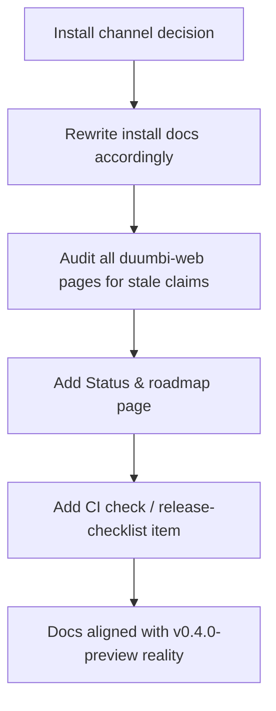

---
tags:
  - duumbi/inbox/enriched
  - duumbi/status/processed
  - duumbi/classification/execution
  - duumbi/value/high
  - duumbi/importance/high
  - duumbi/complexity/low
duumbi_inbox_enrichment: processed
duumbi_inbox_enrichment_generated_at: 2026-06-16T19:14:25.816Z
---

# Docs Truth Reconciliation for v0.4.0-preview

<!-- duumbi-inbox-enrichment:v1 status=processed generated_at=2026-06-16T19:14:25.816Z -->

## Source
- Surface: Manual Obsidian edit
- Vault path: Duumbi/00 Inbox (ToProcess)/2026-06-12 - Docs Truth Reconciliation.md
- Submitted by: unknown unless explicit in the raw input

## Raw input
> ---
> tags:
>   - duumbi/inbox/roadmap
>   - duumbi/status/to-process
>   - duumbi/classification/execution
>   - duumbi/value/high
>   - duumbi/importance/high
>   - duumbi/complexity/low
> created: 2026-06-12
> milestone: M0
> source: "[[DUUMBI Future Development Roadmap Map]]"
> related_issues:
>   - hgahub/duumbi#686
> ---
> 
> # Docs Truth Reconciliation
> 
> ## Context
> 
> docs.duumbi.dev (Starlight, in `hgahub/duumbi-web`) documents `cargo install duumbi`, but DUUMBI is **not published to crates.io** and has no releases. The main repo still carries legacy `sites/` + `docs/` content alongside the canonical duumbi-web docs (issue #686). Docs also pin an outdated model id (`claude-sonnet-4-20250514`) in provider setup examples.
> 
> ## Goal
> 
> Every public claim (install path, feature status, model ids, registry behavior) matches shipped reality at v0.4.0-preview launch. No aspirational instructions.
> 
> ## Subtasks
> 
> 1. Decide: publish `duumbi` to crates.io (name is presumably reserved by us — verify) **or** rewrite installation docs around GitHub Releases binaries + install script. Document the decision.
> 2. Audit all pages in duumbi-web docs + landing + compare pages for stale claims (install, providers, model ids, registry, platform support).
> 3. Execute #686: migrate/refresh/delete legacy `sites/` and `docs/` content in the main repo; main repo docs become contributor-facing only, duumbi-web is the canonical user docs.
> 4. Add a "Status & roadmap" page sourced from this vault's roadmap map, with honest Delivered/Partial/Research labels (mirror [[DUUMBI - Service and Research Direction]]).
> 5. Add a docs CI check or release-checklist item: install instructions must be verified against the latest release before publishing.
> 
> ## Acceptance criteria
> 
> - Following the docs verbatim on a clean machine yields a working install (this is also an M0 release gate).
> - No page references unpublished distribution channels or retired model ids.
> - Issue #686 closed. Completed by Stage 12 closure on 2026-06-14 via hgahub/duumbi#708 (merge SHA `ae3b92b19274fac588013efbdc25e28fe9820eaf`).
> 
> ## Stage 12 Disposition
> 
> - 2026-06-14: The #686 docs reconciliation execution path is complete: product spec #706 and technical spec #707 were approved, implementation PR #708 merged, and the GitHub issue was closed as completed.
> - This note remains in `00 Inbox (ToProcess)` because it still includes broader v0.4.0-preview release-gate items outside #686, especially install-channel coordination with #687 plus status/roadmap and release-checklist follow-ups.
> 
> ## Links
> 
> - [[DUUMBI Future Development Roadmap Map]]
> - [[2026-06-12 - Release v0.4.0-preview TUI-first]]

## Interpreted intent

Ensure all public documentation (docs.duumbi.dev) accurately reflects the shipped v0.4.0-preview product, removing aspirational or inaccurate claims about install channels, model ids, feature availability, and platform support.

## Developer summary

The #686 docs reconciliation execution path (specs, implementation PR #708) is complete and merged, but several broader v0.4.0-preview release-gate items remain: (1) decide install channel — publish to crates.io or rewrite docs for GitHub Releases/binaries — coordinated with issue #687; (2) audit all duumbi-web docs/landing/comparison pages for stale claims (installs, providers, model ids, registry, platform support); (3) add a 'Status & roadmap' page sourced from the vault's roadmap map with honest Delivered/Partial/Research labels; (4) add a CI check or release-checklist item to verify install instructions against the latest release before publishing. The GitHub issue #686 is already closed as completed; this note now tracks the non-#686 follow-ups required for the release gate.

## UML overview

## Classification
- Type: execution
- Business value: high
- Importance: high
- Complexity: low

## Clarifications
### Answered
- The #686 reconciliation execution path (product spec #706, technical spec #707, PR #708) is complete and merged.
- The note itself has been updated with a Stage 12 disposition explaining the remaining scope outside #686.
- Issue #686 is closed as completed; the docs truth reconciliation sub-project labelled #686 is done.
- Remaining tasks are install-channel coordination (GitHub Releases vs crates.io), docs audit, status/roadmap page, and CI/release-checklist item.

### Open
- Has the crates.io publishing decision been finalized? What is the status of #687?
- Who is assigned to audit the duumbi-web docs for stale claims?
- Should the 'Status & roadmap' page be implemented in duumbi-web (Starlight) directly, or as a static page linked from docs? Which roadmap source is authoritative for Delivered/Partial/Research labels?
- Is the install-instruction verification CI check intended as a GitHub Action in duumbi-web, or as a manual release-checklist step?
- Should the remaining tasks be tracked as a new GitHub issue, or as sub-tasks within an existing v0.4.0-preview tracking issue?

## Relevant DUUMBI context
- Duumbi/00 Inbox (ToProcess)/2026-06-12 - Docs Truth Reconciliation.md — this note itself, containing the original subtasks and Stage 12 disposition.
- [[DUUMBI Future Development Roadmap Map]] — source of the overall roadmap and milestone labels, needed for the status/roadmap page.
- [[2026-06-12 - Release v0.4.0-preview TUI-first]] — linked release note, providing context on the release scope and gates.
- DUUMBI - Agentic Development Runbook — defines the intake-to-delivery workflow; relevant for tracking this work as a GitHub issue.

## Related GitHub context

Issue hgahub/duumbi#686 (closed, completed) covered the main docs reconciliation execution path (specs + implementation PR). Issue #687 is mentioned as the install channel coordination; its current status should be verified. Issue #706 (product spec), #707 (technical spec), and PR #708 (implementation) are merged and closed.

## Initial routing recommendation

GitHub issue

## Requested follow-up
- Create a new GitHub issue (or use an existing release tracking issue) to track the remaining non-#686 tasks.
- Coordinate with #687 to determine the install channel and update docs accordingly.
- Perform a full audit of duumbi-web docs and landing pages for inaccuracies.
- Implement the 'Status & roadmap' page in the docs.
- Implement an install-instruction verification check (CI or release checklist).
- When all tasks are done, mark this Inbox note as processed.

## AI agent instructions
- Open a new GitHub issue in hgahub/duumbi with title 'Docs Truth Reconciliation: Remaining v0.4.0-preview release-gate items'.
- In the issue body, list the remaining subtasks from the Inbox note: install channel decision & doc rewrite, audit of duumbi-web pages, status/roadmap page, and install verification check.
- Mention that #686 is closed; this new issue tracks the non-#686 follow-ups.
- Set label 'release-gate' and milestone 'v0.4.0-preview'.
- Add a note to coordinate with #687 for the install channel.
- Do not include implementation steps — this is a tracking issue for human coordination.

## Scope candidate
### In
- Install channel documentation (crates.io vs GitHub Releases) — decision and doc updates.
- Audit of all public-facing pages on duumbi-web (Starlight) for stale claims.
- Creation of a Status & roadmap page in duumbi-web, sourced from Obsidian vault roadmap.
- CI check or release-checklist item to verify install instructions against the latest release.

### Out
- Actual publishing to crates.io (that decision and automation may be tracked elsewhere).
- Content migration of legacy sites/docs directories (completed under #686).
- Implementation of new features or runtime changes.
- Updating source code or vault knowledge beyond the docs themselves.

## Risks and trade-offs
- Stale docs could mislead users and damage trust, especially if install fails.
- The crates.io decision is blocking the install docs rewrite and may be delayed.
- The audit may reveal deeper inconsistencies that require changes in the product itself, not just docs.
- If the status/roadmap page is not kept in sync with the vault, it will quickly become stale.

## Obsidian tags

#duumbi/inbox/enriched #duumbi/status/processed #duumbi/classification/execution #duumbi/value/high #duumbi/importance/high #duumbi/complexity/low

## Enrichment result
- Date: 2026-06-16T19:14:25.816Z
- Status: ready for triage
- Canonical duplicate: none verified
- Facts:
- docs.duumbi.dev currently documents `cargo install duumbi`, but DUUMBI is not published to crates.io.
- The main repository had legacy sites/ and docs/ content alongside the canonical duumbi-web docs (issue #686).
- The docs pinned an outdated model id (claude-sonnet-4-20250514).
- Issue #686 has been resolved: product spec #706, technical spec #707, implementation PR #708 merged, issue closed.
- The Stage 12 disposition states that the broader v0.4.0-preview release-gate items outside #686 remain, including install-channel coordination with #687.
- Assumptions:
- The remaining tasks are still required for the v0.4.0-preview release.
- Issue #687 is the correct coordination point for the install channel decision.
- A CI check or release-checklist item can be implemented without major infrastructure changes.
- The audit scope is limited to public-facing pages on duumbi-web; internal developer docs (in main repo) are now contributor-facing only.
- Recommendations:
- Create a new GitHub issue to track the remaining non-#686 items with clear subtasks.
- Prioritize the install channel decision to unblock doc rewrites.
- Use the vault roadmap map as the single source of truth for the Status & roadmap page.
- Add the install verification step to the release checklist, and optionally automate it in CI for future releases.

## Triage result
- Date: 2026-06-16T21:06:23.473Z
- Classification: execution work
- Routing: Created GitHub issue #732 and routed it to Needs Human Acceptance.
- GitHub artifacts:
  - https://github.com/hgahub/duumbi/issues/732
- Obsidian artifacts:
  - none
- Canonical duplicate:
  - none
- Open questions:
  - See GitHub issue.
- Assumptions:
  - Automated triage refill selected this source as actionable. Rationale: The remaining work from Docs Truth Reconciliation inbox note is not yet captured in any open issue and is needed to reach the release gate.
- Next stage: Needs Human Acceptance

## Stage 12 Disposition - Issue #732
- Date: 2026-06-19
- Result: Completed and closed. The remaining Docs Truth Reconciliation release-gate issue #732 was implemented in hgahub/duumbi-web PR #10 and merged by hgahub.
- Implementation PR: https://github.com/hgahub/duumbi-web/pull/10
- Merge commit: 55dba01bc9be08af7d42a3b984aba88b128c2ff1
- Product spec: https://github.com/hgahub/duumbi/pull/741
- Technical spec: https://github.com/hgahub/duumbi/pull/742
- Review evidence: https://github.com/hgahub/duumbi/issues/732#issuecomment-4749347421 plus PR #10 review thread https://github.com/hgahub/duumbi-web/pull/10#discussion_r3440881167 resolved/outdated after commit 75542a5.
- Closure evidence: GitHub issue #732 is closed and its Project status is Done.
- Follow-up: v0.4.1-preview release preparation remains separate release work, not part of #732 closure.
